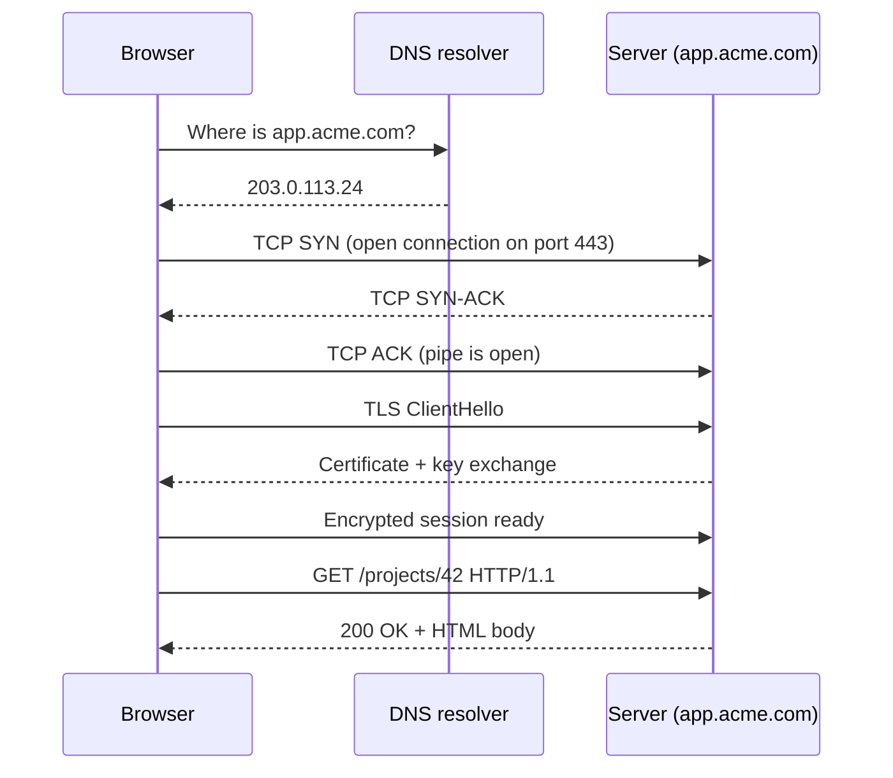
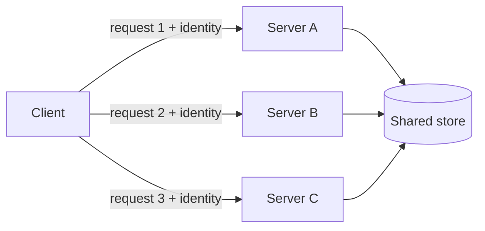

# How the Web Works

You type `https://app.acme.com/projects/42` and press Enter. Less than a second
later you see a page. In that second, your computer found a machine somewhere in
the world, opened a connection to it, proved the machine was really who it
claimed to be, asked a question, and got an answer.

This file walks through that second, step by step. Everything else in this track
sits on top of it.

> **📌 In one line:** the web is one program asking another program a question
> over a network connection, and HTTP is the language they use to phrase it.

## Table of Contents

1. [Client and Server in Plain Words](#client-and-server-in-plain-words)
2. [What Happens When You Press Enter](#what-happens-when-you-press-enter)
3. [Anatomy of a URL](#anatomy-of-a-url)
4. [Ports: the Door Number](#ports-the-door-number)
5. [Why HTTP Is Stateless](#why-http-is-stateless)
6. [Advanced: HTTP/1.1 vs HTTP/2 vs HTTP/3](#advanced-http11-vs-http2-vs-http3)
7. [Where Proxies and Load Balancers Sit](#where-proxies-and-load-balancers-sit)
8. [Common Mistakes](#common-mistakes)
9. [Questions to Test Yourself](#questions-to-test-yourself)
10. [Related](#related)

---

## Client and Server in Plain Words

Think of a restaurant.

You sit at a table. You do not walk into the kitchen and cook. You tell a waiter
what you want. The waiter carries your order to the kitchen, waits, and brings
back a plate. You never see the kitchen. The kitchen never sees you.

- **Client** = you, the customer. The program that *asks*.
- **Server** = the kitchen. The program that *answers*.
- **Request** = the order you gave.
- **Response** = the plate that came back.

That is the whole idea. A **client** is any program that starts a conversation.
A **server** is any program that sits and waits for someone to start one.

A browser is a client. A mobile app is a client. So is `curl` in your terminal,
and so is your Node service when it calls the Stripe API. "Client" and "server"
are **roles in one conversation**, not types of machine. Your AdonisJS API is a
server when React calls it, and a client when it calls PostgreSQL.

```text
┌──────────────┐   request    ┌──────────────┐   query    ┌──────────────┐
│   Browser    │ ───────────▶ │  Node API    │ ─────────▶ │  PostgreSQL  │
│   (client)   │ ◀─────────── │ (server, and │ ◀───────── │   (server)   │
└──────────────┘   response   │  also client)│   rows     └──────────────┘
                              └──────────────┘
```

> **💡 Tip:** when you are confused about who is responsible for something, ask
> "who started this conversation?" That side is the client.

### What the server actually is

A server is not special hardware. It is a normal process running on a computer
that has done two things:

1. Asked the operating system for a **port** (a numbered door — see below).
2. Started a loop that waits for connections on that port.

When you run `node server.js` on your laptop, your laptop is a server. The only
difference in production is that the machine has a stable address and never
sleeps.

---

## What Happens When You Press Enter

Five steps happen in order. Each one must finish before the next begins.

1. **DNS lookup** — turn the name `app.acme.com` into a numeric address like
   `203.0.113.24`. DNS (Domain Name System) is the internet's phone book. Names
   are for humans; the network only routes numbers.
2. **TCP connection** — open a reliable two-way pipe to that address. TCP
   (Transmission Control Protocol) guarantees that bytes arrive, in order, or
   you are told the connection failed.
3. **TLS handshake** — agree on encryption and check the server's certificate.
   TLS (Transport Layer Security) is the "S" in HTTPS. Skipped for plain HTTP.
4. **HTTP request** — send the actual question as text over that pipe.
5. **HTTP response** — the server sends back a status, headers, and a body.



Two things are worth noticing in that diagram.

**The first four exchanges carry no useful data.** They only set up the
connection. That is why a first request to a cold domain feels slow, and why
browsers and HTTP clients **reuse** an open connection for the next request
instead of repeating steps 1–3.

**DNS answers are cached.** Your operating system, your browser, and your
internet provider all remember the answer for a while (the TTL, or Time To
Live). So most requests skip step 1 entirely.

> **⚠️ Warning:** DNS caching is why a deployment that changes a domain's IP
> address does not take effect instantly for everyone. Old clients keep using
> the cached address until the TTL expires.

The layers below HTTP — how IP routes a packet, how TCP recovers a lost one —
are covered in [networking](../../networking/README.md). For backend work you
mostly need to know that TCP gives you a reliable ordered stream, and HTTP
writes text into it.

---

## Anatomy of a URL

A URL (Uniform Resource Locator) is one string that contains everything needed
to find a resource. Break one apart:

```text
  https://app.acme.com:443/projects/42/tasks?status=open&page=2#comments
  └─┬─┘   └─────┬─────┘└┬┘└────────┬───────┘└────────┬────────┘└───┬───┘
    │           │       │          │                 │             │
  scheme      host    port       path          query string     fragment
```

| Part | Example | What it does | Does the server see it? |
|---|---|---|---|
| Scheme | `https` | Which protocol to speak, and therefore the default port | Indirectly |
| Host | `app.acme.com` | Which machine to talk to; sent as the `Host` header | Yes |
| Port | `443` | Which door on that machine | Yes (it is the connection) |
| Path | `/projects/42/tasks` | Which resource on that server | Yes |
| Query string | `?status=open&page=2` | Extra named options, usually filters | Yes |
| Fragment | `#comments` | Position inside the returned document | **No** |

Three details that surprise people:

**The fragment never leaves the browser.** Everything after `#` is used by the
browser to scroll to an element, or by a single-page app for routing. It is
never sent to the server. You cannot read it in your handler.

**The port is usually invisible.** `https://app.acme.com/` really means
`https://app.acme.com:443/`. The browser fills in the default for the scheme.

**Query strings are just text.** `?status=open&page=2` is a string of key/value
pairs joined by `&`. Your framework parses it into an object for you. Values
arrive as **strings**, always — `page=2` gives you `"2"`, not `2`.

```ts
// Every query value is a string. Convert before you use it as a number.
const page = Number(request.input('page') ?? 1)
const perPage = Math.min(Number(request.input('per_page') ?? 20), 100) // cap it
```

> **⚠️ Warning:** never put a password, API key, or token in a query string.
> URLs are written to server logs, browser history, and the `Referer` header
> sent to third parties. See [headers](05-headers.md) for where secrets belong.

---

## Ports: the Door Number

One machine has one address but runs many programs. A port tells the operating
system which program a connection belongs to.

Back to the analogy: the IP address is the street address of an apartment
building. The port is the apartment number. Without it, the mail carrier knows
the building but not the door.

A port is a number from 1 to 65535. A server process **binds** to one port and
listens there. Only one process can hold a given port at a time — that is the
cause of the `EADDRINUSE: address already in use` error you have probably seen.

| Port | Usually runs | Note |
|---|---|---|
| 80 | HTTP | The default when the scheme is `http` |
| 443 | HTTPS | The default when the scheme is `https` |
| 3333 | AdonisJS dev server | Just a convention; Express often uses 3000 |
| 5432 | PostgreSQL | Should never be reachable from the public internet |
| 6379 | Redis | Same — keep it on a private network |

```ts
// The port is configuration, not a constant. Hosting platforms assign one.
const port = Number(process.env.PORT ?? 3333)
server.listen(port, () => console.log(`listening on ${port}`))
```

> **💡 Tip:** in production your Node app usually listens on a high port like
> 3333, and nginx listens on 443 and forwards to it. Users never type 3333.
> See [Where Proxies and Load Balancers Sit](#where-proxies-and-load-balancers-sit).

---

## Why HTTP Is Stateless

**Stateless** means the server does not remember anything about you between
requests. Each request arrives as if it were the first one you ever sent.

The restaurant analogy breaks here, so change it. Imagine a waiter with total
memory loss who resets every time he turns around. You must repeat your entire
order — including "I am table 7, I already paid" — every single time you speak
to him.

That sounds like a flaw. It is actually a design choice, and it is why the web
scales.



Because no server holds your session in its own memory, any server can answer
any request. You can run ten copies of your app behind a load balancer, restart
one, or add three more during a traffic spike — and nobody gets logged out.

### What this means for your code

Every request must carry its own proof of identity. There is no "current user"
that lives on the server between calls.

```ts
// ❌ BROKEN — module-level variable shared by every request and every user.
let currentUser: User | null = null

export async function login({ request }: HttpContext) {
  currentUser = await User.verify(request.input('email'), request.input('password'))
  return { ok: true }
}

export async function listProjects() {
  // Whose projects? Whoever logged in last, on this one server process.
  return Project.query().where('owner_id', currentUser!.id)
}
```

That code appears to work on your laptop with one user. In production it leaks
one user's data to another, and it breaks completely the moment a second server
process exists.

```ts
// ✅ FIXED — identity comes from the request itself, every time.
export async function listProjects({ request, auth }: HttpContext) {
  // The client sent a token/cookie; middleware turned it back into a user.
  const user = auth.getUserOrFail()
  return Project.query().where('owner_id', user.id)
}
```

The "identity" the client carries is usually a cookie holding a session ID, or
an `Authorization` header holding a token. Both are covered in Part 5 —
Authentication. For now, hold on to the rule:

> **📌 Remember:** if a request cannot prove who it is on its own, it has no
> identity. Never store per-user state in a module variable.

Statelessness applies to *the protocol*, not to your data. Your database is very
much stateful. The point is that the **connection** remembers nothing.

---

## Advanced: HTTP/1.1 vs HTTP/2 vs HTTP/3

All three versions speak the same vocabulary — methods, paths, headers, status
codes. What changes is how the bytes move over the connection.

The problem all of them fight is **head-of-line blocking**: one slow item at the
front of a queue holds up everything behind it, even though the rest is ready.

| | HTTP/1.1 | HTTP/2 | HTTP/3 |
|---|---|---|---|
| Released | 1997 | 2015 | 2022 |
| Transport | TCP | TCP | QUIC (over UDP) |
| Format | Plain text | Binary frames | Binary frames |
| Requests per connection | One at a time | Many in parallel (multiplexing) | Many in parallel |
| Head-of-line blocking | At the HTTP level | At the TCP level only | Effectively none |
| Header compression | None | HPACK | QPACK |
| Encryption | Optional | Required in practice | Built in |

**HTTP/1.1** sends one request per connection at a time. To load 50 images the
browser opens about six connections and queues the rest. A slow response blocks
its whole connection.

**HTTP/2** fixes that at the HTTP level. Many requests share one connection as
interleaved "streams". But they still ride on one TCP connection, and TCP
insists on delivering bytes in order — so one lost packet stalls every stream.
The blocking moved down a layer rather than disappearing.

**HTTP/3** replaces TCP with QUIC, a protocol built on UDP that tracks each
stream separately. A lost packet in one stream no longer stalls the others. QUIC
also folds the TLS handshake into the connection setup, so fewer round trips
are needed before the first request.

### What you actually do about this

Almost nothing, and that is the point. Your Node app writes the same request and
response objects regardless of version. The version is negotiated between the
client and whatever terminates TLS — usually nginx, a load balancer, or a CDN.

> **💡 Tip:** if you want HTTP/2 or HTTP/3, enable it on your reverse proxy or
> CDN. Do not rewrite your application code for it.

One habit does become outdated under HTTP/2: bundling many small files into one
giant file, and "domain sharding" (spreading assets over several hostnames).
Both were workarounds for HTTP/1.1's connection limit, and both can hurt under
HTTP/2.

---

## Where Proxies and Load Balancers Sit

In the diagrams above, the browser talks straight to your app. In production it
almost never does. There is at least one machine in between.

```text
                    ┌──────────────────────────────────────┐
 Browser ─── TLS ──▶│  Load balancer / reverse proxy       │
                    │  (nginx, ALB, Cloudflare)            │
                    │  - terminates TLS                    │
                    │  - picks a healthy app instance      │
                    └──────┬───────────────┬───────────────┘
                   plain HTTP           plain HTTP
                           │               │
                    ┌──────▼─────┐  ┌──────▼─────┐
                    │  app:3333  │  │  app:3333  │
                    └────────────┘  └────────────┘
```

A **reverse proxy** is a server that takes requests on behalf of other servers.
The client thinks it is talking to the final destination; really it is talking
to the proxy, which forwards the request onward. It is the receptionist in a
building lobby: every visitor speaks to the receptionist, who routes them.

A **load balancer** is a reverse proxy whose main job is choosing *which* of
several identical app instances gets the request.

Three consequences you will meet in later files:

1. **TLS usually ends at the proxy.** Your Node app receives plain HTTP. See
   [https-and-tls](06-https-and-tls.md).
2. **The connection your app sees comes from the proxy, not the user.** So
   `req.ip` is the proxy's IP unless you configure trust correctly. See
   [headers](05-headers.md) — this is a real production bug.
3. **This only works because HTTP is stateless.** Any instance can serve any
   request.

Full treatment lives in
[reverse-proxy](../../system-design/foundational/reverse-proxy.md) and
[load-balancing](../../system-design/foundational/load-balancing.md). Read those
when you want to know *how the proxy chooses*; for now just know it is there.

---

## Common Mistakes

| Mistake | Why it is wrong | Do this instead |
|---|---|---|
| Storing the logged-in user in a module-level variable | HTTP is stateless and you run more than one process; users see each other's data | Read identity from the request on every call |
| Putting a token or password in the query string | URLs land in logs, browser history, and `Referer` headers | Use the `Authorization` header or a cookie |
| Hardcoding the port in application code | Hosting platforms assign a port at runtime | Read `process.env.PORT` with a local default |
| Expecting query values to be numbers | Query strings are text; `?page=2` gives `"2"` | Convert and validate explicitly |
| Trying to read the URL fragment on the server | The part after `#` is never sent | Pass it as a query parameter if the server needs it |
| Exposing 5432 or 6379 to the internet | Databases have weak default protection and are scanned constantly | Keep data stores on a private network |
| Assuming `req.ip` is the user behind a proxy | You see the load balancer's address | Configure trusted proxies; see [headers](05-headers.md) |

---

## Questions to Test Yourself

1. Your Node API calls the Stripe API. In that conversation, which side is the
   client and which is the server? Why is the answer different from when React
   calls your API?
2. Name the five steps between pressing Enter and seeing a page, in order.
   Which of them carry no application data at all, and why does that matter for
   performance?
3. You change your domain's IP address and some users still hit the old server
   for twenty minutes. What explains this?
4. Why can the server not read `#comments` from
   `https://app.acme.com/tasks#comments`? If your backend needed that value,
   how would you send it?
5. What does "stateless" mean in one sentence, and how does it make it possible
   to run ten copies of your app behind a load balancer?
6. HTTP/2 removed head-of-line blocking at the HTTP level but not entirely.
   Where did it move, and how does HTTP/3 remove it?
7. Your app listens on port 3333, but users visit `https://app.acme.com` with
   no port. What sits in between, and what else does that machine do for you?
8. A teammate says "we should use HTTP/3 so we need to change our controllers".
   What is wrong with that sentence?

---

## Related

- [Request and Response](02-request-and-response.md) — the exact text format of
  the message sent in step 4.
- [HTTPS and TLS](06-https-and-tls.md) — what really happens in the handshake
  in step 3.
- [Headers](05-headers.md) — how a stateless request carries its identity, and
  how to find the real client IP behind a proxy.
- [reverse-proxy](../../system-design/foundational/reverse-proxy.md) — the
  machine that sits between the browser and your app.
- [load-balancing](../../system-design/foundational/load-balancing.md) — how
  that machine chooses which instance answers.
- [networking](../../networking/README.md) — the IP and TCP layers underneath
  everything described here.
