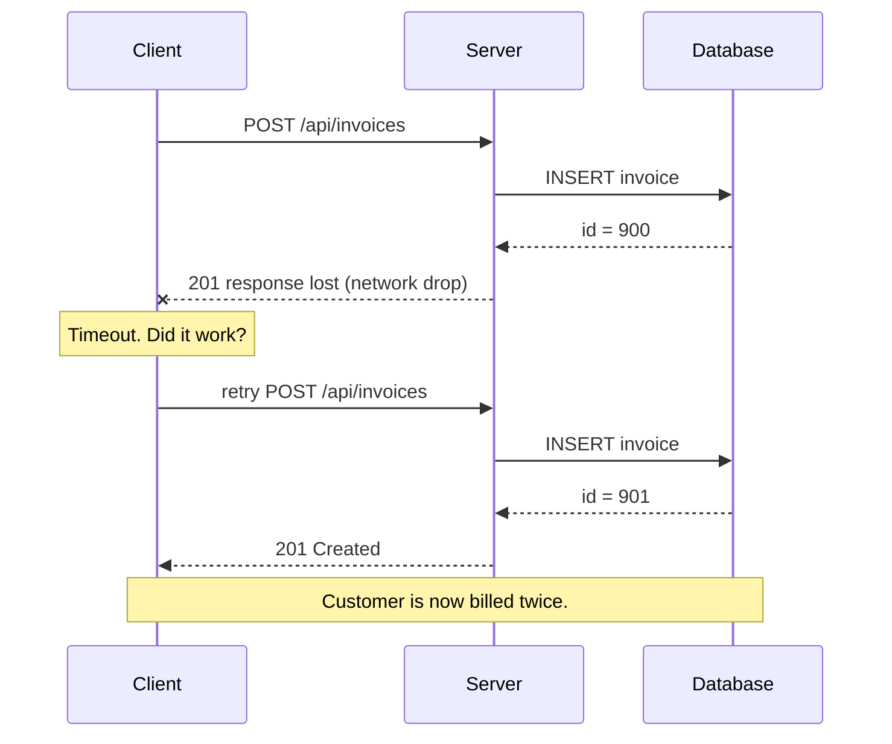
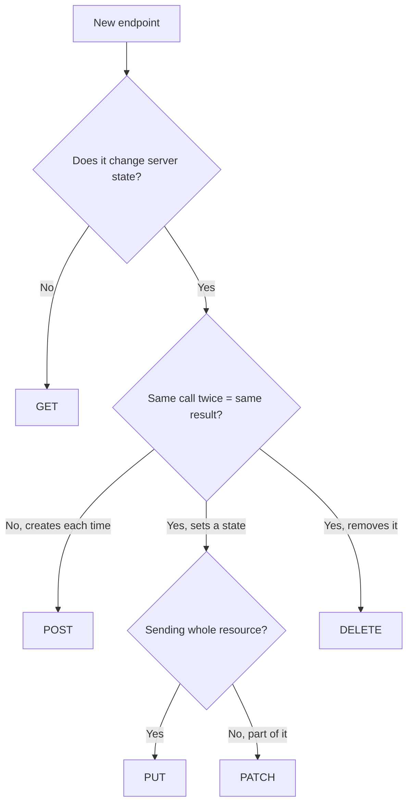

# HTTP Methods

The method is the first word of an HTTP request. It is one short word, but it
carries a promise: it tells every machine between the client and your database
what kind of thing is about to happen.

Browsers, caches, crawlers, proxies and retry libraries all read that promise
and act on it — without asking you. If your code breaks the promise, those
machines will happily do damage on your behalf.

> **📌 In one line:** the method is a contract about *what this request does to
> the server*, and the entire internet acts on that contract automatically.

## Table of Contents

1. [Verbs on a Filing Cabinet](#verbs-on-a-filing-cabinet)
2. [The Methods](#the-methods)
3. [Safe, Idempotent, or Neither](#safe-idempotent-or-neither)
4. [Why This Decides Retry Behaviour](#why-this-decides-retry-behaviour)
5. [PUT vs PATCH](#put-vs-patch)
6. [Why GET Must Never Change Data](#why-get-must-never-change-data)
7. [Advanced Topics](#advanced-topics)
8. [BROKEN vs FIXED: Delete by GET](#broken-vs-fixed-delete-by-get)
9. [Common Mistakes](#common-mistakes)
10. [Questions to Test Yourself](#questions-to-test-yourself)
11. [Related](#related)

---

## Verbs on a Filing Cabinet

Imagine a filing cabinet full of folders. Each folder is a resource — one
project, one invoice, one user.

- **GET** — read a folder. Put it back exactly as it was.
- **POST** — hand a new document to the clerk and let them file it. The clerk
  assigns the folder number.
- **PUT** — replace the entire contents of folder 42 with what you brought.
- **PATCH** — open folder 42 and change only page 3.
- **DELETE** — shred folder 42.
- **HEAD** — ask only "does folder 42 exist, and how thick is it?" without
  taking it out.
- **OPTIONS** — ask the clerk "what am I allowed to do with this cabinet?"

The URL says *which folder*. The method says *what you are doing to it*. This is
the core idea of REST, covered fully in Part 2.

---

## The Methods

| Method | Meaning | Has a body? | Typical response |
|---|---|---|---|
| `GET` | Read a resource | No | `200 OK` + the data |
| `POST` | Create a resource, or run an action | Yes | `201 Created` + `Location`, or `202 Accepted` |
| `PUT` | Replace a resource completely | Yes | `200 OK` or `204 No Content` |
| `PATCH` | Change part of a resource | Yes | `200 OK` with the updated resource |
| `DELETE` | Remove a resource | Normally no | `204 No Content` |
| `HEAD` | Like GET, headers only, no body | No | `200 OK` with no body |
| `OPTIONS` | Ask what is allowed | No | `204` + `Allow` / CORS headers |

A realistic route table for one resource in our SaaS domain:

```ts
// AdonisJS routes — the Express form is app.get('/projects', ...)
router.get('/projects', [ProjectsController, 'index'])        // list
router.post('/projects', [ProjectsController, 'store'])       // create
router.get('/projects/:id', [ProjectsController, 'show'])     // read one
router.put('/projects/:id', [ProjectsController, 'replace'])  // full replace
router.patch('/projects/:id', [ProjectsController, 'update']) // partial update
router.delete('/projects/:id', [ProjectsController, 'destroy'])
```

Notice that the noun `projects` never changes. Only the verb does. If you find
yourself writing `POST /projects/42/delete`, the method is doing no work and the
path is carrying the verb instead. That is the smell Part 2 will teach you to
avoid.

---

## Safe, Idempotent, or Neither

Two words that sound academic and are actually the most practical thing in this
file.

**Safe** means the request does not change anything on the server. Reading a
page is safe. You can send it a thousand times and the system is unchanged.

**Idempotent** means sending the request many times has the same final effect as
sending it once. It may change something — but doing it again changes nothing
further.

An analogy for idempotent: a light switch set to the "off" position. Press "off"
once, the light is off. Press "off" four more times — still off, nothing extra
happened. Compare with a button that adds one item to your shopping cart: press
it five times and you have five items. That button is not idempotent.

| Method | Safe | Idempotent | Why |
|---|---|---|---|
| `GET` | Yes | Yes | Only reads |
| `HEAD` | Yes | Yes | Only reads, no body |
| `OPTIONS` | Yes | Yes | Only describes |
| `PUT` | No | **Yes** | Sets the resource to a given state; repeating sets the same state |
| `DELETE` | No | **Yes** | After the first call it is gone; repeating leaves it gone |
| `POST` | No | **No** | Each call creates a new thing |
| `PATCH` | No | **Not guaranteed** | Depends on what the patch says |

Every safe method is automatically idempotent. The reverse is not true: `DELETE`
changes things, so it is not safe, but it is idempotent.

### Why PATCH is the tricky one

```json
// Idempotent patch — sets an absolute value.
{ "status": "archived" }

// NOT idempotent — describes a relative change.
{ "op": "increment", "field": "taskCount", "by": 1 }
```

Send the first one five times: the project is archived, same as after one call.
Send the second five times: `taskCount` is now five higher. Same request, very
different consequences.

> **💡 Tip:** design your `PATCH` endpoints to take absolute values, not
> deltas. You get idempotency for free, and retries become safe.

---

## Why This Decides Retry Behaviour

A request fails with a timeout. Your HTTP client must decide: retry, or give up?

Here is the uncomfortable truth about a timeout: **you do not know whether the
server processed it.** The request may have never arrived. Or it may have been
fully processed and the *response* got lost on the way back.



That is why retry libraries, load balancers and API gateways all follow one
default rule:

> **📌 Remember:** retry `GET`, `PUT`, `DELETE`, `HEAD`, `OPTIONS` freely. Never
> blindly retry `POST` or a delta-style `PATCH`.

A failed `PUT /api/projects/42` can be sent again with no harm — it sets the
project to the same state either way. A failed `POST /api/invoices` cannot,
because you might create a second invoice.

To make `POST` retry-safe anyway, you use an **idempotency key**: the client
generates a unique ID, sends it as a header, and the server remembers which keys
it has already processed.

```ts
// The client generates the key ONCE and reuses it across every retry.
const idempotencyKey = crypto.randomUUID()

await httpClient.post('/api/invoices', payload, {
  headers: { 'Idempotency-Key': idempotencyKey },
})
```

On the server, you look the key up before doing work. If you have seen it, you
return the stored response instead of creating a second invoice. The storage,
expiry and race-condition details are covered in
[idempotency](../../system-design/reliability/idempotency.md).

How retry timing should work — exponential backoff, jitter, and when to stop
retrying entirely — is in
[circuit-breakers-and-retries](../../system-design/reliability/circuit-breakers-and-retries.md).

---

## PUT vs PATCH

Both update an existing resource. The difference is what happens to the fields
you did **not** mention.

Start with this project in the database:

```json
{
  "id": 42,
  "name": "Website redesign",
  "status": "active",
  "budget": 15000,
  "ownerId": 7
}
```

### PUT replaces everything

```ts
// Client sends the FULL resource. Missing fields are cleared.
await fetch('/api/projects/42', {
  method: 'PUT',
  headers: { 'Content-Type': 'application/json' },
  body: JSON.stringify({ name: 'Website redesign', status: 'archived' }),
})
```

Result:

```json
{ "id": 42, "name": "Website redesign", "status": "archived",
  "budget": null, "ownerId": null }
```

The budget and owner are gone. That is not a bug — it is what `PUT` means. The
client said "the project is now exactly this", and did not include them.

This is also exactly why `PUT` is idempotent: run it ten times and you land on
the same document every time.

### PATCH changes only what you send

```ts
// Client sends ONLY the fields that change.
await fetch('/api/projects/42', {
  method: 'PATCH',
  headers: { 'Content-Type': 'application/json' },
  body: JSON.stringify({ status: 'archived' }),
})
```

Result:

```json
{ "id": 42, "name": "Website redesign", "status": "archived",
  "budget": 15000, "ownerId": 7 }
```

Everything not mentioned is untouched.

### Handler code for each

```ts
// PUT — build the full row, defaulting anything the client omitted.
async replace({ params, request }: HttpContext) {
  const project = await Project.findOrFail(params.id)
  const body = request.only(['name', 'status', 'budget', 'ownerId'])

  project.name = body.name          // required by the PUT contract
  project.status = body.status ?? 'active'
  project.budget = body.budget ?? null   // omitted means cleared
  project.ownerId = body.ownerId ?? null
  await project.save()
  return project
}
```

```ts
// PATCH — merge only the keys that are actually present.
async update({ params, request }: HttpContext) {
  const project = await Project.findOrFail(params.id)
  // request.only returns just the keys the client sent, so merge is partial.
  project.merge(request.only(['name', 'status', 'budget', 'ownerId']))
  await project.save()
  return project
}
```

| | PUT | PATCH |
|---|---|---|
| Client sends | The whole resource | Only changed fields |
| Omitted fields | Cleared or reset | Left alone |
| Idempotent | Always | Only if values are absolute |
| Good for | Settings forms, config documents | "Archive this", "rename that" |
| Risk | Accidentally wiping fields | Ambiguity: is `null` "clear it" or "skip it"? |

> **⚠️ Warning:** most APIs that claim to implement `PUT` actually implement
> `PATCH` behaviour and quietly keep omitted fields. This confuses every client.
> Pick one meaning per endpoint, document it, and be consistent. When unsure,
> support only `PATCH`.

---

## Why GET Must Never Change Data

This is a rule, not a style preference. Four different systems will break it for
you if you ignore it.

**1. Browser prefetch.** Browsers, and link previews in Slack or WhatsApp, fetch
URLs before anyone clicks. A `GET /projects/42/delete` link sitting in an email
can be deleted just by previewing the message.

**2. Crawlers.** Search engine and internal crawlers follow every link on a
page. There is a famous class of incident where a company's entire admin panel
was wiped because an indexing bot followed every "Delete" link.

**3. Caching.** Proxies, CDNs and browsers cache `GET` responses by default.
Your "action" may run once and then be served from cache forever — or the
opposite, run at every cache miss. See
[caching-strategies](../../system-design/foundational/caching-strategies.md).

**4. History and retries.** `GET` requests are stored in browser history, and
proxies retry them automatically on failure. Pressing back or refresh re-runs
them silently, while a `POST` at least triggers a "resubmit?" prompt.



---

## Advanced Topics

### Method override

Old HTML forms can only send `GET` and `POST`. Some corporate proxies also block
`PUT` and `DELETE`. The workaround is a header or a hidden field:

```text
POST /api/projects/42 HTTP/1.1
X-HTTP-Method-Override: DELETE
```

The server reads the header and treats the request as a `DELETE`.

> **⚠️ Warning:** enabling method override turns any `POST` into a `DELETE`. If
> your CSRF (Cross-Site Request Forgery) protection or your authorization checks
> branch on the method, an attacker can slip past them. Enable it only if you
> genuinely need it, and only for authenticated routes.

### Why DELETE usually has no body

The specification allows a body on `DELETE`, but says it has no defined meaning.
In practice, proxies strip it, HTTP clients refuse to send it, and `fetch()` in
some browsers ignores it. Put what you need in the path or the query string:

```text
DELETE /api/projects/42?cascade=true
```

### OPTIONS and preflight

`OPTIONS` asks a server what it permits. Its most common use today is the CORS
(Cross-Origin Resource Sharing) **preflight**: before a browser sends a `PATCH`
or `DELETE` to a different origin, it first sends an `OPTIONS` request asking
for permission.

```text
OPTIONS /api/projects/42 HTTP/1.1
Origin: https://app.acme.com
Access-Control-Request-Method: PATCH
```

If the server does not answer with the right headers, the browser blocks the
real request — and your app sees an error that never reached your server at all.
Full explanation in [CORS](../11-api-security/03-cors.md).

### HEAD

`HEAD` returns the same headers as `GET` with no body. Use it to check whether a
large file exists, or to read its `Content-Length` or `ETag` before downloading.
Most frameworks answer `HEAD` automatically for every `GET` route.

---

## BROKEN vs FIXED: Delete by GET

```ts
// ❌ BROKEN — a destructive action behind GET.
router.get('/projects/:id/delete', async ({ params, response }) => {
  await Project.query().where('id', params.id).delete()
  return response.redirect('/projects')
})
```

```html
<!-- And in the admin page: -->
<a href="/projects/42/delete">Delete</a>
```

This deletes projects when a crawler indexes the page, when a chat app generates
a link preview, when the browser prefetches the link on hover, and when a user
presses the back button. It is also cacheable, so a proxy may store the redirect
and confuse everyone.

```ts
// ✅ FIXED — the destructive action uses DELETE and returns 204.
router.delete('/api/projects/:id', async ({ params, response, auth }) => {
  const project = await Project.findOrFail(params.id)
  await auth.user!.authorize('delete', project)  // authorization, see Part 6
  await project.delete()
  return response.noContent()                    // 204: done, nothing to send
})
```

```html
<!-- The UI issues a real DELETE instead of following a link. -->
<button data-project-id="42" class="js-delete">Delete</button>
<script>
  document.querySelector('.js-delete').addEventListener('click', async (e) => {
    const id = e.currentTarget.dataset.projectId
    await fetch(`/api/projects/${id}`, { method: 'DELETE' })
  })
</script>
```

Now no crawler, prefetcher or cache can trigger it, because none of them ever
send a `DELETE` on their own.

---

## Common Mistakes

| Mistake | Why it is wrong | Do this instead |
|---|---|---|
| `GET /projects/42/delete` | Crawlers, prefetch and caches will trigger it | `DELETE /projects/42` |
| Putting the verb in the path (`POST /projects/42/archive-action`) | The method already carries the verb | `PATCH /projects/42` with `{"status":"archived"}` |
| Retrying a failed `POST` automatically | You may create the same record twice | Use an `Idempotency-Key`, or do not retry |
| `PATCH` with increments (`{"by": 1}`) | Not idempotent, so retries corrupt the number | Send the absolute value |
| Treating `PUT` as partial update | Clients expect omitted fields to be cleared | Implement `PATCH`, or document the difference clearly |
| Sending a body with `DELETE` | Proxies and clients may strip it | Use the path or query string |
| Enabling method override everywhere | Turns any `POST` into a `DELETE`; bypasses checks | Enable only where required |
| `POST` for a pure search because the query is long | Loses caching and bookmarking | Use `GET` with query parameters; use `POST` only when the query truly cannot fit |

---

## Questions to Test Yourself

1. Explain "safe" and "idempotent" in your own words, and give one method that
   is idempotent but not safe.
2. Why is `DELETE` idempotent even though calling it twice returns different
   status codes the second time?
3. Your HTTP client times out on `POST /api/invoices`. Why is retrying dangerous
   and what exactly might have happened on the server?
4. Give a `PATCH` body that is idempotent and one that is not, for the same
   field. Why does the difference matter for a retry?
5. A project has `budget: 15000`. A client sends `PUT /projects/42` with only
   `{"name":"New name"}`. What should `budget` be afterwards, and why?
6. Name three different systems that will send a `GET` to your URL without a
   human clicking anything.
7. Your frontend sends `DELETE /api/projects/42` from a different domain and you
   see no request in your server logs, only a browser error. What happened?
8. When would you choose `PUT` over `PATCH` for a real feature?

---

## Related

- [Status Codes](04-status-codes.md) — which code each method should return.
- [Request and Response](02-request-and-response.md) — where the method sits in
  the raw message.
- [Headers](05-headers.md) — `Location`, `Allow`, and the override header.
- [idempotency](../../system-design/reliability/idempotency.md) — how to make
  `POST` safe to retry.
- [circuit-breakers-and-retries](../../system-design/reliability/circuit-breakers-and-retries.md)
  — when and how a client should retry at all.
- [CORS](../11-api-security/03-cors.md) — why the browser sends `OPTIONS`
  before your `PATCH`.
- [caching-strategies](../../system-design/foundational/caching-strategies.md)
  — why only safe methods are cacheable.
