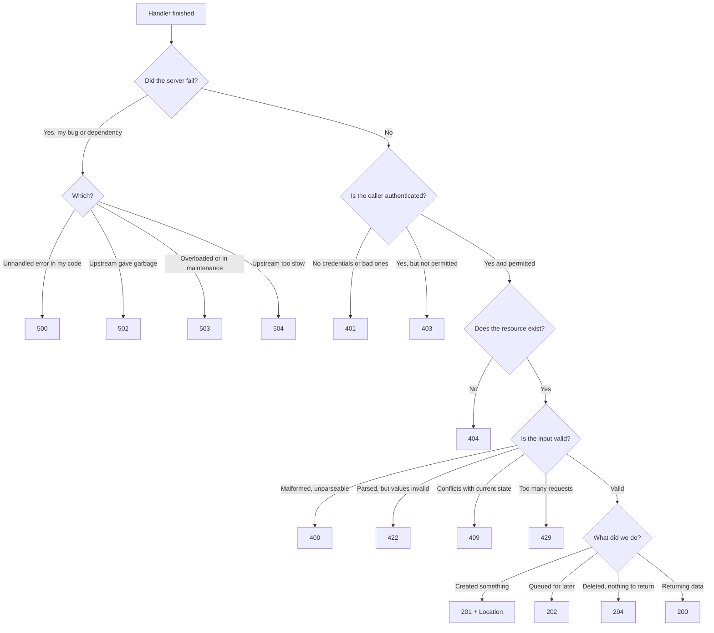
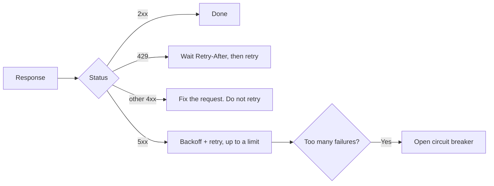

# Status Codes

A status code is a three-digit number on the first line of every HTTP response.
It is the server's one-word summary of what happened, and it is the only part of
your response that machines read.

Your monitoring dashboard, your load balancer, your retry library and the
browser all make decisions from that number — before anyone looks at your
carefully written error message. Getting it right is not politeness. It is how
the rest of the system works.

> **📌 In one line:** the status code tells machines what happened; the body
> tells humans why.

## Table of Contents

1. [The Reply Card](#the-reply-card)
2. [The Five Families](#the-five-families)
3. [Choosing a Code](#choosing-a-code)
4. [The Reference Table](#the-reference-table)
5. [The Classic Confusions](#the-classic-confusions)
6. [Returning the Right Code in a Real Handler](#returning-the-right-code-in-a-real-handler)
7. [Advanced: 4xx, 5xx and Retries](#advanced-4xx-5xx-and-retries)
8. [BROKEN vs FIXED: 200 OK with success false](#broken-vs-fixed-200-ok-with-success-false)
9. [Common Mistakes](#common-mistakes)
10. [Questions to Test Yourself](#questions-to-test-yourself)
11. [Related](#related)

---

## The Reply Card

You post a letter to a company. A card comes back. Before reading any text, you
look at the coloured stamp in the corner:

- **Green** — done, here is your answer.
- **Blue** — your letter went to a new address, try there.
- **Yellow** — your letter was wrong. Fix it and send again.
- **Red** — our office made a mistake. The letter was fine.

You sort your mail by the stamp colour without reading a word. Every machine on
the internet does exactly this with status codes. That is why `200 OK` on a
failure is so damaging — you stamped a failure green, and every automatic system
now believes it succeeded.

---

## The Five Families

The first digit is the family. Learn these five sentences and you can guess the
meaning of any code you have never seen.

| Family | Name | One sentence |
|---|---|---|
| `1xx` | Informational | "Still working, keep the connection open." Rare in app code. |
| `2xx` | Success | "It worked." |
| `3xx` | Redirection | "What you want is somewhere else, or you already have it." |
| `4xx` | Client error | "Your request was wrong. Do not send the same thing again." |
| `5xx` | Server error | "Our fault. Your request may have been fine." |

The `4xx` / `5xx` split is the most important line in HTTP. It assigns blame,
and blame decides behaviour: whether to retry, whether to alert an engineer,
whether to mark a server unhealthy.

---

## Choosing a Code



Print this flowchart, or rebuild it from memory. Almost every endpoint you ever
write ends at one of those leaves.

---

## The Reference Table

These twenty codes cover virtually everything a real API needs.

| Code | Name | What it means | When you return it |
|---|---|---|---|
| `200` | OK | Request succeeded, body has the result | `GET`, successful `PATCH`/`PUT` that returns the resource |
| `201` | Created | A new resource now exists | Successful `POST`; include a `Location` header |
| `202` | Accepted | Accepted, but not finished yet | Work queued to a background job; return a status URL |
| `204` | No Content | Succeeded, and there is deliberately no body | `DELETE`, or an update where the client needs nothing back |
| `301` | Moved Permanently | This URL is retired, use the new one forever | Renamed a route; clients and search engines update their links |
| `302` | Found | Temporary redirect, keep using the old URL | Redirect after login to the page the user wanted |
| `304` | Not Modified | Your cached copy is still fresh | The client sent `If-None-Match` and the `ETag` still matches |
| `400` | Bad Request | The request itself is malformed | Broken JSON, missing required query parameter, bad header |
| `401` | Unauthorized | You are not identified (really "unauthenticated") | No token, expired token, wrong password |
| `403` | Forbidden | We know who you are, and you may not do this | Viewer tries to delete a project owned by another company |
| `404` | Not Found | No resource at this URL | Unknown ID, unknown route |
| `405` | Method Not Allowed | The URL exists, the verb does not | `DELETE /api/reports` when only `GET` is supported; add `Allow` |
| `409` | Conflict | Valid request, wrong current state | Duplicate email, editing a stale version, deleting a paid invoice |
| `410` | Gone | It existed and is permanently removed | A deleted public link; more informative than 404 |
| `422` | Unprocessable Content | Parsed fine, but the values are unacceptable | `dueDate` in the past, `budget` negative, `email` malformed |
| `429` | Too Many Requests | Rate limit hit | Throttling; include `Retry-After` |
| `500` | Internal Server Error | Unhandled failure in our code | The catch-all. A bug, a null dereference, a broken query |
| `502` | Bad Gateway | A proxy got an invalid response from upstream | Your app crashed and nginx cannot reach it |
| `503` | Service Unavailable | Temporarily unable to serve | Deploy, maintenance mode, overload, dependency down |
| `504` | Gateway Timeout | Upstream did not answer in time | Slow query or a slow third-party API behind a proxy |

> **💡 Tip:** you do not need more codes than these. Exotic codes (`418`, `451`,
> `423`) mostly confuse clients. Prefer a well-known code plus a clear,
> machine-readable error body.

---

## The Classic Confusions

### 401 vs 403

`401` means **we do not know who you are**. `403` means **we know exactly who
you are, and the answer is still no**.

The names are historically confusing: `401 Unauthorized` actually means
unauthenticated. Read it as "unauthenticated" every time.

```ts
// No token at all, or a token that is expired or forged.
if (!token || !isValid(token)) {
  return response.unauthorized({ error: 'authentication_required' })  // 401
}

// Valid token. Real user. Just not their company's project.
if (project.companyId !== user.companyId) {
  return response.forbidden({ error: 'insufficient_permissions' })    // 403
}
```

The practical difference is what the client should do next. After a `401`, a
client refreshes its token or shows the login screen. After a `403`, logging in
again is pointless — showing a login form would be a bug.

### 400 vs 422

`400` means the message could not even be understood. `422` means it was
understood perfectly and the values are wrong.

```text
// 400 — this is not JSON at all.
POST /api/projects
Content-Type: application/json

{"name": "Website redesign",

// 422 — valid JSON, but the values break our business rules.
POST /api/projects
Content-Type: application/json

{"name": "", "budget": -500, "dueDate": "2019-01-01"}
```

The distinction matters because the fixes differ. A `400` is a bug in the client
code that built the request. A `422` is usually a form the user filled in wrong,
and the response should carry per-field errors so the UI can highlight them.

> **💡 Tip:** some large APIs return `400` for both. That is acceptable if you
> are consistent and include a structured error body. What is not acceptable is
> mixing them randomly.

### 404 vs 403

Sometimes `404` is the *deliberate* answer for something that exists.

Suppose an attacker probes `GET /api/companies/1001/invoices` through
`/api/companies/9999/invoices`. If you return `403` for real company IDs and
`404` for non-existent ones, you have just handed them a list of every valid
company ID. That is called an enumeration leak.

```ts
// ✅ For resources in another tenant, hide existence entirely.
const project = await Project.query()
  .where('id', params.id)
  .where('company_id', user.companyId)   // scope the query, do not filter later
  .first()

if (!project) {
  return response.notFound({ error: 'project_not_found' })  // 404, not 403
}
```

Use `403` when the caller is *allowed to know the resource exists* but may not
perform this action — for example, a team member who can view a project but not
delete it. Use `404` across tenant boundaries.

### 500 vs 502 vs 503 vs 504

All are `5xx`, but they point at different machines.

```text
Client ──▶ nginx ──▶ Node app ──▶ PostgreSQL / Stripe

500  Node app ran, hit an unhandled error, and replied itself
502  nginx could not get a valid reply — the app crashed or is not listening
503  The app is up but refusing work: maintenance, overload, no DB connection
504  The app (or the DB) is alive but took longer than the proxy will wait
```

Telling them apart turns a vague alert into a direction to look. Constant `502`
means your process is dying — check for crashes and out-of-memory kills.
Constant `504` means something is slow — check
[slow-query-fixes](../../databases/query-optimization/slow-query-fixes.md) and
your outbound API calls.

---

## Returning the Right Code in a Real Handler

### Create → 201 with Location

```ts
async store({ request, response }: HttpContext) {
  const payload = await request.validateUsing(createProjectValidator)
  const project = await Project.create(payload)

  // Location tells the client where the new resource lives.
  response.header('Location', `/api/projects/${project.id}`)
  return response.created(project)   // 201
}
```

### Delete → 204, no body

```ts
async destroy({ params, response }: HttpContext) {
  const project = await Project.find(params.id)
  if (!project) return response.notFound({ error: 'project_not_found' })

  await project.delete()
  return response.noContent()        // 204 — do NOT send a body with this
}
```

A `204` with a body is invalid. Some clients will hang waiting for bytes that
never come.

### Validation failure → 422 with field errors

```ts
// Give the UI enough structure to highlight the exact input that failed.
return response.unprocessableEntity({
  error: 'validation_failed',
  details: [
    { field: 'name', rule: 'required', message: 'Project name is required' },
    { field: 'budget', rule: 'min', message: 'Budget cannot be negative' },
  ],
})
```

### Rate limited → 429 with Retry-After

```ts
// Retry-After is in seconds. Without it, clients guess — usually badly.
response.header('Retry-After', '60')
return response.tooManyRequests({
  error: 'rate_limit_exceeded',
  message: 'Try again in 60 seconds.',
})
```

The algorithms behind that limit live in
[rate-limiting](../../system-design/foundational/rate-limiting.md).

### Async work → 202 with a status URL

```ts
async exportInvoices({ response, auth }: HttpContext) {
  const job = await ExportJob.create({ userId: auth.user!.id, state: 'queued' })
  await queue.dispatch('invoices:export', { jobId: job.id })

  response.header('Location', `/api/export-jobs/${job.id}`)
  return response.accepted({ jobId: job.id, state: 'queued' })  // 202
}
```

Use `202` whenever the real work happens after the response is sent. Returning
`200` would lie: nothing is finished yet.

---

## Advanced: 4xx, 5xx and Retries

The family boundary is a machine-readable instruction:

- **`4xx` — the client is wrong. Sending the identical request again will fail
  identically.** Do not retry unchanged.
- **`5xx` — the server is wrong. The same request might succeed later.** A retry
  is reasonable.

Several layers act on this without asking you:

| Layer | Behaviour on 5xx | Behaviour on 4xx |
|---|---|---|
| HTTP client libraries | Retry with backoff | Fail immediately |
| Load balancer health checks | Mark the instance unhealthy, stop routing to it | Ignore — the instance is fine |
| Monitoring and alerting | Page an engineer | Show on a dashboard, no page |
| CDNs | Usually serve a stale cached copy | Pass through to the client |
| Circuit breakers | Count toward opening the breaker | Not counted |

The exception: `429` is a `4xx` that *is* retryable, but only after waiting.
That is why `Retry-After` exists.



This is exactly why misclassifying matters in production. Return `500` for a
user's bad input and you will:

- wake an on-call engineer for a typo in someone's form,
- make load balancers pull healthy servers out of rotation,
- make clients retry a request that can never succeed, multiplying your load at
  the worst possible moment.

See
[circuit-breakers-and-retries](../../system-design/reliability/circuit-breakers-and-retries.md)
for how a client should implement backoff, and
[health-checks](../../cloud-devops/deployment-strategies/health-checks.md) for
how a load balancer decides an instance is dead.

> **📌 Remember:** every `5xx` you return is a promise to the whole system that
> retrying might help. Do not make that promise for a validation error.

---

## BROKEN vs FIXED: 200 OK with success false

This is the single most common status code mistake in real codebases.

```ts
// ❌ BROKEN — every response is 200, and the real outcome hides in the body.
async store({ request, response }: HttpContext) {
  const name = request.input('name')
  if (!name) {
    return response.ok({ success: false, message: 'Name is required' })
  }
  try {
    const project = await Project.create({ name })
    return response.ok({ success: true, data: project })
  } catch (error) {
    return response.ok({ success: false, message: 'Something went wrong' })
  }
}
```

Everything about this looks harmless. It is not. Here is what it breaks:

**Clients.** Every caller must parse the body to learn whether it worked.
`fetch()` and `axios` both treat this as success, so `try/catch` and
`response.ok` become useless, and the failure flows deeper into the code before
anyone notices.

**Monitoring.** Your error rate dashboard reads status codes. It shows 0%
errors while the database is on fire. You will find out from customers.

**Retries and load balancers.** A genuine `500` disguised as `200` is never
retried, and a broken instance is never removed from rotation — because to the
load balancer it is answering perfectly.

**Caching.** `200` responses are cacheable. A CDN or browser may cache your
error and serve it to everyone for an hour.

```ts
// ✅ FIXED — the status code carries the outcome; the body carries the detail.
async store({ request, response }: HttpContext) {
  const payload = await request.validateUsing(createProjectValidator) // throws → 422
  const project = await Project.create(payload)

  response.header('Location', `/api/projects/${project.id}`)
  return response.created(project)   // 201
}
```

Unexpected errors are handled once, centrally, instead of in every handler:

```ts
// One exception handler maps error types to status codes for the whole app.
export default class HttpExceptionHandler {
  async handle(error: unknown, ctx: HttpContext) {
    if (error instanceof ValidationError) {
      return ctx.response.unprocessableEntity({ error: 'validation_failed', details: error.messages })
    }
    if (error instanceof NotFoundError) {
      return ctx.response.notFound({ error: 'not_found' })
    }
    // Log the real error; never leak stack traces to the client.
    logger.error({ err: error, requestId: ctx.request.id() }, 'unhandled error')
    return ctx.response.internalServerError({ error: 'internal_error' })  // 500
  }
}
```

The pattern of centralising this is covered in Part 7 and in
[error-handling](../../typescript-fundamentals/error-handling/error-handling.md).

---

## Common Mistakes

| Mistake | Why it is wrong | Do this instead |
|---|---|---|
| `200 OK` with `{"success": false}` | Monitoring, retries and caches all read the status, not the body | Return the real code |
| `500` for invalid user input | Pages on-call, triggers retries, marks servers unhealthy | `400` or `422` |
| `200` for a `POST` that created a row | Clients cannot tell creation from update; no `Location` | `201` + `Location` |
| `204` with a JSON body | Invalid; some clients wait for bytes that never arrive | `200` if you must return data |
| `403` for another tenant's resource | Confirms that the ID exists — enumeration leak | `404` across tenant boundaries |
| `401` when the user is logged in but lacks permission | The client will pointlessly show a login screen | `403` |
| `429` with no `Retry-After` | Clients retry immediately and make the overload worse | Always set `Retry-After` |
| Leaking a stack trace in a `500` body | Exposes file paths, library versions, sometimes credentials | Log it; return a generic message and a request ID |
| Branching on the reason phrase text | It is free-form and varies between servers | Branch on the number |

---

## Questions to Test Yourself

1. Your API returns `200 OK` with `{"success": false}` for errors. Name three
   different systems this breaks, and how.
2. A logged-in user tries to delete a project belonging to another company.
   Which code, and why is the "obvious" alternative a security problem?
3. What is the difference between `400` and `422`? Give a body that deserves
   each.
4. Why is `429` special among the `4xx` codes, and which header must accompany
   it?
5. You see a spike of `502` in your logs, then a spike of `504`. What different
   causes do those two point to?
6. Why does returning `500` for a validation error cost real money at 3 AM?
7. A `POST /api/invoices/export` starts a background job that takes two minutes.
   Which status code, which header, and why not `200`?
8. When would `410 Gone` be a better answer than `404 Not Found`?

---

## Related

- [HTTP Methods](03-http-methods.md) — which code each method should return.
- [Headers](05-headers.md) — `Location`, `Retry-After`, `Allow`, `ETag`.
- [Request and Response](02-request-and-response.md) — where the status line
  sits in the raw message.
- [circuit-breakers-and-retries](../../system-design/reliability/circuit-breakers-and-retries.md)
  — how clients act on `4xx` versus `5xx`.
- [rate-limiting](../../system-design/foundational/rate-limiting.md) — what
  produces a `429`.
- [health-checks](../../cloud-devops/deployment-strategies/health-checks.md) —
  how `5xx` responses take an instance out of rotation.
- [error-handling](../../typescript-fundamentals/error-handling/error-handling.md)
  — mapping error types to status codes in one place.
