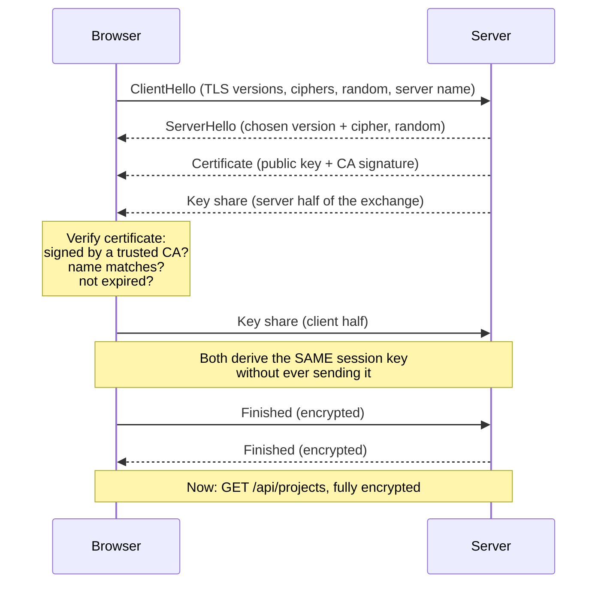
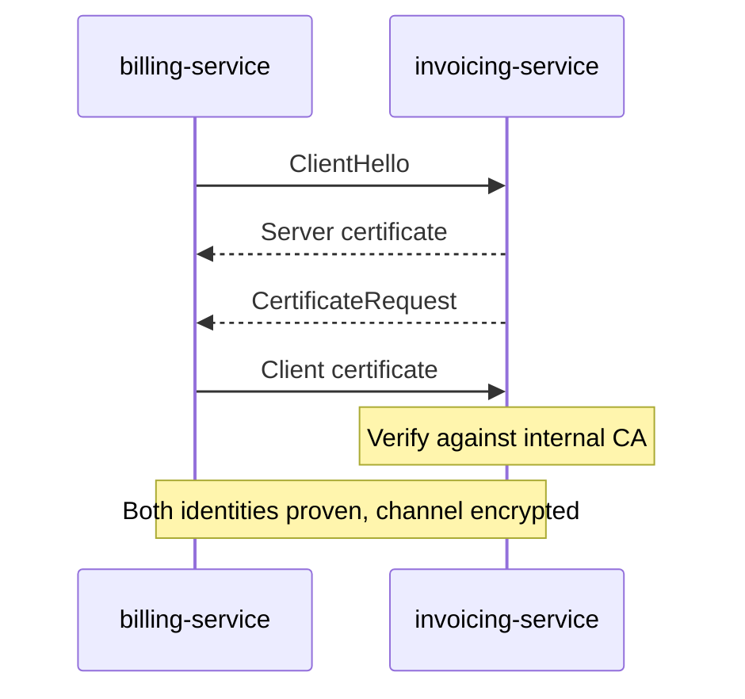

# HTTPS and TLS

HTTPS is HTTP with a locked box around it. The messages are identical — same
methods, same headers, same status codes — but nobody on the path between the
client and the server can read or change them.

You will almost never write TLS code. You will, however, debug expired
certificates, redirect loops, mixed content warnings and "why does my app think
this request is insecure". All of those need the mental model in this file.

> **📌 In one line:** TLS proves you are talking to the right server, then
> encrypts everything you say to it.

## Table of Contents

1. [Postcard vs Sealed Envelope](#postcard-vs-sealed-envelope)
2. [What HTTPS Actually Protects](#what-https-actually-protects)
3. [Symmetric vs Asymmetric Encryption](#symmetric-vs-asymmetric-encryption)
4. [The TLS Handshake](#the-tls-handshake)
5. [What a Certificate Is](#what-a-certificate-is)
6. [Where TLS Terminates in Real Deployments](#where-tls-terminates-in-real-deployments)
7. [Redirects, HSTS and Mixed Content](#redirects-hsts-and-mixed-content)
8. [Certificate Expiry as an Outage](#certificate-expiry-as-an-outage)
9. [Advanced: mTLS and Pinning](#advanced-mtls-and-pinning)
10. [Common Mistakes](#common-mistakes)
11. [Questions to Test Yourself](#questions-to-test-yourself)
12. [Related](#related)

---

## Postcard vs Sealed Envelope

Plain HTTP is a postcard. Every person who handles it — the postal worker, the
sorting office, the neighbour who picks up your mail — can read the whole thing.
Any of them could also erase a line and write a different one, and you would
never know.

HTTPS is a sealed envelope, with two extra properties a real envelope does not
have:

- If anyone opens it, the receiver can tell.
- Before sealing it, you checked the recipient's government-issued ID.

On a coffee shop network, the "postal workers" are every other person on the
Wi-Fi, the router owner, and the internet provider. That is why HTTPS is not
optional any more.

---

## What HTTPS Actually Protects

Three separate guarantees. They are often lumped together as "encryption", but
they solve different problems.

| Guarantee | Attack it stops | Plain-words meaning |
|---|---|---|
| **Confidentiality** | Eavesdropping | Nobody in the middle can read the content |
| **Integrity** | Tampering | Nobody can change the content without detection |
| **Authentication** | Impersonation | You are talking to the real `app.acme.com` |

The third one is the most underrated. Encryption alone is worthless if you
encrypted your password and sent it to an attacker. Certificates exist to stop
exactly that.

```text
 HTTP (postcard)
 Browser ──────────▶ [ Wi-Fi router ] ──────────▶ Server
                     reads password,
                     injects ads,
                     rewrites the page

 HTTPS (sealed envelope)
 Browser ══════════▶ [ Wi-Fi router ] ══════════▶ Server
                     sees only:
                     "some bytes went to 203.0.113.24:443"
```

What HTTPS does **not** hide: the domain name you are visiting (visible through
DNS and the server name sent during the handshake), the size and timing of your
traffic, and the IP address. It hides the path, the headers, and the body.

> **⚠️ Warning:** HTTPS protects data **in transit** only. Once the request
> arrives, the body is plain text in your server's memory and in your logs. It
> is not a substitute for hashing passwords or encrypting data at rest.

---

## Symmetric vs Asymmetric Encryption

You need just enough of this to follow the handshake.

| | Symmetric | Asymmetric (public key) |
|---|---|---|
| Keys | One shared secret key | A public key and a private key |
| Encrypt / decrypt | Same key does both | Public key encrypts, private key decrypts |
| Speed | Very fast | Roughly 100–1000x slower |
| Problem it has | How do both sides get the key safely? | Too slow for bulk data |
| Example algorithm | AES | RSA, ECDSA |

Symmetric is a door with one key, and both people must already have a copy.
Asymmetric is a public post box: anyone can drop a letter in through the slot
(public key), but only the owner has the key to open it (private key).

TLS uses both, and this is the whole trick:

1. Use **asymmetric** crypto once, at the start, to safely agree on a shared
   secret — because the two sides have never met.
2. Use **symmetric** crypto for every byte after that, because it is fast.

---

## The TLS Handshake

Simplified, but accurate in its essentials.



Step by step:

**1. ClientHello.** The browser says which TLS versions and cipher suites it
supports, sends a random number, and names the host it wants (`app.acme.com`).
That host name is sent in the clear, which is why the *domain* you visit is not
private, even though everything else is.

**2. ServerHello and certificate.** The server picks a version and cipher, sends
its own random number, and sends its certificate. The certificate contains the
server's **public key** and a signature from a Certificate Authority.

**3. Verification.** The browser checks the certificate before going further.
This is the authentication step. If it fails, the browser shows the full-page
warning and refuses to continue.

**4. Key exchange.** Both sides exchange key-share values and each derives the
same session key independently. The session key itself is never transmitted.
Because a fresh key pair is generated per connection, recording today's traffic
and stealing the server's private key next year does not decrypt it. That
property is called **forward secrecy**.

**5. Finished.** Both sides send an encrypted message proving they derived the
same key. Only now does the first HTTP byte travel.

All of this costs round trips — one in TLS 1.3, two in TLS 1.2 — which is why
connections are reused rather than reopened for every request. See
[how-the-web-works](01-how-the-web-works.md).

---

## What a Certificate Is

A certificate is an identity document for a domain. It states:

| Field | Meaning |
|---|---|
| Subject / SAN | Which domains it is valid for (`app.acme.com`, `*.acme.com`) |
| Public key | The server's public key |
| Issuer | Which Certificate Authority signed it |
| Valid from / to | The expiry window — commonly 90 days now |
| Signature | The CA's cryptographic signature over all of the above |

A **Certificate Authority (CA)** is an organisation browsers already trust —
Let's Encrypt, DigiCert, Google Trust Services. Your operating system and
browser ship with a list of CA root certificates. That pre-installed list is the
root of all trust on the web.

Getting a certificate means proving to a CA that you control the domain, usually
by serving a file the CA asks for, or adding a DNS record. Then the CA signs
your certificate.

```text
 Root CA (in your OS trust store)
   └── signs → Intermediate CA
                 └── signs → app.acme.com certificate
```

The browser walks that chain upward until it reaches a root it already trusts.

### What the browser checks

1. **Signature chain** — does it lead to a trusted root?
2. **Name match** — does the certificate cover the domain in the address bar?
3. **Validity dates** — is today inside the window?
4. **Revocation** — has the CA withdrawn it?
5. **Algorithms** — are the cipher and key size still acceptable?

Any failure stops the connection. There is no partial trust.

> **⚠️ Warning:** a valid certificate proves *domain ownership*, nothing more.
> An attacker who registers `app-acme-billing.com` can get a perfectly valid
> certificate for it in minutes. The padlock means "the connection is private",
> never "this site is honest".

---

## Where TLS Terminates in Real Deployments

In production your Node app almost never performs a TLS handshake. Something in
front does it and forwards plain HTTP over a private network.

```text
 Internet                    Private network
 ────────                    ───────────────
                ┌──────────────────────────┐
 Browser ══════▶│ Load balancer / nginx    │────▶ app:3333  (plain HTTP)
        HTTPS   │ - holds the certificate  │────▶ app:3333  (plain HTTP)
        :443    │ - does the handshake     │
                │ - adds X-Forwarded-Proto │
                └──────────────────────────┘
```

This is called **TLS termination**. Reasons to do it there:

- One place to install and renew certificates, instead of one per instance.
- Handshakes cost CPU; the proxy is built for it and your app is not.
- The proxy can inspect and route requests it can now read.

What it means for your code:

**1. Your app sees `http`, not `https`.** Any check based on the connection will
always say "insecure". Use `X-Forwarded-Proto` instead — see
[headers](05-headers.md).

```ts
// ❌ BROKEN — infinite redirect loop behind a TLS-terminating proxy.
// The connection to the app is always plain HTTP, so this never stops.
if (!request.secure()) {
  return response.redirect(`https://${request.host()}${request.url()}`)
}
```

```ts
// ✅ FIXED — trust the proxy, then read the header it set.
// With trustProxy configured, request.protocol() reflects X-Forwarded-Proto.
if (request.protocol() !== 'https') {
  return response.redirect(`https://${config.get('app.domain')}${request.url()}`)
}
```

Note the second fix also stops building the URL from the client-supplied `Host`
header. Both faults commonly appear in the same three lines of code.

**2. The link from proxy to app is unencrypted.** That is acceptable when both
sit inside a private network you control. If traffic crosses a boundary you do
not control, encrypt that hop too (see mTLS below).

**3. Your app should not listen on the public internet at all.** Bind it to the
private interface and let only the proxy reach it. Configuration examples are in
[nginx reverse-proxy-config](../../cloud-devops/nginx/reverse-proxy-config.md).

---

## Redirects, HSTS and Mixed Content

### Redirecting HTTP to HTTPS

Users type `acme.com`, not `https://acme.com`. The browser tries HTTP first, so
port 80 must answer with a permanent redirect:

```text
GET / HTTP/1.1
Host: app.acme.com

HTTP/1.1 301 Moved Permanently
Location: https://app.acme.com/
```

There is a gap here. That very first request travelled over plain HTTP, and an
attacker on the same network could have intercepted it and never let the
redirect happen.

### HSTS closes the gap

`Strict-Transport-Security` (HTTP Strict Transport Security) tells the browser:
"for this domain, never use plain HTTP again — for the next N seconds, convert
`http://` to `https://` before sending anything."

```text
Strict-Transport-Security: max-age=31536000; includeSubDomains
```

After the first successful HTTPS visit, the browser stops sending that
vulnerable first request entirely. To close the gap even for a first-ever visit,
domains can be added to the browser's built-in preload list.

> **⚠️ Warning:** HSTS is hard to undo. Browsers remember it for the full
> `max-age`, and you cannot reach those users to tell them otherwise. Start with
> `max-age=300` while testing, and only add `includeSubDomains` once you are
> certain every subdomain — including internal tools — has a valid certificate.

### Mixed content

A page loaded over HTTPS that pulls a script or image over HTTP is **mixed
content**. An attacker can replace that HTTP script, and it then runs with full
access to your HTTPS page. Browsers block mixed scripts outright.

```html
<!-- ❌ BROKEN — hardcoded http on an https page. Blocked by the browser. -->
<script src="http://cdn.acme.com/analytics.js"></script>

<!-- ✅ FIXED — explicit https. -->
<script src="https://cdn.acme.com/analytics.js"></script>
```

The same applies to your API responses. If your JSON returns
`{"avatarUrl": "http://..."}`, the browser blocks or flags the image. Build
absolute URLs from a configured base URL that already includes `https://`.

---

## Certificate Expiry as an Outage

Certificates expire. When one does, **every** client rejects the connection
immediately — browsers show a full-page warning, and server-to-server calls
throw `CERT_HAS_EXPIRED`. There is no grace period and no partial degradation.

This causes real, famous outages, and it has a specific pattern: everything is
fine for months, then the entire service becomes unreachable at once, at a time
nobody deployed anything.

How to avoid being that story:

| Practice | Why |
|---|---|
| Automate renewal (ACME / Let's Encrypt / managed certs) | Humans forget; 90-day certificates cannot be managed manually |
| Alert at 30, 14 and 7 days before expiry | Automation also fails, silently |
| Monitor expiry from **outside** your network | Checking the file on disk misses a proxy serving an old one |
| Include every internal and staging certificate | Internal expiry breaks service-to-service calls too |
| Test renewal in staging | Find the broken reload hook before it is production |

```ts
// A cheap external check you can run from a monitoring job.
import tls from 'node:tls'

function daysUntilExpiry(host: string): Promise<number> {
  return new Promise((resolve, reject) => {
    const socket = tls.connect({ host, port: 443, servername: host }, () => {
      const cert = socket.getPeerCertificate()
      const msLeft = new Date(cert.valid_to).getTime() - Date.now()
      socket.end()
      resolve(Math.floor(msLeft / 86_400_000))
    })
    socket.on('error', reject)
  })
}
```

> **📌 Remember:** an expired certificate is a total outage with a known date.
> It is the only outage you can put in your calendar a year in advance.

---

## Advanced: mTLS and Pinning

### Mutual TLS

In normal TLS only the server proves its identity. In **mTLS (mutual TLS)**,
both sides do: the client also presents a certificate, and the server verifies
it against its own trusted CA.



This makes the certificate itself the credential. There is no token to leak, no
password to rotate, and the handshake fails before any application code runs.

Where it is used:

- Service-to-service authentication inside a cluster. Service meshes such as
  Istio and Linkerd enable it for all internal traffic automatically.
- Bank and payment provider APIs, where a client certificate is issued to you
  during onboarding.
- Admin interfaces that should be reachable only from issued devices.

The cost is certificate management multiplied by the number of services:
issuing, distributing, rotating and revoking. Use a mesh or a dedicated internal
CA rather than doing it by hand.

### Certificate pinning

Normal verification accepts **any** certificate signed by **any** trusted CA.
There are hundreds of trusted CAs, and if any one of them is compromised or
coerced, it can issue a valid certificate for your domain.

Pinning narrows that: the client is told to accept only one specific certificate
or public key for this host, and to reject everything else — even a technically
valid certificate from a real CA.

```text
Normal:  is it signed by ANY trusted CA?            → accept
Pinned:  is it THIS exact key I was told to expect? → accept, else refuse
```

It is mainly used in mobile apps, where you control both ends and ship updates.

> **⚠️ Warning:** pinning is dangerous in browsers and in long-lived clients. If
> you rotate the certificate and an old client still pins the previous key, that
> client is permanently locked out with no way to recover remotely. Browser-based
> pinning (HPKP) was deprecated for exactly this reason.

---

## Common Mistakes

| Mistake | Why it is wrong | Do this instead |
|---|---|---|
| Checking `request.secure()` behind a proxy | Always false; causes infinite redirect loops | Trust the proxy and read `X-Forwarded-Proto` |
| Renewing certificates manually | 90-day lifetimes plus human memory equals an outage | Automate with ACME, and alert on expiry |
| Monitoring expiry by reading the file on disk | The proxy may still serve an old certificate | Check from outside, over the network |
| `includeSubDomains` before every subdomain has HTTPS | Locks users out of internal tools for `max-age` | Roll out gradually with a short `max-age` |
| Large `max-age` on HSTS while testing | Browsers remember it and you cannot reach them | Start at `max-age=300` |
| Treating the padlock as proof the site is legitimate | A certificate proves domain control only | Judge the domain name, not the padlock |
| Disabling certificate verification to fix an error | Removes the authentication guarantee entirely | Fix the chain, the clock, or the CA bundle |
| Assuming HTTPS protects stored data | It protects transit only | Hash passwords; encrypt at rest separately |
| Hardcoding `http://` asset URLs | Browsers block mixed content | Build URLs from a configured HTTPS base |

---

## Questions to Test Yourself

1. Name the three guarantees HTTPS provides. Which one would be useless without
   the other two, and why?
2. Why does TLS use asymmetric encryption at the start and symmetric encryption
   afterwards? What would go wrong if it used only one of them?
3. What exactly does the browser verify in a certificate? Name four checks.
4. Someone shows you a phishing site with a valid padlock. How is that possible,
   and what does the padlock actually prove?
5. You force HTTPS in your app and get an infinite redirect loop after deploying
   behind a load balancer. What is the cause and the fix?
6. What gap does HSTS close, and why should you start with a small `max-age`?
7. Your service worked for 89 days and then every client failed at once with no
   deploy. What happened, and name two practices that would have prevented it?
8. When would you choose mTLS over a bearer token for service-to-service calls,
   and what new operational cost does it add?

---

## Related

- [How the Web Works](01-how-the-web-works.md) — where the handshake fits in the
  sequence of a request.
- [Headers](05-headers.md) — `X-Forwarded-Proto`, HSTS, and trusted proxies.
- [Status Codes](04-status-codes.md) — the `301` used for the HTTP→HTTPS
  redirect.
- [nginx reverse-proxy-config](../../cloud-devops/nginx/reverse-proxy-config.md)
  — where the certificate is actually installed.
- [reverse-proxy](../../system-design/foundational/reverse-proxy.md) — the
  machine that terminates TLS for you.
- [security headers](../11-api-security/04-security-headers.md) — HSTS and its
  neighbours, in full.
- [networking](../../networking/README.md) — the TCP connection TLS is built on.
