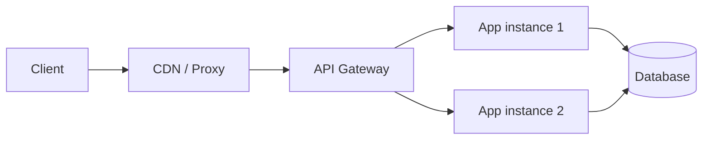
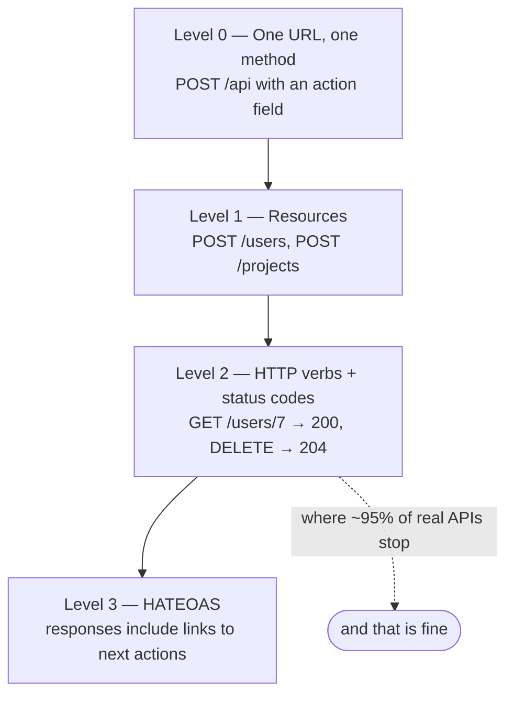

# REST Principles

Imagine a very large library. Every book has a fixed shelf address printed on
its spine. Anyone who knows the address can walk to that shelf and get the
book. They do not need to talk to the librarian first, and the librarian does
not need to remember who they are. The address is the thing, and a small set of
standard actions (take, return, replace, remove) covers everything.

REST is that idea applied to a network. Your data is a set of addressable
things. HTTP already gives you the addresses (URLs) and the standard actions
(GET, POST, PUT, PATCH, DELETE). REST is the agreement to use them the way they
were meant to be used.

> **📌 In one line:** REST is an architectural style where every piece of data
> is a resource with its own URL, and you act on it using the standard HTTP
> methods, without the server remembering anything about you between requests.

## Table of Contents

1. [What REST Actually Is](#what-rest-actually-is)
2. [The Core Idea: Everything Is a Resource](#the-core-idea-everything-is-a-resource)
3. [The Constraints That Matter](#the-constraints-that-matter)
4. [Statelessness in Practice](#statelessness-in-practice)
5. [The Richardson Maturity Model](#the-richardson-maturity-model)
6. [HATEOAS, Honestly](#hateoas-honestly)
7. [Advanced: What "RESTful" Arguments Get Wrong](#advanced-what-restful-arguments-get-wrong)
8. [Common Mistakes](#common-mistakes)
9. [Questions to Test Yourself](#questions-to-test-yourself)
10. [Related](#related)

---

## What REST Actually Is

REST stands for **RE**presentational **S**tate **T**ransfer. The name comes
from Roy Fielding's PhD thesis in 2000. He was one of the people who helped
write the HTTP specification, and the thesis was his description of *why* the
web works so well at huge scale.

So REST is not a new invention bolted onto the web. It is a description of the
web's own design, written down as a set of rules you can copy.

Three things REST is **not**:

| REST is not | Why people think it is | What it really is |
|---|---|---|
| A protocol | It is always discussed next to HTTP | A style. HTTP is the protocol |
| A library or framework | "We use a REST library" | No code ships with it. You just follow rules |
| A standard with a certification | RFC numbers exist for HTTP, not REST | An academic description, with no test suite |

Because there is no official test, nobody can hand you a certificate saying
your API is REST. This is why arguments about whether something is "really
RESTful" go on forever. Keep that in mind — it will save you hours.

The useful part of REST is not the label. It is the small set of design rules
underneath, because each rule buys you something concrete: caching, easy
horizontal scaling, or an API that other developers can guess.

## The Core Idea: Everything Is a Resource

A **resource** is any thing in your system that is worth naming. A user. A
project. A task. An invoice. Even a collection of them ("all tasks in project
42") is a resource.

Each resource gets a stable address — a URL. You act on it with an HTTP
method. That is the whole model.

```text
┌──────────────────────────────────────────────────────────────┐
│  Resource:  a task                                           │
│  Address:   /projects/42/tasks/1007                          │
├──────────────────────────────────────────────────────────────┤
│  GET     /projects/42/tasks/1007   → read it                 │
│  PATCH   /projects/42/tasks/1007   → change part of it       │
│  PUT     /projects/42/tasks/1007   → replace it              │
│  DELETE  /projects/42/tasks/1007   → remove it               │
│  GET     /projects/42/tasks        → read the collection     │
│  POST    /projects/42/tasks        → add one to the collection│
└──────────────────────────────────────────────────────────────┘
```

Notice that the **verb is never in the URL**. The URL says *what*, the method
says *what to do with it*. This is the single most important habit in REST, and
file 2 ([Resource Naming and URLs](02-resource-naming-and-urls.md)) is entirely
about getting it right.

### Resource vs representation

The resource is the abstract thing: "task 1007". The **representation** is the
concrete bytes you send over the wire to describe it — usually JSON.

The same resource can have several representations:

```http
GET /projects/42/tasks/1007
Accept: application/json      → {"id":1007,"title":"Ship invoices"}

GET /projects/42/tasks/1007
Accept: text/csv              → id,title
                                1007,Ship invoices
```

The "RE" in REST is exactly this: you never move the resource itself, you move
a *representation* of it.

## The Constraints That Matter

Fielding listed six constraints. Five of them show up in your day-to-day code.
Here is each one in plain words, plus what it actually changes about how you
write your controllers.

### 1. Client–server

The client and the server are separate programs with a clear boundary. The
server owns the data. The client owns the screen.

They only talk through the API contract. Neither is allowed to reach into the
other's internals.

> **Practical consequence:** your API must not return data shaped for one
> particular screen. The moment your endpoint is called
> `/dashboard-widget-data`, you have glued your server to one React component,
> and the next redesign becomes an API change.

### 2. Stateless

Every request must carry everything the server needs to handle it. The server
does not remember the previous request.

> **Practical consequence:** you can run 10 copies of your Node app behind a
> [load balancer](../../system-design/foundational/load-balancing.md) and it
> does not matter which copy gets the request. If your server kept per-user
> memory, request 2 would fail whenever it landed on a different copy.

This one has enough real-world consequences that it gets its own section below.

### 3. Uniform interface

Everyone uses the same small set of rules: resources have URLs, you act on them
with standard methods, and responses describe themselves (`Content-Type`,
status codes).

> **Practical consequence:** a developer who has never seen your API can still
> guess that `GET /invoices/88` reads invoice 88, and that a `404` means it does
> not exist. You get free tooling too — Postman, curl, browser dev tools, HTTP
> caches and proxies all already understand your API.

### 4. Cacheable

Responses should say whether they can be stored and reused. HTTP already has
the headers for this: `Cache-Control`, `ETag`, `Last-Modified`.

> **Practical consequence:** a `GET` that is safe to cache for 60 seconds can
> be served by a CDN or a reverse proxy and never touch your database. This only
> works if your `GET`s genuinely have no side effects. See
> [caching-strategies](../../system-design/foundational/caching-strategies.md).

### 5. Layered system

A client cannot tell whether it is talking to your app directly, or to a load
balancer, a CDN, or an API gateway that forwards to your app.

> **Practical consequence:** you can insert a
> [reverse proxy](../../system-design/foundational/reverse-proxy.md) or an
> [API gateway](../../system-design/foundational/api-gateway.md) later without
> changing a single client. It also means your app must never assume the TCP
> connection came straight from the user — the real client IP is in a header.

The sixth constraint, **code on demand** (the server can send executable code
to the client), is optional and almost never used in APIs. Ignore it.



The client only ever knows about the leftmost arrow. That is the layered
system constraint doing its job.

## Statelessness in Practice

This is the constraint people get wrong most often, so let us make it concrete.

Say you build a three-step "create company" wizard. The tempting design is to
have the server remember progress:

```ts
// ❌ BROKEN — the server keeps wizard progress in its own memory.
const wizardState = new Map<string, Partial<CompanyDraft>>()

router.post('/companies/wizard/step-1', (req, res) => {
  wizardState.set(req.user.id, { name: req.body.name })
  res.json({ ok: true })
})

router.post('/companies/wizard/step-2', (req, res) => {
  // Assumes step 1 ran on THIS server process. It may not have.
  const draft = wizardState.get(req.user.id)!
  draft.billingEmail = req.body.billingEmail
  res.json({ ok: true })
})
```

Three things break here. If you run two instances, step 2 may land on the
instance that never saw step 1. If the process restarts, every in-progress
wizard is lost. And memory grows forever for users who abandon the flow.

The fix is to move the state somewhere both requests can reach, and to give the
client a handle to it:

```ts
// ✅ FIXED — the draft is a real resource in the database, with its own URL.
router.post('/company-drafts', async (req, res) => {
  const draft = await CompanyDraft.create({
    ownerId: req.user.id,
    name: req.body.name,
    status: 'incomplete',
  })
  res.status(201).json({ id: draft.id, next: `/company-drafts/${draft.id}` })
})

router.patch('/company-drafts/:id', async (req, res) => {
  // Everything needed is in the URL, the body, and the auth token.
  const draft = await CompanyDraft.findOwnedBy(req.params.id, req.user.id)
  await draft.merge({ billingEmail: req.body.billingEmail }).save()
  res.json(draft.serialize())
})
```

Now any instance can serve any step. The client holds the draft ID, so the
client holds the "where am I" state — which is exactly where screen state
belongs.

### What stateless does *not* mean

Stateless does not mean "no database" and it does not mean "no login". Data in
PostgreSQL or [Redis](../../system-design/foundational/redis.md) is shared
state, not per-connection server memory. That is fine.

| Where the state lives | Stateless? | Why |
|---|---|---|
| In a `Map` inside one Node process | ❌ No | Only that one process can see it |
| In a signed JWT the client sends each time | ✅ Yes | The request carries it |
| In a session row in PostgreSQL, keyed by a cookie | ✅ Yes | Any instance can read it |
| In a session store in Redis, keyed by a cookie | ✅ Yes | Any instance can read it |
| In an in-memory session that requires sticky routing | ❌ No | Request must return to the same box |

> **💡 Tip:** the test is simple. "If this request went to a brand new server
> that has never seen this user, would it still work?" If yes, you are
> stateless.

## The Richardson Maturity Model

Leonard Richardson described four levels of how closely an API follows REST.
It is a useful vocabulary, not a score to chase.



| Level | What it looks like | Example request |
|---|---|---|
| 0 | A single endpoint. The body says what to do. This is RPC over HTTP. | `POST /api` with `{"action":"getTask","id":1007}` |
| 1 | Many URLs, one per resource, but still one method (usually POST). | `POST /tasks/get`, `POST /tasks/delete` |
| 2 | Proper methods and proper status codes on resource URLs. | `GET /tasks/1007` → `200`, `DELETE /tasks/1007` → `204` |
| 3 | Level 2, plus every response links to the actions you can take next. | `GET /invoices/88` returns a `links.send` URL |

**Almost every production API you will ever touch is level 2.** Stripe, GitHub,
Shopify — all effectively level 2, with a few links sprinkled in. Level 2 gives
you nearly all the practical benefits: cacheable GETs, safe retries, standard
tooling, guessable URLs.

> **📌 Remember:** level 2 done consistently beats level 3 done partially.
> Aim for level 2 everywhere, not level 3 in one corner of your API.

## HATEOAS, Honestly

HATEOAS stands for **H**ypermedia **A**s **T**he **E**ngine **O**f
**A**pplication **S**tate. Long name, small idea.

The idea: a response should not just contain data, it should contain the links
for what you can do next. The client then follows links instead of building
URLs from hard-coded strings.

```jsonc
{
  "id": 88,
  "status": "draft",
  "total_cents": 250000,
  "_links": {
    "self":   { "href": "/v1/invoices/88" },
    "send":   { "href": "/v1/invoices/88/send",   "method": "POST" },
    "void":   { "href": "/v1/invoices/88/void",   "method": "POST" },
    "company":{ "href": "/v1/companies/12" }
  }
}
```

Because the invoice is a draft, the server offers `send` and `void`. Once it is
paid, the server would stop sending those links, and a correct client would
stop showing those buttons. In theory the client never needs to know the rules.

### Why it is rarely used

Four honest reasons:

1. **Clients ignore the links anyway.** Frontend developers hard-code
   `/v1/invoices/${id}/send` because it is simpler and it works.
2. **It does not remove the coupling.** The client still has to know what
   `send` *means* and what fields to post. Only the string moved.
3. **No agreed format.** HAL, JSON:API, Siren, Collection+JSON all disagree.
   Picking one is a real cost with little payoff.
4. **Response size and effort.** Every response grows, and every endpoint needs
   link-building logic that must be tested.

Where hypermedia genuinely wins: long-lived public APIs with many independent
clients you cannot coordinate with, and paginated collections (a `next` URL in
a page response is real HATEOAS and is genuinely useful — see
[Pagination](03-pagination-filtering-sorting.md)).

> **💡 Tip:** you do not have to choose all or nothing. Sending `next` /
> `prev` links on collections, and a `self` link on each item, gives you the
> useful 10% of HATEOAS for almost no cost.

## Advanced: What "RESTful" Arguments Get Wrong

Once your API grows past twenty endpoints, someone will say "that is not
RESTful". Here is how to handle that conversation productively.

### Mistake 1: treating REST as a rulebook with a grade

There is no authority. Fielding's thesis describes a style; it does not define
a compliance test. "Not RESTful" is only a useful sentence if it is followed by
"…and here is the concrete cost we pay for that."

### Mistake 2: forcing non-CRUD actions into CRUD shapes

Real systems have actions: send an invoice, archive a project, reset a
password. Twisting these into `PATCH /invoices/88 {"status":"sent"}` hides
important behaviour (it sends an email, charges a fee, cannot be undone) behind
a generic update.

```ts
// ❌ BROKEN — a generic PATCH that secretly triggers email + accounting.
// PATCH /invoices/88  { "status": "sent" }
// The client cannot tell this is irreversible, and validation is now
// a pile of if-statements about which status transitions are legal.

// ✅ FIXED — the action is its own resource with its own permissions.
// POST /invoices/88/send  { "cc": ["finance@acme.com"] }
// Clear intent, its own auth rule, its own rate limit, its own audit log.
```

A dedicated action endpoint is not a REST violation worth losing sleep over.
File 2 covers this as the [controller resource pattern](02-resource-naming-and-urls.md).

### Mistake 3: chasing purity instead of consistency

Ask which of these two APIs is easier to work with:

| API A | API B |
|---|---|
| 95% pure REST, 5% odd exceptions with different conventions | Level 2 throughout, same rules everywhere, a few action endpoints |
| Errors shaped differently in the pure and impure parts | One error shape, always |
| IDs sometimes in the path, sometimes in the body | IDs always in the path |

B wins every time. A developer integrating with your API is building a mental
model. Consistency means their model keeps predicting correctly. Purity with
exceptions means it keeps failing, and every exception costs them a support
ticket.

> **📌 Remember:** the goal is an API a stranger can predict. REST is a tool
> for that goal, not the goal itself.

### Mistake 4: ignoring the constraints that actually pay

If you are going to be impure somewhere, be impure about URL aesthetics — not
about statelessness, safe `GET`s, or correct status codes. Those three are the
ones that cost you real money when broken:

| Constraint broken | Real-world cost |
|---|---|
| `GET` has side effects | A crawler, a prefetcher, or a retry silently changes data |
| Server keeps per-process state | You cannot scale out; deploys drop user sessions |
| Wrong status codes | Clients retry things they should not; monitoring goes blind |
| Ugly but consistent URL | A slightly annoyed developer. That is all |

---

## Common Mistakes

| Mistake | Why it is wrong | Do this instead |
|---|---|---|
| Putting verbs in URLs (`/getUser`, `/createTask`) | Duplicates what the HTTP method already says, and breaks caching and tooling | Nouns plus methods: `GET /users/7`, `POST /tasks` |
| Returning `200 OK` for every response, with `success: false` inside | Proxies, caches, retries, and monitoring all read the status code, not your body | Use real status codes. See [status codes](../01-http-foundations/04-status-codes.md) |
| Keeping per-user progress in a process-level variable | Breaks with more than one instance and on every deploy | Store it in the database or a shared cache, and give the client the ID |
| Using `GET` for something that changes data | Browsers prefetch, proxies cache, clients retry — all of which now mutate your data | `POST`, `PUT`, `PATCH`, or `DELETE` |
| Designing endpoints around one screen | The API dies at the next redesign | Design around resources; let the client compose |
| Arguing about REST purity in code review | Costs hours, changes nothing for users | Argue about consistency and about the four costly constraints above |
| Adding HATEOAS links nobody consumes | Bigger payloads, more code, more tests, zero benefit | Ship `self` and pagination links only, until a client asks for more |

## Questions to Test Yourself

1. Why is "REST is a protocol" wrong? What *is* the protocol in a REST API?
2. Your API keeps a user's multi-step form progress in a `Map` inside the Node
   process. Name three separate ways this fails in production.
3. Storing a session in Redis still means the server "remembers" the user. Why
   does that not break the stateless constraint?
4. Which Richardson level does an endpoint like `POST /api` with
   `{"action":"deleteTask"}` sit at, and what exactly do you lose by staying
   there?
5. Give a concrete example where making a `GET` request change data causes a
   real bug, involving something other than your own client code.
6. HATEOAS is supposed to decouple the client from URLs. Why does it usually
   fail to remove the coupling in practice?
7. You must choose between a perfectly RESTful design with two odd exceptions,
   and a slightly impure design that is identical everywhere. Which do you pick
   and what is your one-sentence reason?
8. What does the layered-system constraint imply about how your app should read
   the client's IP address?

## Related

- [Resource Naming and URLs](02-resource-naming-and-urls.md) — turns the
  resource idea in this file into concrete paths.
- [HTTP Methods](../01-http-foundations/03-http-methods.md) — the verbs the
  uniform interface constraint relies on.
- [Status Codes](../01-http-foundations/04-status-codes.md) — the other half of
  a self-describing response.
- [REST vs GraphQL vs RPC](06-rest-vs-graphql-vs-rpc.md) — what the
  alternatives to this style trade away.
- [load-balancing](../../system-design/foundational/load-balancing.md) — why
  statelessness is what lets you add servers.
- [caching-strategies](../../system-design/foundational/caching-strategies.md) —
  how to actually use the cacheable constraint.
- [api-gateway](../../system-design/foundational/api-gateway.md) — the layered
  system constraint as a real piece of infrastructure.
