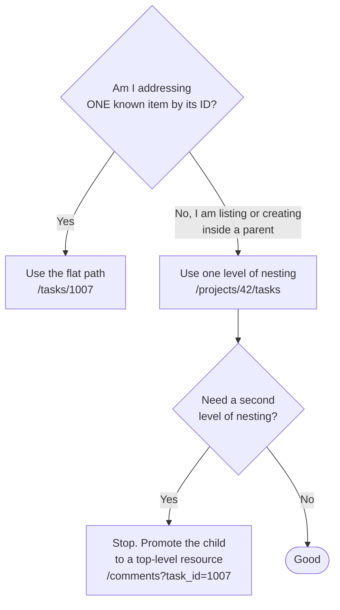
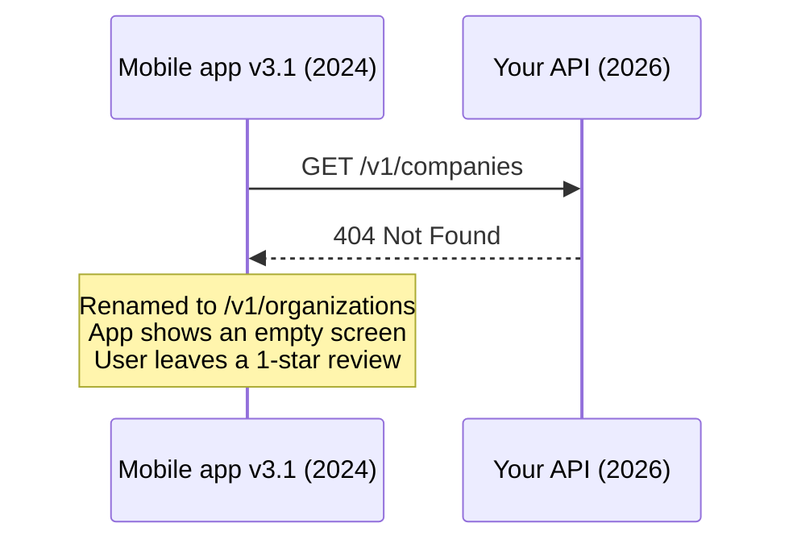

# Resource Naming and URLs

Think of your API's URLs as street addresses in a city. If the streets follow a
predictable naming pattern, a visitor finds any house without a map. If every
street follows a different rule, the visitor calls you for directions every
time.

Naming is the cheapest part of API design to get right and the most expensive
part to change later. A URL that shipped in last year's mobile app is frozen
until that app version dies.

> **📌 In one line:** URLs name things (nouns), HTTP methods say what to do to
> them (verbs), and once a URL is public you are stuck with it — so choose
> slowly and stay consistent.

## Table of Contents

1. [Nouns, Not Verbs](#nouns-not-verbs)
2. [Plural, Casing, and Trailing Slashes](#plural-casing-and-trailing-slashes)
3. [Nested Resources](#nested-resources)
4. [Actions That Are Not CRUD](#actions-that-are-not-crud)
5. [Filters, Search, and Sub-Collections](#filters-search-and-sub-collections)
6. [IDs in URLs](#ids-in-urls)
7. [Worked Example: The Whole SaaS API](#worked-example-the-whole-saas-api)
8. [Advanced: URLs Are a Public Contract](#advanced-urls-are-a-public-contract)
9. [Common Mistakes](#common-mistakes)
10. [Questions to Test Yourself](#questions-to-test-yourself)
11. [Related](#related)

---

## Nouns, Not Verbs

The HTTP method is already a verb. Putting another verb in the path repeats it
and, worse, hides it from every tool that reads HTTP.

```text
   GET      /users/7
   ▲        ▲
   │        └── the noun: WHICH thing
   └── the verb: WHAT to do
```

When the verb lives in the path (`POST /getUser`), three things break.
**Caching:** a proxy or CDN can cache a `GET`, never a `POST`, even when that
`POST` only reads. **Retries:** clients and gateways retry `GET` safely because
`GET` promises no side effects; `POST /getUser` gives no such promise.
**Guessability:** once `/getUser` exists, someone adds `/fetchUsers`,
`/userList`, and `/listAllUsers`, and nobody can guess which one is real.

### Before and after

| # | ❌ Bad | ✅ Good | Why |
|---|---|---|---|
| 1 | `GET /getUsers` | `GET /users` | The method already means "get" |
| 2 | `POST /createProject` | `POST /projects` | `POST` to a collection means "create in it" |
| 3 | `POST /updateTask?id=1007` | `PATCH /tasks/1007` | ID belongs in the path; `PATCH` means partial update |
| 4 | `POST /deleteInvoice` | `DELETE /invoices/88` | `DELETE` exists for exactly this |
| 5 | `GET /user/getById/7` | `GET /users/7` | Collection plus identifier is the whole pattern |
| 6 | `GET /getTasksForProject?projectId=42` | `GET /projects/42/tasks` | The relationship is structural, so it belongs in the path |
| 7 | `POST /users/7/setActive` | `PATCH /users/7` with `{"status":"active"}` | A plain field change is an update, not an action |
| 8 | `GET /searchInvoices?q=acme` | `GET /invoices?q=acme` | Search is a filtered view of the collection |
| 9 | `POST /api/v1/Notification/MarkAllRead` | `POST /v1/notifications/read-all` | Lowercase, plural, kebab-case, no `Api` noise |
| 10 | `GET /company_projects_list` | `GET /companies/12/projects` | Structure, not a flattened sentence |

> **⚠️ Warning:** rows 7 and 8 are the subtle ones. Not everything that feels
> like an action needs an action endpoint. If it only sets a field, it is a
> `PATCH`. [Actions That Are Not CRUD](#actions-that-are-not-crud) covers the
> cases where a real action endpoint is correct.

## Plural, Casing, and Trailing Slashes

These three decisions do not matter much on their own. What matters is picking
one answer and using it in 100% of your API.

### Plural or singular?

Use **plural** for collections, always.

```text
/users          ← the collection
/users/7        ← one item inside the collection
```

Reading `/users/7` as "item 7 of the users collection" works. Mixing `/user/7`
with `/users` forces every client to remember which endpoints use which form.
Plural everywhere removes that decision.

The one accepted exception is a **singleton resource** — a thing of which
exactly one exists for the caller:

```text
GET   /me            ← the currently logged-in user
GET   /settings      ← this company's single settings object
```

### Casing

| Place | Convention | Example |
|---|---|---|
| URL path | `kebab-case`, lowercase | `/password-reset-requests` |
| Query parameters | `snake_case` or `camelCase`, pick one | `?created_after=2026-01-01` |
| JSON fields | the same one you picked above | `{"created_at": "..."}` |

Paths are lowercase because some servers treat `/Users` and `/users` as
different resources while others do not. Hyphens beat underscores in paths
because an underline in a link can hide an underscore.

> **💡 Tip:** match your JSON field style to your query parameter style. If the
> response says `created_at`, the filter is `?created_after=`.

### Trailing slashes

Pick "no trailing slash" and redirect the other form.

```text
/users   ← canonical
/users/  ← 301 redirect to /users
```

Treating `/users` and `/users/` as two endpoints doubles your route table and
splits your cache. A permanent redirect costs one extra round trip, once.

## Nested Resources

Nesting shows that one resource lives inside another: `/companies/12/projects`,
`/projects/42/tasks`.

### When nesting helps

- The child **cannot exist** without the parent. A task with no project is
  meaningless.
- The parent is how you **scope permissions**. "Can this user see company 12?"
  answers the question for everything under it.
- Listing the children is a common, real operation.

### When nesting hurts

```text
❌ /companies/12/projects/42/tasks/1007/comments/9/reactions/3
```

That URL has six levels. Problems it creates:

- **Redundant.** Comment 9 already implies its task, project, and company. The
  extra IDs are just more values that can disagree with each other.
- **Validation burden.** Your handler must check task 1007 really belongs to
  project 42, which really belongs to company 12. Miss one check and you have an
  access-control hole.
- **Unstable.** If a task moves to another project, every saved URL breaks.

> **📌 Remember:** do not nest more than **one level deep**. Use
> `/projects/42/tasks` to *list or create*, and `/tasks/1007` to *read, update,
> or delete* a specific one.



### The two-path pattern in code

```ts
// Nested: create and list, scoped by the parent.
router.get('/projects/:projectId/tasks', listTasksInProject)
router.post('/projects/:projectId/tasks', createTaskInProject)

// Flat: everything that addresses one task by its own ID.
router.get('/tasks/:taskId', showTask)
router.patch('/tasks/:taskId', updateTask)

async function showTask(req: Request, res: Response) {
  const task = await Task.findOrFail(req.params.taskId)
  // Authorization comes from the data, not from a URL segment the client chose.
  await authorize(req.user, 'read', task)
  res.json(serializeTask(task))
}
```

> **⚠️ Warning:** never trust a parent ID in the URL as proof of access. A
> client can send `/companies/12/projects/999` where project 999 belongs to
> company 55. Always verify the relationship server-side.

## Actions That Are Not CRUD

Some operations are genuinely not "create, read, update, delete". Sending an
invoice sends an email, stamps a timestamp, writes an audit record, and cannot
be undone. Hiding all of that inside `PATCH /invoices/88` is dishonest.

The standard answer is the **controller resource** pattern: a verb-shaped last
segment under a real resource, always called with `POST`.

```text
POST /invoices/88/send
POST /invoices/88/void
POST /users/7/password-reset
POST /projects/42/archive
POST /tasks/1007/duplicate
POST /notifications/read-all
```

Rules for these: always `POST` (they are neither safe nor idempotent); the verb
is the last segment only; one action per endpoint; and each gets its own
permission check and audit log entry.

```ts
// ❌ BROKEN — one endpoint, many hidden powers, one coarse permission check.
router.post('/invoices/:id/action', async (req, res) => {
  const { type } = req.body                     // 'send' | 'void' | 'refund'
  await authorize(req.user, 'update', invoice)  // far too broad for a refund
  await invoiceActions[type](invoice)
})

// ✅ FIXED — each action is its own endpoint with its own rule.
router.post('/invoices/:id/send',   can('invoice.send'),   sendInvoice)
router.post('/invoices/:id/refund', can('invoice.refund'), refundInvoice)
```

### The alternative: model the action as a resource

Sometimes the action leaves a real record behind. Make that record the resource:

| Action style | Resource style | Prefer the resource style when |
|---|---|---|
| `POST /users/7/password-reset` | `POST /password-reset-requests` | You must list, expire, or audit the requests |
| `POST /invoices/88/send` | `POST /invoices/88/deliveries` | You send many times and need a history |

> **💡 Tip:** ask "will anyone need to look this up later?" If yes, it is a
> resource. If not, the action endpoint is fine. Either way, these are the calls
> that must not run twice — pair them with
> [idempotency](../../system-design/reliability/idempotency.md) keys.

## Filters, Search, and Sub-Collections

Three ways to express "a subset of a collection", and they are not
interchangeable.

| Form | Example | Use when |
|---|---|---|
| Query parameter | `GET /tasks?status=open` | A temporary, combinable view |
| Sub-collection | `GET /projects/42/tasks` | A permanent structural relationship |
| Named sub-path | `GET /tasks/overdue` | A business view that deserves a stable name |

The test for query parameter vs path: **if removing it still leaves a sensible
resource, it is a filter.** `GET /tasks` without `?status=open` is fine, so
status is a query parameter.

```text
/tasks                            all tasks the caller may see
/tasks?status=open&assignee_id=7  two filters combined
/projects/42/tasks                a structural sub-collection
/tasks/overdue                    a named business view
```

Avoid inventing a third way for the same thing. If both `/projects/42/tasks`
and `/tasks?project_id=42` exist, document which one is canonical, and make
sure both return the identical shape.

The full design of filter parameters, including ranges and multiple values,
is in [Pagination, Filtering, Sorting](03-pagination-filtering-sorting.md).

## IDs in URLs

The ID format you choose leaks into every URL, every log line, every foreign
key, and every customer's saved bookmark. Here is the honest comparison.

| Property | Sequential integer (`1007`) | UUID v4 (`f47ac10b-…`) | ULID / UUID v7 (`01JB6…`) |
|---|---|---|---|
| Guessable by an attacker | ❌ Trivially (`/users/1`, `/users/2`) | ✅ No | ✅ No |
| Sortable by creation time | ✅ Yes | ❌ No, random | ✅ Yes, time is the prefix |
| Index performance on insert | ✅ Best (appends to the B-tree) | ❌ Worst (random writes across pages) | ✅ Near-best (mostly sequential) |
| Storage size | ✅ 4–8 bytes | ❌ 16 bytes (36 as text) | ❌ 16 bytes (26 as text) |
| Leaks business information | ❌ Yes — see below | ✅ No | ⚠️ Leaks creation time only |
| Readable in a support ticket | ✅ "invoice 88" | ❌ Nobody reads it aloud | ⚠️ Long but copy-pasteable |
| Safe to generate client-side | ❌ No, needs the database | ✅ Yes | ✅ Yes |

### The business information leak

A competitor signs up for your product twice, one week apart, and reads their
own company IDs: `/companies/4182`, then `/companies/4194`. They now know you
added 12 companies in a week. The same trick reveals your total customer count,
your growth rate, and your invoice volume. It costs them nothing to run.

> **⚠️ Warning:** sequential IDs also make **IDOR** (Insecure Direct Object
> Reference) attacks easy. An attacker changes `/invoices/88` to `/invoices/89`
> and sees whether your authorization check is real. Random IDs are not a
> substitute for that check — but they do stop the attack from being automated.

### A practical recommendation

Keep a sequential `bigint` primary key **inside** the database, so indexes,
joins, and foreign keys stay fast. Expose a **ULID or UUID v7** as the public ID
in URLs, so the URLs are unguessable but still sortable and index-friendly.

```ts
// Public ID generated in the app, sortable by time, safe to expose.
import { ulid } from 'ulid'

const project = await Project.create({
  publicId: ulid(),            // '01JB6Z9Q7K3M8T1V2W5X4Y6Z7A'
  companyId: company.id,       // internal bigint, never exposed
  name: 'Q1 Migration',
})
// URL becomes /projects/01JB6Z9Q7K3M8T1V2W5X4Y6Z7A
```

> **💡 Tip:** a prefix makes IDs self-describing in logs, the way Stripe does it:
> `inv_01JB6Z…`, `usr_01JB6Z…`. A pasted ID explains itself, and a task ID sent
> to an invoice endpoint fails loudly instead of quietly.

## Worked Example: The Whole SaaS API

Here is a complete endpoint list for the domain used across this track. Notice
the repetition — that repetition *is* the design.

### Auth, the current user, companies, and membership

| Method | Path | Purpose |
|---|---|---|
| POST | `/v1/auth/login` | Exchange credentials for a token |
| POST | `/v1/auth/logout` | Invalidate the current token |
| POST | `/v1/auth/refresh` | Get a new access token |
| POST | `/v1/password-reset-requests` | Start a password reset (always `202`) |
| POST | `/v1/password-resets` | Complete the reset with a token |
| GET | `/v1/me` | The logged-in user's own profile (singleton) |
| PATCH | `/v1/me` | Update own name, avatar, locale |
| GET | `/v1/companies` | List companies the caller belongs to |
| POST | `/v1/companies` | Create a company |
| GET | `/v1/companies/:companyId` | Read one company |
| PATCH | `/v1/companies/:companyId` | Update name, billing email, timezone |
| DELETE | `/v1/companies/:companyId` | Soft-delete a company |
| GET | `/v1/companies/:companyId/members` | List members and their roles |
| PUT | `/v1/companies/:companyId/members/:userId` | Set that user's role |
| DELETE | `/v1/companies/:companyId/members/:userId` | Remove the user from the company |
| POST | `/v1/companies/:companyId/invitations` | Invite someone by email |
| DELETE | `/v1/invitations/:invitationId` | Cancel a pending invitation |
| GET | `/v1/users/:userId` | Read one user's public profile |
| DELETE | `/v1/users/:userId` | Deactivate a user |

`PUT` is correct for setting a role: sending it twice leaves the same result.

### Projects, tasks, and comments

| Method | Path | Purpose |
|---|---|---|
| GET | `/v1/companies/:companyId/projects` | List a company's projects |
| POST | `/v1/companies/:companyId/projects` | Create a project in that company |
| GET | `/v1/projects/:projectId` | Read one project |
| PATCH | `/v1/projects/:projectId` | Update name, description, due date |
| DELETE | `/v1/projects/:projectId` | Delete a project |
| POST | `/v1/projects/:projectId/archive` | Archive it and stop its notifications |
| POST | `/v1/projects/:projectId/duplicate` | Copy the project and its task template |
| GET | `/v1/projects/:projectId/tasks` | List tasks in a project |
| POST | `/v1/projects/:projectId/tasks` | Create a task in a project |
| GET | `/v1/tasks` | List tasks across projects, with filters |
| GET | `/v1/tasks/:taskId` | Read one task |
| PATCH | `/v1/tasks/:taskId` | Update title, status, assignee, due date |
| DELETE | `/v1/tasks/:taskId` | Delete a task |
| GET | `/v1/tasks/:taskId/comments` | List comments on a task |
| POST | `/v1/tasks/:taskId/comments` | Add a comment |
| DELETE | `/v1/comments/:commentId` | Delete a comment (flat: one nesting level only) |

### Invoices and notifications

| Method | Path | Purpose |
|---|---|---|
| GET | `/v1/companies/:companyId/invoices` | List a company's invoices |
| POST | `/v1/companies/:companyId/invoices` | Create a draft invoice |
| GET | `/v1/invoices/:invoiceId` | Read one invoice |
| PATCH | `/v1/invoices/:invoiceId` | Edit a draft (rejected once sent) |
| POST | `/v1/invoices/:invoiceId/send` | Send it to the customer |
| POST | `/v1/invoices/:invoiceId/void` | Void it |
| POST | `/v1/invoices/:invoiceId/payments` | Record a payment against it |
| GET | `/v1/invoices/:invoiceId/pdf` | Download the PDF representation |
| GET | `/v1/notifications` | List the caller's notifications |
| GET | `/v1/notifications?read=false` | Unread only — a filter, not a new path |
| PATCH | `/v1/notifications/:notificationId` | Mark one as read |
| POST | `/v1/notifications/read-all` | Mark every unread one as read |
| GET | `/v1/notification-preferences` | Singleton: the caller's settings |
| PUT | `/v1/notification-preferences` | Replace the settings object |

Read the list again and count the repeated patterns: collection plus ID, one
level of nesting for create and list, flat paths for single items, `POST` plus a
verb for real actions, filters as query parameters. That predictability is the
entire product of good naming.

## Advanced: URLs Are a Public Contract

### Why renaming a path is a breaking change

Rename `/v1/companies` to `/v1/organizations` and every caller that has not
been updated gets a `404`. The data is identical, but the address changed, so
the door no longer opens.

This hurts most with mobile apps. A web frontend updates the moment you deploy.
An iOS app from eighteen months ago is still on someone's phone, still calling
the old path, and you cannot force that user to update.



Safe alternatives:

1. **Keep both.** Route the old path to the same handler. One extra line.
2. **Redirect.** `301` old to new. Browsers follow it; many HTTP clients do not
   by default, so test yours.
3. **Version.** Use the new name only in `/v2`. See
   [API Versioning](04-api-versioning.md).

### Designing for the API you will have in two years

Questions to ask *before* the first endpoint ships:

| Question | If you skip it | Cheap answer now |
|---|---|---|
| Will one user belong to two companies? | Every path assumes one, and you rewrite them all | Scope by company from day one |
| Will this list exceed a few hundred rows? | An unbounded list becomes an outage | Paginate from the first version |
| Will a third party ever call this? | Internal shortcuts become public promises | Put `/v1` in the path immediately |
| Could the business rename this? | "Projects" become "workspaces" and the URL lies | Name it after what it *is*, not the UI label |
| Will you need a bulk version? | Clients loop 500 single calls and overload the database | Leave room for `POST /tasks/bulk` |

> **💡 Tip:** name resources after the domain concept, not the screen. If the UI
> calls it "My Board" but the data is tasks, the endpoint is `/tasks`.

### Keep non-identity data out of the URL

| Do not put in the URL | Why | Where it goes |
|---|---|---|
| API keys or tokens | URLs land in logs, history, and `Referer` headers | `Authorization` header |
| Passwords or reset tokens | The same leak, with worse consequences | Request body |
| Format extensions (`.json`) | Duplicates `Accept`, doubles your route table | `Accept` header |
| The current user's ID | Every client can lie about it | Read it from the auth token |

```ts
// ❌ BROKEN — the client tells you who it is, so any client can read any inbox.
router.get('/users/:userId/notifications', (req, res) =>
  Notification.forUser(req.params.userId).then((r) => res.json(r)))

// ✅ FIXED — identity comes from the verified token; /me names the singleton.
router.get('/me/notifications', (req, res) =>
  Notification.forUser(req.user.id).then((r) => res.json(r)))
```

---

## Common Mistakes

| Mistake | Why it is wrong | Do this instead |
|---|---|---|
| Verbs in paths (`/createTask`) | Breaks caching, retries, and guessability | Nouns plus HTTP methods |
| Mixing `/user` and `/users` | Every client must memorise which endpoints are which | Plural everywhere, except true singletons like `/me` |
| Nesting three or more levels | Redundant IDs, extra validation, fragile URLs | One level for list and create; flat paths for single items |
| Trusting a parent ID in the path as authorization | An attacker sends any parent ID they like | Load the record, then check ownership from the data |
| One `/action` endpoint with a `type` field | One permission check for many different powers | One endpoint per action, each with its own rule |
| Exposing sequential integer IDs publicly | Leaks customer counts and growth; enables automated IDOR probing | ULID or UUID v7 in public URLs, integers internally |
| Putting a token or user ID in the URL | Tokens leak through logs; user IDs can be forged | Header for tokens, auth context for identity |
| Renaming a live path because it reads better | Instant `404` for every old mobile client | Keep the old path as an alias, or rename only in a new version |

## Questions to Test Yourself

1. `POST /getUsers` returns data and changes nothing. Name two concrete things
   you lose compared with `GET /users`.
2. Why is `GET /companies/12/projects/42/tasks/1007` worse than
   `GET /tasks/1007`, even though both identify the same task?
3. A request arrives for `/companies/12/projects/999`, but project 999 belongs
   to company 55. What must your handler do, and what happens if it does not?
4. When is `POST /invoices/88/send` the right design, and when should the same
   behaviour be `PATCH /invoices/88` instead?
5. A competitor signs up twice, a week apart, and sees company IDs 4182 and
   4194. What did you just tell them for free?
6. UUID v4 is unguessable, so why might you still prefer ULID or UUID v7 for a
   table that receives many inserts per second?
7. You want to rename `/v1/companies` to `/v1/organizations`. List every group
   of clients that breaks, and give two ways to avoid breaking them.

## Related

- [REST Principles](01-rest-principles.md) — why the resource idea behind these
  URLs exists at all.
- [Pagination, Filtering, Sorting](03-pagination-filtering-sorting.md) — the
  query parameters that go on the paths designed here.
- [API Versioning](04-api-versioning.md) — what to do when a path or a field
  genuinely has to change.
- [HTTP Methods](../01-http-foundations/03-http-methods.md) — the verbs that let
  your paths stay nouns.
- [idempotency](../../system-design/reliability/idempotency.md) — needed by the
  non-CRUD action endpoints in this file.
- [api-gateway](../../system-design/foundational/api-gateway.md) — routes by
  path, so a stable path layout pays off in infrastructure too.
