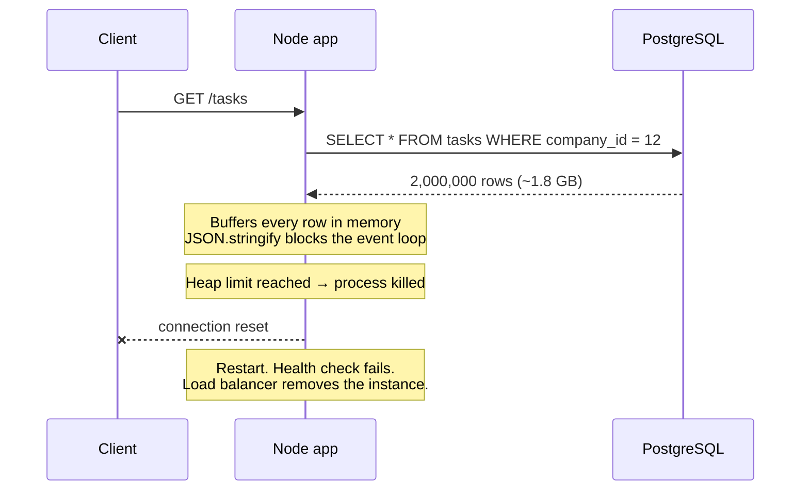
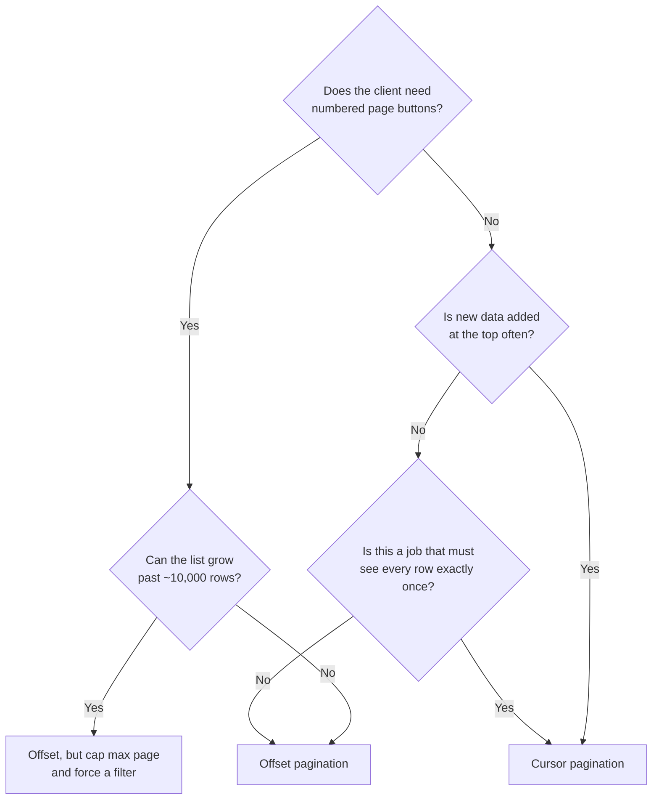

# Pagination, Filtering, and Sorting

A waiter does not bring the whole kitchen to your table. They bring one plate,
then ask if you want more. An API that returns an entire table in one response
is a waiter carrying the kitchen.

This file covers the three things every collection endpoint needs: how many rows
to send, which rows to send, and in what order. Get these wrong and you get slow
pages, duplicated rows, and one endpoint that takes the server down on a Monday
morning.

> **📌 In one line:** every collection endpoint must have a maximum page size, a
> defined order, and an allow-list of filterable and sortable columns — from the
> very first version.

## Table of Contents

1. [The Failure That Starts This](#the-failure-that-starts-this)
2. [Offset Pagination](#offset-pagination)
3. [Cursor Pagination](#cursor-pagination)
4. [Which One to Use](#which-one-to-use)
5. [Designing Filter Parameters](#designing-filter-parameters)
6. [Sorting and the Allow-List](#sorting-and-the-allow-list)
7. [Response Envelope Design](#response-envelope-design)
8. [Common Mistakes](#common-mistakes)
9. [Questions to Test Yourself](#questions-to-test-yourself)
10. [Related](#related)

---

## The Failure That Starts This

Here is real code that ships more often than it should:

```ts
// ❌ BROKEN — no limit. Fine in development, fatal in production.
router.get('/tasks', async (req, res) => {
  const tasks = await Task.query().where('company_id', req.user.companyId)
  res.json(tasks)
})
```

On your laptop the seed data has 200 tasks and the endpoint returns in 12
milliseconds. You ship it. Eighteen months later one customer has 2 million
tasks, and somebody opens the task list:



Four separate failures in one request:

| Layer | What breaks |
|---|---|
| Database | One query holds a connection for minutes and fills the pool |
| Node process | The rows do not fit in the heap; V8 kills the process |
| Event loop | `JSON.stringify` on a huge array blocks every other request |
| Client | The browser tries to render 2 million rows and freezes |

And this is not a load problem. **One** user, **one** click.

> **⚠️ Warning:** the default limit must be enforced on the server. A client
> that forgets `?limit=` must still get a small page. Never trust the client to
> protect your database.

```ts
// ✅ FIXED — a default limit, a hard maximum, and a stable order.
const MAX_LIMIT = 100

router.get('/tasks', async (req, res) => {
  const limit = Math.min(Number(req.query.limit ?? 25) || 25, MAX_LIMIT)
  const tasks = await Task.query()
    .where('company_id', req.user.companyId)
    .orderBy('created_at', 'desc')
    .orderBy('id', 'desc')          // tie-breaker: makes the order deterministic
    .limit(limit)
  res.json({ data: tasks, meta: { limit } })
})
```

Note the second `orderBy`. Without a unique tie-breaker, two rows with the same
`created_at` can come back in a different order on every query, which silently
breaks *both* styles of pagination below.

## Offset Pagination

The one everybody learns first. "Skip N rows, then give me M rows."

```http
GET /v1/tasks?page=3&per_page=25
```

```sql
SELECT * FROM tasks
WHERE company_id = 12
ORDER BY created_at DESC, id DESC
LIMIT 25 OFFSET 50;          -- page 3 → skip (3 - 1) * 25
```

Response shape:

```jsonc
{
  "data": [ /* 25 tasks */ ],
  "meta": {
    "page": 3,
    "per_page": 25,
    "total": 1842,
    "total_pages": 74
  }
}
```

It is easy to build, easy to explain, and gives numbered page buttons for free.
It has two real problems.

### Problem 1: it gets slower the deeper you go

`OFFSET 100000` does not mean "jump to row 100,000". The database must **read
and discard** 100,000 rows first, then return 20. Page 1 is instant; page 5,000
can take seconds.

```text
OFFSET 100000 LIMIT 20
├─────────── reads and throws away 100,000 rows ───────────┤├─ 20 ─┤
                                                            ▲
                                         all the work is before the answer
```

The database side of this — index-only scans, `EXPLAIN` output, why the planner
cannot skip ahead — is covered in
[pagination-performance](../../databases/query-optimization/pagination-performance.md).

### Problem 2: rows shift between pages

This one causes quiet data bugs rather than slow pages. Offset counts
*positions*, and positions move when rows are inserted or deleted.

```text
Time 1 — the client fetches page 1 (LIMIT 3 OFFSET 0)
  position:   1     2     3   │   4     5     6
  row:      [ T9 ] [ T8 ] [ T7 ] [ T6 ] [ T5 ] [ T4 ]
            └────── page 1 ──────┘
            client receives: T9, T8, T7

Time 2 — someone creates a new task T10. It sorts to the top.
  position:   1     2     3   │   4     5     6     7
  row:      [T10 ] [ T9 ] [ T8 ] [ T7 ] [ T6 ] [ T5 ] [ T4 ]

Time 3 — the client fetches page 2 (LIMIT 3 OFFSET 3)
                              └────── page 2 ──────┘
            client receives: T7, T6, T5
                             ▲
                       T7 AGAIN — it was already on page 1
```

The client now shows T7 twice. If a row is **deleted** instead, the mirror
problem happens: a row shifts up past the boundary and is never returned at all.

This is more than a UI glitch. A nightly export job that pages through `/tasks`
silently skips records, and a sync job creates duplicates. Nobody notices for
months.

> **📌 Remember:** offset pagination is safe for browsing data that changes
> slowly. It is not safe for exporting, syncing, or paging through a feed where
> new rows arrive at the top.

## Cursor Pagination

Also called **keyset pagination**. Instead of "skip 100,000 rows", you say
"give me the rows that come *after this exact row*".

```http
GET /v1/tasks?limit=25
GET /v1/tasks?limit=25&cursor=eyJjIjoiMjAyNi0wMy0xMVQwOTowMDowMFoiLCJpIjo4ODEyfQ
```

### What is actually in the cursor

The cursor is not magic. It is the sort key values of the last row you sent,
encoded so clients do not try to construct it themselves.

```ts
type Cursor = { c: string; i: number }   // created_at, id — the sort key

function encodeCursor(task: Task): string {
  const payload: Cursor = { c: task.createdAt.toISOString(), i: task.id }
  return Buffer.from(JSON.stringify(payload)).toString('base64url')
}

function decodeCursor(raw: string): Cursor {
  // Never trust it: a client can edit base64. Validate before it reaches SQL.
  const parsed = JSON.parse(Buffer.from(raw, 'base64url').toString())
  if (typeof parsed.i !== 'number' || typeof parsed.c !== 'string') {
    throw new BadRequestError('invalid_cursor')
  }
  return parsed
}
```

Base64 is not security. It is a signal meaning "opaque value, do not parse it,
do not build one by hand". That is what lets you change the sort key later
without breaking clients.

### The SQL difference

```sql
-- Offset: reads 100,020 rows, returns 20.
SELECT * FROM tasks
WHERE company_id = 12
ORDER BY created_at DESC, id DESC
LIMIT 20 OFFSET 100000;

-- Keyset: seeks straight to the position, reads 20 rows.
SELECT * FROM tasks
WHERE company_id = 12
  AND (created_at, id) < ('2026-03-11T09:00:00Z', 8812)   -- row comparison
ORDER BY created_at DESC, id DESC
LIMIT 20;
```

The `(created_at, id) < (?, ?)` form is a **row comparison**. PostgreSQL
compares the tuples in order, exactly matching a composite index on
`(company_id, created_at DESC, id DESC)`. The index gives the database a
starting point, so page 5,000 costs the same as page 1.

> **⚠️ Warning:** the tuple comparison only works if the index column order and
> directions match the `ORDER BY`. Writing
> `created_at < ? OR (created_at = ? AND id < ?)` is logically the same but
> often produces a worse query plan. Prefer the tuple form.

### What you give up

No page numbers — you cannot jump to page 40, because there is no "40th cursor".
No going backwards without a second, reversed query. And the sort is fixed by
the cursor: changing `?sort=` mid-pagination makes the old cursor meaningless,
so return `400` when that happens.

### The response shape

```jsonc
{
  "data": [ /* 25 tasks */ ],
  "meta": {
    "limit": 25,
    "next_cursor": "eyJjIjoiMjAyNi0wMy0xMVQwOTowMDowMFoiLCJpIjo4ODEyfQ",
    "has_more": true
  }
}
```

When there are no more rows, send `"next_cursor": null` and `"has_more": false`.
Do not omit the fields — clients then need two code paths.

> **💡 Tip:** fetch `limit + 1` rows. If you get `limit + 1` back, there is
> another page; drop the extra row and set `has_more: true`. This avoids a
> second `COUNT` query entirely.

## Which One to Use



| Situation | Use | Why |
|---|---|---|
| Admin table with page numbers, a few thousand rows | Offset | Page numbers matter more; data is small |
| Infinite-scroll activity feed | Cursor | New rows land at the top constantly |
| Notification list in a mobile app | Cursor | Same reason, and mobile retries a lot |
| Nightly export or sync job | Cursor | Skipping or duplicating a row is unacceptable |
| Search ordered by relevance score | Offset | Score is per query; there is no stable key |
| Public API for third parties | Cursor | You cannot control how deep they page |
| Dropdown of 30 projects | Either, but still set a limit | Small today, not guaranteed small tomorrow |

A common middle ground: support offset for the first N pages and refuse deeper
ones with `422` and a message saying "narrow your filters". Many large APIs do
exactly this.

## Designing Filter Parameters

Filters answer "which rows", and they must be as boring and predictable as
possible.

### The four shapes you need

```http
# 1. Simple equality
GET /v1/tasks?status=open&assignee_id=7

# 2. Multiple values (OR within one field) — comma-separated
GET /v1/tasks?status=open,in_review

# 3. Ranges — suffix the field name
GET /v1/tasks?due_at_after=2026-03-01&due_at_before=2026-03-31

# 4. Free-text search — one parameter, always called q
GET /v1/tasks?q=migration
```

Two fields combine with AND. Values inside one field combine with OR. Write
that sentence in your API documentation and never deviate from it.

| Need | Parameter form | Example |
|---|---|---|
| Equals | `field=value` | `status=open` |
| One of several | `field=a,b,c` | `status=open,in_review` |
| Greater / less | `field_after`, `field_before` | `created_at_after=2026-01-01` |
| Boolean | `field=true` / `field=false` | `is_billable=true` |
| Missing value | `field=null` | `assignee_id=null` |
| Text search | `q=...` | `q=migration` |

### Do not build a query language in your URL

Sooner or later someone proposes this:

```text
❌ GET /v1/tasks?filter=(status eq 'open' and (priority gt 3 or assignee_id eq 7))
```

It looks powerful. What it costs: **you wrote a parser**, and parsers have bugs
— this one takes attacker input. **You cannot index for it**, because any
combination is now legal. **It is a denial-of-service surface**, since nested
conditions are cheap to send and expensive to run. And **no tool understands
it** — no OpenAPI spec, no client library, no autocomplete.

If clients genuinely need arbitrary queries, that is a reporting problem. Give
them a scheduled export, a read replica, or a
[CQRS read model](../../system-design/scale-patterns/cqrs.md) — not a parser in
your URL.

> **📌 Remember:** every filter you accept is a promise that there is an index
> behind it. Add filters one at a time, with the index in the same pull request.

## Sorting and the Allow-List

```http
GET /v1/tasks?sort=-created_at        # leading minus = descending
GET /v1/tasks?sort=priority,-due_at   # multiple keys, in order
```

The leading `-` is compact and widely used. Whatever you pick, document it once.

### Why an allow-list is a security requirement

Sorting is the single easiest place to create a SQL injection hole, because
column names cannot be passed as bound parameters. Query builders bind
*values*, not *identifiers*, so the sort column usually ends up concatenated
into the SQL string.

```ts
// ❌ BROKEN — the sort column goes straight into SQL. Two separate holes.
router.get('/tasks', async (req, res) => {
  const sort = String(req.query.sort ?? 'created_at')
  const tasks = await db.raw(
    `SELECT * FROM tasks WHERE company_id = ? ORDER BY ${sort} DESC LIMIT 25`,
    [req.user.companyId]
  )
  res.json(tasks.rows)
})
```

Two different attacks work here:

1. **Injection.** `?sort=(SELECT CASE WHEN (SELECT password_hash FROM users
   WHERE id=1) LIKE 'a%' THEN id ELSE title END)` sorts differently depending on
   a secret. Repeated character by character, the attacker reads your password
   hashes through the *order of the rows*. No error message is ever needed.
2. **Denial of service.** `?sort=description` has no index, so PostgreSQL sorts
   the whole table on disk. A few concurrent requests exhaust `work_mem` and the
   database slows down for every customer.

```ts
// ✅ FIXED — an allow-list maps client names to real, indexed columns.
const SORTABLE = {
  created_at: 'tasks.created_at',
  due_at: 'tasks.due_at',
  priority: 'tasks.priority',
  title: 'tasks.title',
} as const

function parseSort(raw: unknown) {
  const fields = String(raw ?? '-created_at').split(',').slice(0, 2)
  return fields.map((field) => {
    const desc = field.startsWith('-')
    const key = desc ? field.slice(1) : field
    const column = SORTABLE[key as keyof typeof SORTABLE]
    if (!column) throw new BadRequestError('invalid_sort_field')
    return { column, direction: desc ? ('desc' as const) : ('asc' as const) }
  })
}
```

Three defences in one small function: unknown names are rejected, the value that
reaches SQL is one you wrote yourself, and `.slice(0, 2)` caps how many sort keys
a caller can stack.

Always append your unique tie-breaker after the requested sort, or pagination
becomes non-deterministic again:

```ts
const order = parseSort(req.query.sort)
const query = Task.query().where('company_id', req.user.companyId)
for (const { column, direction } of order) query.orderBy(column, direction)
query.orderBy('tasks.id', 'desc')     // always last: guarantees a total order
```

## Response Envelope Design

An **envelope** is the object that wraps your list. Always use one: a bare JSON
array has nowhere to put pagination information, and adding the envelope later
breaks every client.

```jsonc
{
  "data": [ { "id": "tsk_01JB…", "title": "Ship invoices" } ],
  "meta": {
    "limit": 25,
    "next_cursor": "eyJjIjoi…",
    "has_more": true
  }
}
```

| Field | Where | Why |
|---|---|---|
| `data` | Top level | Always an array for collections. Always present, even when empty |
| `meta.limit` | Inside `meta` | Tells the client what the server actually applied |
| `meta.next_cursor` | Inside `meta` | `null` when finished, never omitted |
| `meta.has_more` | Inside `meta` | Saves the client from checking for `null` |
| `meta.total` | Inside `meta` | Only when you can afford to count. See below |

Keep pagination data out of `data` and resource fields out of `meta`. That split
is what lets a client write one generic "read a page" helper.

### Should you return a total count?

`COUNT(*)` with the same `WHERE` clause is a **second full query**, and it
usually cannot use an index-only scan. On a large filtered table it can cost
more than fetching the page itself.

| Option | Cost | Use when |
|---|---|---|
| Exact `total` on every request | Highest — a second full scan | Small tables, or an admin screen that truly needs "1,842 results" |
| `total` only when `?include_total=true` | Paid only when asked | The default. Let the client decide |
| Approximate count from table statistics | Very cheap, off by a few percent | "About 2 million results" is good enough |
| `has_more` only | Free with the `limit + 1` trick | Infinite scroll, mobile, any cursor API |

> **💡 Tip:** ask what the number is *for*. If it only renders "Showing 1–25 of
> many", `has_more` is enough. Most total counts exist because someone copied
> another API, not because a user needs them.

---

## Common Mistakes

| Mistake | Why it is wrong | Do this instead |
|---|---|---|
| No limit on a list endpoint | One customer's growth takes the process down | Default limit plus a hard server-side maximum |
| Trusting `?limit=` from the client | `?limit=1000000` is the same outage | `Math.min(requested, MAX_LIMIT)` |
| Paginating without a stable `ORDER BY` | Rows repeat or vanish between pages at random | Always add a unique tie-breaker such as `id` |
| Offset pagination for an export job | Silently skips or duplicates rows as data changes | Cursor pagination |
| Interpolating `?sort=` into SQL | SQL injection, plus unindexed-column denial of service | An allow-list mapping names to columns |
| Letting clients build cursors by hand | You can never change the sort key again | Opaque base64 cursors, validated on decode |
| Returning a bare JSON array | No room for pagination data; adding it later breaks clients | An envelope with `data` and `meta` |
| `COUNT(*)` on every request | A second full scan for a number nobody reads | `has_more`, or a count only when asked |
| A filter parameter with no index behind it | Fast in testing, a table scan in production | Ship the filter and its index together |

## Questions to Test Yourself

1. A `GET /tasks` with no limit works fine for two years, then kills the
   process. Name the four separate layers that fail, in order.
2. Explain the shifting-page problem to someone non-technical, using page 1 and
   page 2 of a list that gets a new row at the top.
3. Why is `OFFSET 100000 LIMIT 20` slow even when `created_at` is indexed?
4. What exactly is inside a cursor, and why encode it as opaque base64 when
   base64 provides no security?
5. Why must the index column order and direction match the `ORDER BY` for
   `(created_at, id) < (?, ?)` to be fast?
6. Give a concrete way an attacker reads a password hash through `?sort=`
   without ever seeing an error message.
7. Besides injection, what is the second reason to allow-list sortable columns?
8. When is returning `meta.total` worth the cost, and what do you return the
   rest of the time?

## Related

- [pagination-performance](../../databases/query-optimization/pagination-performance.md) —
  the database-side depth: index design, `EXPLAIN` output, and deep-page cost.
- [Resource Naming and URLs](02-resource-naming-and-urls.md) — the paths these
  query parameters attach to.
- [Error Response Design](05-error-response-design.md) — how to return
  `invalid_sort_field` and `invalid_cursor` consistently.
- [slow-query-fixes](../../databases/query-optimization/slow-query-fixes.md) —
  what to do when a filter turns out to have no usable index.
- [cqrs](../../system-design/scale-patterns/cqrs.md) — the real answer when
  clients want arbitrary queries.
- [caching-strategies](../../system-design/foundational/caching-strategies.md) —
  why cursor pages cache better than offset pages.
