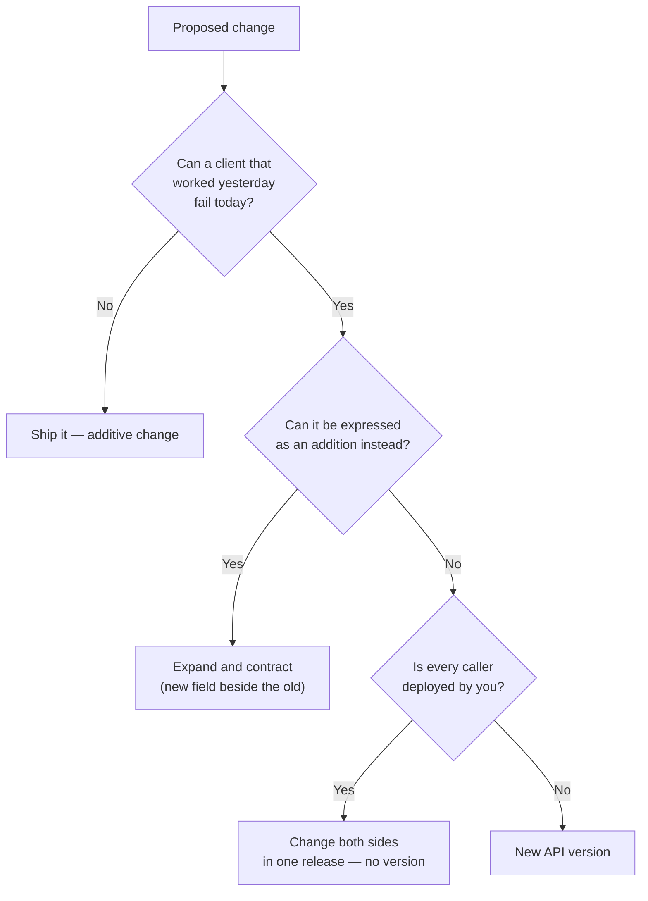
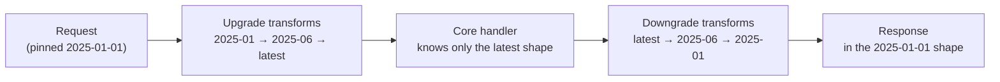
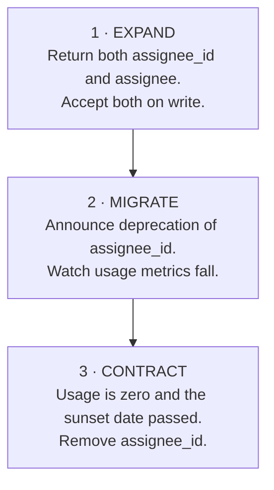
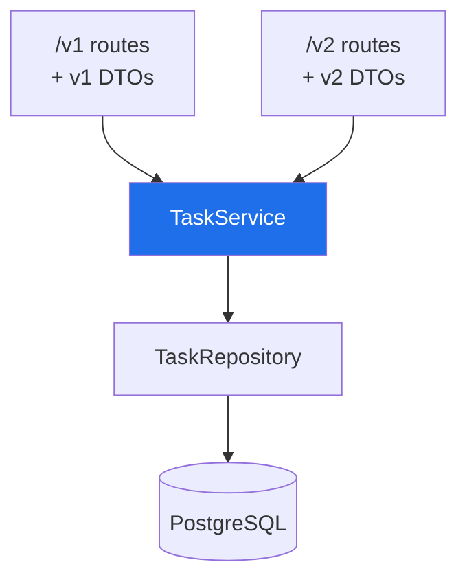

# API Versioning

A published API is a promise you made to software you do not control. A mobile
app sitting on 40,000 phones will keep calling the endpoint it was compiled
against for years, whether or not you still like the shape of that JSON.

Versioning is how you keep that promise while still changing things. This file
covers what actually counts as a breaking change, where the version number
goes, how to run two versions without duplicating your codebase, how to retire
an old one, and — the part most teams skip — how to design so that you never
need a `/v2` at all.

> **📌 In one line:** a version is not a feature, it is a bill — you pay it
> every day that two shapes of the same endpoint are alive, so make additive
> changes by default and reserve a new version for the changes that genuinely
> cannot be additive.

## Table of Contents

1. [What Counts as a Breaking Change](#what-counts-as-a-breaking-change)
2. [Where the Version Goes](#where-the-version-goes)
3. [Major Numbers vs Dates](#major-numbers-vs-dates)
4. [Designing So You Never Need v2](#designing-so-you-never-need-v2)
5. [Expand and Contract](#expand-and-contract)
6. [Running Two Versions Without Forking Your Code](#running-two-versions-without-forking-your-code)
7. [Deprecation and Sunset](#deprecation-and-sunset)
8. [Versioning Things That Are Not Your URL](#versioning-things-that-are-not-your-url)
9. [Common Mistakes](#common-mistakes)
10. [Questions to Test Yourself](#questions-to-test-yourself)
11. [Related](#related)

---

## What Counts as a Breaking Change

A change is breaking if a client that worked yesterday can fail today **without
changing a line of its own code**. That is the whole definition. Everything else
is a judgement call about how strict your clients are.

The useful mental test: *can a correct client, written against the documented
contract, observe this change and get a worse outcome?*

| Change | Breaking? | Why |
|---|---|---|
| Add a new endpoint | No | Nobody calls what they do not know about |
| Add an optional response field | No* | A tolerant client ignores it — see the asterisk below |
| Add an optional request parameter with a default | No | Existing calls keep their old behaviour |
| Add a new **required** request parameter | **Yes** | Every existing call starts returning `422` |
| Remove a response field | **Yes** | `task.owner.name` becomes `undefined`, and the UI renders "undefined" |
| Rename a response field | **Yes** | This is a remove plus an add, and the remove is what hurts |
| Change a field's type (`3` → `"3"`) | **Yes** | `price * quantity` silently becomes string concatenation |
| Change ID format (`4821` → `"tsk_01JB…"`) | **Yes** | Clients that stored the ID as an integer column cannot write it back |
| Make a field nullable that never was | **Yes** | `user.email.toLowerCase()` throws on the first `null` |
| Add a new value to a **response** enum | **Usually yes** | A client with `switch (status)` and no `default` falls through |
| Accept a new value in a **request** enum | No | Old callers never send it |
| Stop accepting a value in a request enum | **Yes** | Tightened validation rejects calls that used to work |
| Loosen validation (max length 50 → 120) | No | Everything that passed before still passes |
| Tighten validation (max length 120 → 50) | **Yes** | Yesterday's valid payload is today's `422` |
| Change `200` to `202` for the same call | **Yes** | Clients branch on the status code, and some only accept `200` |
| Change an error code string (`invalid_sort` → `bad_sort`) | **Yes** | Error codes are API surface; clients match on them |
| Change the default page size (25 → 10) | **Yes, quietly** | An importer that assumed "one page is everything" now skips rows |
| Change the default sort order | **Yes, quietly** | Pagination cursors and "latest item" logic both shift |
| Turn a synchronous endpoint into a queued one | **Yes** | The resource no longer exists at the moment the response arrives |
| Lower a rate limit | **Yes in practice** | Nothing in the schema changed and every client still breaks |

\* The asterisk on "add an optional response field": it is non-breaking **only
if your clients are tolerant readers**. A client generated from a strict
OpenAPI schema with `additionalProperties: false`, or a Go/Java client using a
strict decoder, will reject an unknown field. This is why "ignore fields you do
not recognise" belongs in your API documentation as an explicit rule, on day
one.

> **⚠️ Warning:** the four *quiet* breaks in that table — default page size,
> default sort, enum widening, rate limits — are the ones that actually cause
> incidents. They pass code review because no schema file changed. Add them to
> your review checklist by name.



That third question is the one people forget. Versioning exists because you
cannot redeploy the caller. An internal service called only by your own
monolith does not need a `/v2` — it needs one pull request that changes both
sides. Pay the versioning cost only where the cost of *not* paying it is a
broken client you cannot reach.

## Where the Version Goes

There are four places to put a version, and the arguments about them are older
than most frameworks you have used.

### 1. In the URL path

```http
GET /v1/tasks/tsk_01JB4E9K HTTP/1.1
Host: api.saas.example
```

| Pros | Cons |
|---|---|
| Visible in every log line, dashboard, and bug report | Purists argue the URL should identify the resource, not its representation |
| You can paste it in a browser or a curl example with no setup | A single resource now has two URLs, which weakens caching and linking |
| Routing is trivial: the reverse proxy can split `/v1` and `/v2` to different deployments | Encourages a big-bang `/v2` rewrite rather than incremental change |
| Impossible to get wrong by accident — no missing-header bugs | |

### 2. In a custom request header

```http
GET /tasks/tsk_01JB4E9K HTTP/1.1
Api-Version: 2026-03-01
```

| Pros | Cons |
|---|---|
| One canonical URL per resource, forever | Invisible in logs and browser address bars unless you deliberately log it |
| Fine-grained: you can version behaviour, not whole route trees | Easy to forget, so you must decide what a *missing* header means |
| Works well with per-account pinning (below) | Caches must `Vary: Api-Version` or they will serve one version's body to the other |

### 3. In the `Accept` header (content negotiation)

```http
GET /tasks/tsk_01JB4E9K HTTP/1.1
Accept: application/vnd.saas.task.v2+json
```

This is the most theoretically correct option — you are asking for a specific
*representation* of a resource, which is exactly what `Accept` is for. It is
also the one your users will get wrong most often, the one that breaks curl
examples, and the one that confuses CDNs. Correct and unusable is still
unusable.

### 4. In a query parameter

```http
GET /tasks/tsk_01JB4E9K?api_version=2 HTTP/1.1
```

Easy to test, easy to accidentally cache wrong, easy to lose when a client
builds URLs by string concatenation, and it pollutes every filter parameter
list. Avoid it except as a debugging override.

### What to actually do

> **📌 Remember:** URL path for the **major** version, plus an optional
> date-based header for **minor** behaviour changes. One coarse dimension that
> is impossible to miss, one fine dimension for the long tail.

```ts
// A missing version must never mean "latest". "Latest" changes under the
// client's feet, which is the exact failure versioning is supposed to prevent.
app.use('/v1', v1Router)
app.use('/v2', v2Router)

// Unversioned paths get a permanent redirect, not a silent default.
app.use('/tasks', (req, res) => {
  res.redirect(308, `/v1${req.originalUrl}`)   // 308 preserves method and body
})
```

Two rules that matter more than which style you picked:

1. **Version the whole API, not individual endpoints.** `/v1/tasks` alongside
   `/v3/projects` sounds flexible and produces a support matrix nobody can
   reason about. One number for the surface.
2. **Never let "no version" mean "newest".** Either reject it, or pin it to the
   oldest supported version. `latest` is only safe for a client you deploy.

## Major Numbers vs Dates

Two conventions are in wide use, and they optimise for different things.

| | Major numbers (`/v1`, `/v2`) | Dates (`2026-03-01`) |
|---|---|---|
| Looks like | `/v2/tasks` | `Api-Version: 2026-03-01` |
| Granularity | Coarse — a version is a big event | Fine — every breaking change gets its own date |
| Client experience | "Migrate to v2" is one large project | "Move from March to June" is a small diff |
| Versions alive at once | 2, maybe 3 | Dozens, but each is a thin layer |
| Cost to you | Cheap per version, expensive per migration | Expensive infrastructure, cheap per change |
| Good for | Most teams, internal platforms, small public APIs | Large public APIs with many integrators (Stripe's model) |

Semantic versioning (`MAJOR.MINOR.PATCH`) applies cleanly to libraries, where
the consumer chooses when to upgrade. For an HTTP API the consumer does not
choose — you deployed, so they are on the new code. That is why almost nobody
ships `/v1.2.3/tasks`: only the major number is meaningful over the wire, and
minor/patch changes must be non-breaking by definition.

### The account-pinned date model

Worth understanding even if you never build it, because it explains how a
public API survives a decade of change:

1. When an account makes its first API call, it is **pinned** to the current
   version date. It stays there forever unless someone upgrades it.
2. A single request may override the pin with a header — that is how you test a
   migration safely.
3. Internally, exactly one implementation exists: the newest one. Older
   versions are produced by **transformation layers** applied on the way out
   (and on the way in).



```ts
// Each breaking change contributes ONE small, permanent, tested transform.
type VersionChange = {
  version: string                                  // the date it shipped
  description: string
  downgradeResponse?: (body: any) => any           // latest shape → older shape
  upgradeRequest?: (body: any) => any              // older shape → latest shape
}

const CHANGES: VersionChange[] = [
  {
    version: '2026-03-01',
    description: 'task.assignee_id replaced by a nested task.assignee object',
    downgradeResponse: (task) => ({
      ...task,
      assignee_id: task.assignee?.id ?? null,
      assignee: undefined,
    }),
    upgradeRequest: (body) =>
      'assignee_id' in body
        ? { ...body, assignee: { id: body.assignee_id }, assignee_id: undefined }
        : body,
  },
]

// Apply every change newer than the caller's pinned version, newest last.
function downgrade(body: unknown, pinned: string) {
  return CHANGES.filter((c) => c.version > pinned)
    .sort((a, b) => (a.version < b.version ? 1 : -1))
    .reduce((acc, c) => c.downgradeResponse?.(acc) ?? acc, body)
}
```

The cost is real: every transform is code you maintain forever, and the chain
must be tested end to end for each supported date. The benefit is that your
business logic never contains the word "version".

## Designing So You Never Need v2

Most `/v2` projects are penance for five decisions made in week one. These are
the decisions.

| Decision | Why it prevents a future break |
|---|---|
| Wrap every response in an envelope (`{ "data": …, "meta": … }`) | You can add `meta` fields forever. A bare array has nowhere to grow |
| Return objects where you might later need more than one field | `{"assignee": {"id": …}}` can gain `name` later; `assignee_id` cannot |
| Never expose database columns directly — map through a DTO | A column rename becomes an internal change instead of an API change |
| Use opaque string IDs (`tsk_01JB…`) from day one | You can change the underlying key type, shard, or storage without clients noticing |
| Document "ignore unknown fields" and "new enum values may appear" | Turns two whole categories of change from breaking into additive |
| Return `status` as a string enum, not a boolean | `is_done: true/false` cannot express `in_review`. The third state always arrives |
| Money as integer minor units plus a currency code | `{"amount": 1999, "currency": "USD"}` never needs a float-to-string migration |
| Timestamps as RFC 3339 strings in UTC, always | No epoch-seconds-vs-milliseconds break, no timezone renegotiation |
| Collection endpoints paginated from the first commit | Adding pagination later is a hard break for anyone who read the whole array |

> **💡 Tip:** the single highest-leverage habit is the DTO boundary. If a
> controller returns an ORM model directly, then *every* schema migration is
> potentially an API change — and one day someone adds a `password_reset_token`
> column and ships it to the internet in a response body.

```ts
// ❌ BROKEN — the API shape is whatever the table happens to look like today.
router.get('/v1/tasks/:id', async (req, res) => {
  const task = await Task.query().findById(req.params.id)
  res.json(task)          // leaks new columns automatically, breaks on renames
})

// ✅ FIXED — an explicit, hand-written mapping. The only place the wire
// format is defined, and the place a reviewer looks when it must change.
function toTaskResponse(task: Task) {
  return {
    id: task.publicId,
    title: task.title,
    status: task.status,                       // string enum, never a boolean
    assignee: task.assignee
      ? { id: task.assignee.publicId, name: task.assignee.name }
      : null,
    due_at: task.dueAt?.toISOString() ?? null, // RFC 3339, UTC
    created_at: task.createdAt.toISOString(),
  }
}

router.get('/v1/tasks/:id', async (req, res) => {
  const task = await Task.query().findById(req.params.id).withGraphFetched('assignee')
  res.json({ data: toTaskResponse(task) })
})
```

## Expand and Contract

Also called **parallel change**. It is how you make a "breaking" change without
breaking anyone, and it works for API fields, database columns, and queue
message formats alike.

The rename `assignee_id` → `assignee` object, done safely:



| Phase | Response contains | Request accepts | Duration |
|---|---|---|---|
| Expand | `assignee_id` **and** `assignee` | Either field; new one wins if both are sent | Ships immediately |
| Migrate | Both, with `assignee_id` marked deprecated in the docs and a `Deprecation` header on responses that still read it | Either | Weeks to months — driven by metrics, not the calendar |
| Contract | `assignee` only | `assignee` only; `assignee_id` returns `422` | After usage hits zero **and** the announced sunset date |

```ts
// EXPAND phase: write path accepts both spellings, unambiguously.
const body = UpdateTaskSchema.parse(req.body)

// Precedence rule must be written down: the new field always wins.
const assigneeId = body.assignee?.id ?? body.assignee_id ?? undefined

if (body.assignee_id !== undefined) {
  // Count it. You cannot retire a field whose real usage you never measured.
  metrics.increment('api.deprecated_field_used', {
    field: 'assignee_id',
    client: req.auth.clientId,
  })
}
```

That metric is the point of the whole exercise. "Is anyone still using this?"
must be a dashboard query, not a guess, and it must be tagged by client so you
know *who* to email.

> **⚠️ Warning:** during Expand, both fields must stay consistent in both
> directions. If a client writes `assignee_id` and then reads `assignee` and
> gets `null`, you have shipped a worse bug than the rename would have been.
> Test the cross-reads explicitly.

## Running Two Versions Without Forking Your Code

The failure mode here is predictable: someone copies `src/controllers` to
`src/controllers/v2`, and six months later a bug fix has to be applied twice —
and gets applied once.

**Versioning belongs at the edge.** Routes, serializers, and request parsers
may know about versions. Services, repositories, and domain logic never do.

```text
src/
  api/
    v1/
      routes.ts          thin: parse → call service → serialize with v1 DTO
      dto/task.ts        toTaskResponseV1()
    v2/
      routes.ts          thin: parse → call the SAME service → v2 DTO
      dto/task.ts        toTaskResponseV2()
  services/
    task-service.ts      ← one implementation. No `if (version === …)` here.
  repositories/
    task-repository.ts   ← never version-aware
```



```ts
// ❌ BROKEN — the version has leaked into the domain layer. Every future
// version adds another branch here, and the branches multiply.
class TaskService {
  async list(companyId: string, version: number) {
    const tasks = await this.repo.findByCompany(companyId)
    if (version === 1) return tasks.map((t) => ({ ...t, assignee_id: t.assigneeId }))
    return tasks
  }
}

// ✅ FIXED — the service returns one domain shape. Each version's DTO decides
// how to render it. Adding v3 touches exactly one new folder.
class TaskService {
  async list(companyId: string): Promise<Task[]> {
    return this.repo.findByCompany(companyId)
  }
}
```

| Concern | Where it lives | Version-aware? |
|---|---|---|
| Route path and HTTP method | `api/vN/routes.ts` | Yes |
| Request validation schema | `api/vN/schema.ts` | Yes |
| Response serialization (DTO) | `api/vN/dto/` | Yes |
| Authentication and authorization | Shared middleware | No |
| Business rules | `services/` | **Never** |
| Database access, queries, transactions | `repositories/` | **Never** |
| Background jobs and emails | `jobs/` | **Never** |

When a version's differences grow past "different DTOs and different
validation", that is the signal that you have designed a genuinely new product
surface — and that is the rare case where a separate deployment behind the
[api-gateway](../../system-design/foundational/api-gateway.md) is honest, rather
than a copy-paste accident.

### Test the versions, not just the code

Keep a golden-response file per version and assert against it. A snapshot test
is the cheapest possible alarm for "someone changed the v1 shape by accident":

```ts
test('v1 task response shape is frozen', async () => {
  const res = await request(app).get('/v1/tasks/tsk_01JB4E9K').set(auth)
  expect(res.status).toBe(200)
  expect(Object.keys(res.body.data).sort()).toEqual([
    'assignee_id', 'created_at', 'due_at', 'id', 'status', 'title',
  ])
})
```

An added key fails this test. That is deliberate: it forces the author to
decide consciously whether the addition is safe for that version's clients,
rather than discovering it from a support ticket.

## Deprecation and Sunset

Deleting a version is a communication problem with a small technical component.

### The timeline

| Stage | What you do | Typical gap |
|---|---|---|
| Announce | Changelog, email to every integrator, docs banner, migration guide with before/after payloads | Day 0 |
| Deprecate | Responses carry `Deprecation` and `Sunset` headers. Docs mark it. New signups cannot select it | Day 0 |
| Measure | Per-client, per-endpoint usage dashboard. Email the top users directly, by name | Continuous |
| Brownout | Short, pre-announced windows where the old version returns `410 Gone` — 5 minutes, then an hour | ~1 month before sunset |
| Sunset | The version returns `410 Gone` permanently, with a link to the migration guide | 6–12 months for a public API; 1 sprint for an internal one |

The brownout is the underrated step. Every integrator has someone who ignores
emails and discovers the migration during the outage. A scheduled five-minute
failure at 10 a.m. on a Tuesday is a far kinder way to find them than the real
shutdown at 2 a.m.

### The headers

```http
HTTP/1.1 200 OK
Content-Type: application/json
Deprecation: @1772323200
Sunset: Wed, 01 Sep 2027 00:00:00 GMT
Link: <https://docs.saas.example/api/migrate-v1-to-v2>; rel="deprecation"; type="text/html"
```

| Header | Defined by | Meaning |
|---|---|---|
| `Deprecation` | RFC 9745 | When the resource *became* deprecated. `@` plus a Unix timestamp, or `true` for "already deprecated" |
| `Sunset` | RFC 8594 | The date after which the resource will stop working. HTTP date format |
| `Link` with `rel="deprecation"` | RFC 8288 + RFC 9745 | Where the human-readable migration guide lives |

> **⚠️ Warning:** the old `Warning` header is obsolete — RFC 9111 removed it
> from HTTP caching, and clients no longer surface it. Do not build your
> deprecation signalling on it. Also assume that **nobody reads response
> headers**: they are for tooling and for the post-incident conversation where
> you show that the warning was there. Email and the dashboard are what
> actually move clients.

After sunset:

```ts
// 410 Gone, not 404. 404 says "maybe you typed it wrong"; 410 says
// "this existed, it is intentionally gone, stop retrying".
v1Router.all('*', (req, res) => {
  res.status(410).json({
    error: {
      code: 'api_version_gone',
      message: 'API v1 was retired on 2027-09-01. Migrate to v2.',
      docs_url: 'https://docs.saas.example/api/migrate-v1-to-v2',
    },
  })
})
```

And for a version that never existed, reject rather than guess:

```ts
// 400 with a machine-readable code beats a 404 from the router, because the
// caller can tell "wrong version" apart from "wrong path".
if (!SUPPORTED_VERSIONS.has(requested)) {
  throw new BadRequestError('unsupported_api_version', {
    supported: [...SUPPORTED_VERSIONS],
  })
}
```

## Versioning Things That Are Not Your URL

The REST endpoints are the easy part. These four are where teams get caught.

### Webhooks and events

Your webhook receiver cannot set a request header on a call *you* make to
*them*. So the version has to be stored per subscription and stamped into the
payload.

```jsonc
{
  "id": "evt_01JB4E9KQ",
  "type": "task.completed",
  "api_version": "2026-03-01",   // the shape of "data" below
  "created_at": "2026-03-11T09:00:00Z",
  "data": { "task": { "id": "tsk_01JB4E9K" } }
}
```

| Option | How it works | Trade-off |
|---|---|---|
| Version stored on the endpoint subscription | Each receiver picks a version when registering | Best; mirrors the pinning model |
| `api_version` in the payload | Receiver branches on it | Necessary regardless, so the receiver can log and route |
| Versioned event type (`task.completed.v2`) | Both events are sent during migration | Simple, but doubles delivery volume and can double-process |

Because a webhook is delivered at least once, a receiver may see the same event
under two versions during a migration — which is a plain
[idempotency](../../system-design/reliability/idempotency.md) requirement, not a
versioning one.

### Mobile clients that never die

You cannot force an upgrade, and an app store review takes days. Two things
make this survivable:

1. A `GET /v1/app-config` call on launch that returns `min_supported_version`
   and a message, so the app can show a blocking "please update" screen. Build
   this into version 1.0 — you cannot add it retroactively to the clients that
   need it.
2. Keep the oldest version alive until install-base telemetry says it is safe.
   "Six months" is not a policy; "under 0.1% of weekly active installs" is.

### Database migrations

Schema changes are the same expand/contract dance one layer down, and they must
be **backwards compatible with the currently running code**, because during a
rolling or [blue-green deploy](../../cloud-devops/deployment-strategies/blue-green-deployment.md)
both old and new application versions talk to the same database at the same
time.

```text
❌ One release:  rename column assignee_id → assignee_user_id
                 → old pods crash on every query for the deploy's duration

✅ Three releases:
   1. add assignee_user_id, write to both columns, read from the old one
   2. backfill, then read from the new one (both still written)
   3. drop assignee_id
```

### Shared client libraries

If you publish an SDK, it has its own semantic version *and* a pinned API
version. Say in the README which SDK majors speak which API versions, or every
support conversation starts with twenty minutes of archaeology.

---

## Common Mistakes

| Mistake | Why it is wrong | Do this instead |
|---|---|---|
| Treating "add a field" as always safe | Strict-schema clients reject unknown fields | Document tolerant reading on day one, and test against a strict client |
| Copying the controller folder to create v2 | Bug fixes get applied to one copy | Version DTOs and routes only; share the service layer |
| `if (version === 1)` inside a service | Branches multiply and the domain becomes unreadable | Push version differences to the edge |
| Letting an unversioned path mean "latest" | The client's behaviour changes on your deploy, not theirs | Reject it, or `308` redirect to the oldest supported version |
| Versioning per endpoint | `/v1/tasks` with `/v3/projects` is an unsupportable matrix | One version for the whole API surface |
| Shipping `/v2` because the code is ugly | Clients pay for your refactor and get nothing | Refactor behind a stable contract |
| Announcing a sunset with no usage metrics | You cannot tell whether shutting down is safe | Per-client, per-endpoint usage dashboard first |
| Retiring a version on a calendar date alone | The date arrives, real traffic is still there, you blink and extend | Date **and** measured usage, with brownouts before the deadline |
| `404` after retirement | Looks like a typo; clients keep retrying forever | `410 Gone` with a migration link |
| Returning ORM models directly | Every schema change becomes an accidental API change | An explicit DTO mapping function |
| Changing default page size or sort "because it is just a default" | Silent data loss in importers and sync jobs | Treat defaults as part of the contract |
| Expand phase where the two fields can disagree | Write-then-read returns stale or `null` data | Test cross-reads in both directions before shipping |

## Questions to Test Yourself

1. Give the one-sentence definition of a breaking change, then name three
   changes that break clients without any schema file changing.
2. Why is adding a value to a *response* enum usually breaking, while accepting
   a new value in a *request* enum is not?
3. Your API is called only by your own web frontend, deployed from the same
   repo. Do you need versioning? Explain your reasoning in terms of who can be
   redeployed.
4. Compare URL-path versioning and header versioning on three axes:
   observability, cache correctness, and how easy it is for a client to get it
   wrong.
5. Walk through renaming `assignee_id` to a nested `assignee` object using
   expand/contract. What decides when you may enter the contract phase?
6. In the account-pinned date model, where does version-specific code live, and
   why does the core handler only ever know the newest shape?
7. Why should a retired version return `410` rather than `404`, and what should
   its body contain?
8. Both old and new application pods run against one database during a deploy.
   Explain why a column rename in a single release causes an outage, and what
   the three-release version looks like.
9. A webhook receiver cannot send you a version header. Name two ways the event
   payload conveys its own version, and the cost of each.

## Related

- [Resource Naming and URLs](02-resource-naming-and-urls.md) — the paths this
  version prefix attaches to, and the full SaaS endpoint list.
- [REST Principles](01-rest-principles.md) — why the uniform-interface
  constraint is what makes a version a contract at all.
- [Error Response Design](05-error-response-design.md) — the shape of
  `unsupported_api_version` and `api_version_gone`, and why error codes are
  versioned surface too.
- [Status Codes](../01-http-foundations/04-status-codes.md) — `308`, `410`, and
  the `400` vs `422` distinction used above.
- [Headers](../01-http-foundations/05-headers.md) — `Deprecation`, `Sunset`,
  `Link`, and why `Vary` matters for header-based versioning.
- [Migrations](../10-database-integration/02-migrations.md) — expand/contract
  applied to schema changes.
- [Webhooks](../12-files-and-integrations/03-webhooks.md) — delivery,
  signatures, and per-subscription versioning.
- [api-gateway](../../system-design/foundational/api-gateway.md) — routing
  `/v1` and `/v2` to different deployments when they genuinely diverge.
- [blue-green-deployment](../../cloud-devops/deployment-strategies/blue-green-deployment.md) —
  the window where two application versions share one database.
- [idempotency](../../system-design/reliability/idempotency.md) — why duplicate
  event delivery during a webhook migration must be safe.
