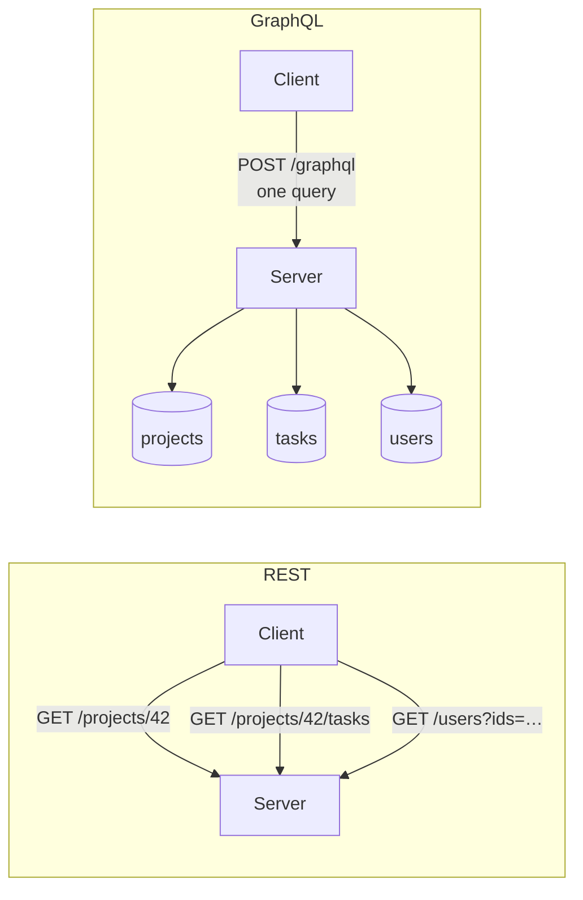
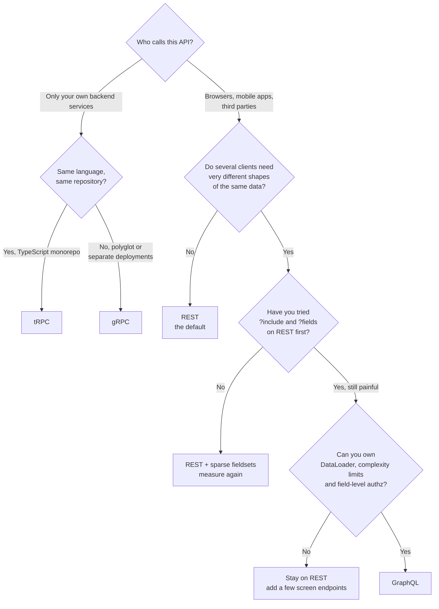

# REST vs GraphQL vs RPC

Three ways to order food. At a **restaurant with a menu** you point at item 14
and the kitchen brings exactly what item 14 is — that is REST. At a **deli
counter** you describe what goes on the sandwich and they build it — that is
GraphQL. In a **factory canteen where you work**, you shout "the usual" to
someone who already knows you — that is RPC. None of these is wrong; they
optimise for different customers.

> **📌 In one line:** REST names things and lets HTTP do the rest, GraphQL lets
> the client describe the exact data it wants, and RPC calls a function on
> another machine — and the right answer is usually "REST in public, RPC
> internally, GraphQL only when you have measured the problem it solves".

## Table of Contents

1. [The Same Request, Three Ways](#the-same-request-three-ways)
2. [REST: Strengths and Weaknesses](#rest-strengths-and-weaknesses)
3. [GraphQL: One Endpoint, One Query Language](#graphql-one-endpoint-one-query-language)
4. [What GraphQL Actually Costs](#what-graphql-actually-costs)
5. [RPC: gRPC and tRPC](#rpc-grpc-and-trpc)
6. [The Comparison Table](#the-comparison-table)
7. [Choosing](#choosing)
8. [Honest Advice for a Small SaaS Team](#honest-advice-for-a-small-saas-team)
9. [Advanced: Webhooks and WebSockets Are Complements](#advanced-webhooks-and-websockets-are-complements)
10. [Common Mistakes](#common-mistakes)
11. [Questions to Test Yourself](#questions-to-test-yourself)
12. [Related](#related)

---

## The Same Request, Three Ways

One operation, written three times: **get project 42 with its tasks**.

### REST

```http
GET /v1/projects/42 HTTP/1.1
Authorization: Bearer eyJhbGci…
```

```json
{ "id": 42, "name": "Q1 Migration", "status": "active", "ownerId": 7,
  "budget": 40000, "createdAt": "2026-01-04T09:12:00Z" }
```

Tasks are a second call: `GET /v1/projects/42/tasks`. Two round trips, and
the first returned six fields when the screen needed two.

### GraphQL

```http
POST /graphql HTTP/1.1
Authorization: Bearer eyJhbGci…
```
```graphql
query {
  project(id: 42) {
    name
    tasks(status: OPEN, first: 20) { id title assignee { name } }
  }
}
```

```json
{ "data": { "project": { "name": "Q1 Migration",
  "tasks": [{ "id": "1007", "title": "Move DNS", "assignee": { "name": "Sara" } }] } } }
```

One round trip, exactly the requested fields, nothing else.

### RPC (gRPC)

```protobuf
service ProjectService {
  rpc GetProjectWithTasks(GetProjectRequest) returns (ProjectWithTasks);
}
message GetProjectRequest { int64 project_id = 1; bool include_tasks = 2; }
```
```ts
const res = await projectClient.getProjectWithTasks({ projectId: 42n, includeTasks: true })
```

It reads like a local function call: compressed binary on the wire, types
generated from the `.proto` file, no URL to design.

> **📌 Remember:** the three examples differ in *who decides the shape of the
> response*. REST: the server. GraphQL: the client. RPC: whoever owns the
> shared interface definition, agreed by both sides up front.

---

## REST: Strengths and Weaknesses

REST models your system as **resources** addressed by URLs, manipulated with
HTTP methods. Everything in the first four files of this part is REST.

### What REST is genuinely good at

| Strength | Why it matters |
|---|---|
| **HTTP caching for free** | A `GET` with `ETag` / `Cache-Control` is cached by browsers, CDNs and proxies with zero code |
| **Every tool already speaks it** | cURL, Postman, browser dev tools, load balancers, WAFs, API gateways |
| **Debuggable by humans** | A URL in the address bar reproduces the bug |
| **Status codes carry meaning** | Monitoring, retries and circuit breakers just work |
| **Cheap to learn** | A new developer is productive in a day |

Caching is the row people underrate: a CDN in front of `GET /v1/projects/42`
serves thousands of requests per second without your server waking up. Rate
limiting per path is nearly as valuable, and every gateway does it already.

### Where REST hurts

**Over-fetching** — the endpoint returns 25 fields; the mobile list screen uses
2. On a slow connection the user pays for 23 fields they never see.

**Under-fetching** — the endpoint returns too little, so the client makes more
calls. A project page needs the project, its tasks, each task's assignee, and
the comment count: four calls, serialised by their dependencies.

```text
Mobile project screen, REST, 3G latency ~200 ms
  GET /projects/42         ──► 200 ms
  GET /projects/42/tasks   ──► 200 ms   (needs the project first)
  GET /users?ids=7,9,14    ──► 200 ms   (needs the tasks first)
  GET /projects/42/stats   ──► 200 ms
                               ────────
                               800 ms before the first pixel
```

**Endpoint sprawl as a workaround** — teams add `?include=tasks,assignee`,
then `?fields=id,name`, then `/projects/42/full`, then
`/mobile/v2/project-screen`. Each is a new contract to version and test. At
that point you have built a worse GraphQL by accident.

> **💡 Tip:** before leaving REST, try the cheap fixes: sparse fieldsets
> (`?fields=`), an `?include=` parameter for one level of relations, and a
> batch endpoint. They solve most of the pain for a fraction of the cost.

---

## GraphQL: One Endpoint, One Query Language

GraphQL replaces many endpoints with **one** — usually `POST /graphql`. The
client sends a query describing the shape it wants; the server returns exactly
that shape.



Three ideas make it work:

1. **A schema.** The server publishes a typed graph: which types exist, which
   fields they have, how they connect. Being machine-readable, it drives
   query autocomplete and generated client types.
2. **Resolvers.** Each field has a function that fetches it; the engine walks
   the query and calls resolvers in order.
3. **One transport.** Everything is a `POST` to one URL.

| Problem | How GraphQL answers it |
|---|---|
| Over-fetching | The client lists the fields it wants; nothing else is sent |
| Under-fetching | Related data nests in the same query, one round trip |
| Versioning | Add fields freely; deprecate old ones with `@deprecated` |
| Client/server drift | The schema is a typed, introspectable contract |
| Screen-specific endpoints | Each screen writes its own query; no backend change |

That last row is the real organisational win. A frontend team that needs one
extra field ships it themselves instead of filing a backend ticket and waiting
a sprint. In a company with separate frontend and backend teams, this alone
can justify GraphQL.

---

## What GraphQL Actually Costs

The marketing stops here. The costs are real and mostly land on the backend.

### 1. N+1 queries, by construction

Resolvers run per field, per object. A query for 50 tasks with their assignees
calls the `assignee` resolver 50 times — 50 separate `SELECT`s.

```ts
// ❌ BROKEN — one database round trip per task.
const resolvers = {
  Task: {
    assignee: (task) => db.user.findUnique({ where: { id: task.assigneeId } }),
  },
}

// ✅ FIXED — DataLoader batches the 50 calls of one tick into one query.
const userLoader = new DataLoader(async (ids: number[]) => {
  const users = await db.user.findMany({ where: { id: { in: ids } } })
  return ids.map((id) => users.find((u) => u.id === id) ?? null)
})

const resolvers = {
  Task: { assignee: (task) => userLoader.load(task.assigneeId) },
}
```

DataLoader is not optional in a real GraphQL server; it is a required part of
the architecture, one loader per relationship. The full diagnosis of this
query pattern is in
[n-plus-one-queries](../../databases/query-optimization/n-plus-one-queries.md).

### 2. HTTP caching mostly stops working

Everything is `POST` to one URL, so CDNs, browsers and proxies cache nothing.
You replace free infrastructure caching with application-level caching you
write and invalidate yourself — persisted queries, response caching keyed by
query hash, or a normalised client cache like Apollo's. That is real work.

### 3. Query complexity is an attack surface

A client controls the shape of the query, so a client can write:

```graphql
query { project(id: 42) { tasks { project { tasks { project { tasks { id } } } } } } }
```

That is a legal query that can explode into millions of resolver calls. You
must defend with **depth limiting**, **complexity scoring** (assign a cost per
field and cap the total), **pagination limits on every list field**, and
**timeouts**. Rate limiting by request count is useless here: one request can
cost 10,000 times another.

### 4. Authorization must be field-level

In REST, one check at the top of the handler protects the whole response. In
GraphQL, a single query can reach `project → tasks → assignee → salary`, and
each of those fields needs its own rule.

```ts
// Every sensitive field carries its own check — there is no single choke point.
const resolvers = {
  User: {
    salary: (user, _args, ctx) => {
      if (!ctx.can('user.salary.view', user)) return null
      return user.salary
    },
  },
}
```

Miss one field on one type and you have a leak reachable from any query that
touches it.

### 5. Operational blind spots

`POST /graphql` is one line in your access log. "Which endpoint is slow?" has
no answer until you require named operations and trace per field.

| Cost | Mitigation | Effort |
|---|---|---|
| N+1 queries | DataLoader per relationship | Medium, ongoing |
| No HTTP caching | Persisted queries + app cache | High |
| Complexity attacks | Depth + cost limits, pagination caps | Medium, never skip |
| Field-level authz | A rule per sensitive field | High, ongoing |

> **⚠️ Warning:** none of these are reasons to never use GraphQL. They are the
> bill. Adopt GraphQL when the value — many clients with different data needs —
> is clearly larger than this list.

---

## RPC: gRPC and tRPC

RPC — **Remote Procedure Call** — drops the resource metaphor entirely. You
call a function; it happens to run on another machine.

```text
REST:     POST /v1/invoices/88/send
GraphQL:  mutation { sendInvoice(id: 88) { status } }
RPC:      invoiceClient.sendInvoice({ id: 88 })
```

### gRPC

Contracts are written in Protocol Buffers, compiled into typed clients and
servers for many languages, and sent as compressed binary over HTTP/2.

| Strength | Detail |
|---|---|
| Fast | Binary encoding is smaller and faster to parse than JSON |
| Strongly typed across languages | A Go service and a Node service share one `.proto` |
| Streaming built in | Client, server and bidirectional streams are first class |
| Breaking changes are visible | Field numbers and types are checked at build time |

| Weakness | Detail |
|---|---|
| Not natively callable from a browser | Needs a `grpc-web` proxy |
| Not human readable | You cannot cURL it or read it in dev tools |
| Toolchain weight | Code generation in CI, `.proto` files to distribute |

gRPC's home is **service-to-service traffic inside your own network** — the
hot path between two backends where latency and type safety matter and no
browser is involved. See
[monolith-vs-microservices](../../system-design/foundational/monolith-vs-microservices.md).

### tRPC

tRPC is RPC for a TypeScript monorepo. There is no schema language and no code
generation: the client imports the *type* of the server's router, so renaming a
procedure on the server turns the frontend red in your editor.

```ts
export const appRouter = router({                       // server
  getProject: publicProcedure
    .input(z.object({ id: z.number() }))
    .query(({ input }) => db.project.findUnique({ where: { id: input.id } })),
})
export type AppRouter = typeof appRouter

const project = await trpc.getProject.query({ id: 42 }) // client, fully typed
```

Its limits are exactly its premise: TypeScript on both ends, one repository,
no third-party consumers. Excellent for an internal admin panel or a Next.js
app; wrong for a public API.

> **💡 Tip:** gRPC and tRPC solve the same problem — a typed call between two
> pieces of software you both own — at different scales. Polyglot services and
> a network hop: gRPC. One TypeScript repo: tRPC.

---

## The Comparison Table

| | REST | GraphQL | RPC (gRPC / tRPC) |
|---|---|---|---|
| **Learning curve** | Low | Medium–high (schema, resolvers, loaders) | Low for tRPC, medium for gRPC |
| **HTTP caching** | ✅ Free with `GET` + `ETag` | ❌ Needs persisted queries and app cache | ❌ None |
| **Versioning** | URL or header versions; breaking changes are explicit | Add fields, deprecate old ones; no `/v2` | `.proto` field numbers; tRPC uses the compiler |
| **Tooling** | ✅ Everything speaks HTTP | ✅ Strong dev tooling, weak infrastructure tooling | ⚠️ Needs generated clients |
| **Over-fetching** | ❌ Common | ✅ Solved | ⚠️ Fixed by the message definition |
| **Under-fetching** | ❌ Multiple round trips | ✅ One query | ⚠️ Add a field or a new method |
| **Typing** | ⚠️ Only via OpenAPI, if maintained | ✅ Schema is the contract | ✅ Strongest |
| **Browser support** | ✅ Native | ✅ Native | ❌ gRPC needs a proxy; tRPC is TS-only |
| **Human debuggability** | ✅ cURL, address bar | ⚠️ Readable, but needs a client | ❌ Binary |
| **Monitoring / rate limiting** | ✅ Per path, for free | ❌ One path; must score query cost | ⚠️ Per method, with tooling |
| **File upload / download** | ✅ Natural | ❌ Awkward, needs an extra spec | ⚠️ Streams, but not browser-friendly |
| **Best fit** | Public APIs, CRUD, anything cacheable | Many clients, different data needs | Internal service-to-service, typed monorepos |

---

## Choosing



Two questions decide almost every real case: **is a browser involved?** (if
not, RPC is on the table) and **do multiple clients need genuinely different
shapes?** (if not, GraphQL is cost without benefit).

---

## Honest Advice for a Small SaaS Team

**Start with REST.** For a team of two to ten people with a web app and maybe
a mobile app, REST is the correct default and it is not close: cheapest to
build, cheapest to debug at 3 AM, and the only one where a CDN, a gateway and
a monitoring tool help you for free.

**Add GraphQL only for a problem you have measured.** Honest triggers: three
or more independent client teams with genuinely different data needs; a mobile
app where round trips are a measured, user-visible cost *after* `?include=`
was tried; a public API whose consumers keep asking for different field
combinations. Not triggers: "it is modern", "REST feels verbose", "a
conference talk".

**Use tRPC or gRPC for internal typed calls** — near-free wins where they fit.
A Next.js admin panel talking to its own backend gets end-to-end types from
tRPC with no schema file; two backend services on a hot path get speed and a
real contract from gRPC. Neither replaces your public REST API.

A realistic mature architecture is not one style but several:

```text
Browser / mobile  ──REST─────►  Public API
Admin panel (TS)  ──tRPC─────►  Same backend, internal procedures
Public API        ──gRPC─────►  Billing service, search service
Your backend      ──webhook──►  Customer systems
```

> **📌 Remember:** the expensive decision is not which style you pick. It is
> picking a second one before the first is causing measurable pain, because
> then you maintain two contracts, two auth paths and two sets of tooling.

---

## Advanced: Webhooks and WebSockets Are Complements

All three styles are **request/response and client-initiated**. Some problems
are neither.

| Need | Wrong tool | Right tool |
|---|---|---|
| Tell a partner's system an invoice was paid | Ask them to poll you | A [webhook](../12-files-and-integrations/03-webhooks.md) |
| Push a new task to every open board | Poll every 3 seconds | WebSockets, or GraphQL subscriptions |
| Stream partial results from a long job | Hold the request open | Server-Sent Events, or gRPC streaming |
| Tell your own services a user signed up | A chain of sync calls | A [message queue](../../system-design/foundational/message-queues/) |

**Webhooks** invert the direction: *you* call *them* when something happens.
Delivery, retries, signing and replay protection are covered in
[Webhooks](../12-files-and-integrations/03-webhooks.md). Note that a webhook
you send is itself a small REST call — the styles compose.

**WebSockets** keep a connection open for two-way messages. Use them for live
cursors, chat, presence and notifications; do not use them as a general
replacement for your API, because you then rebuild routing, auth, caching and
error handling yourself.

The honest rule: **pick one request/response style as your main API, and add
push mechanisms only where the direction of the need is genuinely reversed.**
---

## Common Mistakes

| Mistake | Why it is wrong | Do this instead |
|---|---|---|
| Adopting GraphQL to fix one slow mobile screen | You buy DataLoader, caching and authz work for one screen | Try `?include=` and a batch endpoint first |
| GraphQL without DataLoader | Every list query becomes N+1 | One loader per relationship, from day one |
| No depth or complexity limits | One crafted query can take down the server | Depth limit, cost scoring, pagination caps |
| A top-level GraphQL auth check only | A nested field reaches data the entry point never saw | Authorize per field on sensitive types |
| Exposing gRPC directly to browsers | Browsers cannot speak it | grpc-web or REST at the edge |
| tRPC for a public API | Consumers would need your TypeScript types | REST plus OpenAPI outside the repo |
| Growing `?include=`, `?fields=`, `/full`, `/mobile/v2` | You are building GraphQL badly | Stop at one `?include=`, or adopt GraphQL deliberately |
| Two styles over the same data with no rule | Two contracts, two auth paths, drift | One canonical API; the other is a thin layer |
| Using WebSockets as a general API | You reimplement routing, auth, caching and errors | Request/response for CRUD, push only for pushes |

---

## Questions to Test Yourself

1. A mobile list screen shows a task title and assignee name for 20 tasks.
   Describe the REST calls, the GraphQL query, and the number of round trips
   for each.
2. Why does moving from REST to GraphQL usually *lose* you caching, and what do
   you have to build to get it back?
3. Explain, using resolvers, why GraphQL causes N+1 queries by default, and
   what DataLoader changes.
4. Write a GraphQL query that is legal, short, and could exhaust your server.
   Name the two defences that stop it.
5. In REST, one authorization check at the top of a handler can be enough. Why
   is that never true in GraphQL?
6. Your team has a Next.js admin panel and a Go billing service. Which style
   for each hop, and why?
7. A partner wants to know as soon as an invoice is paid. Why is "poll our
   REST API every minute" the wrong answer, and what replaces it?
8. Name three things that are *not* good reasons to adopt GraphQL.
---

## Related

- [REST Principles](01-rest-principles.md) — what REST actually requires, the
  baseline the other two styles are compared against.
- [Resource Naming and URLs](02-resource-naming-and-urls.md) and
  [API Versioning](04-api-versioning.md) — the REST design work GraphQL claims
  to remove.
- [Error Response Design](05-error-response-design.md) — GraphQL returns `200`
  with an `errors` array, which changes everything in that file.
- [n-plus-one-queries](../../databases/query-optimization/n-plus-one-queries.md)
  — the database pattern every GraphQL resolver tree runs into.
- [Webhooks](../12-files-and-integrations/03-webhooks.md) — the outbound
  complement to all three styles.
- [monolith-vs-microservices](../../system-design/foundational/monolith-vs-microservices.md)
  — whether you have service-to-service traffic worth gRPC at all.
- [cdn-and-edge-caching](../../system-design/scale-patterns/cdn-and-edge-caching.md)
  — the free caching REST gets and GraphQL gives up, and
  [api-gateway](../../system-design/foundational/api-gateway.md) — where a
  REST edge and gRPC internals meet.
