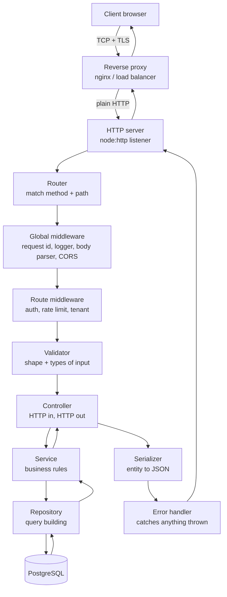
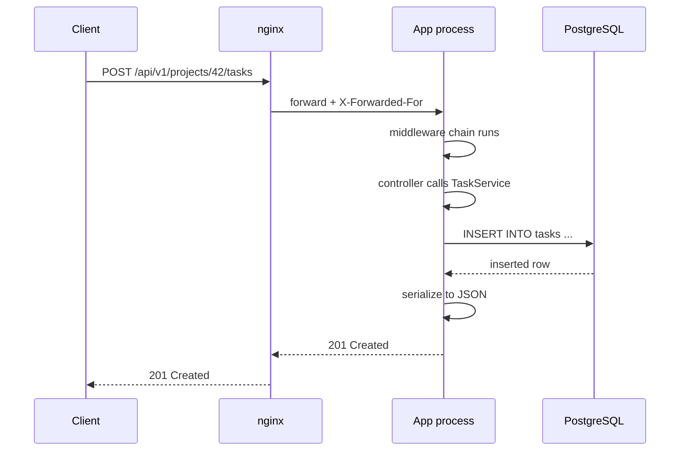
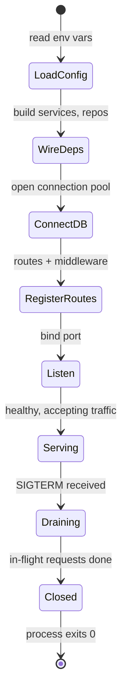

# Anatomy of a Backend App

Think of a restaurant. A customer walks in the door. A host checks if there is
a free table. A waiter takes the order. The kitchen cooks it. A runner brings
the plate back. If the kitchen is on fire, someone still has to walk out and
tell the customer politely.

Your backend app is that restaurant. One HTTP request walks in the door and
passes through a fixed sequence of stations before anything is sent back. This
file draws that sequence end to end, then explains what keeps the whole
building standing: the process, the port, the startup order, and the shutdown.

> **📌 In one line:** A backend app is one long process that owns a port, and
> every request walks the same fixed path through it — proxy, server, router,
> middleware, controller, service, repository, database — and back out again.

## Table of Contents

1. [The Journey of One Request](#the-journey-of-one-request)
2. [What Each Stage Is Responsible For](#what-each-stage-is-responsible-for)
3. [Where the Node.js Process Fits](#where-the-nodejs-process-fits)
4. [What "The Server Is Running" Actually Means](#what-the-server-is-running-actually-means)
5. [Bootstrapping: The Application Lifecycle](#bootstrapping-the-application-lifecycle)
6. [Graceful Shutdown](#graceful-shutdown)
7. [How This Connects to Rolling Deploys](#how-this-connects-to-rolling-deploys)
8. [Common Mistakes](#common-mistakes)
9. [Questions to Test Yourself](#questions-to-test-yourself)
10. [Related](#related)

---

## The Journey of One Request

A user clicks "Create task" in your React app. That click becomes one HTTP
request: `POST /api/v1/projects/42/tasks`. Here is every station it visits.



Two things are worth noticing immediately.

First, the path is **symmetric**. The request goes down through the layers and
the response comes back up through the same layers in reverse. A middleware
that measures response time works because it sits on both the way in and the
way out.

Second, the **error handler wraps everything**. It is not a station the
request passes through only when things go well. It is the last net. Anything
thrown at any depth lands there and becomes an HTTP response.

Here is the same journey as a sequence, which makes the *timing* clearer:



---

## What Each Stage Is Responsible For

The most useful column in this table is the last one. Most messy backends are
messy because work leaked into the wrong stage.

| Stage | Its job | What does NOT belong here |
|---|---|---|
| Reverse proxy | Terminate TLS, serve static files, load balance, set `X-Forwarded-*` | Business rules, authentication decisions, anything per-user |
| HTTP server | Accept TCP connections, parse raw bytes into a request object | Routing logic, any knowledge of your features |
| Router | Match method + path to one handler, extract route params | Auth checks, database calls, response formatting |
| Global middleware | Cross-cutting work every request needs: request id, logging, body parsing, CORS | Feature-specific logic, per-route rules |
| Route middleware | Gatekeeping for this route group: auth, rate limit, tenant resolution | Business rules, writing to the database |
| Validator | Is the input the right shape and type? Reject early with 422 | "Does this user exist?", "is the invoice already paid?" — those are business rules |
| Controller | Translate HTTP into a service call, translate result into HTTP | Business rules, SQL, sending email, formatting currency |
| Service | The business rules. The part you could run from a CLI script or a queue worker | HTTP status codes, `req`/`res` objects, SQL strings |
| Repository | Build and run queries, map rows to entities | Business rules, permission checks |
| Database | Store data, enforce constraints, run transactions | Application logic beyond constraints and simple triggers |
| Serializer | Turn an entity into the exact JSON shape the API promised | Deciding *whether* the user may see the data |
| Error handler | Turn any thrown error into a correct status code and safe body | Recovering business state, retrying |

> **💡 Tip:** When you are unsure where a piece of code belongs, ask: *"Would
> this still be true if the request came from a CLI command instead of HTTP?"*
> If yes, it is a service rule. If no, it is a controller or middleware
> concern.

The layering vocabulary (controller, service, repository) has a full part of
its own: see [Application Architecture](../09-application-architecture/) and
[MVC](../../software-engineering/architecture/mvc.md) for the pattern behind
it, and [the repository pattern](../../software-engineering/design-patterns/repository-pattern.md)
for the data layer.

---

## Where the Node.js Process Fits

Here is the part that surprises people coming from PHP or Java.

Your Node app is **one process, running your JavaScript on one thread**. It
does not create a thread per request. It does not create a process per
request. One thread handles thousands of requests at the same time.

It can do that because almost everything slow in a backend is *waiting*, not
*computing*. Waiting for PostgreSQL. Waiting for Redis. Waiting for an email
API. While request A waits for its database query, the event loop picks up
request B and runs its middleware.

```text
                 ┌──────────────────────────────────────┐
   req A ───▶    │                                      │
   req B ───▶    │   ONE thread running your JS code    │
   req C ───▶    │   (the event loop picks up whichever │
   req D ───▶    │    request is ready to continue)     │
                 └──────────────────────────────────────┘
                          │              ▲
                    start I/O       I/O finished
                          ▼              │
                 ┌──────────────────────────────────────┐
                 │  OS / thread pool: sockets, disk, DNS │
                 └──────────────────────────────────────┘
```

The consequence you must remember: **if your code blocks the thread, every
other request in the process stops too.** A `for` loop over 500,000 rows, a
synchronous `bcrypt.hashSync`, a giant `JSON.parse` — all of them freeze every
other user, not just the one who made the request.

The full mechanics of the event loop, the phases, microtasks vs macrotasks,
and how `await` actually suspends a function are explained in
[event-loop](../../typescript-fundamentals/event-loop/event-loop.md). Read
that file if any of the paragraph above felt vague. This file will not repeat
it.

> **⚠️ Warning:** "It works fine locally" hides blocking code perfectly. With
> one user, blocking the thread costs nothing. With 200 concurrent users, the
> same code turns into a 10-second p99 latency.

---

## What "The Server Is Running" Actually Means

When you type `node build/server.js` and see `Server listening on :3333`, four
concrete things have happened at the operating-system level.

1. The OS started a **process** and gave it a process ID (PID).
2. Your code created a **socket** and asked the OS to *bind* it to port 3333.
3. Your code called **listen**, which tells the OS: queue up incoming
   connections for me.
4. The process entered a loop and does not exit, because there is an active
   handle keeping it alive.

That last point is why a Node server does not just finish and quit like a
script does. Node exits when it has nothing left to do. A listening server is
always "something left to do".

```ts
import http from 'node:http'

const server = http.createServer((req, res) => {
  res.writeHead(200, { 'content-type': 'application/json' })
  res.end(JSON.stringify({ status: 'ok' }))
})

// bind + listen. After this line the process stays alive on purpose.
server.listen(3333, '0.0.0.0', () => {
  console.log('listening on 3333, pid', process.pid)
})
```

Conceptually the OS is running an accept loop for you. If you wrote it by
hand, it would look like this pseudo-code:

```text
socket = create_socket()
bind(socket, port 3333)
listen(socket)

forever:
    connection = accept(socket)      # blocks until a client connects
    read bytes, parse HTTP request
    hand the request to the app
```

Two practical facts fall out of this:

- **`EADDRINUSE` means another process already owns that port.** Only one
  process can bind a given port on a given address. The old crashed instance
  is usually still holding it.
- **The port is the app's only public door.** Everything in this file happens
  behind that one door. That is also why a reverse proxy in front is so
  useful: see [reverse-proxy](../../system-design/foundational/reverse-proxy.md).

---

## Bootstrapping: The Application Lifecycle

Before the first request arrives, your app must build itself. The order
matters, and getting it wrong produces confusing failures.



Why this exact order:

| Step | Why it must come here |
|---|---|
| 1. Load config | Everything else needs it. Validate it now and crash loudly if `DATABASE_URL` is missing — not at 2 AM on the first request that touches the database. |
| 2. Wire dependencies | Build the objects once (services, repositories, mail client) so requests do not build them repeatedly. See [dependency-injection](../../software-engineering/principles/dependency-injection.md). |
| 3. Connect to the database | Open the pool and run one test query. If the database is unreachable, fail startup instead of serving 500s. |
| 4. Register routes and middleware | Order inside this step is itself important — that is the subject of [routing](02-routing.md) and [middleware](03-middleware.md). |
| 5. Listen | Last. The moment you bind the port, real traffic can arrive. Do not open the door before the kitchen is ready. |

```ts
// bootstrap.ts — the whole startup in one readable function
export async function boot(): Promise<http.Server> {
  const config = loadConfig(process.env)     // throws immediately if invalid
  const db = await createPool(config.databaseUrl)
  await db.query('select 1')                 // prove the DB really answers

  const container = wireDependencies({ db, config })
  const app = createApp(container)           // registers middleware + routes

  const server = http.createServer(app)
  await new Promise<void>((r) => server.listen(config.port, r))
  return server
}
```

> **📌 Remember:** Bind the port **last**. A process that is listening is a
> process that a load balancer will send users to.

---

## Graceful Shutdown

This is the section most tutorials skip, and it is the one that decides
whether your deploys are invisible or visible to customers.

### What happens without it

Your orchestrator (Kubernetes, ECS, systemd, PM2 — all the same idea) wants to
stop your old version. It sends the process a `SIGTERM` signal, which means
"please stop". Node's default behaviour for `SIGTERM` is to exit immediately.

"Immediately" means: right in the middle of whatever it was doing.

```mermaid
sequenceDiagram
    participant K as Orchestrator
    participant A as App
    participant D as PostgreSQL
    participant C as Client
    C->>A: POST /invoices (pay invoice)
    A->>D: BEGIN; UPDATE invoices SET paid=true
    K->>A: SIGTERM
    A--xC: connection closed, no response
    Note over A,D: transaction never committed<br/>client saw a network error
```

The client has no idea whether the invoice was paid. It may retry. If your
endpoint is not idempotent, it may pay twice. See
[idempotency](../../system-design/reliability/idempotency.md).

### BROKEN vs FIXED

```ts
// ❌ BROKEN — exits mid-request; every in-flight response is lost
process.on('SIGTERM', () => {
  console.log('shutting down')
  process.exit(0)   // kills open sockets and open transactions instantly
})
```

`process.exit()` does not wait for anything. Not for the response you are
writing, not for the transaction you are committing, not for the log line you
just queued.

```ts
// ✅ FIXED — stop accepting new work, finish current work, then exit
let shuttingDown = false

process.on('SIGTERM', () => void shutdown(server, db))

async function shutdown(server: http.Server, db: Pool): Promise<void> {
  if (shuttingDown) return          // SIGTERM can arrive more than once
  shuttingDown = true

  // 1. Fail the health check first so the load balancer stops sending traffic.
  setHealthy(false)
  await delay(5_000)                // give the LB time to notice

  // 2. Stop accepting new connections. Existing ones keep running.
  await new Promise<void>((resolve) => server.close(() => resolve()))

  // 3. Now nothing is in flight — close the database pool cleanly.
  await db.end()
  process.exit(0)
}
```

### Reading that code line by line

**Why fail the health check before closing the server.** Load balancers do not
learn instantly that a node is going away. They poll a health endpoint every
few seconds. If you close the server the same millisecond you get `SIGTERM`,
the balancer may still route a request to you and the user gets a connection
error. Returning `503` from `/health` for a few seconds first makes the
balancer remove you calmly. See
[health-checks](../../cloud-devops/deployment-strategies/health-checks.md).

**Why `server.close()` is the correct tool.** `server.close()` stops the
listener from accepting *new* connections but lets every in-flight request
finish. Its callback fires only when the last one is done. That is exactly
"draining".

**Why the database pool closes last.** If you end the pool while a request is
mid-query, that request throws. Close it only after the server has drained.

**Add a hard timeout.** A request stuck on a slow external API can block
shutdown forever. Orchestrators only wait a fixed grace period (often 30
seconds) before sending `SIGKILL`, which cannot be caught.

```ts
// Safety net: never let draining hang forever.
const forceExit = setTimeout(() => {
  console.error('drain timed out, forcing exit')
  process.exit(1)
}, 15_000)
forceExit.unref()   // this timer alone must not keep the process alive
```

> **⚠️ Warning:** `SIGKILL` (`kill -9`) cannot be handled. No cleanup runs. If
> your data integrity depends on cleanup code, it is already fragile — use
> database transactions so an abrupt death rolls back instead.

### Keep-alive connections

One more detail that bites in production. HTTP keep-alive means a client may
hold an idle connection open to your server for 60 seconds or more. Those idle
connections are not "in flight", but `server.close()` still waits for them.

Node 18+ gives you `server.closeIdleConnections()` to drop the idle ones while
still letting active requests finish. Call it right after `server.close()`.

---

## How This Connects to Rolling Deploys

A rolling deploy replaces your instances a few at a time so users never see
downtime. Instance 1 stops, a new one starts, then instance 2, and so on.

That plan only works if each instance can stop **without dropping requests**.
Graceful shutdown is the contract your app signs with the deploy system:

| The deploy system promises | Your app must promise |
|---|---|
| Send `SIGTERM`, not `SIGKILL`, first | Catch `SIGTERM` and start draining |
| Wait a grace period (e.g. 30s) | Finish draining inside that window |
| Stop routing traffic to a failing health check | Report unhealthy as soon as draining starts |
| Only kill the old instance after the new one is healthy | Report healthy only after bootstrap fully finished |

Break either side and users see `502 Bad Gateway` on every deploy. The full
mechanics of the deploy side live in
[rolling-updates](../../cloud-devops/deployment-strategies/rolling-updates.md).

> **📌 Remember:** Zero-downtime deploys are not a feature of your hosting
> platform. They are a feature of your shutdown code plus your health check.

---

## Common Mistakes

| Mistake | Why it is wrong | Do this instead |
|---|---|---|
| `process.exit()` inside the `SIGTERM` handler | Kills in-flight responses and open transactions | `server.close()`, wait for drain, then exit |
| Calling `listen()` before the database is connected | Traffic arrives while the app cannot serve it, producing 500s | Bind the port as the last bootstrap step |
| Putting business rules in the controller | Logic cannot be reused by a queue worker or CLI, and cannot be tested without HTTP | Move it to a service; keep the controller thin |
| Blocking the thread with a long loop or `*Sync` call | One request freezes every other request in the process | Use async APIs, or move heavy work to a queue or worker thread |
| No timeout on the drain | A stuck request blocks shutdown until `SIGKILL` arrives | Add a forced-exit timer shorter than the grace period |
| Reading config lazily inside request handlers | A missing env var becomes a 3 AM runtime error instead of a startup crash | Load and validate all config at boot |
| Health check returns 200 the instant the process starts | Load balancer sends traffic before routes and the pool are ready | Report healthy only after bootstrap completes |

---

## Questions to Test Yourself

1. A request enters your app and a database error is thrown inside the
   repository. Name every layer that error passes through on the way out, and
   say which one decides the HTTP status code.
2. Why does binding the port *last* during bootstrap matter, and what exactly
   goes wrong if you bind it first?
3. Your Node process handles 500 concurrent requests on one thread. Explain in
   your own words why that is possible, and name one kind of code that
   destroys it.
4. What is the difference between `server.close()` and `process.exit()` in
   terms of in-flight requests?
5. During a rolling deploy your users see occasional `502` errors. Give two
   different causes — one on the app side, one on the load balancer side.
6. Why should the health check start failing *before* the server stops
   accepting connections, rather than at the same moment?
7. You get `EADDRINUSE` on startup. What does that tell you about the state of
   the machine, and what is the first thing you would check?
8. Which stage of the pipeline should reject a request whose `title` field is
   a number instead of a string — and which stage should reject a request to
   archive an invoice that is already archived? Explain the difference.

---

## Related

- [Routing](02-routing.md) — the next box on the map: how a path becomes a handler.
- [Middleware](03-middleware.md) — the chain that runs before your controller.
- [Controllers and Request Context](04-controllers-and-request-context.md) — keeping the controller thin.
- [event-loop](../../typescript-fundamentals/event-loop/event-loop.md) — how one thread serves many requests.
- [reverse-proxy](../../system-design/foundational/reverse-proxy.md) — what sits in front of your process.
- [rolling-updates](../../cloud-devops/deployment-strategies/rolling-updates.md) — why graceful shutdown exists.
- [health-checks](../../cloud-devops/deployment-strategies/health-checks.md) — how the balancer learns you are draining.
- [idempotency](../../system-design/reliability/idempotency.md) — what saves you when a dropped request is retried.
- [MVC](../../software-engineering/architecture/mvc.md) — the pattern behind the controller/service split.
