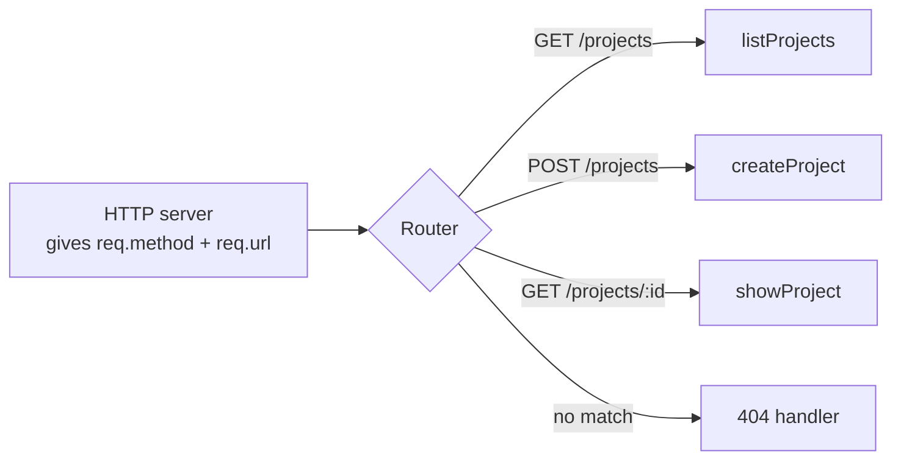
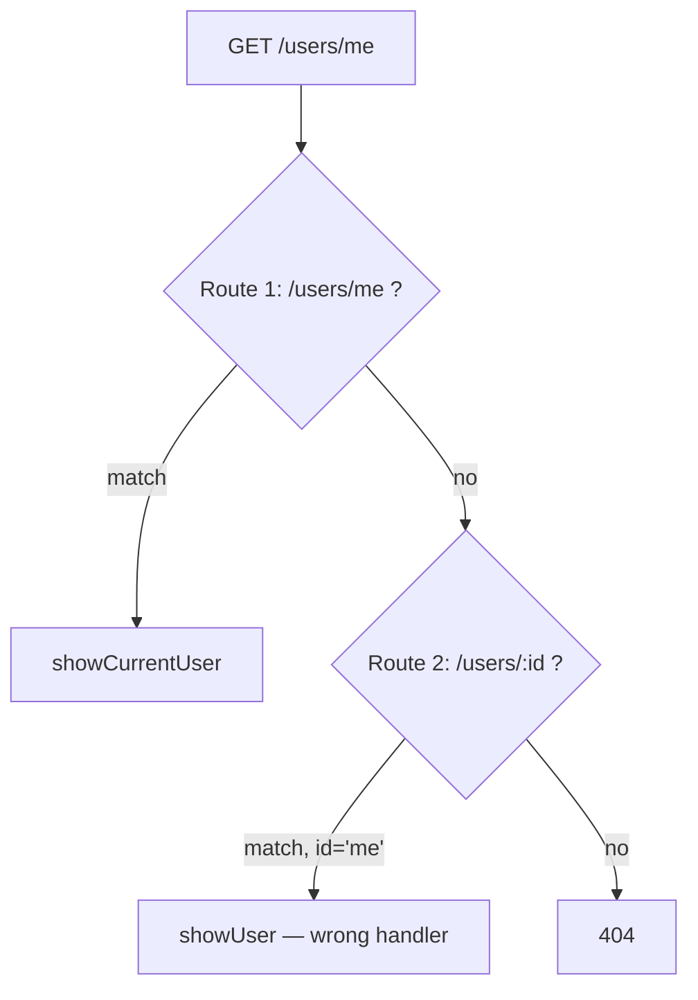

# Routing

Imagine a big office building with one reception desk. Every visitor walks in
and says two things: what they want to do ("deliver", "collect", "visit") and
where they want to go ("floor 4, room 12"). The receptionist looks at a
printed list and points them to exactly one room.

A router is that receptionist. It looks at two things on every request — the
**method** (`GET`, `POST`, ...) and the **path** (`/projects/42/tasks`) — and
picks exactly one handler function to run. That is the whole job. There is no
magic in it, and this file proves that by writing one in about twenty lines.

> **📌 In one line:** A router is a lookup table from (method + path) to one
> handler function, plus a way to pull variable pieces out of the path.

## Table of Contents

1. [What a Router Does](#what-a-router-does)
2. [A Router in Twenty Lines](#a-router-in-twenty-lines)
3. [Parameters, Query Strings, Wildcards](#parameters-query-strings-wildcards)
4. [Matching Order and Specificity](#matching-order-and-specificity)
5. [Grouping, Prefixes, and Group Middleware](#grouping-prefixes-and-group-middleware)
6. [Organizing Routes as the App Grows](#organizing-routes-as-the-app-grows)
7. [Named Routes and URL Generation](#named-routes-and-url-generation)
8. [404 and the Catch-All Route](#404-and-the-catch-all-route)
9. [Advanced: How Routers Match at Scale](#advanced-how-routers-match-at-scale)
10. [Common Mistakes](#common-mistakes)
11. [Questions to Test Yourself](#questions-to-test-yourself)
12. [Related](#related)

---

## What a Router Does

A router sits between the HTTP server and your application code.



It does three things and nothing else:

1. **Match.** Compare the incoming method and path against registered routes.
2. **Extract.** Pull dynamic pieces out of the path (`42` out of
   `/projects/42`) and hand them to the handler.
3. **Dispatch.** Call that handler, after any middleware attached to the route.

What a router must **not** do: check whether the user is logged in, read the
database, or format a response. Those belong to [middleware](03-middleware.md)
and [controllers](04-controllers-and-request-context.md).

---

## A Router in Twenty Lines

Frameworks make routing feel mysterious. It is not. Here is a working router.

```ts
type Handler = (req: Request, params: Record<string, string>) => Promise<Response>

interface Route {
  method: string
  segments: string[]   // '/projects/:id' becomes ['projects', ':id']
  handler: Handler
}

const routes: Route[] = []

export function register(method: string, path: string, handler: Handler): void {
  routes.push({
    method,
    segments: path.split('/').filter(Boolean),
    handler,
  })
}
```

Registration just stores the route. Now the matching half:

```ts
export function match(method: string, path: string) {
  const parts = path.split('/').filter(Boolean)

  for (const route of routes) {
    if (route.method !== method) continue
    if (route.segments.length !== parts.length) continue

    const params: Record<string, string> = {}
    let ok = true

    for (let i = 0; i < parts.length; i++) {
      const seg = route.segments[i]
      if (seg.startsWith(':')) params[seg.slice(1)] = parts[i]  // dynamic
      else if (seg !== parts[i]) { ok = false; break }          // literal
    }

    if (ok) return { handler: route.handler, params }
  }
  return null   // nothing matched -> the caller sends 404
}
```

That is a real router. Register a route and it works:

```ts
register('GET', '/projects/:projectId/tasks/:taskId', async (req, params) => {
  // params is { projectId: '42', taskId: '7' } — plain strings, always
  return json(await taskService.find(params.projectId, params.taskId))
})
```

Read that loop once more: it **returns the first route that matches**, walking
the array in registration order. That one fact causes the most common routing
bug in the world.

> **💡 Tip:** Route params are always strings — `params.projectId` is `'42'`,
> not `42`. Converting and checking them is the
> [validator's](../04-validation-and-input/01-why-validation-matters.md) job.

---

## Parameters, Query Strings, Wildcards

Three different mechanisms carry variable data in a URL. They look similar and
behave very differently.

| Kind | Looks like | Where you read it | Used for | Optional? |
|---|---|---|---|---|
| Route parameter | `/projects/:id` → `/projects/42` | `req.params.id` | Identifying *which* resource | No — the route does not match without it |
| Query string | `/tasks?status=open&page=2` | `req.query.status` | Filtering, sorting, paging, options | Yes — always treat as optional |
| Wildcard / catch-all | `/files/*path` → `/files/logos/dark.png` | `req.params.path` | Variable-depth paths: file trees, proxies, SPA fallback | Matches one or more segments |
| Optional segment | `/reports/:year?` | `req.params.year` may be undefined | Rare. Prefer two explicit routes | Yes |

A full URL with all of them:

```text
https://api.example.com/v1/projects/42/tasks?status=open&sort=-created_at#top
└───────┬────────────┘└─┬┘└───┬──┘ └┬┘ └─┬─┘ └──────────┬──────────────┘ └┬┘
     origin           ver  literal  param literal     query string      fragment
                                     ↑                       ↑             ↑
                              req.params.projectId      req.query    never sent
                                                                     to the server
```

Two rules worth memorising. **The fragment (`#top`) never reaches your
server** — the browser keeps it. And **the query string is not part of the
route match**: `/tasks?status=open` and `/tasks` hit the same handler.

```ts
// A realistic list endpoint reading both kinds of input
register('GET', '/projects/:projectId/tasks', async (req, params) => {
  const projectId = params.projectId                  // from the path
  const status = req.query.get('status') ?? 'all'     // from the query string
  const page = Number(req.query.get('page') ?? '1')   // string -> number, validate later
  return json(await taskService.list(projectId, { status, page }))
})
```

---

## Matching Order and Specificity

Our twenty-line router returns the **first** match. Most real routers
(Express, Koa, and many others) behave the same way. Order of registration is
therefore part of your program's meaning.

```ts
// ❌ BROKEN — /users/me never runs
router.get('/users/:id', showUser)     // registered first
router.get('/users/me', showCurrentUser)

// A request to GET /users/me matches '/users/:id' first,
// with params.id = 'me'. showUser then runs:
//   SELECT * FROM users WHERE id = 'me'
// PostgreSQL: invalid input syntax for type integer: "me" -> a 500 error.
```

The fix is one line moved:

```ts
// ✅ FIXED — the specific literal route is registered before the dynamic one
router.get('/users/me', showCurrentUser)   // literal 'me' wins
router.get('/users/:id', showUser)         // everything else falls through
```



The general rule: **static beats dynamic, dynamic beats wildcard.**

| Priority | Pattern | Example |
|---|---|---|
| 1 (highest) | Fully static path | `/projects/archived` |
| 2 | Static prefix + parameter | `/projects/:id` |
| 3 | Parameter early in the path | `/:resource/count` |
| 4 (lowest) | Wildcard / catch-all | `/*path` |

Some routers (Fastify, Adonis, most trie-based routers — see the advanced
section) sort by specificity automatically, so `/users/me` wins no matter when
you registered it. **Do not rely on that.** Register specific routes first
anyway: the code then reads correctly in every framework, and the next person
does not have to know which strategy your router uses.

> **⚠️ Warning:** This bug is quiet. It does not throw at startup. It only
> appears when a user hits the exact path, often in production, often as a
> confusing database type error rather than a routing error.

---

## Grouping, Prefixes, and Group Middleware

Repeating `/api/v1/` on forty routes is noise, and forgetting the auth
middleware on one of them is a security hole. Grouping fixes both.

```ts
// Every route inside inherits the prefix AND the middleware list.
router.group('/api/v1', [requestId, jsonBodyParser], () => {

  // Public — no auth
  router.post('/auth/login', authController.login)
  router.post('/auth/register', authController.register)

  // Everything below requires a valid session
  router.group('', [authenticate], () => {
    router.get('/me', userController.showCurrent)

    router.group('/projects', [resolveTenant], () => {
      router.get('', projectController.index)
      router.post('', projectController.store)
      router.get('/:projectId', projectController.show)
      router.get('/:projectId/tasks', taskController.index)
    })
  })
})
```

Groups nest, and middleware accumulates from outside in. A request to
`GET /api/v1/projects/42/tasks` runs `requestId` → `jsonBodyParser` →
`authenticate` → `resolveTenant` → the handler.

The security value is the real point. With grouping, "is this endpoint
protected?" is answered by *where the line sits in the file*. A new route added
inside the authenticated group is protected by default.

> **📌 Remember:** Default to secure. Put routes inside the authenticated
> group, and move the few public ones out deliberately.

In AdonisJS the shape is `Route.group(() => { ... }).prefix('/api/v1').middleware(['auth'])`;
in Express it is `app.use('/api/v1', authenticate, projectsRouter)`. Names
differ by framework version — check your version's docs — the idea does not.

---

## Organizing Routes as the App Grows

There are three common layouts. They are stages, not competitors: most apps
move from 1 to 2 as they grow, and a few reach 3.

| Layout | What it is | Good when | Hurts when |
|---|---|---|---|
| Single routes file | Every route in `routes.ts` | Under ~40 routes. One file you can read top to bottom | The file passes 300 lines and merge conflicts start on every branch |
| Per-resource files | `routes/projects.ts`, `routes/tasks.ts`, imported by one index | Most real apps. Clear ownership, small diffs | You must remember to import the new file |
| Auto-discovery | Scan a folder and register files by convention | Very large apps, strong conventions | The route list is now invisible; debugging "why is this 404" gets harder |

A realistic per-resource layout for the SaaS domain used across this track:

```text
app/
├── routes/
│   ├── index.ts            # builds the router, applies global middleware
│   ├── auth.routes.ts      # login, register, refresh, logout
│   ├── users.routes.ts     # /me, /users/:id
│   ├── companies.routes.ts # /companies, members, invites
│   ├── projects.routes.ts  # /projects, /projects/:id
│   ├── tasks.routes.ts     # nested under a project
│   ├── invoices.routes.ts  # /invoices, /invoices/:id/pay
│   └── webhooks.routes.ts  # no auth middleware, signature check instead
└── controllers/
    ├── projects.controller.ts
    └── tasks.controller.ts
```

```ts
// routes/index.ts — one place that shows the whole API shape
export function registerRoutes(router: Router): void {
  router.group('/api/v1', [requestId, logger, jsonBodyParser], () => {
    registerAuthRoutes(router)        // public
    registerWebhookRoutes(router)     // public, signature-verified
    router.group('', [authenticate], () => {
      registerUserRoutes(router)
      registerProjectRoutes(router)
      registerInvoiceRoutes(router)
    })
  })
}
```

> **💡 Tip:** Whatever layout you pick, add a `routes:list` command that prints
> every route with its method, path, middleware, and handler. Most frameworks
> ship one. It turns "is this route even registered?" into one command.

---

## Named Routes and URL Generation

Hardcoded URL strings spread through your codebase. When the path changes, you
must find every copy.

```ts
// ❌ BROKEN — the URL is duplicated in email templates, tests, and services
const link = `https://app.example.com/projects/${project.id}/tasks/${task.id}`
// Change the path to /workspaces/:id/tasks and this string silently rots.
```

Give the route a name once, and build URLs from that name:

```ts
// ✅ FIXED — one definition, every caller derives from it
router.get('/projects/:projectId/tasks/:taskId', taskController.show)
      .as('tasks.show')

const link = router.url('tasks.show', { projectId: project.id, taskId: task.id })
// -> /projects/42/tasks/7 ; changing the path updates every caller at once
```

Named routes also fail loudly: an unknown name throws, and the generator can
require every `:param`. A wrong hardcoded string fails silently instead.

Naming convention that scales: `resource.action` — `projects.index`,
`projects.store`, `tasks.show`, `invoices.pay`. It mirrors your controller
methods, so the mapping is obvious.

---

## 404 and the Catch-All Route

If no route matches, someone must still answer. Register one catch-all
handler, and register it **last**.

```ts
// Last registration wins the leftovers. Registered earlier, it would swallow
// every request in the app.
router.all('/*path', (req) => {
  return json({
    error: { code: 'ROUTE_NOT_FOUND', message: `No route for ${req.method} ${req.path}` },
  }, 404)
})
```

Three details separate a good 404 from a sloppy one. **Return JSON, not an
HTML page**, in the same error shape as every other error you return — see
[error response design](../02-rest-api-design/05-error-response-design.md).
**405 is not 404**: if the path exists but the method does not, answer `405
Method Not Allowed` with an `Allow` header. And **do not echo user input into
HTML**, which would be a cross-site scripting (XSS) risk.

---

## Advanced: How Routers Match at Scale

Our twenty-line router loops over every route and compares segment by segment.
With 500 routes, the worst case compares 500 routes per request. Is that slow?

In practice, no — but real routers do better anyway, and knowing how explains
their behaviour.

### Loop-over-regexes (Express style)

Each route is compiled once at startup into a regular expression
(`/projects/:id` → `^/projects/([^/]+)$`). Each request tries them in order
until one matches: simple, order-dependent, linear in the number of routes.

### Radix tree / trie (Fastify, Adonis, Go's chi, most modern routers)

Routes are stored as a tree of path segments. Matching walks the tree one
segment at a time, so cost depends on **path depth**, not route count.

```text
                    (root)
                      │
            ┌─────────┴──────────┐
         projects              invoices
            │                     │
    ┌───────┴────────┐        ┌───┴────┐
   ""            :projectId  ""      :id
  (index)            │                │
                 ┌───┴───┐         ┌──┴──┐
                ""     tasks      ""    pay
```

Matching `/projects/42/tasks` walks `projects` → `:projectId` → `tasks`: three
steps, whether the app has 20 routes or 2,000. Static children are tried before
parameter children, and those before wildcards — the specificity rule from
earlier, built into the data structure.

### Why route count almost never matters

Put the numbers next to each other:

| Work item | Typical cost |
|---|---|
| Route matching (either strategy) | 1–20 microseconds |
| JSON body parsing | 10–200 microseconds |
| One indexed PostgreSQL query | 0.5–5 milliseconds |
| One un-indexed query on a big table | 50–2000 milliseconds |
| One external HTTP call | 20–500 milliseconds |

Route matching is roughly a thousand times cheaper than the cheapest database
query. **Never optimise routing for speed.** Optimise it for readability and
correct specificity. A slow endpoint is slow because of
[the query](../../databases/query-optimization/slow-query-fixes.md) or an
[N+1 problem](../../databases/query-optimization/n-plus-one-queries.md).

### Routes as attachment points

The router knows something no other layer knows: **which endpoint this is**,
before any work happens. That makes it the natural place to hang per-endpoint
policies.

```ts
// Different endpoints deserve very different limits.
router.post('/auth/login', authController.login)
      .middleware([rateLimit({ max: 5, windowMs: 60_000, key: 'ip' })])

router.post('/invoices/:id/pay', invoiceController.pay)
      .middleware([rateLimit({ max: 10, windowMs: 60_000, key: 'user' }), idempotencyKey()])

router.get('/projects/:id', projectController.show)
      .middleware([cacheFor({ seconds: 30, varyBy: ['tenant'] })])
```

A login endpoint needs a strict limit by IP address to slow password guessing.
A read endpoint needs a cache. A payment endpoint needs an idempotency key so a
retry cannot charge twice. Attaching each policy next to the endpoint it
protects is clearer than one global rule that fits nothing well.

The algorithms behind those limits (token bucket, sliding window, distributed
counters in Redis) are covered in
[rate-limiting](../../system-design/foundational/rate-limiting.md); caching
strategy and invalidation in
[caching-strategies](../../system-design/foundational/caching-strategies.md).
This file only claims the *attachment point*.

---

## Common Mistakes

| Mistake | Why it is wrong | Do this instead |
|---|---|---|
| Registering `/users/:id` before `/users/me` | The dynamic route matches first and `id` becomes `"me"` | Register static paths before dynamic ones |
| Putting the catch-all 404 route first | It matches everything and no real route ever runs | Register it last, after all other routes |
| Treating route params as numbers | They are always strings; `params.id + 1` gives `"421"` | Convert and validate in the validation layer |
| Auth middleware applied per route by hand | One forgotten route becomes an open endpoint | Group routes and apply auth to the group |
| Hardcoding URL strings across the codebase | A path change breaks emails, tests, and redirects silently | Name routes and generate URLs from names |
| Returning 404 when the path exists but the method does not | The client cannot tell "wrong URL" from "wrong verb" | Return 405 with an `Allow` header |
| Optimising the router for speed | Routing is microseconds; the database is milliseconds | Optimise queries instead |
| Doing database work inside the route file | Route files become untestable and huge | Route points at a controller; the controller delegates |

---

## Questions to Test Yourself

1. In your own words, what are the only two pieces of the request a router
   looks at, and what are the three things it does with them?
2. Why does `GET /users/me` return a database type error when `/users/:id` is
   registered first? Trace the exact sequence.
3. What is the difference between a route parameter and a query string, and
   how does each one affect whether a route matches at all?
4. You add a new endpoint inside an authenticated route group and forget to
   think about auth. Is it protected? Why is that the desired default?
5. A colleague says "we have 800 routes, routing must be our bottleneck".
   Explain with numbers why that is almost certainly wrong.
6. What does a radix-tree router give you that a loop-over-regexes router does
   not — and why should you still register specific routes first anyway?
7. When would you attach a rate limit to a single route instead of globally?
   Give two endpoints that need very different limits and say why.
8. Why must the catch-all route be registered last, and what would you return
   from it for an API as opposed to a server-rendered website?

---

## Related

- [Anatomy of a Backend App](01-anatomy-of-a-backend-app.md) — where the router sits in the full pipeline.
- [Middleware](03-middleware.md) — what runs between the route match and the handler.
- [Controllers and Request Context](04-controllers-and-request-context.md) — what the matched handler should contain.
- [Resource Naming and URLs](../02-rest-api-design/02-resource-naming-and-urls.md) — how to choose the paths you register.
- [rate-limiting](../../system-design/foundational/rate-limiting.md) — the algorithms behind per-route limits.
- [caching-strategies](../../system-design/foundational/caching-strategies.md) — what a route-level cache hook should do.
