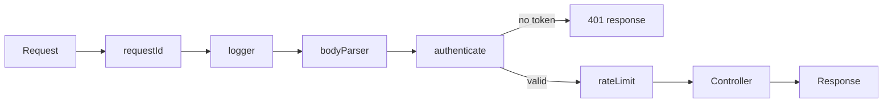

# Middleware

Think about entering an airport. Before you reach your gate you pass a series
of checkpoints: ticket check, passport check, security scan, boarding pass
scan. Each checkpoint does one job. Each one can either wave you through or
stop you right there. None of them knows or cares which gate you are going to.

Middleware is exactly that. It is a function that runs **before** your handler
(and often **after** it too), does one small job, and then either passes the
request along or stops it.

> **📌 In one line:** Middleware is a chain of small functions where each one
> can inspect the request, change it, stop it, or call `next()` to hand it to
> the next function in line.

## Table of Contents

1. [What Middleware Is](#what-middleware-is)
2. [The Chain and the Onion](#the-chain-and-the-onion)
3. [A Middleware Engine in Twenty-Five Lines](#a-middleware-engine-in-twenty-five-lines)
4. [The Two Shapes](#the-two-shapes)
5. [Order Matters](#order-matters)
6. [Global, Group, and Route-Level](#global-group-and-route-level)
7. [Real Middleware You Will Write](#real-middleware-you-will-write)
8. [Bugs That Hang Requests Forever](#bugs-that-hang-requests-forever)
9. [Advanced Concerns](#advanced-concerns)
10. [Common Mistakes](#common-mistakes)
11. [Questions to Test Yourself](#questions-to-test-yourself)
12. [Related](#related)

---

## What Middleware Is

A middleware function receives the request and a way to continue. That is the
whole contract. It can do four things:

| Action | Example | Result |
|---|---|---|
| **Read** the request | Log the method and path | Request continues unchanged |
| **Change** the request | Parse the JSON body, attach `ctx.user` | The next steps see the change |
| **Stop** the request | Return `401` because there is no token | The handler never runs |
| **Change the response** on the way out | Add a `X-Response-Time` header | Client sees the extra header |

The important property is **reuse**. Authentication is needed by 90% of your
endpoints. As middleware it exists once, attached to a route group. Inside
controllers it exists ninety times, and one copy will be wrong.

> **💡 Tip:** Good middleware is boring and general. If a function only makes
> sense for one endpoint, it is not middleware — it is part of that handler.

---

## The Chain and the Onion

The chain view shows the order:



But the chain view hides something. Middleware does not only run on the way
in. The onion view shows why:

```text
        ┌──────────────── requestId ────────────────┐
        │   ┌──────────── logger ───────────────┐   │
        │   │   ┌──────── bodyParser ───────┐   │   │
        │   │   │   ┌──── authenticate ──┐  │   │   │
  req ──┼──▶┼──▶┼──▶┼──▶  CONTROLLER     │  │   │   │
  res ◀─┼───┼───┼───┼──◀─────────────────┘  │   │   │
        │   │   │   └───────────────────────┘   │   │
        │   │   └───────────────────────────────┘   │
        │   └───────────────────────────────────────┘
        └───────────────────────────────────────────┘
        entered first                         exits last
```

The request travels **inward** through each layer, reaches the controller at
the centre, then the response travels **outward** through the same layers in
reverse order. That is why a timing middleware works: it records the start time
going in, and when control comes back it knows how long everything inside took.

> **📌 Remember:** First in, last out. The middleware registered first is the
> outermost layer, so it sees the response last.

---

## A Middleware Engine in Twenty-Five Lines

`next()` feels like framework magic until you write the dispatcher yourself.

```ts
interface Context {
  req: Request
  res: ResponseBuilder
  state: Record<string, unknown>   // shared scratch space for this request
}

type Middleware = (ctx: Context, next: () => Promise<void>) => Promise<void>

export function compose(stack: Middleware[]) {
  return function run(ctx: Context): Promise<void> {
    let lastCalled = -1

    function dispatch(i: number): Promise<void> {
      if (i <= lastCalled) {
        // Guard: calling next() twice in one middleware is always a bug.
        return Promise.reject(new Error('next() called multiple times'))
      }
      lastCalled = i

      const fn = stack[i]
      if (!fn) return Promise.resolve()          // end of the chain

      // The `next` a middleware receives is just "run index i + 1".
      return fn(ctx, () => dispatch(i + 1))
    }

    return dispatch(0)
  }
}
```

That is the entire idea. `next()` is not special syntax. It is a closure that
calls the next function in an array.

Using it:

```ts
const run = compose([
  async (ctx, next) => { console.log('in 1'); await next(); console.log('out 1') },
  async (ctx, next) => { console.log('in 2'); await next(); console.log('out 2') },
  async (ctx) => { ctx.res.json({ status: 'ok' }) },   // no next() = the handler
])
// Output order: in 1, in 2, out 2, out 1  ← the onion, proven
```

Two consequences you can now see directly in the code. **A middleware that
never calls `next()` ends the chain** — deliberately that is how a `401`
short-circuits, accidentally it is how a request hangs. And **the `await`
before `next()`** is what makes the outward half work; drop it and your
"after" code runs too early.

---

## The Two Shapes

There are two common middleware signatures. They solve the same problem
differently.

### Shape 1 — Express style: `(req, res, next)`

```ts
// Express style: next() is a callback, and you do not await it.
function requestTimer(req: Request, res: Response, next: NextFunction): void {
  const start = process.hrtime.bigint()

  // No "after next()" hook exists, so you must listen for an event.
  res.on('finish', () => {
    const ms = Number(process.hrtime.bigint() - start) / 1e6
    console.log(`${req.method} ${req.url} ${res.statusCode} ${ms.toFixed(1)}ms`)
  })

  next()   // continue; anything written after this line runs immediately
}
```

### Shape 2 — Onion style: `async (ctx, next)`

Used by Koa, AdonisJS, and the engine written above.

```ts
// Onion style: next() returns a promise, so "after" is just code after await.
async function requestTimer(ctx: Context, next: () => Promise<void>): Promise<void> {
  const start = process.hrtime.bigint()

  await next()   // everything inside the onion runs here

  const ms = Number(process.hrtime.bigint() - start) / 1e6
  ctx.res.header('x-response-time', `${ms.toFixed(1)}ms`)
  ctx.logger.info({ ms, status: ctx.res.status }, 'request completed')
}
```

| | Express style | Onion style |
|---|---|---|
| Continue | `next()` (callback) | `await next()` (promise) |
| Code "after" the handler | Needs a `res.on('finish')` event listener | Just the lines after `await next()` |
| Wrapping in `try/catch` | Does not catch downstream errors | `try { await next() } catch` catches everything below |
| Modifying the response | Awkward — must patch `res.write`/`res.end` | Natural — the response object is still there |
| Mental model | A list of callbacks | Nested layers, like `try`/`finally` |

The onion shape is easier for anything that needs *both* halves: timing,
logging with duration, compression, error catching, transaction
commit-or-rollback. That is why newer frameworks chose it.

> **⚠️ Warning:** Mixing them is a real source of bugs. In onion style,
> forgetting `await` before `next()` means your "after" code runs before the
> handler finishes, and errors thrown downstream escape your `try/catch`.

---

## Order Matters

Middleware order is not a style preference. It changes behaviour.

| # | Middleware | Why it sits here |
|---|---|---|
| 1 | **Request ID** | Everything below must be able to log the same id, so it must exist first |
| 2 | **Logger** | Wraps everything below it, so the duration it measures includes all of it |
| 3 | **Body parser** | Auth may read a token from the body; the controller needs the parsed body |
| 4 | **CORS** (Cross-Origin Resource Sharing) | Must answer browser preflight `OPTIONS` requests *before* auth rejects them for having no token |
| 5 | **Authenticate** | Identify the caller before any rule depends on who they are |
| 6 | **Rate limit** | Placed after auth so the limit can be per user, not only per IP address |
| 7 | **Authorize / tenant** | Needs the identified user from step 5 |
| 8 | **Route handler** | The centre of the onion |
| 9 | **Error handler** | Registered last, so it is the outermost layer and catches everything |

Three of those rows are the classic ordering bugs. **CORS after auth**: the
browser's preflight `OPTIONS` request carries no credentials, gets a `401`, and
the real request is never sent — the developer sees "CORS error" and spends a
day on the wrong problem. **Rate limit before auth**: you can only key on IP,
so one office network shares one bucket. **Error handler not outermost**:
errors escape it and become an unhandled crash.

---

## Global, Group, and Route-Level

| Scope | Runs for | Good examples | Bad examples |
|---|---|---|---|
| Global | Every request, including `/health` | Request id, logger, body parser, CORS, security headers | Authentication (it would block your health check and login route) |
| Group | Every route inside one group | Auth, tenant resolution, API version negotiation | Anything only one endpoint needs |
| Route | One endpoint | Strict rate limit on login, idempotency key on payment, cache hook on a hot read | Logging (duplicated everywhere) |

```ts
app.use([requestId, logger, jsonBodyParser, cors])                 // global

router.group('/api/v1', [authenticate, resolveTenant], () => {     // group
  router.get('/projects', projectController.index)
  router.post('/invoices/:id/pay', invoiceController.pay)
        .middleware([idempotencyKey(), rateLimit({ max: 10 })])    // route level
})
```

> **💡 Tip:** Global middleware runs on your health check too. Keep it cheap
> and never let it touch the database, or a database outage will also break the
> health check meant to report that outage.

---

## Real Middleware You Will Write

These four cover most of what a real service needs.

### 1. Request ID

Every log line for one request should carry the same id. That id is how you
find every related line when a customer reports a problem.

```ts
import { randomUUID } from 'node:crypto'

export const requestId: Middleware = async (ctx, next) => {
  // Trust an incoming id from your own proxy so traces span services,
  // but generate one when it is absent.
  const incoming = ctx.req.header('x-request-id')
  ctx.state.requestId = incoming ?? randomUUID()
  ctx.res.header('x-request-id', String(ctx.state.requestId))
  await next()
}
```

### 2. Timing and logging

```ts
export const httpLogger: Middleware = async (ctx, next) => {
  const start = process.hrtime.bigint()
  try {
    await next()
  } finally {
    // `finally` means failed requests get logged too — those matter most.
    const ms = Number(process.hrtime.bigint() - start) / 1e6
    logger.info({
      requestId: ctx.state.requestId,
      method: ctx.req.method,
      path: ctx.req.path,
      status: ctx.res.status,
      durationMs: Number(ms.toFixed(1)),
    }, 'http request')
  }
}
```

### 3. Authentication

```ts
export const authenticate: Middleware = async (ctx, next) => {
  const header = ctx.req.header('authorization')
  if (!header?.startsWith('Bearer ')) {
    throw new UnauthorizedError('Missing bearer token')   // error handler formats it
  }

  const user = await sessionService.resolve(header.slice(7))
  if (!user) throw new UnauthorizedError('Invalid or expired token')
  ctx.state.user = user     // the controller reads this, never the raw token
  await next()
}
```

Notice it **throws** instead of writing a response, so one place builds every
error body and they all share a shape. Full treatment in
[Part 7 — Error Handling](../07-error-handling/).

### 4. Catching errors from async handlers

In older Express versions an async handler that rejects never reaches the
error handler, so the request hangs. The standard fix is a wrapper:

```ts
// Express: wrap every async handler so a rejected promise reaches next(err).
type AsyncHandler = (req: Request, res: Response, next: NextFunction) => Promise<unknown>

export const asyncWrap = (fn: AsyncHandler) =>
  (req: Request, res: Response, next: NextFunction): void => {
    Promise.resolve(fn(req, res, next)).catch(next)
  }

router.get('/projects/:id', asyncWrap(projectController.show))
```

Onion-style frameworks do not need this: `await next()` already propagates
rejections up to whichever layer has a `try/catch`. See
[async-await-promise](../../typescript-fundamentals/async-await-promise/async-await-promise.md)
for why an unhandled rejection behaves this way.

---

## Bugs That Hang Requests Forever

### The hanging request

```ts
// ❌ BROKEN — the request hangs until the client times out
export const resolveTenant: Middleware = async (ctx, next) => {
  const companyId = ctx.req.header('x-company-id')
  if (companyId) {
    ctx.state.company = await companyService.find(companyId)
    await next()
  }
  // No `else` branch. When the header is missing: no next(), no response.
  // The chain simply stops. The client waits 30 seconds and gives up.
}
```

There is no error and no log line. The request just stops existing — which is
what makes this bug hard to find.

```ts
// ✅ FIXED — every path either responds or continues
export const resolveTenant: Middleware = async (ctx, next) => {
  const companyId = ctx.req.header('x-company-id')
  if (!companyId) {
    throw new BadRequestError('x-company-id header is required')  // stops, with a response
  }

  const company = await companyService.find(companyId)
  if (!company) throw new NotFoundError('Company not found')

  ctx.state.company = company
  await next()        // the only "continue" path, and it is unconditional
}
```

**The rule:** trace every branch of your middleware. Each one must end in
`await next()` or in a response. No branch may end in nothing.

### Three more failure modes

| Bug | What you see | Why it happens |
|---|---|---|
| Calling `next()` twice | `Error: next() called multiple times`, or worse, silent double execution | An early-return path forgot its `return` before `next()` |
| Responding, then continuing | `ERR_HTTP_HEADERS_SENT` crash | The middleware wrote a response but did not stop, and the controller wrote another |
| Heavy synchronous work | Every request in the process gets slower, not just this one | The single thread is blocked — see [event-loop](../../typescript-fundamentals/event-loop/event-loop.md) |

```ts
if (!token) { ctx.res.status(401).json({ error: 'no token' }) }  // ❌ no return
await next()                              // runs anyway -> headers already sent

if (!token) throw new UnauthorizedError('no token')             // ✅ stops here
await next()
```

---

## Advanced Concerns

### Short-circuiting for caching

A middleware that answers from cache never reaches the controller — the onion
working exactly as designed.

```ts
export const cacheRead = (ttlSeconds: number): Middleware => async (ctx, next) => {
  if (ctx.req.method !== 'GET') return next()         // only cache reads
  const key = `http:${ctx.state.company}:${ctx.req.path}:${ctx.req.rawQuery}`
  const hit = await redis.get(key)
  if (hit) {
    ctx.res.header('x-cache', 'HIT').json(JSON.parse(hit))
    return                                            // short-circuit: no next()
  }
  await next()                                        // controller runs
  if (ctx.res.status === 200) await redis.setex(key, ttlSeconds, ctx.res.bodyText)
}
```

Two things make this safe: the key includes the tenant, so company A never
sees company B's data, and only `200` responses are stored, so errors are not
cached. Invalidation, stale-while-revalidate and cache stampedes are covered in
[caching-strategies](../../system-design/foundational/caching-strategies.md)
and [redis](../../system-design/foundational/redis.md).

### Why the error handler must be registered last

Only the outermost layer can catch what happens inside all the others.

```ts
// Registered first in the stack array = outermost = catches everything below.
export const errorHandler: Middleware = async (ctx, next) => {
  try {
    await next()
  } catch (err) {
    const mapped = toHttpError(err)      // one place maps errors to status codes
    logger.error({ requestId: ctx.state.requestId, err }, 'request failed')
    ctx.res.status(mapped.status).json({ error: { code: mapped.code, message: mapped.message } })
  }
}
```

Naming differs across frameworks: Express wants `app.use(errorHandler)` after
all routes, Koa-style wants it first in the array. Both mean the same thing —
**it must wrap everything else**.

### Per-request context propagation

By the time the controller runs, middleware has attached `requestId`, `user`
and `company`. The next problem is reaching them from code five calls deeper —
a repository that wants to log the request id — without passing `ctx` through
every signature. Node solves this with `AsyncLocalStorage`, which is the
subject of [the next file](04-controllers-and-request-context.md).

---

## Common Mistakes

| Mistake | Why it is wrong | Do this instead |
|---|---|---|
| A branch that neither responds nor calls `next()` | The request hangs until the client times out, with no log line | Make every branch end in `await next()` or a response |
| Missing `return` before an early `next()` | Runs the chain twice or crashes with "headers already sent" | `return next()`, or throw and let the error handler respond |
| Forgetting `await` before `next()` in onion style | "After" code runs too early and downstream errors escape your `try/catch` | Always `await next()` |
| CORS registered after authentication | Preflight `OPTIONS` gets 401 and the browser reports a confusing CORS error | Register CORS before auth |
| Rate limit before authentication | Limits can only key on IP, so a shared network shares one bucket | Put rate limiting after auth to key on user id |
| Error handler not the outermost layer | Errors escape and become an unhandled crash | Register it so it wraps every other layer |
| Authentication as global middleware | Blocks `/health` and `/auth/login` | Attach auth to a route group |
| Heavy synchronous work in middleware | Blocks the single thread for every concurrent request | Use async APIs or move work to a queue |

---

## Questions to Test Yourself

1. Explain `next()` without the word "framework". What is it actually, in terms
   of the compose function in this file?
2. Middleware A is registered before B. Which sees the response first on the
   way out, and why?
3. Why does a timing middleware need the onion shape, and what must Express
   style do instead?
4. A request hangs for 30 seconds then fails with a client timeout, and nothing
   appears in your logs. What is your first hypothesis?
5. Your frontend reports a CORS error on a request that works in Postman. What
   ordering bug produces exactly that?
6. Why is rate limiting usually placed *after* authentication, and what do you
   lose by placing it before?
7. A cache middleware returns early without calling `next()`. Is that a bug?
   How does it differ from the hanging-request bug?
8. Why should authentication middleware throw rather than write a `401` itself?

---

## Related

- [Anatomy of a Backend App](01-anatomy-of-a-backend-app.md) — where the middleware chain sits in the pipeline.
- [Routing](02-routing.md) — how middleware gets attached to routes and groups.
- [Controllers and Request Context](04-controllers-and-request-context.md) — what happens at the centre of the onion.
- [async-await-promise](../../typescript-fundamentals/async-await-promise/async-await-promise.md) — why `await next()` behaves as it does.
- [event-loop](../../typescript-fundamentals/event-loop/event-loop.md) — why blocking middleware hurts every request.
- [caching-strategies](../../system-design/foundational/caching-strategies.md) — what a short-circuiting cache layer must get right.
