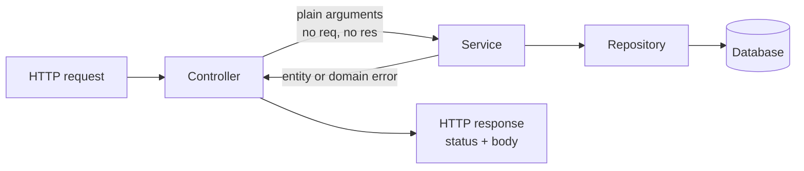
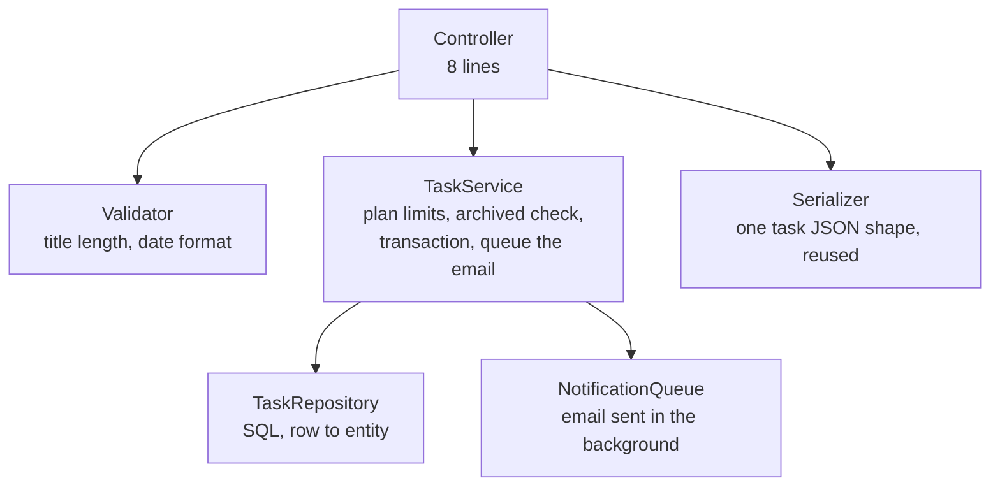
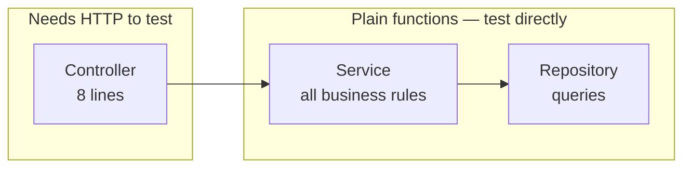
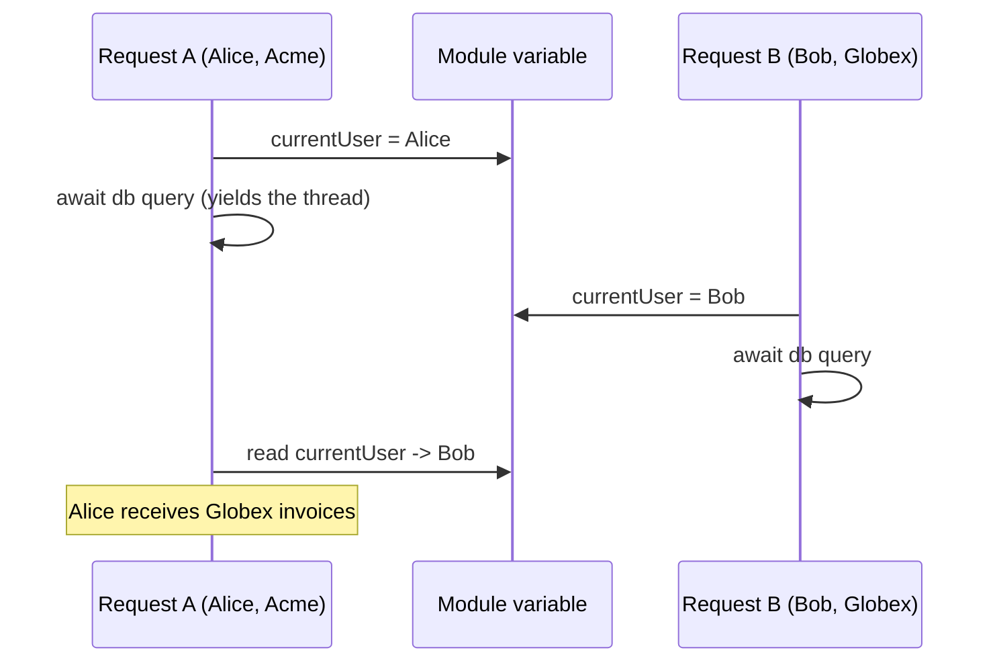

# Controllers and Request Context

A hotel receptionist does not cook your food, clean your room, or repair the
lift. A guest walks up and says "I would like dinner at eight". The
receptionist understands the request, calls the restaurant, and comes back
with "table booked, table 12". The receptionist is a **translator between the
guest and the people who actually do the work**.

A controller is that receptionist. It takes an HTTP request, turns it into a
call to your business logic, and turns the result back into an HTTP response.
It does not contain business rules. When it starts containing them, everything
downstream gets harder: testing, reuse, and reading the code at all.

> **📌 In one line:** A controller translates HTTP into a service call and the
> service result back into HTTP — nothing more.

## Table of Contents

1. [What a Controller Is For](#what-a-controller-is-for)
2. [The Centrepiece: A Fat Controller and Its Fix](#the-centrepiece-a-fat-controller-and-its-fix)
3. [Reading Input Safely](#reading-input-safely)
4. [Returning Responses](#returning-responses)
5. [The Request Context Object](#the-request-context-object)
6. [Typing the Authenticated User](#typing-the-authenticated-user)
7. [Passing Context Down with AsyncLocalStorage](#passing-context-down-with-asynclocalstorage)
8. [Thin Controllers and Testability](#thin-controllers-and-testability)
9. [Advanced: Request-Scoped State](#advanced-request-scoped-state)
10. [Common Mistakes](#common-mistakes)
11. [Questions to Test Yourself](#questions-to-test-yourself)
12. [Related](#related)

---

## What a Controller Is For



The controller owns exactly four small jobs:

| Job | Example |
|---|---|
| Read input from the HTTP request | `const { title, dueDate } = request.body` |
| Call one piece of business logic | `await taskService.create(projectId, input, actor)` |
| Choose a status code | `201` for created, `200` for updated, `204` for deleted |
| Shape the response body | `response.status(201).json(serializeTask(task))` |

And it must **not** own these:

| Not the controller's job | Where it belongs |
|---|---|
| Business rules ("a free plan may hold 10 projects") | Service — [service layer](../09-application-architecture/02-service-layer.md) |
| SQL or ORM query building | Repository — [repository pattern](../../software-engineering/design-patterns/repository-pattern.md) |
| Sending email or firing webhooks | Service, usually through a queue |
| Checking the input shape and types | Validator — [Part 4](../04-validation-and-input/) |
| Deciding the error body format | Error handler — [Part 7](../07-error-handling/) |

The test is one sentence: **could a queue worker or a CLI command trigger the
same behaviour without going through HTTP?** If yes, that behaviour belongs in
a service, not a controller.

---

## The Centrepiece: A Fat Controller and Its Fix

This is the single most common problem in real codebases. Here is a controller
that does everything itself.

```ts
// ❌ BROKEN — validation, rules, SQL, email and formatting all in one place
export class TaskController {
  async store(req: Request, res: Response): Promise<void> {
    const { title, dueDate, assigneeId } = req.body
    const projectId = req.params.projectId

    // 1. Validation, by hand
    if (!title || typeof title !== 'string' || title.trim().length < 3) {
      res.status(400).json({ message: 'Title must be at least 3 characters' })
      return
    }
    if (dueDate && new Date(dueDate).toString() === 'Invalid Date') {
      res.status(400).json({ message: 'Invalid due date' })
      return
    }

    // 2. Data access, by hand
    const project = await db.query('SELECT * FROM projects WHERE id = $1', [projectId])
    if (project.rows.length === 0) {
      res.status(404).json({ message: 'Project not found' })
      return
    }

    // 3. Business rules, by hand
    const company = await db.query('SELECT * FROM companies WHERE id = $1',
      [project.rows[0].company_id])
    const count = await db.query('SELECT count(*) FROM tasks WHERE project_id = $1',
      [projectId])
    if (company.rows[0].plan === 'free' && Number(count.rows[0].count) >= 50) {
      res.status(402).json({ message: 'Free plan allows 50 tasks per project' })
      return
    }
    if (project.rows[0].archived_at !== null) {
      res.status(409).json({ message: 'Cannot add tasks to an archived project' })
      return
    }

    // 4. Writing, by hand
    const inserted = await db.query(
      `INSERT INTO tasks (project_id, title, due_date, assignee_id, status)
       VALUES ($1, $2, $3, $4, 'open') RETURNING *`,
      [projectId, title.trim(), dueDate ?? null, assigneeId ?? null],
    )
    const task = inserted.rows[0]

    // 5. Side effects, by hand, blocking the response
    if (assigneeId) {
      await mailer.send({
        to: (await db.query('SELECT email FROM users WHERE id = $1', [assigneeId]))
          .rows[0].email,
        subject: `New task: ${task.title}`,
        body: `You were assigned "${task.title}" in ${project.rows[0].name}.`,
      })
    }

    // 6. Response formatting, by hand
    res.status(201).json({
      id: task.id, title: task.title, status: task.status,
      dueDate: task.due_date, assigneeId: task.assignee_id,
      createdAt: task.created_at,
    })
  }
}
```

### What is actually wrong with it

It works. That is why it survives code review. But look at what it costs:

| Problem | Consequence |
|---|---|
| Business rules live inside an HTTP handler | A CLI importer or a queue worker that creates tasks cannot reuse them — so the rules get copy-pasted, then drift |
| Testing needs fake `req` and `res` objects | Testing "free plan allows 50 tasks" requires building a whole HTTP request |
| Six separate queries, no transaction | A crash between the count and the insert leaves inconsistent state |
| Email send blocks the response | The user waits for the mail server; if it is down, task creation fails |
| Response shape hand-written here | Another endpoint returning a task will format it differently |
| The N+1 risk is invisible | See [n-plus-one-queries](../../databases/query-optimization/n-plus-one-queries.md) |

### The fixed controller

```ts
// ✅ FIXED — the controller only translates HTTP, in both directions
export class TaskController {
  constructor(private readonly tasks: TaskService) {}

  async store(ctx: HttpContext): Promise<void> {
    const input = await createTaskValidator.validate(ctx.request.body)   // shape + types
    const task = await this.tasks.create({
      projectId: ctx.request.params.projectId,
      input,
      actor: ctx.auth.user,          // attached earlier by auth middleware
    })
    ctx.response.status(201).json(serializeTask(task))
  }
}
```

Eight lines. Nothing was deleted — every rule still exists, it just moved to
the layer that owns it:



And now the rules are testable without HTTP:

```ts
// No server, no request object, no port. Just the rule.
it('rejects a 51st task on the free plan', async () => {
  const service = new TaskService(fakeRepo({ taskCount: 50, plan: 'free' }), fakeQueue())
  await expect(service.create({ projectId: 'p1', input, actor }))
    .rejects.toBeInstanceOf(PlanLimitExceededError)
})
```

> **📌 Remember:** If a controller is longer than about 15 lines, some other
> layer is missing.

---

## Reading Input Safely

A request carries data in four places. They have different trust levels and
different failure modes.

| Source | Example | Type you get | Trust |
|---|---|---|---|
| Route params | `/projects/:projectId` | Always `string` | None — user-controlled |
| Query string | `?status=open&page=2` | `string` or `string[]` | None — and a repeated key silently becomes an array |
| Body | JSON payload | Whatever `JSON.parse` produced: any shape | None — could be a 10 MB nested object |
| Headers | `authorization`, `x-company-id` | `string` or `undefined` | None — trivially forged by any client |

The rule is short: **none of them is trustworthy, ever.** Not the headers, not
the body, not the id in the path. Everything arriving over the network was
typed by someone you do not know.

```ts
// ❌ BROKEN — trusting the body's shape and the header's meaning
async store(ctx: HttpContext): Promise<void> {
  const body = ctx.request.body                      // shape is unknown
  const companyId = ctx.request.header('x-company-id')   // forgeable
  await this.tasks.create({ ...body, companyId })     // mass assignment risk
}
```

Two separate holes there. The spread copies **whatever** the client sent,
including fields like `status: 'done'` or `companyId` that the client must not
control — that is called mass assignment. And the company comes from a header
the client writes, so any user can claim to be in any company.

```ts
// ✅ FIXED — validate the body into a known type, derive identity from the session
async store(ctx: HttpContext): Promise<void> {
  const input = await createTaskValidator.validate(ctx.request.body)
  // input is now { title: string; dueDate?: Date; assigneeId?: string } — nothing else
  const task = await this.tasks.create({
    projectId: ctx.request.params.projectId,
    companyId: ctx.auth.user.companyId,   // from the verified session, never a header
    input,
    actor: ctx.auth.user,
  })
  ctx.response.status(201).json(serializeTask(task))
}
```

The validator does two jobs at once: it rejects bad input, and it narrows the
TypeScript type so the rest of the function knows exactly what it has. Why
that matters, and how to build the validation layer, is
[Part 4 — Validation & Input Handling](../04-validation-and-input/01-why-validation-matters.md).

> **⚠️ Warning:** `x-company-id`, `x-user-id`, and `x-role` headers sent by a
> browser client are worthless as identity. Anyone can set them with `curl`.
> Identity comes from a verified session or token only.

---

## Returning Responses

Consistency is worth more than cleverness here. A client written once should
keep working for every endpoint you add.

| Situation | Status | Body |
|---|---|---|
| Created a resource | `201` | The created resource, plus a `Location` header |
| Read or updated | `200` | The resource |
| Deleted, nothing to say | `204` | Empty — no body at all |
| Accepted for background work | `202` | A job id the client can poll |
| List endpoint | `200` | `{ data: [...], meta: { page, perPage, total } }` |

```ts
// One consistent envelope for lists, everywhere in the API.
async index(ctx: HttpContext): Promise<void> {
  const { page, perPage } = await listTasksValidator.validate(ctx.request.query)
  const result = await this.tasks.list(ctx.request.params.projectId, { page, perPage })

  ctx.response.status(200).json({
    data: result.items.map(serializeTask),
    meta: { page, perPage, total: result.total },
  })
}
```

Three habits that pay off:

- **One serializer per entity.** `serializeTask` lives in one file and is used
  by every endpoint that returns a task. Change the shape once, everywhere.
- **Never return the raw database row.** It leaks column names, internal flags
  and sometimes password hashes. A serializer is also a safety filter.
- **Never format errors in the controller.** Throw a typed error and let the
  error handler decide the status and body.

Status code details live in
[status codes](../01-http-foundations/04-status-codes.md); body shape and
pagination conventions in
[error response design](../02-rest-api-design/05-error-response-design.md) and
[pagination](../02-rest-api-design/03-pagination-filtering-sorting.md).

---

## The Request Context Object

The context (`ctx`) is the object your framework hands to middleware and
controllers. It holds everything true about **this one request**.

| Belongs on the context | Why |
|---|---|
| `requestId` | Every log line for this request needs it |
| `auth.user` | Who is calling, after the session was verified |
| `tenant` / `company` | Which customer's data this request may touch |
| `locale` and timezone | For formatting messages and dates |
| `startedAt` | So the logger can compute duration |

| Does NOT belong on the context | Why |
|---|---|
| An open database transaction nobody will commit | It holds a connection from the pool until it times out |
| Mutable application state (counters, caches) | It is per request; app state must live outside it |
| Anything the client sent unvalidated | Putting raw input on `ctx` makes it look trusted |
| Service instances built per request "just in case" | Wasteful, and hides real dependencies |

The healthy pattern: **middleware writes to the context, controllers read from
it.** Auth middleware sets `ctx.auth.user`; the controller reads it. If a
controller writes something onto `ctx` for a later layer to read, that is a
sign the data should have been a function argument instead.

---

## Typing the Authenticated User

A context that is loosely typed pushes the problem into every controller.

```ts
// ❌ BROKEN — untyped context, so nothing is checked
async show(ctx: { auth: { user: unknown } }): Promise<void> {
  const user = ctx.auth.user as { id: string; companyId: string }   // a lie
  // If auth middleware did not run, user is undefined and this crashes at runtime.
}
```

Casting with `as` tells the compiler to stop checking. It does not make the
value exist. Instead, describe the two real states — authenticated or not —
and let TypeScript narrow between them.

```ts
// ✅ FIXED — two states, and a guard the compiler understands
interface AuthenticatedUser {
  id: string
  email: string
  companyId: string
  role: 'owner' | 'admin' | 'member'
}

interface HttpContext {
  request: HttpRequest
  response: HttpResponse
  requestId: string
  user: AuthenticatedUser | null      // null until auth middleware runs
}

// A type guard: after this returns true, TypeScript knows ctx.user is not null.
function isAuthenticated(
  ctx: HttpContext,
): ctx is HttpContext & { user: AuthenticatedUser } {
  return ctx.user !== null
}
```

Now the controller cannot forget:

```ts
async show(ctx: HttpContext): Promise<void> {
  if (!isAuthenticated(ctx)) throw new UnauthorizedError('Login required')
  // From here on, ctx.user.companyId is typed, checked and safe.
  const project = await this.projects.findForCompany(
    ctx.request.params.id, ctx.user.companyId,
  )
  ctx.response.json(serializeProject(project))
}
```

The mechanics of type guards, discriminated unions and narrowing are covered
in [type-narrowing](../../typescript-fundamentals/type-narrowing/type-narrowing.md).

> **💡 Tip:** In practice you register the guard once as route middleware, so
> routes inside the authenticated group get a context type where `user` is
> never `null`. The compiler then enforces your routing decisions.

---

## Passing Context Down with AsyncLocalStorage

Here is a real problem. Your repository wants to include the request id in its
slow-query logs. The repository is called by a service, which is called by the
controller. Passing `ctx` down every signature pollutes three layers with an
HTTP concern.

`AsyncLocalStorage` solves it. Think of it as a labelled box that stays
attached to one request as it moves through every `await`. Code anywhere
inside that request can open the box. Other requests see their own box.

```ts
import { AsyncLocalStorage } from 'node:async_hooks'

interface RequestStore {
  requestId: string
  userId: string | null
}

export const requestStore = new AsyncLocalStorage<RequestStore>()
```

Middleware puts the values in the box for the whole downstream chain:

```ts
export const withRequestStore: Middleware = async (ctx, next) => {
  // Everything awaited inside run() — however deep — sees this same store.
  await requestStore.run(
    { requestId: ctx.requestId, userId: ctx.user?.id ?? null },
    () => next(),
  )
}
```

Any code, at any depth, reads it without being handed anything:

```ts
export function log(level: 'info' | 'error', message: string, extra = {}): void {
  const store = requestStore.getStore()      // undefined outside a request
  logger[level]({ ...extra, requestId: store?.requestId, userId: store?.userId }, message)
}

// Deep inside a repository, with no ctx parameter anywhere in sight:
if (durationMs > 200) log('info', 'slow query', { sql, durationMs })
```

### The honest trade-off

| Benefit | Cost |
|---|---|
| No `ctx` threaded through every function signature | The dependency is invisible — reading the repository does not reveal that it needs a store |
| Logging and tracing get request context for free | A unit test that calls the code outside `run()` gets `undefined` |
| Works across `await`, `setTimeout`, promise chains | Values can be missing in some callback styles and in worker threads |
| One place decides what is request-scoped | Overuse turns it into a global variable with extra steps |

The practical rule: **use it for cross-cutting observability — request id,
trace id, user id for logs.** Do not use it to pass business data. If your
service needs the current company to apply a rule, pass it as an argument.
That keeps the rule explicit and testable.

---

## Thin Controllers and Testability

This is the payoff for everything above.



With a fat controller, testing "the free plan allows 50 tasks" means booting
an HTTP server, creating a session, and sending a real request. That test is
slow, and it fails for a dozen reasons unrelated to the rule.

With a thin controller, the same rule is a plain function call with fake
dependencies. It runs in milliseconds and fails only when the rule breaks.

So you end up with a sensible test pyramid:

| Layer | Test type | Count | Speed |
|---|---|---|---|
| Service | Unit tests, fake repository | Many | Milliseconds |
| Repository | Integration tests, real test database | Some | Tens of milliseconds |
| Controller + routes | End-to-end HTTP tests on the important paths | Few | Hundreds of milliseconds |

The controller barely needs testing at all, because there is almost nothing in
it to break. That is the point. See
[unit testing](../13-testing-and-quality/02-unit-testing.md) for how to write
the service tests, and
[service layer](../09-application-architecture/02-service-layer.md) for how to
design the layer they test.

---

## Advanced: Request-Scoped State

### The dangerous mistake: module-level per-request data

This bug looks harmless and destroys data. Storing per-request values in a
module-level variable means **every concurrent request shares one variable**.

```ts
// ❌ BROKEN — one variable, shared by every request in the process
let currentUser: AuthenticatedUser | null = null

export const authenticate: Middleware = async (ctx, next) => {
  currentUser = await sessionService.resolve(ctx.request.header('authorization'))
  await next()
}

export class InvoiceController {
  async index(ctx: HttpContext): Promise<void> {
    // By the time this line runs, another request may have overwritten currentUser.
    const invoices = await this.invoices.listForCompany(currentUser!.companyId)
    ctx.response.json(invoices.map(serializeInvoice))
  }
}
```

It passes every test, because tests usually run one request at a time. Under
real concurrent traffic, this happens:



Remember from
[the event loop](../../typescript-fundamentals/event-loop/event-loop.md): one
thread interleaves requests at every `await`. The variable is not protected by
anything. This is a cross-tenant data leak — one of the most serious bugs a
multi-tenant SaaS can ship, and it is silent.

```ts
// ✅ FIXED — the value lives on the request, not on the module
export const authenticate: Middleware = async (ctx, next) => {
  ctx.user = await sessionService.resolve(ctx.request.header('authorization'))
  await next()
}

export class InvoiceController {
  async index(ctx: HttpContext): Promise<void> {
    if (!isAuthenticated(ctx)) throw new UnauthorizedError('Login required')
    const invoices = await this.invoices.listForCompany(ctx.user.companyId)
    ctx.response.json(invoices.map(serializeInvoice))
  }
}
```

`AsyncLocalStorage` is the other correct answer, because it gives each request
its own store rather than one shared slot.

> **⚠️ Warning:** The safe rule is simple. **A module-level `let` may hold
> application state (a connection pool, a config object). It must never hold
> request state (a user, a tenant, a request id).**

### Request-scoped dependency injection

Some dependencies genuinely need per-request values baked in: a logger already
carrying the request id, or a repository bound to one database transaction.

```ts
// Build the per-request objects once, in one place, and pass them down.
export const container: Middleware = async (ctx, next) => {
  const log = logger.child({ requestId: ctx.requestId, userId: ctx.user?.id })
  ctx.services = {
    tasks: new TaskService(new TaskRepository(db), notificationQueue, log),
    invoices: new InvoiceService(new InvoiceRepository(db), log),
  }
  await next()
}
```

Three scopes are worth naming clearly:

| Scope | Built | Examples |
|---|---|---|
| Singleton | Once at boot | Database pool, config, mail client, metrics registry |
| Request-scoped | Once per request | Child logger with request id, transaction-bound repository |
| Transient | Every time it is asked for | Short-lived value objects |

Keep singletons as the default. Building a fresh service object per request
costs allocations for no benefit unless it captures request state. The general
pattern and its trade-offs live in
[dependency-injection](../../software-engineering/principles/dependency-injection.md).

---

## Common Mistakes

| Mistake | Why it is wrong | Do this instead |
|---|---|---|
| Business rules inside the controller | Cannot be reused by a worker or CLI, and needs HTTP to test | Move them to a service; keep the controller translating |
| Storing per-request data in a module-level variable | Concurrent requests overwrite each other — a cross-tenant data leak | Put it on the context or in `AsyncLocalStorage` |
| Trusting `x-user-id` or `x-company-id` headers | Any client can forge them | Derive identity from the verified session only |
| Spreading `req.body` into a create call | Mass assignment: the client sets fields it must not control | Validate into an explicit typed object first |
| `ctx.user as AuthenticatedUser` | The cast silences the compiler without making the value exist | Use a type guard and handle the `null` case |
| Returning the raw database row | Leaks internal columns, and every endpoint formats differently | One serializer per entity |
| Awaiting an email send before responding | The user waits for a third party; an outage breaks the endpoint | Queue the side effect — [message queues](../../system-design/foundational/message-queues/overview.md) |
| Formatting error bodies in the controller | Error shapes drift apart across endpoints | Throw a typed error; the error handler formats it |
| Putting an uncommitted transaction on the context | Holds a pooled connection until it times out | Scope the transaction inside one service method |

---

## Questions to Test Yourself

1. Give the one-sentence rule for what a controller may contain, and use it to
   decide where "an archived project cannot receive new tasks" belongs.
2. The fat controller in this file "works". Name three concrete costs it
   creates that a passing test would not reveal.
3. Why is `ctx.user.companyId` safe to trust while an `x-company-id` header is
   not, when both arrive with the same request?
4. What is mass assignment, and which single line in the broken example
   creates it?
5. Draw the timeline for two concurrent requests hitting a controller that
   reads a module-level `currentUser`. At which exact moment does the wrong
   data get returned?
6. What does `AsyncLocalStorage` give you that passing `ctx` as an argument
   does not — and what does passing `ctx` give you that it does not?
7. Why does a thin controller make your business rules cheaper to test? Name
   the specific things a service test does not need to set up.
8. When is a request-scoped dependency actually justified, and why should
   singletons be the default?

---

## Related

- [Middleware](03-middleware.md) — how `ctx.user` and `ctx.requestId` get attached in the first place.
- [Anatomy of a Backend App](01-anatomy-of-a-backend-app.md) — where the controller sits in the pipeline.
- [Validation & Input Handling](../04-validation-and-input/01-why-validation-matters.md) — how the input becomes a trusted typed object.
- [Service Layer](../09-application-architecture/02-service-layer.md) — the layer the controller delegates to.
- [Unit Testing](../13-testing-and-quality/02-unit-testing.md) — testing the rules without HTTP.
- [type-narrowing](../../typescript-fundamentals/type-narrowing/type-narrowing.md) — making `ctx.user` typed instead of cast.
- [event-loop](../../typescript-fundamentals/event-loop/event-loop.md) — why shared module state breaks under concurrency.
- [dependency-injection](../../software-engineering/principles/dependency-injection.md) — wiring services with the right lifetime.
