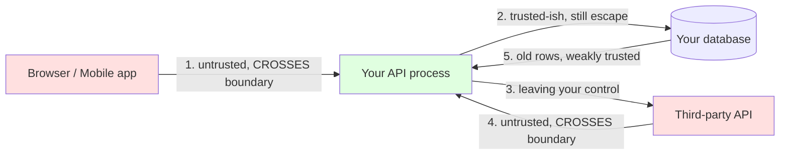
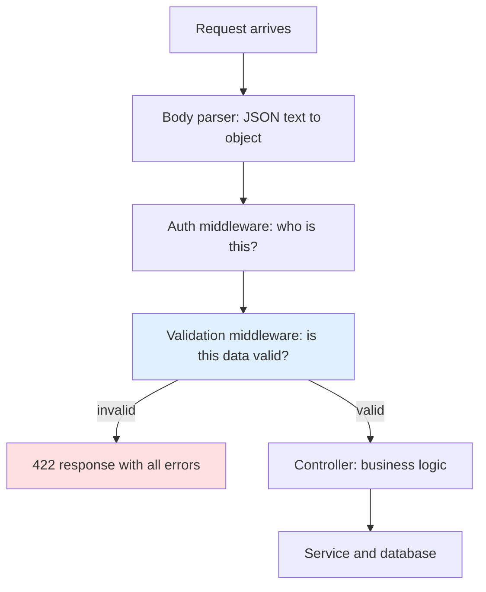

# Why Validation Matters

Think about a security guard at the front door of an office building. He does
not care that you look friendly. He checks your badge every single time, even
if you walked through that door yesterday. Validation is that guard: it stands
at the door of your server and checks every piece of data that tries to come
in. This file is about *why* that guard must exist.

> **📌 In one line:** Every byte arriving from outside your server process is a
> lie until you check it — including bytes sent by your own frontend.

## Table of Contents

1. [The One Rule](#the-one-rule)
2. [Why "The Frontend Already Validates It" Is Not Validation](#why-the-frontend-already-validates-it-is-not-validation)
3. [Trust Boundaries](#trust-boundaries)
4. [What Goes Wrong Without Validation](#what-goes-wrong-without-validation)
5. [Mass Assignment](#mass-assignment--the-bug-that-makes-users-admins)
6. [Where Validation Belongs in the Request Pipeline](#where-validation-belongs-in-the-request-pipeline)
7. [Validation vs Business Rules](#validation-vs-business-rules)
8. [The Three Layers of Defense](#the-three-layers-of-defense)
9. [Fail Fast, and Return All Errors at Once](#fail-fast-and-return-all-errors-at-once)
10. [Common Mistakes](#common-mistakes)
11. [Questions to Test Yourself](#questions-to-test-yourself)
12. [Related](#related)

---

## The One Rule

Here is the whole idea in one sentence:

**Data that comes from outside your server is untrusted input.** "Outside your
server" is bigger than most people think. It includes:

- The request body sent by your own React app.
- Query strings, route parameters, headers and cookies.
- Uploaded files, and their file names.
- Webhook payloads from Stripe, GitHub, or any other service, and the responses
  of third-party APIs you call.
- Environment variables and config files at boot time.
- Rows in your own database written by an older, buggier version of your code.

That last one surprises people. Your database is a source of truth about
*state*, not about *shape*. If a bug three months ago wrote
`invoice.amount = -400`, the database will happily hand that back today.

> **📌 Remember:** Trust is not about *who* sent the data. It is about whether
> your process can *prove* the data is correct.

---

## Why "The Frontend Already Validates It" Is Not Validation

This is the most common reason developers skip backend validation. The React
form has `required`, an email regex, and `min={0}` on the amount input. So the
data must be fine, right?

No. The form is a *suggestion*; the API is the *gate*. Your HTTP endpoint is a
public function — anyone who knows the URL can call it with anything.

### Proving it with curl

Imagine this React form for creating an invoice:

```tsx
<input name="amount" type="number" min={1} required />
<input name="customerEmail" type="email" required />
```

Here is a request that never touches that form:

```bash
curl -X POST https://api.yourapp.com/invoices \
  -H "Authorization: Bearer eyJhbGciOi..." \
  -H "Content-Type: application/json" \
  -d '{"amount": -50000, "customerEmail": "not-an-email",
       "status": "paid", "companyId": 7}'
```

Every rule the form enforced is gone:

| Form rule | What curl sent | Result if the API does not check |
|---|---|---|
| `min={1}` | `-50000` | A negative invoice — you owe the customer money |
| `type="email"` | `"not-an-email"` | Email sending fails days later |
| Field not in the form at all | `"status": "paid"` | Invoice marked paid without payment |
| Field not in the form at all | `"companyId": 7` | Invoice created inside another company |

The last two are the dangerous ones. The form could not send those fields, so
nobody thought about them. curl can send anything.

> **⚠️ Warning:** Copying a request as curl, editing it and replaying it is a
> right-click menu item in DevTools. It needs no special skill.

Frontend validation is not useless — it is just for *user experience*, not
*safety*. It gives an instant red message under the field instead of a round
trip. It is not a security control, because the attacker controls it.


## Trust Boundaries

A **trust boundary** is a line in your system. On one side someone else
controls the data; on the other side, you do. Every arrow crossing it needs a
check.



1. **Browser to API — validate.** Body, query, params, headers, cookies: all
   attacker-controlled.
2. **API to database — escape, do not re-validate.** The check happened at
   arrow 1. Here what matters is never building SQL by string concatenation —
   see [injection attacks](../11-api-security/02-injection-attacks.md).
3. **API to third party — your responsibility.** Forwarding unvalidated input
   to a payment provider makes their error your outage.
4. **Third party to API — validate.** A webhook body is just an HTTP request
   from the internet. Anyone can POST to your webhook URL.
5. **Database to API — weakly trusted.** Old rows may have shapes your current
   code does not expect.

> **💡 Tip:** When you review a pull request, find every arrow that crosses into
> your process and ask "where is the check?". If you cannot point at a line of
> code, the check does not exist.

---

## What Goes Wrong Without Validation

Four categories, each with a real example.

### 1. Crashes

The classic: reading a property of `undefined`.

```ts
// The controller assumes `project` exists in the body
async function createProject(req: Request, res: Response) {
  const name = req.body.project.name.trim(); // 💥
  // ...
}
```

Send `{}` and Node throws:
`TypeError: Cannot read properties of undefined (reading 'name')`.

At best that is a 500 error and a 3 AM alert. At worst it happens inside an
unhandled promise and kills the process, taking every in-flight request with
it. See
[error handling](../../typescript-fundamentals/error-handling/error-handling.md).

### 2. Corrupt data

Corrupt data is worse than a crash. A crash is loud; corrupt data is silent and
permanent.

```ts
// No check on amount
await Invoice.create({ amount: req.body.amount, companyId });
```

Send `amount: -4000`. The invoice list total, the revenue report and the
accountant's export are now all wrong, and nobody notices for six weeks.

Same story with an empty required name: `""` is a string, so a naive `typeof`
check passes. The sidebar then renders a row with no text, and support gets a
ticket saying "the app is broken".

### 3. Security holes

**Injection.** User input becomes part of a query or command. A `name` query
parameter of `' OR '1'='1` concatenated into SQL returns every project of every
company. The fix is parameterized queries — see
[injection attacks](../11-api-security/02-injection-attacks.md).

**Mass assignment.** The whole next section is about this one.

### 4. Confusing downstream bugs

These cost the most engineering time, because the symptom appears far away from
the cause — in both code and time. A user signs up with the email
`"  Afsar@Example.COM "`, with spaces. No validation, no trimming.

```text
Day 0   POST /register  →  user row saved with email "  Afsar@Example.COM "
Day 0   Welcome email  →  SMTP provider rejects the address, job retries, dies
Day 3   User tries to log in with "afsar@example.com"  →  "user not found"
Day 3   Support opens a ticket: "login is broken"
Day 4   Engineer spends 3 hours reading auth code, which is correct
Day 4   Engineer finally looks at the raw row and sees the spaces
```

The auth code was never the bug. The bug was admitted at the door on day 0.

> **📌 Remember:** Bad data travels. The further it gets before you notice, the
> more expensive it becomes.

---

## Mass Assignment — The Bug That Makes Users Admins

This is the single most important example in this file. Read it twice.

**Mass assignment** means taking a whole object of user input and handing it
straight to your model or ORM (Object-Relational Mapper — the library that turns
database rows into objects). The word "mass" means "all fields at once".

### The broken version

```ts
// ❌ BROKEN — every key the attacker sends becomes a column value
export async function register(req: Request, res: Response) {
  const user = await User.create(req.body);
  return res.status(201).json(user);
}
```

This looks clean, and it works perfectly in testing, because the signup form
only sends `name`, `email` and `password`. Now the attacker sends this:

```bash
curl -X POST https://api.yourapp.com/register \
  -H "Content-Type: application/json" \
  -d '{
        "name": "Afsar",
        "email": "afsar@example.com",
        "password": "correct-horse-battery",
        "role": "admin",
        "isVerified": true,
        "companyId": 1,
        "creditBalance": 999999
      }'
```

Your ORM writes every key it recognises as a column. The attacker is now an
admin of company 1, already verified, with a large credit balance. No password
was cracked. Your own code did it, on request.

Hiding the field name does not help. If any endpoint returns a user object
containing `"role": "member"`, your own responses have published the field name.

### The fixed version — allow-list

The fix is to name the fields you accept, explicitly, one by one.

```ts
// ✅ FIXED — only these four keys can ever reach the database
export async function register(req: Request, res: Response) {
  const { name, email, password } = req.body as Record<string, unknown>;

  const parsed = registerSchema.parse({ name, email, password });

  const user = await User.create({
    name: parsed.name,
    email: parsed.email,
    password: await hash(parsed.password),
    role: "member",      // set by the server, never by the client
    isVerified: false,   // set by the server, never by the client
  });

  return res.status(201).json({ id: user.id, name: user.name });
}
```

Three things changed: only three keys are read from the body, `role` and
`isVerified` are decided by server logic, and a schema checks the three allowed
fields. The next file shows that a schema does the picking *and* the checking
together, because its parsed output contains only the keys it declares.

> **⚠️ Warning:** Allow-list, never deny-list. A deny-list (`delete body.role`)
> fails the day someone adds a new sensitive column and forgets the list. An
> allow-list fails safe: the new column is simply not accepted.

| Approach | New sensitive column added | Result |
|---|---|---|
| Deny-list (`delete body.role`) | Nobody updates the list | Column is writable by anyone |
| Allow-list (`pick name, email`) | Nobody updates the list | Column is not writable at all |

## Where Validation Belongs in the Request Pipeline

Validation goes **after the body is parsed** and **before the controller runs**.



**After parsing**, because you cannot validate a JSON string — you validate the
object it produced. **Before the controller**, so controller code can assume the
data is already correct. A controller full of `if (!body.name) return 400` is a
controller nobody can read.

Validation is normally a middleware, so the ordering rules in
[middleware](../03-request-lifecycle/03-middleware.md) are what make this work.
Auth runs *before* validation: if the caller is not allowed in at all, do not
spend CPU validating a 2 MB body from them.


## Validation vs Business Rules

These two look similar and people mix them up constantly. They are not the same
thing, and they do not live in the same place.

| | Validation | Business rule |
|---|---|---|
| Question it answers | Is this data *shaped* correctly? | Is this action *allowed right now*? |
| Needs a database? | No | Usually yes |
| Example | "email must be a string in email format" | "this email is already registered" |
| Example | "amount must be a positive number" | "this company's plan allows only 5 projects" |
| Lives in | A schema, in validation middleware | A service method |
| Status code | `422 Unprocessable Entity` | `409 Conflict` or `403 Forbidden` |

### Why the second one cannot live in a schema

"This email is already registered" requires a `SELECT`. That makes it **async**
(it hits the network or disk) and **not deterministic** (the same input gives a
different answer one second later, after someone else registers). It is also
not really about shape — the data is perfectly well-formed.

A schema that does database calls is hard to reuse too. You cannot run it
against a webhook, a seed script, or a unit test without a live database.

```ts
// Validation — pure, fast, no I/O
const schema = z.object({ email: z.string().email(), password: z.string().min(12) });

// Business rule — lives in the service, needs the DB
async function registerUser(input: RegisterInput) {
  const existing = await usersRepo.findByEmail(input.email);
  if (existing) throw new ConflictError("EMAIL_TAKEN", "Email already registered.");
  return usersRepo.create(input);
}
```

Business rules belong in the
[service layer](../09-application-architecture/02-service-layer.md).

> **💡 Tip:** A uniqueness check in the service is still a race — two requests
> can both read "not taken" at the same moment. The unique index is what
> actually guarantees it. Catch the violation and return the same 409.

---

## The Three Layers of Defense

You need all three. They catch different things and they fail in different ways.

```text
┌──────────────────────────────────────────────────────────┐
│  Layer 1 — Client side (React form): fast feedback only   │
├──────────────────────────────────────────────────────────┤
│  Layer 2 — API validation (schema middleware) ← THE GATE  │
├──────────────────────────────────────────────────────────┤
│  Layer 3 — DB constraints (NOT NULL, CHECK, UNIQUE)       │
└──────────────────────────────────────────────────────────┘
```

| Layer | Catches | Misses | Why you still need it |
|---|---|---|---|
| Client | Typos, empty fields, obvious format errors | Anything sent by curl, Postman, a mobile app, or a script | Users get an answer in 0 ms instead of 200 ms |
| API validation | Everything a request can send: wrong types, missing fields, extra fields, bad ranges | Data written by migrations, seeds, admin scripts, or another service writing to the same DB | It is the only layer the attacker cannot skip |
| Database | Anything that reaches the DB from any source, including your own scripts | Cannot give a friendly message; fails with a raw error and a 500 | It is the only layer that is *always* enforced |

A concrete case for layer 3: six months from now you write a one-off script to
import invoices from a CSV file. It skips your API and its middleware entirely.
A `CHECK (amount > 0)` constraint stops the bad row anyway. Constraints live in
[migrations](../10-database-integration/02-migrations.md).

```sql
-- Layer 3: written once, enforced forever, from every source
ALTER TABLE invoices ADD CONSTRAINT invoices_amount_positive CHECK (amount > 0);
ALTER TABLE users ADD CONSTRAINT users_email_unique UNIQUE (email);
```

> **⚠️ Warning:** Never rely on the database as your *only* validation. A raw
> `duplicate key value violates unique constraint "users_email_unique"` sent to
> a user is a bad API, and it leaks your schema.

---

## Fail Fast, and Return All Errors at Once

Two rules that sound opposite but work together. **Fail fast**: stop at the
first sign the request cannot succeed — do not open a transaction, call Stripe,
and then discover the email is missing. **Return all errors at once**: when you
reject, tell the user everything that is wrong, not just the first problem.

```ts
// ❌ BROKEN — user fixes one field, submits, gets the next error, repeat
if (!body.name) return res.status(422).json({ error: "name is required" });
if (!body.email) return res.status(422).json({ error: "email is required" });
if (!body.password) return res.status(422).json({ error: "password required" });
```

That is a three-round-trip form. Users hate it, and rightly so.

```ts
// ✅ FIXED — one pass, every problem reported together
const result = createUserSchema.safeParse(req.body);

if (!result.success) {
  return res.status(422).json({
    error: {
      code: "VALIDATION_FAILED",
      message: "Some fields are invalid.",
      // one entry per bad field, so the UI can place each message
      details: result.error.issues.map((i) => ({
        field: i.path.join("."),
        message: i.message,
      })),
    },
  });
}
```

The shape matters: the frontend puts each message under the right input box, so
it needs a machine-readable `field`. The envelope format is its own topic —
[error response design](../02-rest-api-design/05-error-response-design.md).

The rules do not conflict: fail fast at the *request* level, be thorough at the
*field* level.

> **📌 Remember:** Fail fast means "reject before you do work", not "stop at the
> first bad field".

---

## Common Mistakes

| Mistake | Why it is wrong | Do this instead |
|---|---|---|
| Trusting a request because it came from your own frontend | The frontend runs on the attacker's machine | Validate every request the same way |
| `Model.create(req.body)` | Mass assignment: any column becomes writable | Pick fields explicitly, or use a schema's parsed output |
| Deny-listing sensitive fields (`delete body.role`) | Fails open when a new sensitive column is added | Allow-list the fields you accept |
| Returning the first validation error only | Forces the user through several round trips | Collect all issues and return them together |
| Putting "email already taken" in the schema | Needs I/O, is not deterministic, breaks schema reuse | Keep it in the service layer as a business rule |
| Skipping database constraints because the API validates | Scripts, seeds and migrations bypass the API entirely | Add `NOT NULL`, `CHECK`, `UNIQUE` in migrations too |
| Validating only the body | Query strings, params, headers and files are input too | Validate every input surface |

---

## Questions to Test Yourself

1. Your form has `min={1}` on the amount field. Explain how someone sends
   `amount: -50000` to your API anyway.
2. Why is a deny-list (`delete req.body.role`) a worse fix for mass assignment
   than an allow-list, even though both work today?
3. Both "email must be in email format" and "email is already registered"
   reject a request. Why does only one belong in a schema?
4. You validate every request in the API. Give a concrete situation where a bad
   row still reaches the database, and name the layer that stops it.
5. Why does validation run after the body parser but before the controller?
   What breaks if you move it after the controller?
6. "Fail fast" and "return all errors at once" sound contradictory. Why are
   they not?
7. A user reports "login is broken" and the auth code is correct. Explain how a
   missing `trim()` at registration three days earlier caused it.

---

## Related

- [Middleware](../03-request-lifecycle/03-middleware.md) — the chain that
  validation plugs into, and why its position matters.
- [Schema validation](02-schema-validation.md) — next file: how to write the
  checks this file argues for.
- [Sanitization and normalization](03-sanitization-and-normalization.md) — what
  to do with data that is valid but inconsistent.
- [Error response design](../02-rest-api-design/05-error-response-design.md) —
  the shape of the 422 body validation failures return.
- [Service layer](../09-application-architecture/02-service-layer.md) — where
  business rules like uniqueness checks belong.
- [Migrations](../10-database-integration/02-migrations.md) — where the last
  line of defense, database constraints, is written.
- [Injection attacks](../11-api-security/02-injection-attacks.md) — what
  unvalidated input does inside a query or a shell.
- [`unknown` vs `any`](../../typescript-fundamentals/unknown-any/unknown-any.md)
  — the type that forces you to check external data before using it.
