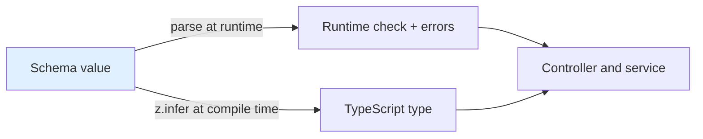
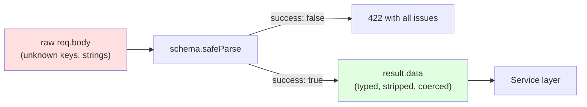
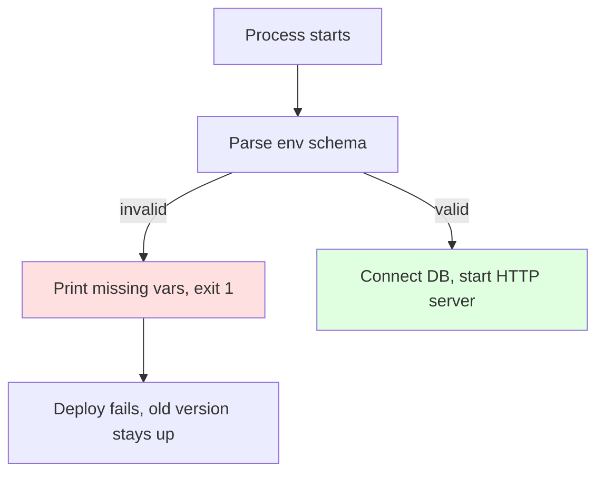

# Schema Validation

At an airport immigration desk, the officer does not invent new questions for
every traveller. He has one printed checklist: passport valid, photo matches,
visa present, dates correct. It is written once and applied to everyone. A
**schema** is that checklist, written in code — the tool that makes checking
cheap enough that you always do it.

> **📌 In one line:** Write the shape of your input once as data, then let a
> library turn it into runtime checks, error messages, and a TypeScript type.

## Table of Contents

1. [What a Schema Is](#what-a-schema-is)
2. [Why Schemas Beat Hand-Written Checks](#why-schemas-beat-hand-written-checks)
3. [Building a Real Schema, Step by Step](#building-a-real-schema-step-by-step)
4. [Type Inference: One Source of Truth](#type-inference-one-source-of-truth)
5. [Zod and VineJS](#zod-and-vinejs)
6. [Parsing vs Validating](#parsing-vs-validating)
7. [Coercion: Everything in a URL Is a String](#coercion-everything-in-a-url-is-a-string)
8. [Custom and Cross-Field Rules](#custom-and-cross-field-rules)
9. [Composing and Reusing Schemas](#composing-and-reusing-schemas)
10. [Validating Things That Are Not the Body](#validating-things-that-are-not-the-body)
11. [Advanced Concerns](#advanced-concerns)
12. [Common Mistakes](#common-mistakes)
13. [Questions to Test Yourself](#questions-to-test-yourself)
14. [Related](#related)

---

## What a Schema Is

A **schema** is a description of the shape and rules of a piece of data,
written as a value in your program. "Shape" means which keys exist, what type
each one is, and whether it is required. "Rules" means the extra conditions: a
minimum length, a range, a set of allowed values, a format.

```ts
import { z } from "zod";

const createTaskSchema = z.object({
  title: z.string().min(1).max(200),
  projectId: z.string().uuid(),
  priority: z.enum(["low", "medium", "high"]),
  dueDate: z.coerce.date().optional(),
});
```

Read it out loud: "a task has a title of 1 to 200 characters, a projectId that
is a UUID, a priority that is one of three words, and an optional dueDate."

The important part is that this is **data, not control flow**. Because it is a
value you can export it, extend it, pass it to a middleware, and reuse it in a
test. A pile of `if` statements can do none of those things.

---

## Why Schemas Beat Hand-Written Checks

Here is the same validation twice. First by hand:

```ts
// ❌ BROKEN — long, incomplete, and inconsistent
function validateTask(body: Record<string, unknown>) {
  const errors: string[] = [];
  if (typeof body.title !== "string") errors.push("title must be a string");
  else if (body.title.length === 0) errors.push("title is required");
  else if (body.title.length > 200) errors.push("title too long");
  if (typeof body.projectId !== "string") errors.push("projectId must be text");
  if (body.priority !== "low" && body.priority !== "medium" &&
      body.priority !== "high") errors.push("bad priority");
  if (body.dueDate !== undefined && isNaN(Date.parse(String(body.dueDate)))) {
    errors.push("dueDate invalid");
  }
  return errors;
}
```

Twenty lines, and still incomplete. `projectId` is checked for "string" but not
for UUID format. The messages use three different styles. There is no
TypeScript type at the end — the caller still holds `Record<string, unknown>`.
And when someone adds `estimateHours` to the model next month, nothing here
reminds them to check it. The schema version does more in eight lines:

```ts
// ✅ FIXED — eight lines, stricter, and it produces a type
const createTaskSchema = z.object({
  title: z.string().min(1).max(200),
  projectId: z.string().uuid(),
  priority: z.enum(["low", "medium", "high"]),
  dueDate: z.coerce.date().optional(),
});

type CreateTaskInput = z.infer<typeof createTaskSchema>;
```

| | Hand-written `if` chain | Schema |
|---|---|---|
| Lines for this example | ~20 | ~8 |
| Forgetting a field | Silent | Unknown keys dropped or rejected |
| Error message style | Different in every function | Identical everywhere |
| TypeScript type | Written again by hand | Derived automatically |
| Reuse in tests or scripts | Copy and paste | Import the schema |

> **💡 Tip:** The strongest argument is the type row. A hand-written check plus
> a hand-written `interface` are two sources of truth. They drift apart, and the
> compiler cannot see it.

---

## Building a Real Schema, Step by Step

Take a real endpoint, `POST /projects`, one requirement at a time.

**Required strings.** A name that must exist and must not be empty:

```ts
const base = z.object({
  name: z.string().trim().min(1, "Project name is required").max(120),
});
```

Note `.trim()` before `.min(1)`. Without it a name of `"   "` passes. Rules run
left to right, so order matters.

**Optional fields and defaults.** These are different things:

```ts
const withDescription = base.extend({
  description: z.string().max(2000).optional(),  // may be missing -> undefined
  isArchived: z.boolean().default(false),        // may be missing -> false
});
```

**Numbers with ranges.** Be explicit about integers and signs:

```ts
const withBudget = withDescription.extend({
  budgetCents: z.number().int().nonnegative().max(100_000_000),
  memberLimit: z.number().int().min(1).max(500).default(10),
});
```

`z.number()` accepts `3.7` and `-2`. Money in cents must be `.int()` and
`.nonnegative()`, or you get the negative-invoice bug from the previous file.

**Enums and dates.** An enum is a fixed list of allowed values:

```ts
const withStatus = withBudget.extend({
  status: z.enum(["planning", "active", "on_hold", "done"]),
  startDate: z.coerce.date(),
  endDate: z.coerce.date().optional(),
});
```

**Nested objects and arrays of objects.** Schemas compose:

```ts
const memberSchema = z.object({
  userId: z.string().uuid(),
  role: z.enum(["owner", "editor", "viewer"]),
});

export const createProjectSchema = withStatus.extend({
  settings: z.object({
    notifyOnTaskDone: z.boolean().default(true),
    weeklyDigest: z.boolean().default(false),
  }),
  members: z.array(memberSchema).min(1).max(50),
});
```

`.min(1)` means "at least one member". `.max(50)` is not a business rule — it
is a size limit that protects you from a request carrying 500,000 members. More
on limits in [sanitization](03-sanitization-and-normalization.md).

---

## Type Inference: One Source of Truth

This is the feature that changes how you write backend code.

```ts
type CreateProjectInput = z.infer<typeof createProjectSchema>;
// {
//   name: string; description?: string; isArchived: boolean;
//   budgetCents: number; memberLimit: number;
//   status: "planning" | "active" | "on_hold" | "done";
//   startDate: Date; endDate?: Date;
//   settings: { notifyOnTaskDone: boolean; weeklyDigest: boolean };
//   members: { userId: string; role: "owner" | "editor" | "viewer" }[];
// }
```

You wrote the rules once and got the runtime check *and* the compile-time type
from them. They cannot drift apart, because one is generated from the other.



Compare with the version everybody has written:

```ts
// ❌ BROKEN — the interface and the check are maintained separately
interface CreateProjectInput { name: string; budgetCents: number; }
function check(body: unknown) { /* ...forgets budgetCents... */ }
```

Add a field to the interface and the check still compiles. Add a rule to the
check and the interface still compiles. Nothing fails until production.

The type machinery behind `z.infer` is explained in
[generics](../../typescript-fundamentals/generics/generics.md). Why the input
starts as `unknown` and not `any` is explained in
[`unknown` vs `any`](../../typescript-fundamentals/unknown-any/unknown-any.md) —
a schema is the "prove it before you use it" step that `unknown` demands.

---

## Zod and VineJS

Zod is the most common schema library in the TypeScript world. AdonisJS ships
its own, **VineJS**, with the same idea and different spelling:

```ts
// VineJS — AdonisJS's built-in validator (shape only; check your version's docs)
import vine from "@vinejs/vine";

const createProjectValidator = vine.compile(
  vine.object({
    name: vine.string().trim().minLength(1).maxLength(120),
    status: vine.enum(["planning", "active", "on_hold", "done"]),
    memberLimit: vine.number().min(1).max(500),
  })
);
```

| Idea | Zod | VineJS |
|---|---|---|
| Object | `z.object({...})` | `vine.object({...})` |
| Min length | `.min(1)` | `.minLength(1)` |
| Optional | `.optional()` | `.optional()` |
| Run it | `schema.parse(data)` | `validator.validate(data)` |
| Type | `z.infer<typeof s>` | `Infer<typeof s>` |

> **💡 Tip:** Learn the *concepts* here, not one library's method names. Every
> validator has objects, primitives, optionality, refinements and inference. The
> exact API changes between major versions — check your version's docs.

---

## Parsing vs Validating

This distinction is small to say and large in effect.

- **Validating** answers a yes/no question: is this data acceptable?
- **Parsing** answers it *and hands you back a new value* — coerced to the right
  types, defaults filled in, unknown keys removed.

Always use the parsed output. Never touch the raw body again.

```ts
// ❌ BROKEN — validates, then uses the RAW body anyway
const result = createProjectSchema.safeParse(req.body);
if (!result.success) return res.status(422).json(toErrorBody(result.error));

const project = await Project.create(req.body); // raw body: every extra key
```

The check passed, so this feels safe. It is not. `req.body` still contains
`ownerId`, `isVerified`, `createdAt`, or whatever else the attacker added. You
just validated one object and saved a different one.

```ts
// ✅ FIXED — use result.data: only declared keys, correct types, defaults applied
const result = createProjectSchema.safeParse(req.body);
if (!result.success) return res.status(422).json(toErrorBody(result.error));

const project = await projectService.create(result.data, req.user.companyId);
```

`result.data` cannot contain a key the schema did not declare. That is
mass-assignment protection for free — you do not have to remember to strip
anything, because nothing undeclared ever made it through.



> **⚠️ Warning:** Most validators *strip* unknown keys by default. Some let you
> *reject* them instead (`.strict()` in Zod). Rejecting is better for internal
> APIs, because a typo like `discription` fails loudly instead of silently doing
> nothing. Stripping is friendlier for public APIs that must tolerate clients
> sending extra fields.

---

## Coercion: Everything in a URL Is a String

HTTP has no types. A URL is text. So for `GET /projects?page=2&active=true`:

```ts
req.query.page   // "2"     — a string, not the number 2
req.query.active // "true"  — a string, not the boolean true
```

The same applies to `application/x-www-form-urlencoded` form posts and to route
parameters like `/projects/:id`. Only a JSON body has real types.

Here is the bug this causes:

```ts
// ❌ BROKEN — string arithmetic
const page = req.query.page;        // "2"
const nextPage = page + 1;          // "21"  ← string concatenation
const offset = (page - 1) * 20;     // 20    ← "-" coerces, "+" does not
```

`"2" + 1 === "21"` but `"2" - 1 === 1`. JavaScript's `+` means "add or join"
and picks joining when either side is a string. This rule and its friends are
covered in
[equality and coercion](../../typescript-fundamentals/equality-and-coercion/equality-and-coercion.md).

Let the schema do the conversion, at the edge, once:

```ts
// ✅ FIXED — coerce in the schema, then the type is really a number
const listProjectsQuery = z.object({
  page: z.coerce.number().int().min(1).default(1),
  perPage: z.coerce.number().int().min(1).max(100).default(20),
  active: z.coerce.boolean().optional(),
  search: z.string().trim().max(100).optional(),
});

const query = listProjectsQuery.parse(req.query); // page: number, not string
```

> **⚠️ Warning:** Coercion is looser than parsing. `z.coerce.boolean()` follows
> JavaScript truthiness, so the string `"false"` becomes `true`. For query flags
> prefer an explicit mapping: `z.enum(["true","false"]).transform(v => v === "true")`.

Note also the `.max(100)` on `perPage`. Without it, `?perPage=1000000` becomes a
database query that reads a million rows. See
[pagination performance](../../databases/query-optimization/pagination-performance.md).

---

## Custom and Cross-Field Rules

Some rules involve more than one field. A single field's schema cannot see its
siblings, so these run after the object is built.

```ts
export const createProjectSchema = withStatus
  .extend({ members: z.array(memberSchema).min(1) })
  .refine((data) => !data.endDate || data.endDate > data.startDate, {
    message: "endDate must be after startDate",
    path: ["endDate"], // attach the error to the right input box
  });
```

The `path` matters. Without it the error is attached to the whole object and
your frontend cannot show it under the correct field.

The same pattern for a password confirmation:

```ts
export const changePasswordSchema = z
  .object({
    currentPassword: z.string().min(1),
    newPassword: z.string().min(12, "Use at least 12 characters"),
    confirmPassword: z.string(),
  })
  .refine((d) => d.newPassword === d.confirmPassword, {
    message: "Passwords do not match",
    path: ["confirmPassword"],
  })
  .refine((d) => d.newPassword !== d.currentPassword, {
    message: "New password must be different",
    path: ["newPassword"],
  });
```

Two separate `.refine()` calls, not one combined condition. Each produces its
own message, so the user learns exactly what is wrong.

> **💡 Tip:** Keep refinements **pure**. No database calls, no `fetch`, no clock
> reads that change behaviour. A schema you can run in a unit test with no
> setup is a schema people actually reuse.

---

## Composing and Reusing Schemas

Create and update endpoints share almost everything. Write the shared part once.

```ts
const projectFields = z.object({
  name: z.string().trim().min(1).max(120),
  description: z.string().max(2000).optional(),
  status: z.enum(["planning", "active", "on_hold", "done"]),
  budgetCents: z.number().int().nonnegative(),
});

export const createProjectSchema = projectFields;

// PATCH: every field optional, because the client sends only what changed
export const updateProjectSchema = projectFields.partial();
```

Why is the update schema usually "create with everything optional"? Because
`PATCH` means "change these fields and leave the rest alone". If the update
schema required `name`, every client would have to re-send the current name just
to change the status.

Two things must **not** become optional:

1. **`id`** — it comes from the route (`/projects/:id`), not the body. Never
   read an id from the body for an update: a client could send a different id
   and edit someone else's row.
2. **Server-controlled fields** — `companyId`, `ownerId`, `createdAt`. They must
   not be in the schema at all.

```ts
// ❌ BROKEN — the body decides which row to update
await Project.query().where("id", req.body.id).update(data);

// ✅ FIXED — the route decides the row, the schema decides the fields
const { id } = routeParamsSchema.parse(req.params);
await projectService.update(id, data, req.user.companyId);
```

A `.partial()` update schema also needs one more guard: reject an empty body, or
you will run an `UPDATE` with no columns.

```ts
export const updateProjectSchema = projectFields
  .partial()
  .refine((d) => Object.keys(d).length > 0, { message: "Send at least one field" });
```

---

## Validating Things That Are Not the Body

The body is one input surface out of five. Validate all of them.

| Surface | Example | Typical schema |
|---|---|---|
| Route params | `/projects/:id` | `z.object({ id: z.string().uuid() })` |
| Query string | `?page=2&status=active` | coerced numbers, enums, defaults |
| Headers | `Idempotency-Key`, `Accept-Language` | strings with format and length limits |
| Body | JSON payload | the schemas above |
| Environment | `DATABASE_URL`, `PORT` | validated once at boot |

A middleware can take all of them at once:

```ts
export function validate(schemas: {
  body?: z.ZodTypeAny; query?: z.ZodTypeAny; params?: z.ZodTypeAny;
}) {
  return (req: Request, res: Response, next: NextFunction) => {
    const parsed = {
      body: schemas.body?.safeParse(req.body),
      query: schemas.query?.safeParse(req.query),
      params: schemas.params?.safeParse(req.params),
    };
    // collect every failure, respond once with all of them
    const issues = collectIssues(parsed);
    if (issues.length > 0) return res.status(422).json(toErrorBody(issues));

    req.valid = unwrap(parsed); // typed, parsed data for the controller
    next();
  };
}
```

Note `req.valid`. Do not overwrite `req.body` with parsed data — later
middleware may expect the original, and the type of `req.body` in your framework
is usually fixed. Put parsed data on its own property.

### Environment variables at boot

This is the highest-value five minutes you will ever spend.

```ts
// config/env.ts — runs once, at import time, before the server listens
const envSchema = z.object({
  NODE_ENV: z.enum(["development", "test", "production"]),
  PORT: z.coerce.number().int().min(1).max(65535).default(3333),
  DATABASE_URL: z.string().url(),
  REDIS_URL: z.string().url(),
  JWT_SECRET: z.string().min(32, "JWT_SECRET must be at least 32 chars"),
  SMTP_FROM: z.string().email(),
});

export const env = envSchema.parse(process.env); // throws here, or never
```

Without this, a missing `JWT_SECRET` is `undefined`. The app starts, serves
traffic, and fails at 2 AM on the first login attempt — or worse, signs tokens
with the string `"undefined"`. With this, the deploy fails in ten seconds and
the old version keeps running.



Which secrets exist and how they reach the process is covered in
[secrets and configuration](../11-api-security/05-secrets-and-configuration.md).

---

## Advanced Concerns

### Where async validation belongs

Schema libraries support async refinements. Use them rarely, and never for
uniqueness.

| Rule | Put it in a schema? | Why |
|---|---|---|
| "email format is valid" | Yes | Pure, instant, deterministic |
| "email is not already taken" | No | Needs the DB; racy; the unique index is the real guard |
| "projectId exists and belongs to my company" | No | It is authorization, not shape |
| "country code is in our static list" | Yes | The list is a constant in code |

An async refinement also turns `parse` into `parseAsync` everywhere, and it
makes the schema unusable in a test without a database.

### Validating third-party responses and webhooks

Your own schemas work just as well on data coming *in* from outside:

```ts
const stripeInvoicePaid = z.object({
  id: z.string(),
  type: z.literal("invoice.payment_succeeded"),
  data: z.object({
    object: z.object({
      id: z.string(),
      amount_paid: z.number().int().nonnegative(),
      customer: z.string(),
    }),
  }),
});

const event = stripeInvoicePaid.parse(await verifiedWebhookBody(req));
```

Two reasons this matters. First, a webhook URL is public — anyone can POST to
it, so signature verification *and* shape validation are both required. Second,
providers add and change fields; a schema tells you the shape changed, in a log
line, instead of a `TypeError` three functions deeper.

The same applies to any `fetch` to a partner API. Its response is untrusted
input, exactly like a request body.

### Performance on large payloads

Validation cost is roughly proportional to the number of fields parsed. For
normal request bodies it is microseconds and you should never think about it.
It matters in three cases:

1. **Huge arrays.** A bulk import with 50,000 rows means 50,000 object parses,
   all on the single thread that also serves every other request. See
   [event loop](../../typescript-fundamentals/event-loop/event-loop.md).
2. **Deeply nested structures.** Cost multiplies with depth.
3. **Regex rules.** A careless pattern can take exponential time on a crafted
   string (a "ReDoS" — Regular expression Denial of Service).

Practical answers: cap array length in the schema, cap the request body size at
the proxy and the framework, process bulk imports as a background job rather
than inside the request, and prefer built-in format checks over hand-written
regexes.

> **📌 Remember:** Compile or build schemas once at module load, not inside the
> request handler. Rebuilding a schema per request is pure waste.

---

## Common Mistakes

| Mistake | Why it is wrong | Do this instead |
|---|---|---|
| Validating, then using `req.body` | The raw body still holds every extra key | Use the parsed output only |
| Writing an `interface` next to the schema | Two sources of truth that drift | Derive the type with `z.infer` |
| Forgetting `.trim()` before `.min(1)` | `"   "` passes as a non-empty string | Trim first, then measure |
| Treating `req.query.page` as a number | It is always a string; `+` concatenates | Coerce in the schema |
| Reading the record id from the body | A client can point the update at another row | Take the id from the route params |
| Uniqueness checks inside the schema | Needs I/O, is racy, breaks reuse | Service layer plus a DB unique index |
| No `.max()` on arrays or `perPage` | One request can read or allocate unbounded data | Cap every list and every page size |
| No env validation at boot | The app starts broken and fails much later | Parse `process.env` at import time |
| Building the schema inside the handler | Rebuilt on every request for no reason | Build once at module scope |

---

## Questions to Test Yourself

1. You validate with `safeParse` and then call `Model.create(req.body)`. The
   validation passed. What is still wrong, and what does an attacker gain?
2. Why does `z.string().min(1)` alone fail to reject `"   "`, and what is the
   fix?
3. Explain why `"2" + 1` is `"21"` but `"2" - 1` is `1`, and what that means for
   a `page` query parameter.
4. What is the difference between `.optional()` and `.default(false)`? When does
   each one belong in a create schema?
5. Why is the update schema usually the create schema made `.partial()`, and
   which two kinds of field must never be in it?
6. "This email is already registered" can be written as an async refinement. Give
   two concrete reasons not to.
7. Your app starts fine but every login fails at 2 AM. How would boot-time env
   validation have turned this into a ten-second deploy failure instead?
8. A bulk import endpoint accepts an array with no `.max()`. Describe the chain
   of events when a client posts 500,000 rows.

---

## Related

- [Why validation matters](01-why-validation-matters.md) — the reasoning behind
  everything in this file.
- [Sanitization and normalization](03-sanitization-and-normalization.md) — what
  to do *after* the data passes the schema.
- [Middleware](../03-request-lifecycle/03-middleware.md) — where the validation
  function runs in the request chain.
- [Generics](../../typescript-fundamentals/generics/generics.md) — the type
  machinery behind `z.infer<typeof schema>`.
- [`unknown` vs `any`](../../typescript-fundamentals/unknown-any/unknown-any.md)
  — why external data starts as `unknown` and a schema is how you narrow it.
- [Equality and coercion](../../typescript-fundamentals/equality-and-coercion/equality-and-coercion.md)
  — the string/number rules that make coercion necessary.
- [Secrets and configuration](../11-api-security/05-secrets-and-configuration.md)
  — where the env values you validate at boot come from.
- [Pagination performance](../../databases/query-optimization/pagination-performance.md)
  — why `perPage` needs a hard maximum.
