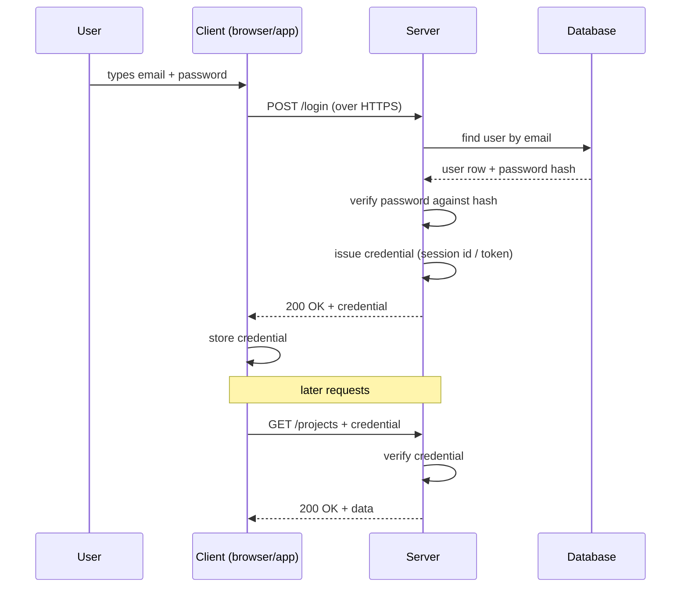
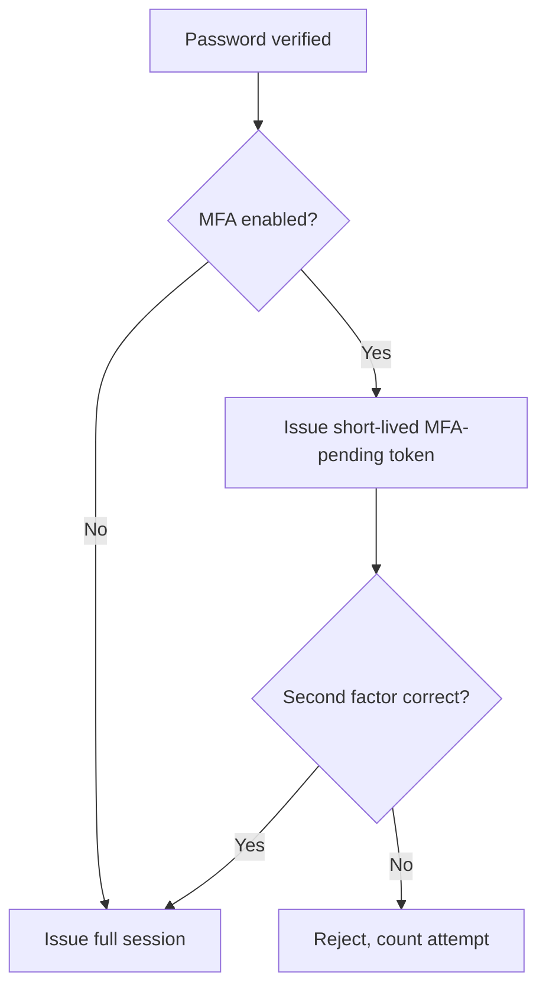
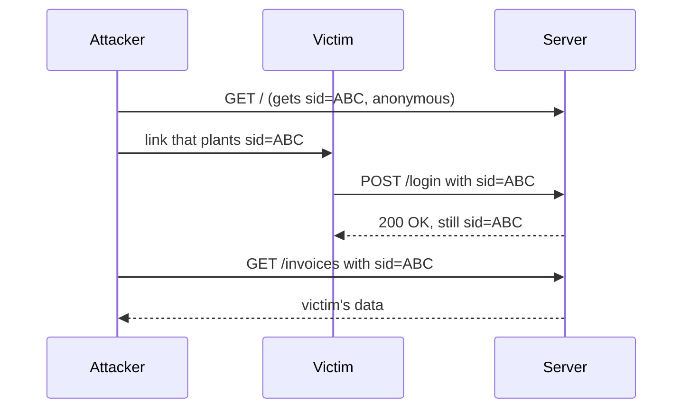

# Authentication Basics

You walk into a hotel. The receptionist asks for your passport. She checks the
photo against your face, finds your booking, and hands you a plastic room key.

For the rest of your stay, nobody asks for your passport again. You just tap
the key on the door. The key is not *you* — it is a small object that proves
the reception already checked who you are.

That is authentication in one picture. The passport check is **login**. The
plastic key is the **session or token**. Everything in this part of the track
is about how to run that check safely, and what shape the key should be.

> **📌 In one line:** authentication is proving who you are once, then carrying
> a small piece of proof on every request after that.

## Table of Contents

1. [Authentication in Plain Words](#authentication-in-plain-words)
2. [The Three Factors](#the-three-factors)
3. [Why Stateless HTTP Changes Everything](#why-stateless-http-changes-everything)
4. [The Universal Login Flow](#the-universal-login-flow)
5. [The Four Main Approaches](#the-four-main-approaches)
6. [Registration and Login, End to End](#registration-and-login-end-to-end)
7. [Account Security Basics Beginners Miss](#account-security-basics-beginners-miss)
8. [User Enumeration](#user-enumeration)
9. [Where Multi-Factor Authentication Fits](#where-multi-factor-authentication-fits)
10. [Advanced: Logout, Fixation, and Log Out Everywhere](#advanced-logout-fixation-and-log-out-everywhere)
11. [Common Mistakes](#common-mistakes)
12. [Questions to Test Yourself](#questions-to-test-yourself)
13. [Related](#related)

---

## Authentication in Plain Words

**Authentication** = proving *who you are*.

**Authorization** = deciding *what you may do*. That is a different question,
and it gets its own part: [Part 6 — Authorization](../06-authorization/).

The two words look alike, so people shorten them: **authn** for
authentication, **authz** for authorization. A useful test:

| Question | Which one | Example failure |
|---|---|---|
| Is this really Sara? | Authentication | Wrong password → `401 Unauthorized` |
| May Sara delete this invoice? | Authorization | Sara is a viewer → `403 Forbidden` |

Notice the status codes. `401` means "I do not know who you are, log in".
`403` means "I know exactly who you are, and the answer is no". Mixing them up
is one of the most common API bugs — see
[status codes](../01-http-foundations/04-status-codes.md).

A **credential** is the thing you present as proof: a password, a session
cookie, a token, an API key, a fingerprint.

---

## The Three Factors

There are only three kinds of proof in the world. Everything else is a
variation on one of them.

| Factor | Plain meaning | Examples | Main weakness |
|---|---|---|---|
| **Something you know** | A secret in your head | Password, PIN, security question | Can be guessed, reused, phished, leaked in a breach |
| **Something you have** | A physical object you hold | Phone running an authenticator app, hardware key (YubiKey), SIM card | Can be stolen, lost, or (for SMS) hijacked |
| **Something you are** | A measurement of your body | Fingerprint, face scan, voice | Cannot be changed after it leaks; usually stays on the device |

**Multi-factor authentication (MFA)** means requiring proof from **two
different factors**. A password plus a security question is *not* MFA — both
are "something you know". A password plus a code from an authenticator app
*is* MFA.

> **💡 Tip:** biometrics on phones almost never travel to your server. The
> fingerprint unlocks a private key held on the device, and the device signs a
> challenge. Your server sees a signature, not a fingerprint.

---

## Why Stateless HTTP Changes Everything

HTTP (HyperText Transfer Protocol) is **stateless**. The server handles one
request, answers it, and forgets everything. The next request from the same
browser arrives as a complete stranger. This is explained in detail in
[how the web works](../01-http-foundations/01-how-the-web-works.md).

This is not a flaw — it is what lets you run ten copies of your API behind a
load balancer. But it creates a problem for login: if the server forgets you
instantly, logging in once is useless. So:

```text
Request 1:  POST /login        { email, password }        ← proof sent once
            ────────────────────────────────────────
Request 2:  GET /projects      Cookie: sid=8f3a...        ← proof sent again
Request 3:  GET /invoices      Cookie: sid=8f3a...        ← proof sent again
Request 4:  POST /tasks        Cookie: sid=8f3a...        ← proof sent again
```

**Every single request must carry its own proof of identity.** There is no
"logged-in connection". There is only a repeated credential.

That is why all of the approaches in this part are really answers to one
question: *what small thing do we hand the client, so it can prove itself on
every future request without sending the password again?*

> **⚠️ Warning:** never let the client send the password on every request. One
> leaked log line, one proxy, one browser extension, and the password itself is
> gone — and users reuse passwords everywhere.

---

## The Universal Login Flow

Every authentication system on earth follows this shape. Only the box labelled
"credential" changes.



Read it as six steps:

1. **Collect** the credentials from the user.
2. **Verify** them against what you stored.
3. **Issue** a new, short-lived credential.
4. **Store** it on the client.
5. **Send** it on every later request.
6. **Verify** it on every later request.

Steps 3 to 6 are where the four approaches differ. Steps 1 and 2 are almost
always "email and password", covered in
[passwords and hashing](02-passwords-and-hashing.md).

---

## The Four Main Approaches

| Approach | What the client holds | Server looks it up? | Best for | Avoid when | Covered in |
|---|---|---|---|---|---|
| **Session cookies** | A random id in a cookie | Yes — every request | Normal web apps with one backend; anything needing instant logout | Truly stateless services; cross-domain APIs with no cookie support | [03-cookies-and-sessions.md](03-cookies-and-sessions.md) |
| **JWT (JSON Web Token)** | A signed token holding claims | No — it verifies a signature | Many services verifying one identity; mobile apps; short-lived access tokens | You need instant revocation, or you are tempted to store user data in it | [04-jwt.md](04-jwt.md) |
| **OAuth2 / OIDC** | A token issued by someone else | Depends on token type | "Log in with Google"; letting third-party apps act for your users | You only have your own users and your own single app — it is extra complexity for nothing | [05-oauth2-and-social-login.md](05-oauth2-and-social-login.md) |
| **API keys** | A long random string | Yes — hashed lookup | Server-to-server calls, CLI tools, CI pipelines, integrations | A human is logging in from a browser | [06-api-keys-and-machine-auth.md](06-api-keys-and-machine-auth.md) |

> **📌 Remember:** these are not competitors. A real product often uses three
> at once — session cookies for the web app, JWTs for its mobile app, API keys
> for customer integrations, and OIDC for "Log in with Google".

If you are building a normal web SaaS with one backend, start with **session
cookies**. File 4 explains honestly why that is usually the better default.

---

## Registration and Login, End to End

### Registration

```ts
// POST /register
async function register({ request, response }: HttpContext) {
  // 1. Validate first. Never trust the body. See Part 4.
  const { email, password, fullName } = await request.validateUsing(registerSchema)

  // 2. Normalise the email so "Sara@X.com" and "sara@x.com" are one account.
  const normalised = email.trim().toLowerCase()

  // 3. Hash the password. Never store it. See file 02.
  const passwordHash = await hash.use('argon').make(password)

  // 4. Create the user as UNVERIFIED.
  const user = await User.create({ email: normalised, passwordHash, fullName })

  await sendVerificationEmail(user)

  // 5. Same response whether or not the email already existed. See enumeration.
  return response.accepted({ message: 'Check your email to finish signing up.' })
}
```

Framework note: `request.validateUsing` and `hash.use` are AdonisJS; in Express
this is a validation middleware plus a direct `argon2.hash` call.

**The response must contain** a neutral message and nothing else. **It must
never contain** the password, the hash, or a logged-in session — make the user
verify the email first.

### Login

```ts
// POST /login
async function login({ request, response, session }: HttpContext) {
  const { email, password } = await request.validateUsing(loginSchema)

  const user = await User.findBy('email', email.trim().toLowerCase())

  // Constant-time behaviour: hash even when the user does not exist. See file 02.
  const ok = user
    ? await hash.verify(user.passwordHash, password)
    : await burnCpuWithDummyHash(password)

  if (!user || !ok) {
    await recordFailedAttempt(email)            // feeds lockout + throttling
    return response.unauthorized({ error: 'Invalid email or password.' })
  }

  if (!user.emailVerifiedAt) {
    return response.forbidden({ error: 'Please verify your email first.' })
  }

  await session.regenerate()                    // stops session fixation
  session.put('userId', user.id)
  return response.ok({ user: user.toPublicJSON() })
}
```

Three details that matter:

- **One error message** for a bad email and a bad password.
- **Regenerate the session id** after a successful login, always.
- **`toPublicJSON()`** — an explicit allow-list of fields. Never return the
  whole model, or one day someone adds a `passwordHash` column and it ships to
  the browser.

---

## Account Security Basics Beginners Miss

These four are not optional extras. Shipping a login without them is shipping a
half-finished login.

### 1. Email verification

Until the user proves they control the email address, the account is a claim,
not a fact. Without verification, anyone can sign up as
`ceo@bigcustomer.com` — and if you later add "Log in with Google" and link
accounts by email, that becomes a full account takeover (see
[file 05](05-oauth2-and-social-login.md)).

Send a link containing a **random, single-use, expiring token**. Store only a
hash of the token, the same way you store passwords.

### 2. Password reset done safely

A reset link is a temporary password. Treat it like one.

| Rule | Why |
|---|---|
| Cryptographically random, 32+ bytes | Must not be guessable |
| Stored hashed in the database | A database leak must not hand out account access |
| Single use — delete on use | Stops replay from an email forwarded or backed up |
| Expires in 15–60 minutes | Limits the window if the mailbox is later compromised |
| Invalidates all sessions when used | The whole point is often "someone else is in my account" |
| Same response for unknown emails | See enumeration below |

### 3. Lockout and throttling

An attacker with a list of leaked passwords will try thousands. Limit attempts
on two keys at once: **per account** (slow down after ~5 failures for one
email) and **per IP address** (after ~20 failures from one source, because
"credential stuffing" tries one password against thousands of accounts).

Prefer an increasing delay (exponential backoff) over a hard permanent lock — a
hard lock lets an attacker lock out your real users on purpose. The mechanics
live in [rate limiting](../../system-design/foundational/rate-limiting.md).

### 4. Timing-safe comparison

Comparing secrets with `===` leaks information through *how long* the
comparison takes. The full explanation and the fix are in
[file 02](02-passwords-and-hashing.md#timing-attacks-and-constant-time-comparison).

---

## User Enumeration

**Enumeration** means an attacker learning *which email addresses have
accounts* on your system. That alone is valuable: it is a target list for
phishing, for password stuffing, and sometimes it is private information
(a user of a medical or dating service).

You leak it whenever a stranger can tell the difference between "this account
exists" and "this account does not".

```ts
// ❌ BROKEN — two different messages tell an attacker which emails are registered
const user = await User.findBy('email', email)
if (!user) {
  return response.notFound({ error: 'No account found for this email.' })
}
if (!(await hash.verify(user.passwordHash, password))) {
  return response.unauthorized({ error: 'Wrong password.' })
}
```

```ts
// ✅ FIXED — one message, one status code, and constant work either way
const user = await User.findBy('email', email)
const ok = user
  ? await hash.verify(user.passwordHash, password)
  : await hash.verify(DUMMY_HASH, password)   // same CPU cost, always false

if (!user || !ok) {
  return response.unauthorized({ error: 'Invalid email or password.' })
}
```

The same leak appears in three other places, and people almost always forget
the last two:

| Endpoint | The leak | The fix |
|---|---|---|
| Login | Different message per case | One message, one status |
| Registration | "Email already taken" | Reply "check your email"; send *either* a verify link *or* a "you already have an account" email |
| Password reset | "No account with that email" | Always reply "if that address has an account, we sent a link" |
| Any of them | The response time differs | Do the same amount of work in both branches |

> **⚠️ Warning:** enumeration is a trade-off, not an absolute. Hiding "email
> already taken" on registration hurts usability. For a public consumer product
> hide it; for an internal company tool it is usually fine to be explicit.
> Decide on purpose — do not leak it by accident.

---

## Where Multi-Factor Authentication Fits

MFA sits *after* a successful password check and *before* you issue the
session. The user is "half logged in" and cannot do anything except finish the
second step.



### TOTP (Time-based One-Time Password)

The app (Google Authenticator, Authy, 1Password) and your server share one
secret, created when the user enables MFA. Both sides run the same formula over
that secret plus the current 30-second time window. Both get the same 6-digit
number.

Practical points: store the shared secret **encrypted**, accept the previous
and next window to tolerate clock drift, mark each code as used so it cannot be
replayed, and always give the user **recovery codes**.

TOTP protects against a leaked password. It does **not** protect against
phishing: a fake site can ask for the 6-digit code and use it immediately.

### WebAuthn and passkeys

WebAuthn is a browser standard where the device holds a **private key** and
your server holds only the matching **public key**. To log in, your server
sends a random challenge and the device signs it, usually after a fingerprint
or face check unlocks the key.

The important property: the signature is bound to your real domain by the
browser. A phishing site on `app-acme-login.com` cannot get a valid signature
for `app.acme.com`. That is why passkeys are phishing-resistant and TOTP is
not.

There is also no shared secret for you to leak.

---

## Advanced: Logout, Fixation, and Log Out Everywhere

### Logout that actually works

Deleting the cookie in the browser is **not** logout. The credential still
exists; you just asked the browser politely to forget it. If an attacker copied
that cookie earlier, it still works.

Real logout has two halves: **server side**, destroy the credential so it can
never be accepted again; **client side**, clear the cookie or stored token.

With sessions, half 1 is one line: delete the session record. With a stateless
JWT, half 1 is *impossible* without adding state back. Hold that thought — it
is the main theme of [file 04](04-jwt.md).

### Session fixation

An attacker gets a valid session id first, then tricks the victim into logging
in while carrying *that* id. If the server keeps the same id after login, the
attacker now holds a logged-in session.



The fix is one line, and it is the same line in every framework: **generate a
brand-new session id at the moment of login** (`session.regenerate()`). The old
id becomes worthless.

### "Log out of all devices"

Users expect this after changing a password or losing a laptop. How hard it is
depends entirely on which approach you chose:

| Approach | How to log out everywhere | Effort |
|---|---|---|
| Server-side sessions | `DELETE FROM sessions WHERE user_id = ?` | Trivial |
| Sessions in Redis | Keep a `user:42:sessions` set, delete each key | Easy |
| Stateless JWT | Not possible directly — you must add a denylist or a `tokenVersion` column and check it on every request | Real work, and it removes the "stateless" benefit |

> **📌 Remember:** "can I revoke this credential right now?" is the single most
> useful question to ask when choosing an authentication approach. Ask it
> before you ask which one is fashionable.

---

## Common Mistakes

| Mistake | Why it is wrong | Do this instead |
|---|---|---|
| Different errors for "no such user" and "wrong password" | Leaks which emails have accounts | One message, one `401`, equal work in both branches |
| Returning the full user model after login | Leaks `passwordHash`, internal flags, other users' data over time | An explicit allow-list serialiser |
| Keeping the session id after login | Session fixation — an attacker's planted id becomes a logged-in one | Regenerate the id on every successful login |
| Treating "delete the cookie" as logout | The credential still exists and still works | Destroy the server-side record too |
| No limit on login attempts | Free unlimited password guessing | Throttle per account and per IP, with backoff |
| Sending the password on every request | One log line or proxy leaks the real password | Send a session id or token instead |
| Skipping email verification | Anyone can claim any address; breaks account linking later | Verify before the account becomes usable |
| Confusing `401` and `403` | Clients retry login when they should show "access denied" | `401` = unknown caller, `403` = known but not allowed |

---

## Questions to Test Yourself

1. A colleague says "we store the user in the session so HTTP is not really
   stateless for us". What is wrong with that sentence?
2. Why is a password plus a security question **not** multi-factor
   authentication, while a password plus an authenticator code is?
3. Your login returns `404` for unknown emails and `401` for wrong passwords.
   Write down exactly what an attacker can build with that difference, and how
   you would fix it without hurting real users.
4. Why must you still run a password hash comparison when the email does not
   exist at all?
5. You change the session id after login. Draw the attack that this prevents,
   with the order of the steps.
6. A user asks to be logged out of every device. Explain why this is one line
   of code with server-side sessions and a design problem with stateless JWTs.
7. TOTP and passkeys both add a second factor. Which one survives a
   convincing phishing site, and what mechanism makes the difference?
8. You are building an internal tool for 200 employees with one backend and one
   web frontend. Which approach from the comparison table would you pick, and
   what is your one-sentence justification?

---

## Related

- [Passwords and Hashing](02-passwords-and-hashing.md) — how step 2 of the
  login flow, "verify the credentials", is actually done safely.
- [Cookies and Sessions](03-cookies-and-sessions.md) — the default answer for
  steps 3 to 6.
- [JWT](04-jwt.md) — the stateless alternative, and its revocation problem.
- [OAuth2 and Social Login](05-oauth2-and-social-login.md) — when someone else
  performs step 2 for you.
- [API Keys and Machine Auth](06-api-keys-and-machine-auth.md) — the same six
  steps when the caller is a program.
- [How the Web Works](../01-http-foundations/01-how-the-web-works.md) — why
  statelessness forces proof onto every request.
- [Status Codes](../01-http-foundations/04-status-codes.md) — `401` vs `403`.
- [Part 6 — Authorization](../06-authorization/) — the next question, once you
  know who is calling.
- [rate-limiting](../../system-design/foundational/rate-limiting.md) — the
  mechanism behind login throttling.
