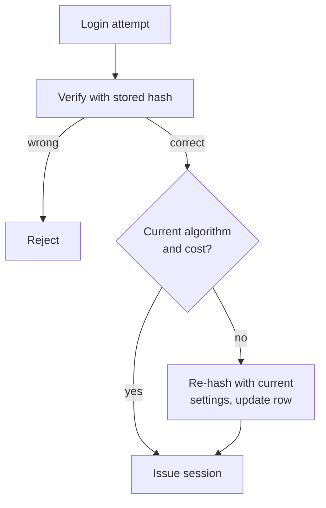

# Passwords and Hashing

Your database will leak one day — through an SQL injection, a stolen backup, a
misconfigured cloud bucket, or a laptop left in a taxi. Password storage is not
about stopping that leak. It is about making the leak **boring**.

Think of a paper shredder. You feed a document in and get confetti out. Shred
the same document again and you get the same confetti, so you can *check* a
document by shredding it and comparing. But nobody can rebuild the document
from the confetti. That is a hash.

> **📌 In one line:** never store a password — store a slow, salted hash of it,
> and compare hashes instead of passwords.

## Table of Contents

1. [Why Plain Text Is Unthinkable](#why-plain-text-is-unthinkable)
2. [Why Encryption Is Also Wrong](#why-encryption-is-also-wrong)
3. [Hashing vs Encryption vs Encoding](#hashing-vs-encryption-vs-encoding)
4. [Why Fast Hashes Are the Wrong Tool](#why-fast-hashes-are-the-wrong-tool)
5. [Salts](#salts)
6. [Slow Hashing: bcrypt, scrypt, Argon2](#slow-hashing-bcrypt-scrypt-argon2)
7. [The Cost Factor](#the-cost-factor)
8. [Working Code: Register and Log In](#working-code-register-and-log-in)
9. [Timing Attacks and Constant-Time Comparison](#timing-attacks-and-constant-time-comparison)
10. [Upgrading Hashes on Next Login](#upgrading-hashes-on-next-login)
11. [Password Policy: What NIST Now Says](#password-policy-what-nist-now-says)
12. [Advanced: Peppers](#advanced-peppers)
13. [Common Mistakes](#common-mistakes)
14. [Questions to Test Yourself](#questions-to-test-yourself)
15. [Related](#related)

---

## Why Plain Text Is Unthinkable

If you store `password: "Summer2024!"` in a column, everyone who can read that
column owns every account: every developer with production access, every
support engineer, every backup file, every log line. And because people reuse
passwords, a plain-text leak from a small project becomes a banking problem for
your users.

> **⚠️ Warning:** if your application can display a user's password back to
> them ("Here is your password: ..."), it is storing it reversibly. That is a
> defect, not a feature.

---

## Why Encryption Is Also Wrong

A common first instinct is "I will encrypt the passwords". That solves the
wrong problem. **Encryption is reversible by design** — you encrypt something
*because you need to read it back later*. So it needs a key, and that key must
live somewhere your server can reach. An attacker who took your database
usually also has your application server and its environment variables.

Now the important question: **do you ever need to read a password back?** No.
To log a user in you only answer "does this input match what was set before?".
When you only need yes/no, use a one-way function.

```text
Encryption:  "Summer2024!" ─encrypt─▶ "9f2a..." ─decrypt(key)─▶ "Summer2024!"
Hashing:     "Summer2024!" ─hash────▶ "$argon2id$v=19$..." ──▶ ✗ no way back
```

---

## Hashing vs Encryption vs Encoding

These three get mixed up constantly. This table is worth memorising.

| | **Encoding** | **Encryption** | **Hashing** |
|---|---|---|---|
| Purpose | Change the *format* so data survives transport | Keep data secret but readable later | Prove sameness without keeping the data |
| Reversible? | Yes, by anyone | Yes, with the key | No |
| Needs a key? | No | Yes | No (a salt is not a key) |
| Output size | Grows with input | Grows with input | Fixed length, always |
| Examples | Base64, URL-encoding, hex, JSON | AES-256-GCM, TLS | bcrypt, Argon2id, SHA-256 |
| Use for passwords? | **Never** | **No** | **Yes** (a slow one) |

> **⚠️ Warning:** **Base64 is not security.** `base64("Summer2024!")` is
> `U3VtbWVyMjAyNCE=`, and `echo 'U3VtbWVyMjAyNCE=' | base64 -d` reverses it
> with no key and no effort. Base64 exists so binary data can travel through
> text-only channels; it hides nothing. The same applies to the JWT payload in
> [file 04](04-jwt.md) — base64 there means "readable by everyone".

---

## Why Fast Hashes Are the Wrong Tool

MD5, SHA-1, SHA-256 and SHA-512 are **general-purpose hashes**, built to be
fast because they are meant for checking that a 4 GB file downloaded correctly.
For passwords, speed is the enemy: the attacker's job is to guess, and a fast
hash lets them guess very quickly.

Rough orders of magnitude on one modern gaming GPU:

| Algorithm | Guesses per second (one GPU) | Time to try all 8-character lowercase + digits (~2.8 trillion) |
|---|---|---|
| MD5 | ~100 billion | Under a minute |
| SHA-1 | ~50 billion | A couple of minutes |
| SHA-256 | ~10 billion | About 5 minutes |
| bcrypt (cost 12) | ~10–20 thousand | Thousands of years |
| Argon2id (64 MB) | ~1–5 thousand | Longer still |

Treat these numbers as the right shape, not exact measurements. The gap between
10 billion and 10 thousand is not a small optimisation — it is the difference
between "cracked over lunch" and "not worth attempting".

> **📌 Remember:** the attacker is not reversing the hash. They are guessing
> likely passwords and hashing them. Your defence is making guesses expensive.

---

## Salts

A **salt** is a random value, unique per user, mixed into the password before
hashing. Without a salt, the same password always gives the same hash. That creates two
problems. First, an attacker sees that 400 users in your leaked table share one
hash — so 400 people used the same, probably weak, password. Second, an
attacker can precompute a giant `hash → password` table once and then look up
every leaked hash instantly; those tables are called **rainbow tables**.

A unique salt destroys both. Identical passwords now produce different hashes,
and a precomputed table is useless because it would need to be rebuilt per
salt.

```text
WITHOUT SALT                              WITH A UNIQUE SALT PER USER
────────────                              ───────────────────────────
sara  "hunter2" ─hash─▶ 9c1185a5...       sara  "hunter2" + "kQ7x.." ─▶ a41f90b2...
omar  "hunter2" ─hash─▶ 9c1185a5...       omar  "hunter2" + "p2Lm.." ─▶ 77de3c08...
          ▲ identical → obvious                       ▲ different → tells you nothing
```

Two rules. **The salt must be unique per password** — one application-wide salt
only defeats generic rainbow tables. And **the salt is not a secret** — it sits
next to the hash in the clear, because its job is uniqueness, not secrecy. A
secret value is a *pepper*; see the advanced section.

> **💡 Tip:** with bcrypt, scrypt and Argon2 you never generate or store the
> salt yourself — the library creates one and writes it into the output string.
> If a tutorial tells you to add a `salt` column, it is using the wrong tool.

---

## Slow Hashing: bcrypt, scrypt, Argon2

These are **adaptive** or **key-derivation** functions. They are deliberately
slow, and the slowness is tunable so you can increase it as hardware improves.

| | **bcrypt** | **scrypt** | **Argon2id** |
|---|---|---|---|
| Year | 1999 | 2009 | 2015 (won the Password Hashing Competition) |
| CPU-hard | Yes | Yes | Yes |
| Memory-hard | No (uses ~4 KB) | Yes | Yes, and tunable |
| Parameters | cost (work factor) | N, r, p | memory, iterations, parallelism |
| Password length limit | **72 bytes** — longer input is silently ignored | None | None |
| Availability | Everywhere, every language | Built into Node `crypto` | Needs a library (`argon2`, `@node-rs/argon2`) |
| Verdict | Fine, safe, boring | Fine, less common | **Preferred choice today** |

**Memory-hardness** is the key modern idea. A GPU has thousands of small cores
but little fast memory per core, so an algorithm needing 64 MB per guess cannot
run thousands of times in parallel. The attacker's hardware advantage mostly
disappears. bcrypt's small memory footprint is its one real weakness.

**Recommendation:** use **Argon2id** for new systems, **bcrypt** if Argon2 is
awkward in your environment. Both are enormously better than any fast hash.
Start Argon2id at `memory = 19 MB`, `iterations = 2`, `parallelism = 1`, or
bcrypt at `cost = 12`, and tune upward.

---

## The Cost Factor

The **cost** (or **work factor**) controls how much computation one hash
requires. In bcrypt it is a single number, and it is **exponential**: cost 12
does twice the work of cost 11. To choose it, pick a target time on **your
production hardware** — around **250 ms** per hash — then measure, raise the
cost by one, and measure again until you reach it.

```ts
// Calibrate once, on the machine that will actually serve logins.
for (const cost of [10, 11, 12, 13, 14]) {
  const start = performance.now()
  await bcrypt.hash('a-realistic-length-password', cost)
  console.log(`cost ${cost}: ${Math.round(performance.now() - start)} ms`)
}
```

Why 250 ms? A user does not notice a quarter of a second on login. An attacker
doing a billion guesses does — it turns an afternoon into several lifetimes.

> **⚠️ Warning:** login is now a CPU-heavy endpoint — ten simultaneous logins
> means ten 250 ms CPU burns. So login must be rate limited
> ([rate limiting](../../system-design/foundational/rate-limiting.md)), and
> hashing must be awaited: `bcrypt.hashSync` blocks the Node
> [event loop](../../typescript-fundamentals/event-loop/event-loop.md) and
> freezes every other request.

**Revisit the cost every year or two.** Hardware gets faster; your cost factor
does not. The next-login upgrade below raises it without a single reset email.

---

## Working Code: Register and Log In

Registration — hash and store:

```ts
import argon2 from 'argon2'

const ARGON_OPTIONS = {
  type: argon2.argon2id,
  memoryCost: 19456,   // ~19 MB — raise it if your server can afford it
  timeCost: 2,
  parallelism: 1,
}

export async function createUser(email: string, plain: string) {
  // await matters: hashing is slow on purpose and must not block the event loop
  const passwordHash = await argon2.hash(plain, ARGON_OPTIONS)
  return User.create({ email: email.trim().toLowerCase(), passwordHash })
}
```

Login — verify:

```ts
export async function verifyPassword(user: User | null, plain: string) {
  // hash even for an unknown email, so both cases take the same time
  if (!user) return argon2.verify(DUMMY_HASH, plain).catch(() => false)

  // argon2.verify reads the parameters and salt out of the stored string itself
  return argon2.verify(user.passwordHash, plain)
}
```

The bcrypt equivalent is the same shape: `await bcrypt.hash(plain, 12)` and
`await bcrypt.compare(plain, user.passwordHash)`.

Notice what is **missing** from both: you never generate a salt, never store a
salt column, and never write your own comparison. The library does all of it.

---

### Reading a bcrypt hash

A bcrypt output is not a random blob. It is a structured string carrying
everything needed to verify a password later, including the salt.

```text
$2b$12$LQv3c1yqBWVHxkd0LHAkCOYz6TtxMQJqhN8/LewdBPj4J/HS.hK1u
│  │  │ └──────────────────────────┬──────────────────────────┘
│  │  │                            │
│  │  │                            └─ 31 chars: the actual hash
│  │  └─ 22 chars: the salt (base64-ish), generated randomly for this password
│  └──── cost factor: 12  → 2^12 = 4096 rounds
└─────── algorithm version: 2b (the current, correct bcrypt variant)
```

Two consequences follow. **You do not need a separate salt column** — the salt
is bytes 8–29, and `bcrypt.compare` pulls it out, re-hashes your input with it,
and compares. And **you can read the cost factor straight from stored data**,
which is what makes transparent upgrades possible.

Argon2's output string does the same in a more readable format:
`$argon2id$v=19$m=19456,t=2,p=1$<salt>$<hash>` — algorithm, version,
parameters, salt, hash.

> **📌 Remember:** the stored string is self-describing. That is why changing
> your parameters does not break old logins.

---

## Timing Attacks and Constant-Time Comparison

`===` on strings stops at the first character that differs, so comparing
`"abcdef"` with `"zzzzzz"` returns faster than comparing it with `"abcdez"`.

The difference is nanoseconds. But an attacker can send millions of requests
and average the results until the noise cancels out. They then guess a secret
one character at a time instead of all at once, which turns an impossible
search into an easy one.

```ts
// ❌ BROKEN — leaks how many leading characters were correct
if (providedToken === storedToken) { /* ... */ }
```

```ts
// ✅ FIXED — always compares every byte, so the time does not depend on the data
import { timingSafeEqual } from 'node:crypto'

function safeEqual(a: string, b: string): boolean {
  const x = Buffer.from(a, 'utf8'), y = Buffer.from(b, 'utf8')
  if (x.length !== y.length) return false   // length is not a useful secret here
  return timingSafeEqual(x, y)
}
```

You do **not** need this for passwords — `bcrypt.compare` and `argon2.verify`
are already constant-time internally. You need it for **everything else you
compare by hand**: API keys, webhook signatures, reset tokens, email
verification tokens, CSRF tokens.

### The dummy hash

There is a second timing leak at a much larger scale. If the user does not
exist, naive code skips hashing and replies in 2 ms; if the user exists but the
password is wrong, it hashes and replies in 250 ms. That gap is visible in a
browser's Network tab, and it hands an attacker a list of which emails have
accounts.

```ts
// A fixed hash of a random throwaway password, generated once at startup.
const DUMMY_HASH = await argon2.hash(randomBytes(32).toString('hex'), ARGON_OPTIONS)

const ok = user
  ? await argon2.verify(user.passwordHash, password)
  : await argon2.verify(DUMMY_HASH, password)   // burns the same ~250 ms
```

This connects directly to
[user enumeration](01-authentication-basics.md#user-enumeration).

---

## Upgrading Hashes on Next Login

You raise your bcrypt cost from 10 to 12, or move to Argon2id. What happens to
the 50,000 users already in your database? You cannot re-hash their passwords —
you do not have the plain text — and you must not force 50,000 resets.

Upgrade each user **the next time they log in**, in the one moment when you
legitimately hold their plain password.



```ts
export async function loginAndMaybeUpgrade(user: User, plain: string) {
  if (!(await argon2.verify(user.passwordHash, plain))) return false

  // needsRehash compares the stored parameters against your current ones
  if (argon2.needsRehash(user.passwordHash, ARGON_OPTIONS)) {
    user.passwordHash = await argon2.hash(plain, ARGON_OPTIONS)
    await user.save()   // silent to the user; one extra hash on one login
  }
  return true
}
```

Changing algorithm needs one extra branch, because Argon2 cannot read a bcrypt
string:

```ts
const isLegacy = user.passwordHash.startsWith('$2')   // bcrypt prefix
const ok = isLegacy
  ? await bcrypt.compare(plain, user.passwordHash)
  : await argon2.verify(user.passwordHash, plain)

if (ok && isLegacy) {
  user.passwordHash = await argon2.hash(plain, ARGON_OPTIONS)
  await user.save()
}
```

After a year most active accounts have migrated by themselves. Keep the legacy
branch until you are ready to force a reset on the inactive remainder.

---

## Password Policy: What NIST Now Says

NIST (the US National Institute of Standards and Technology) publishes the
guidance most security teams follow. Its modern advice reverses much of what
was taught for twenty years:

| Do this | Do **not** do this | Why the change |
|---|---|---|
| Require **at least 8** characters, allow **64+** | Require an uppercase, a digit, and a symbol | Complexity rules produce `Password1!` — predictable, and attackers know the patterns |
| Encourage long passphrases | Block spaces or "special" characters | Length beats complexity; `correct horse battery staple` is far stronger than `P@ss1` |
| Check new passwords against a **breached-password list** | Rely on your own rules alone | The real risk is reuse of an already-leaked password, not low entropy |
| Let people **paste** into the field | Block paste "for security" | Blocking paste breaks password managers, which pushes users toward weak memorable passwords |
| Change only on evidence of compromise | Force a change every 90 days | Forced rotation makes people pick `Summer2024!` then `Autumn2024!` — a predictable sequence |
| Offer MFA | Use security questions as a factor | Mother's maiden name is public information |

Why the reversal? Old rules optimised against *offline brute-force of random
strings*. Real attacks today are *credential stuffing* — replaying passwords
leaked from other sites. Complexity rules and rotation do nothing against that;
breach checking and MFA do.

For the breach check, the Have I Been Pwned range API takes only the first 5
characters of the SHA-1 hash, so the full hash never leaves your server.

---

## BROKEN vs FIXED

### 1. SHA-256 with no salt

```ts
// ❌ BROKEN — fast and unsalted: rainbow-table food, identical passwords collide
const passwordHash = createHash('sha256').update(password).digest('hex')

// ✅ FIXED — slow, memory-hard, per-password salt handled by the library
const passwordHash = await argon2.hash(password, ARGON_OPTIONS)
```

### 2. Logging the request body

```ts
// ❌ BROKEN — the plain password lands in your log files, forever
logger.info({ body: request.body() }, 'login attempt')

// ✅ FIXED — log identity and outcome, never credentials
logger.info({ email: normalisedEmail, ip: request.ip() }, 'login attempt')
```

Configure a global redaction list in your logger (`password`,
`password_confirmation`, `authorization`, `token`, `secret`) so this cannot
happen by accident anywhere. See [Part 8](../08-logging-and-observability/).

---

## Advanced: Peppers

A **pepper** is a secret value mixed into every password before hashing, stored
outside the database — in an environment variable, or better, a key management
service.

```ts
const peppered = createHmac('sha256', process.env.PASSWORD_PEPPER!)
  .update(plain).digest('base64')
const passwordHash = await argon2.hash(peppered, ARGON_OPTIONS)
```

The benefit: an attacker who steals **only** the database still cannot crack
anything, because every guess also needs the pepper.

The costs are why peppers stay uncommon. **Key management** — losing the pepper
makes every password unverifiable. **Rotation** — changing it invalidates every
stored hash. **Limited value** — in most breaches the attacker has the
application server too, so they have the pepper.

Use a pepper only if your database and your secret store genuinely have
separate access paths. Otherwise spend that effort on MFA.

### Never invent your own scheme

"SHA-256 three times with the user id reversed" is not clever, it is weaker.
Every safe primitive here was designed by cryptographers and attacked in public
for years before being trusted. You cannot test a cryptographic design by
seeing that it runs. Use bcrypt or Argon2id; change the parameters, not the
algorithm.

---

## Common Mistakes

| Mistake | Why it is wrong | Do this instead |
|---|---|---|
| Storing passwords encrypted | Reversible; the key is usually stolen with the data | Hash with Argon2id or bcrypt |
| Using SHA-256 or MD5 | Billions of guesses per second on one GPU | Use a slow, adaptive hash |
| One shared salt for all users | Identical passwords still produce identical hashes | Let the library generate a per-password salt |
| A `salt` column next to the hash | Unnecessary — modern hashes embed the salt | Store one string |
| `bcrypt.hashSync` in a request handler | Blocks the Node event loop for 250 ms, freezing all other requests | `await bcrypt.hash(...)` |
| Comparing tokens with `===` | Timing leak, character by character | `crypto.timingSafeEqual` |
| Skipping the hash when the email is unknown | The 250 ms gap reveals which emails exist | Verify against a dummy hash |
| Setting the cost once and never revisiting | Hardware gets faster every year | Re-measure yearly; upgrade on next login |
| Forcing 90-day rotation and symbol rules | Produces predictable passwords; contradicts current NIST guidance | Length, breach checks, MFA |

---

## Questions to Test Yourself

1. Encryption keeps data secret and is reversible. Explain in two sentences why
   that makes it the wrong tool for passwords.
2. A teammate stores `base64(password)` and calls it "encoded for safety".
   Write the one command that defeats it, and explain what base64 is actually
   for.
3. Why is SHA-256 an excellent hash for verifying a downloaded file and a bad
   hash for a password? Both are "one-way".
4. Your leaked table shows 300 users sharing one hash value. What does that
   tell an attacker, and which single design decision would have prevented it?
5. What does "memory-hard" mean, and why does it specifically weaken an
   attacker using GPUs?
6. You raise the bcrypt cost from 10 to 12. Describe step by step how existing
   users end up on cost 12 without a single password reset email.
7. `bcrypt.compare` is already constant-time. Name three other values you must
   still compare with `timingSafeEqual`, and say what leaks if you do not.
8. Old advice said "force a password change every 90 days". Why does current
   guidance say the opposite?

---

## Related

- [Authentication Basics](01-authentication-basics.md) — where password
  verification sits in the login flow, and user enumeration.
- [Cookies and Sessions](03-cookies-and-sessions.md) — what you issue once the
  password check passes.
- [API Keys and Machine Auth](06-api-keys-and-machine-auth.md) — the same
  hashing rules applied to machine credentials.
- [rate-limiting](../../system-design/foundational/rate-limiting.md) — hashing
  makes login expensive for you as well as for the attacker.
- [event-loop](../../typescript-fundamentals/event-loop/event-loop.md) — why a
  synchronous hash call stalls the whole Node process.
- [Part 8 — Logging](../08-logging-and-observability/) — redaction, so
  credentials never reach a log file.
