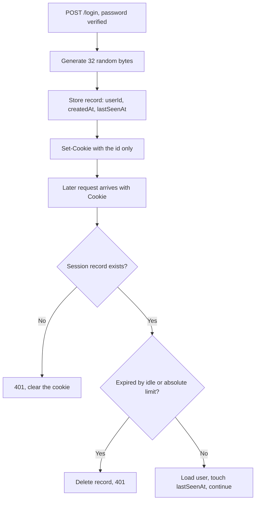

# Cookies and Sessions — Part 2

Part 1 was the cloakroom ticket: the cookie, its headers, and the attributes
that keep it from being stolen or abused.

This part is the coat on hook 47. A **session** is the record behind the
counter — where it lives, how long it lives, how you kill it, and the CSRF
middleware that protects every request it authenticates.

> **⬅️ This continues [Part 1](03-cookies-and-sessions-part-1.md).**

> **📌 In one line:** a session is a record on your server keyed by a long
> random id; the cookie carries only that id, which is exactly why you can
> revoke it, why it cannot be tampered with, and why a demoted user is demoted
> on their very next request.

## Table of Contents

1. [What a Session Actually Is](#what-a-session-actually-is)
2. [Where to Store Sessions](#where-to-store-sessions)
3. [The Session Lifecycle](#the-session-lifecycle)
4. [CSRF Protection for Cookie Auth](#csrf-protection-for-cookie-auth)
5. [BROKEN vs FIXED: the User Object in the Cookie](#broken-vs-fixed-the-user-object-in-the-cookie)
6. [Advanced: Why Mobile Apps Prefer Tokens](#advanced-why-mobile-apps-prefer-tokens)
7. [Common Mistakes](#common-mistakes)
8. [Questions to Test Yourself](#questions-to-test-yourself)
9. [Related](#related)

---

## What a Session Actually Is

A **session** is a record on the server, keyed by a long random id. The cookie
carries only that id.

```text
  BROWSER                              SERVER (Redis or a table)
┌──────────────────────┐             ┌─────────────────────────────────────┐
│ Cookie:              │             │ key   sess:8f3ad9c1b2e47f06         │
│   __Host-sid =       │  ─────────▶ │ value { userId: 42,                 │
│   8f3ad9c1b2e47f06   │   the id    │         createdAt: 1758240000,      │
│                      │   only      │         lastSeenAt: 1758243600,     │
│ (no user data)       │             │         ip: "203.0.113.9" }         │
└──────────────────────┘             │ ttl   86400 seconds                 │
                                     └─────────────────────────────────────┘
```

Rules for the id itself:

- **Cryptographically random**, from `crypto.randomBytes`. Never a counter,
  never a hash of the email, never a UUIDv1 (which encodes a timestamp and a
  MAC address, and is therefore guessable).
- **At least 128 bits** (16 bytes, about 22 base64url characters). 256 bits
  costs nothing extra.
- **Opaque** — it means nothing, so nothing leaks through it and nothing about
  it can be forged.

```ts
import crypto from 'node:crypto'
const sessionId = crypto.randomBytes(32).toString('base64url')  // 256 bits
```

The full request cycle:



Why the cookie must hold *only* the id — four reasons, and each one is a
recurring problem in systems that do the opposite:

1. **You can revoke it.** Delete the record and the cookie is instantly
   worthless, everywhere, for everyone.
2. **Data cannot be tampered with**, because there is no data on the client to
   tamper with.
3. **Stale data is impossible.** Demote a user and their very next request sees
   the new role.
4. **Size stays tiny**, far under the 4 KB cookie limit, and the cookie is
   re-sent on every request.

That first point is the entire argument between sessions and JWTs, and it comes
back in [file 04 part 2](04-jwt-part-2.md#the-stateless-problem-you-cannot-revoke-a-jwt).

---

## Where to Store Sessions

| Store | How it works | Pros | Cons | Use when |
|---|---|---|---|---|
| **In process memory** | a `Map` inside your Node process | zero setup, fastest | **breaks with more than one server**; every deploy logs everyone out | local development only |
| **Redis** | key `sess:<id>`, JSON value, native TTL | sub-millisecond, shared by all instances, expiry is automatic, easy "log out everywhere" | one more service to run and monitor | **the normal answer** for any real app |
| **Relational database** | a `sessions` table | no new infrastructure, survives restarts, queryable ("show my devices") | a write on every request unless you throttle it; you must delete expired rows yourself | low traffic, or you already have a database and want no new services |
| **Signed cookie only** | all state lives in the cookie | no server storage at all | cannot revoke, 4 KB limit, the data is readable | trivial non-sensitive state such as a theme flag |

The in-memory failure is worth picturing, because it is the single most common
"but it works locally" bug:

```text
                    ┌── server A  (has session 8f3a in memory)
  load balancer ────┤
                    └── server B  (never heard of 8f3a)   →  401, random logout
```

The load balancer sends request 1 to A and request 2 to B. See
[load-balancing](../../system-design/foundational/load-balancing.md). Sticky
sessions paper over it until server A restarts, which is not a fix — it is a
delay.

Redis solves it because both instances read the same store:
[redis](../../system-design/foundational/redis.md). It also gives you TTL for
free, which is the whole idle-timeout mechanism in one command.

```ts
// Redis-backed session store: the four operations you actually need
const KEY = (id: string) => `sess:${id}`
const IDLE_TIMEOUT_SECONDS = 30 * 60

async function create(userId: number) {
  const id = crypto.randomBytes(32).toString('base64url')
  const now = Date.now()
  await redis.set(
    KEY(id),
    JSON.stringify({ userId, createdAt: now, lastSeenAt: now }),
    'EX', IDLE_TIMEOUT_SECONDS,
  )
  await redis.sadd(`user:${userId}:sessions`, id)   // enables "log out everywhere"
  return id
}

async function read(id: string) {
  const raw = await redis.get(KEY(id))
  return raw ? JSON.parse(raw) : null
}

async function touch(id: string) {
  await redis.expire(KEY(id), IDLE_TIMEOUT_SECONDS) // sliding expiry
}

async function destroy(id: string, userId: number) {
  await redis.del(KEY(id))
  await redis.srem(`user:${userId}:sessions`, id)
}
```

> **💡 Tip:** the `user:<id>:sessions` set is five extra lines and it is what
> turns "log out of all devices" from a design problem into a `for` loop.
> Add it on day one.

---

## The Session Lifecycle

### Two timeouts, not one

| Timeout | Meaning | Typical value | Why it exists |
|---|---|---|---|
| **Idle (inactivity)** | expires N minutes after the *last* request | 30 min – 14 days | an abandoned laptop stops being logged in |
| **Absolute** | expires N hours after *creation*, however active the user is | 8 h – 30 days | caps how long one stolen cookie is ever useful |

You need both. Idle alone means an attacker who keeps the session warm with a
background request every minute stays logged in forever. Store `createdAt` and
`lastSeenAt`, and check both on every request.

```ts
const IDLE_MS = 30 * 60 * 1000
const ABSOLUTE_MS = 12 * 60 * 60 * 1000

function isExpired(sess: { createdAt: number; lastSeenAt: number }, now = Date.now()) {
  return now - sess.lastSeenAt > IDLE_MS || now - sess.createdAt > ABSOLUTE_MS
}
```

**Sliding expiry** is the idle timeout implemented by pushing the deadline
forward on each request (`redis.expire` above). Do not push it on *every*
request under load — refresh only when more than a minute has passed since
`lastSeenAt`, otherwise you have turned every read into a write.

### Regenerate the id at login

An attacker plants a known session id in the victim's browser, waits for the
victim to log in, and — if the id does not change — now holds a logged-in
session. This is **session fixation**, drawn step by step in
[file 01](01-authentication-basics.md#session-fixation).

```ts
// on successful password verification, BEFORE storing userId
const oldId = ctx.sessionId
await sessions.destroy(oldId, /* anonymous */ 0)   // the planted id dies here
const newId = await sessions.create(user.id)       // brand-new random id
setSessionCookie(res, newId)
```

Most frameworks wrap this as one call — `session.regenerate()` in AdonisJS and
express-session. Call it on login, and again on any privilege change: enabling
MFA, being promoted to admin, starting an impersonation session.

### Real logout

```ts
async function logout({ request, response }) {
  const id = request.cookie('__Host-sid')
  if (id) {
    const sess = await sessions.read(id)
    if (sess) await sessions.destroy(id, sess.userId)   // 1. kill the record
  }
  response.clearCookie('__Host-sid', { path: '/' })     // 2. tidy the browser
  return response.noContent()
}
```

Step 1 is the real logout. Step 2 is housekeeping. Doing only step 2 leaves a
fully working credential alive for anyone who copied it — see
[file 01](01-authentication-basics.md#logout-that-actually-works).

"Log out everywhere" is then one loop over `user:42:sessions`, and you should
run it automatically after a password reset or an email change:

```ts
async function logoutEverywhere(userId: number) {
  const ids = await redis.smembers(`user:${userId}:sessions`)
  if (ids.length) await redis.del(...ids.map(KEY))
  await redis.del(`user:${userId}:sessions`)
}
```

---

## CSRF Protection for Cookie Auth

CSRF exists for exactly one reason: **cookies are attached automatically**
([Part 1, section 5](03-cookies-and-sessions-part-1.md#samesite-and-the-attack-it-blocks)).
A token sent in an `Authorization` header is not attached automatically, which
is why header-based auth is CSRF-free — and XSS-exposed instead, the trade
examined in [file 04 part 2](04-jwt-part-2.md#where-to-store-a-token-on-the-client).

Two standard patterns:

| Pattern | How it works | Needs server state? | Good for |
|---|---|---|---|
| **Synchroniser token** | the server generates a random token, stores it in the session, and embeds it in the form; the submitted value must equal the stored one | yes (but you already have a session) | server-rendered apps |
| **Double submit** | the server sets a *readable* cookie with a random value; the client copies it into a header; the server checks the two match | no | SPA plus API, separate frontends |

Double submit works because an attacker's site can *cause* your cookie to be
sent, but — thanks to the same-origin policy — cannot *read* it in order to
copy it into a header.

```ts
// Double-submit CSRF middleware. Order: session middleware → this → routes.
import crypto from 'node:crypto'

const SAFE = new Set(['GET', 'HEAD', 'OPTIONS'])
const COOKIE = '__Host-csrf'
const HEADER = 'x-csrf-token'

export function csrf() {
  return async (req, res, next) => {
    // 1. Make sure the browser always has a token to copy.
    let token = req.cookies[COOKIE]
    if (!token) {
      token = crypto.randomBytes(32).toString('base64url')
      res.cookie(COOKIE, token, {
        httpOnly: false,   // ON PURPOSE: the frontend must be able to read it
        secure: true,
        sameSite: 'lax',
        path: '/',
      })
    }

    // 2. Reads are exempt — they must not change state anyway.
    if (SAFE.has(req.method)) return next()

    // 3. Requests authenticated by a header, not a cookie, cannot be forged.
    if (req.headers.authorization) return next()

    const sent = Buffer.from(String(req.headers[HEADER] ?? ''))
    const known = Buffer.from(String(token))

    if (sent.length !== known.length || !crypto.timingSafeEqual(sent, known)) {
      return res.status(403).json({ error: 'Invalid CSRF token' })
    }
    return next()
  }
}
```

Three details in that code that people get wrong:

- `httpOnly: false` is **correct here**. The CSRF token is not a credential;
  it is a value that only your own origin can read. The session cookie next to
  it stays `httpOnly: true`.
- The length check before `timingSafeEqual` is required — that function throws
  on mismatched lengths.
- Exempting `GET`/`HEAD`/`OPTIONS` is safe only if those methods really are
  read-only in your app.

The frontend side is three lines:

```ts
const token = document.cookie.split('; ')
  .find(c => c.startsWith('__Host-csrf='))?.split('=')[1]

await fetch('/api/transfer', {
  method: 'POST',
  credentials: 'include',
  headers: { 'content-type': 'application/json', 'x-csrf-token': token! },
  body: JSON.stringify({ to, amount }),
})
```

**When is `SameSite=Lax` alone enough?** When all three of these are true:
every state-changing endpoint uses `POST`/`PUT`/`PATCH`/`DELETE`; you do not
need to support browsers from before 2020; and the action is not high-value.
For payments, permission changes and account settings, use both. Defence in
depth here costs you twenty lines.

---

## BROKEN vs FIXED: the User Object in the Cookie

```ts
// ❌ BROKEN — the client holds the data, so the client controls the data
res.cookie('user', JSON.stringify({ id: 42, email: 'sara@acme.com', role: 'viewer' }))

// ... later, on every request
const user = JSON.parse(req.cookies.user)
if (user.role === 'admin') { /* ... */ }
```

The user opens devtools, edits the cookie, changes `viewer` to `admin`, and is
an admin. There is no signature and no lookup; the cookie *is* the claim.

Signing the cookie stops the edit but not the other two problems:

- The email is still readable by anyone with the laptop, or with a copy of a
  request log.
- A demotion in your database has **no effect** until the cookie expires,
  because nothing ever reads the database.

```ts
// ✅ FIXED — an opaque id; the truth stays on the server and is read fresh
res.cookie('__Host-sid', sessionId, {
  httpOnly: true, secure: true, sameSite: 'lax', path: '/',
})

// ... later, on every request
const sess = await sessions.read(req.cookies['__Host-sid'])
if (!sess || isExpired(sess)) return res.status(401).json({ error: 'Not authenticated' })
const user = await User.find(sess.userId)     // current role, every single time
```

The fixed version costs one lookup per request — sub-millisecond against Redis,
and cacheable. That is the price of being able to revoke access, and it is
cheap.

---

## Advanced: Why Mobile Apps Prefer Tokens

A native iOS or Android app has no cookie jar attached to a browsing context,
no automatic attachment, and no same-site concept to lean on. It often talks to
a different domain than any website you own, and may call several services in
one session.

So mobile clients normally send `Authorization: Bearer <token>` and store the
token in the platform keychain (iOS) or keystore (Android).

| | Browser + session cookie | Mobile app + bearer token |
|---|---|---|
| Sent automatically | yes | no — the app attaches it |
| CSRF possible | yes, needs `SameSite` + tokens | **no**, nothing is automatic |
| Readable by injected script | no, with `HttpOnly` | n/a — no DOM to inject into |
| Storage risk | browser cookie jar | keychain / keystore, OS-protected |
| Revocation | delete the server record | depends on the token design |

Notice the trade: mobile removes CSRF entirely and moves the whole risk onto
**token storage and revocation**. That is precisely the subject of
[file 04](04-jwt-part-1.md), and the reason its second part spends so long on
the revocation problem.

A useful rule for a product with both a web app and a mobile app: use session
cookies for the browser and bearer tokens for the app, over the same backend.
They are not mutually exclusive, and each client gets the mechanism that fits
it.

---

## Common Mistakes

| Mistake | Why it is wrong | Do this instead |
|---|---|---|
| Storing the user object in the cookie | The client can edit it, read it, and keep stale roles | Store an opaque id; read the user from the database |
| A predictable session id (counter, UUIDv1, email hash) | It can be guessed or derived, so sessions can be forged | 32 random bytes from `crypto.randomBytes` |
| In-memory sessions in production | Random logouts behind a load balancer; wiped on every deploy | Redis, or a `sessions` table |
| Only an idle timeout, no absolute one | A stolen cookie kept warm never expires | Store `createdAt` and enforce both limits |
| Keeping the session id after login | Session fixation: a planted id becomes a logged-in one | Regenerate on login and on any privilege change |
| "Logout" that only clears the browser cookie | The credential still works if anyone copied it | Delete the server record first, then clear the cookie |
| Sliding the expiry on literally every request | Turns every read into a Redis or database write | Refresh only if `lastSeenAt` is more than a minute old |
| No `user:<id>:sessions` index | "Log out everywhere" and post-reset cleanup become impossible | Keep the set from day one |
| Marking the CSRF cookie `httpOnly` | The frontend cannot read it, so double submit silently breaks | CSRF cookie readable, session cookie `httpOnly` |
| Comparing the CSRF token with `===` | Leaks information through timing, and throws on length mismatch with `timingSafeEqual` | Length check, then `crypto.timingSafeEqual` |
| Never deleting expired session rows | The table grows forever and slows down | Redis TTL, or a scheduled cleanup job |

---

## Questions to Test Yourself

1. Why must the cookie hold only a random id and not the user object? Give
   four distinct reasons.
2. Your app works locally and randomly logs users out in production. What is
   the first thing you check, and why does adding a second server cause it?
3. Explain the difference between an idle timeout and an absolute timeout, and
   describe the attack that having only the first one allows.
4. What exactly does `session.regenerate()` prevent? Draw the attack in four
   steps.
5. Why is deleting the cookie not a logout? What is the one line that actually
   is?
6. Explain why double-submit CSRF protection works, given that the attacker
   *can* make the browser send your cookie.
7. Why is the CSRF cookie deliberately **not** `HttpOnly`, while the session
   cookie must be?
8. A user resets their password. List everything your backend should do to
   their other sessions, and say how you find them.
9. Why do native mobile apps use `Authorization: Bearer` rather than cookies,
   and what risk does that trade away — in exchange for what?
10. Your team wants to skip Redis and sign the session data into the cookie
    instead. Write the one-sentence objection that ends the discussion.

---

## Related

- [Part 1](03-cookies-and-sessions-part-1.md) — the cookie itself: headers,
  attributes, `HttpOnly`, `Secure`, `SameSite`, and the 4 KB limit.
- [Authentication Basics](01-authentication-basics.md) — the universal login
  flow, session fixation, and "log out everywhere".
- [Passwords and Hashing](02-passwords-and-hashing.md) — timing-safe
  comparison, used again by the CSRF middleware here.
- [JWT — Part 1](04-jwt-part-1.md) and [Part 2](04-jwt-part-2.md) — the
  stateless alternative, its revocation problem, and the honest comparison
  against everything in this file.
- [redis](../../system-design/foundational/redis.md) — the standard session
  store, and where the TTL comes from.
- [load-balancing](../../system-design/foundational/load-balancing.md) — why
  in-memory sessions break past one server.
- [Middleware](../03-request-lifecycle/03-middleware.md) — where the session
  and CSRF middleware sit in the request pipeline.
- [Part 6 — Authorization](../06-authorization/) — what you do with
  `sess.userId` once you have it.
