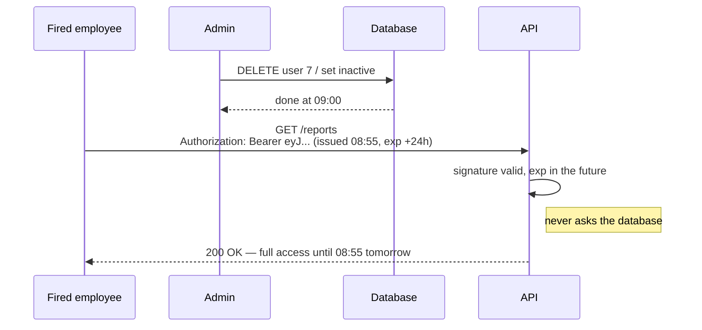
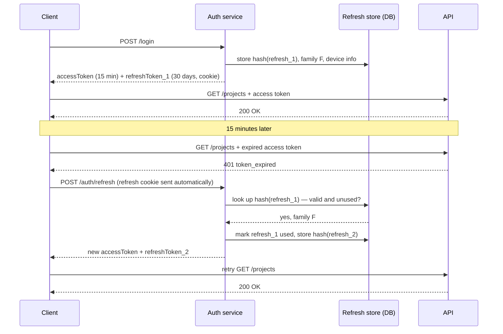
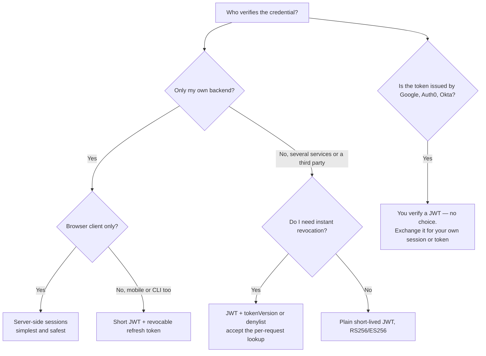

# JWT — Part 2

Part 1 ended on a happy note: verify a signature, skip the database, done.

This part is the bill for that convenience. A badge you cannot phone head
office about is also a badge you cannot cancel. Everything here — refresh
tokens, denylists, `tokenVersion`, short expiries — is an attempt to buy back
the ability to say *no* to a token you already signed.

It ends with the comparison the whole part has been building towards: for most
applications, server-side sessions are the better default, and this file says
why without hedging.

> **⬅️ This continues [Part 1](04-jwt-part-1.md).**

> **📌 In one line:** a JWT is valid until it expires, full stop — so every
> real JWT deployment either accepts that window or adds server state back,
> and once you have added the state you should ask what the JWT was buying you.

## Table of Contents

1. [The Stateless Problem: You Cannot Revoke a JWT](#the-stateless-problem-you-cannot-revoke-a-jwt)
2. [The Four Mitigations](#the-four-mitigations)
3. [Access and Refresh Tokens](#access-and-refresh-tokens)
4. [Refresh Token Rotation and Reuse Detection](#refresh-token-rotation-and-reuse-detection)
5. [Where to Store a Token on the Client](#where-to-store-a-token-on-the-client)
6. [The Classic Attacks](#the-classic-attacks)
7. [BROKEN vs FIXED: Verifying Without Pinning the Algorithm](#broken-vs-fixed-verifying-without-pinning-the-algorithm)
8. [Sessions vs JWT: the Decision](#sessions-vs-jwt-the-decision)
9. [Common Mistakes](#common-mistakes)
10. [Questions to Test Yourself](#questions-to-test-yourself)
11. [Related](#related)

---

## The Stateless Problem: You Cannot Revoke a JWT

Here is the problem in one sentence:

> A verifier decides whether to accept a JWT using only the token and the key.
> Nothing in that decision touches your database — so nothing you do in your
> database can stop the token being accepted.

You can delete the user row. You can set `is_active = false`. You can burn the
office down. Until `exp` passes, every service holding the public key will
keep saying "valid" and letting the holder in.

Work through what that means in practice, because these are not theoretical.

**1. A fired employee keeps access.** HR deactivates the account at 09:00. The
person's laptop holds an access token issued at 08:55 with a 24-hour expiry.
They have until 08:55 tomorrow, and there is nothing you can do from your admin
panel. With a session, `DELETE FROM sessions WHERE user_id = 7` ends it before
they reach the car park.

**2. A password change does not log other sessions out.** A user notices
someone else is in their account and changes their password — the correct
instinct. Every already-issued token is still valid. The attacker is not
logged out. The user believes they are safe and they are not, which is worse
than the original problem.

**3. A stolen token stays valid.** A token pasted into a support ticket,
captured from a log, or lifted by an XSS bug works from anywhere, for anyone,
until `exp`. There is no "sign out of all devices" and no per-device list.

**4. A permission change is not immediate.** You demote an admin to viewer.
Their token still says `"role": "admin"`, and your middleware reads the role
from the token. They stay an admin until the token expires.



Notice that this is not a bug in JWTs. It is the *definition* of a JWT. The
lookup you removed to gain speed is the same lookup that would have told you
the user was gone.

---

## The Four Mitigations

Every production JWT system uses one or more of these. Read the last column
carefully — three of the four put state back.

| Mitigation | How it works | Cost | Still stateless? |
|---|---|---|---|
| **Short expiry** | access tokens live 5–15 minutes | the damage window shrinks but never reaches zero; you need refresh tokens | yes |
| **Refresh-token pair** | a short access token plus a long, revocable refresh token stored server-side | one extra round trip every 15 minutes; real infrastructure | no, the refresh token is stateful |
| **`jti` denylist** | store revoked token ids in Redis until their `exp`; check on every request | a Redis read on every request — exactly the lookup you removed | **no** |
| **`tokenVersion` claim** | the user row holds an integer; it is copied into the token and compared on each request; bump it to invalidate everything for that user | one user lookup per request, though it caches well; all-or-nothing per user | **no** |

The `tokenVersion` pattern is the best value of the three stateful options, so
here it is concretely:

```ts
// users table: token_version INTEGER NOT NULL DEFAULT 0

// at signing
jwt.sign({ role: user.role, tv: user.tokenVersion }, key, { subject: String(user.id), /* ... */ })

// in middleware, after signature verification
const user = await cache.getUser(Number(claims.sub))   // cached, ~0.2 ms
if (!user || user.isActive === false) return res.status(401).json({ error: 'token_invalid' })
if (user.tokenVersion !== claims.tv) return res.status(401).json({ error: 'token_revoked' })
```

```ts
// "log out everywhere", password reset, deactivation, role change:
await db.users.increment('token_version', 1).where({ id: userId })
```

One integer bump instantly invalidates every token ever issued to that user.

> **📌 Remember:** the honest reading of this table is that the moment you need
> real revocation, you have reintroduced a per-request server lookup. At that
> point the JWT is no longer saving you the lookup — it is saving you nothing
> except the ability to verify in several services at once. Sometimes that is
> still worth it. Often it is not.

---

## Access and Refresh Tokens

The standard compromise: two tokens with very different jobs.

| | **Access token** | **Refresh token** |
|---|---|---|
| Purpose | authenticate each API call | obtain a new access token |
| Lifetime | 5–15 minutes | 7–90 days |
| Format | a JWT | an opaque random string is **better** than a JWT |
| Stored server-side? | no | **yes** — hashed, one row per device |
| Sent with | every API request | only to `POST /auth/refresh` |
| Stored on the client | memory, or an `HttpOnly` cookie | `HttpOnly`, `Secure`, `SameSite=Strict` cookie scoped to the refresh path |
| Revocable | not directly | **yes, immediately** — delete the row |

The reasoning is a time trade. The access token is used constantly and cannot
be revoked, so make it short-lived. The refresh token is used rarely and *is*
revocable, so it can live long. The attacker's window shrinks from "as long as
your session" to "at most fifteen minutes", and the user still does not have to
log in every fifteen minutes.



Store refresh tokens the way you store passwords: **hashed**. A leaked refresh
table must not hand out sessions. SHA-256 is sufficient here (unlike for
passwords) because the token is already 256 bits of randomness and cannot be
guessed — see [file 02](02-passwords-and-hashing.md#why-fast-hashes-are-the-wrong-tool)
for why passwords are different.

---

## Refresh Token Rotation and Reuse Detection

**Rotation** means every refresh call invalidates the old refresh token and
issues a new one. It costs nothing and it gives you something valuable: the
ability to *detect theft*.

A refresh token is single-use. So if the same one is ever presented twice, one
of two things happened — and both mean you should assume the worst:

```text
  Legitimate:  R1 ──used──▶ R2 ──used──▶ R3 ──used──▶ R4
                                                       ▲ only this one is live

  Theft:       R1 ──used──▶ R2 ──used──▶ R3
                              │                  attacker stole R2 earlier
                              └──used again──▶ ✋  R2 is already spent
                                                  → burn the whole family
```

You cannot tell whether the attacker or the user got there first. But you know
one of them is an impostor, so you revoke the **entire token family** — every
descendant of that first login — and force a fresh login.

```ts
async function refresh(presented: string) {
  const row = await db.refreshTokens.findBy('token_hash', sha256(presented))

  if (!row) throw new Unauthorized('refresh_invalid')

  if (row.usedAt !== null) {
    // Reuse of a spent token: theft. Kill every token from this login.
    await db.refreshTokens.where({ family_id: row.familyId }).delete()
    await notifySecurity(row.userId, 'refresh token reuse detected')
    throw new Unauthorized('refresh_reused')
  }

  if (row.expiresAt < new Date()) throw new Unauthorized('refresh_expired')

  const next = crypto.randomBytes(32).toString('base64url')
  await db.transaction(async (trx) => {
    await trx.refreshTokens.where({ id: row.id }).update({ used_at: new Date() })
    await trx.refreshTokens.insert({
      user_id: row.userId,
      family_id: row.familyId,            // same family, one generation later
      token_hash: sha256(next),
      expires_at: addDays(new Date(), 30),
    })
  })

  return { accessToken: issueAccessToken(await User.find(row.userId)), refreshToken: next }
}
```

Two practical details: keep the used rows for a short grace period rather than
deleting them immediately, so a dropped response or a double-tap on a flaky
network does not look like theft; and do the whole thing in a transaction, or
two parallel refreshes will both succeed.

---

## Where to Store a Token on the Client

This is the question that generates the most confident wrong advice on the
internet. There are two real options and both have a real weakness.

| | `localStorage` / `sessionStorage` | `HttpOnly` cookie |
|---|---|---|
| Readable by JavaScript | **yes** — any XSS exports it permanently | no |
| Sent automatically | no, your code attaches it | yes, by the browser |
| Vulnerable to XSS theft | **yes** | no |
| Vulnerable to CSRF | no | **yes** — needs `SameSite` plus tokens |
| Works cross-domain | yes, trivially | awkward; needs `SameSite=None` and CORS |
| Works for native mobile | n/a | n/a — use the keychain / keystore |
| Survives a page refresh | yes | yes |

The honest conclusion, and it is not the popular one:

> **📌 For a web application, an `HttpOnly` cookie plus CSRF protection is
> usually safer than `localStorage`.**

The reasoning is about what happens *after* the bug. With CSRF, an attacker can
make the browser act while the victim is on their page — bad, and it is stopped
by `SameSite=Lax` plus a double-submit token
([file 03 part 2](03-cookies-and-sessions-part-2.md#csrf-protection-for-cookie-auth)).
With XSS against `localStorage`, the attacker **exports** the token and uses it
from their own machine, for as long as it lives, with no further access to the
victim. CSRF has a complete, standard defence; XSS token theft has only
mitigation.

People choose `localStorage` because "JWTs are stateless, cookies are stateful"
— but that is a category error. The cookie is only *transport*. Putting a JWT
in an `HttpOnly` cookie keeps every stateless property of the JWT and removes
the XSS exfiltration path.

The other good option for a single-page app: keep the access token **in a
JavaScript variable in memory** (never persisted), and hold only the refresh
token in an `HttpOnly` cookie. A page refresh silently calls `/auth/refresh`.
XSS can then steal at most the 15-minute access token, and cannot touch the
long-lived one.

For **native mobile**, use the platform secure storage — iOS Keychain,
Android Keystore / EncryptedSharedPreferences. Never `UserDefaults`,
`SharedPreferences`, or a file in the app bundle.

---

## The Classic Attacks

| Attack | What the attacker does | One-line fix |
|---|---|---|
| **`alg: none`** | Sets the header to `{"alg":"none"}`, strips the signature, and sends any claims they like. Old libraries accepted it. | Pin `algorithms: ['RS256']`; never let the token pick |
| **Algorithm confusion** | Takes your **public** RSA key (it is public), sets `alg` to `HS256`, and signs the token using that public key as the HMAC secret. A library that picks the algorithm from the header then "verifies" it successfully. | Pin the algorithm allow-list; never pass one key to a verifier that accepts both families |
| **No `exp` check** | Replays a token from months ago. | Always set `expiresIn`; never disable expiry verification |
| **Weak HMAC secret** | Captures one token and brute-forces `"secret"`, `"changeme"` or your company name offline in seconds, then mints admin tokens. | 32 random bytes from `crypto.randomBytes`, held in a secret manager |
| **Blindly trusting `kid`** | Puts `"kid": "../../dev/null"` or a SQL fragment in the header, steering your key lookup to a file or row they control. | Treat `kid` as an untrusted lookup key into a fixed allow-list; never a path or raw SQL |
| **Missing `aud` check** | Replays a token minted for your low-value service against your high-value one. | Verify `audience` on every service |
| **Tokens in the URL** | `?token=eyJ...` lands in access logs, browser history and `Referer` headers. | `Authorization: Bearer`, never a query parameter |

Algorithm confusion deserves its picture, because it is the cleverest of them:

```text
  You intended:                      The attacker sends:
  ┌───────────────────────┐          ┌───────────────────────┐
  │ alg: RS256            │          │ alg: HS256            │
  │ verify with PUBLIC key│          │ verify with PUBLIC key│
  └───────────────────────┘          └───────────────────────┘
       public key = verify only           public key = the HMAC secret,
       (safe to publish)                  and it is published, so the
                                          attacker can sign anything
```

---

## BROKEN vs FIXED: Verifying Without Pinning the Algorithm

```ts
// ❌ BROKEN — the token's own header decides how it is verified
const claims = jwt.verify(token, publicKey)
```

That one line is vulnerable to two attacks at once. On an old library, a token
with `{"alg":"none"}` and no signature is accepted. On a current library that
still infers the algorithm, an attacker signs their own claims with `HS256`
using your published public key as the secret, and verification passes. In
both cases they choose `sub` and `role`.

It has three more holes: no `issuer`, no `audience`, and — if the token was
signed without `expiresIn` — no expiry at all.

```ts
// ✅ FIXED — you decide the algorithm, the issuer, the audience and the clock
let claims: JwtPayload
try {
  claims = jwt.verify(token, publicKey, {
    algorithms: ['RS256'],             // the token cannot choose
    issuer: 'https://auth.acme.com',   // must come from us
    audience: 'https://api.acme.com',  // must be meant for this service
    clockTolerance: 5,                 // seconds
    maxAge: '15m',                     // belt and braces over exp
  }) as JwtPayload
} catch {
  return res.status(401).json({ error: 'token_invalid' })
}

// and then, if you need real revocation:
const user = await cache.getUser(Number(claims.sub))
if (!user?.isActive || user.tokenVersion !== claims.tv) {
  return res.status(401).json({ error: 'token_revoked' })
}
```

> **⚠️ Warning:** `jwt.decode()` is **not** `jwt.verify()`. `decode` reads the
> claims without checking anything at all. Use it for debugging and logging
> only. Searching your codebase for `jwt.decode` is a five-second audit worth
> running today.

---

## Sessions vs JWT: the Decision

| | **Server-side session** | **Stateless JWT** |
|---|---|---|
| Revoke immediately | yes, delete one row | no, unless you add state back |
| Lookup per request | yes (~0.2 ms against Redis) | none, until you add revocation |
| Role and permission changes | take effect on the next request | wait for expiry |
| "Log out everywhere" | one loop | needs `tokenVersion` or a denylist |
| Works across many services | needs a shared store | yes, natural |
| Works across domains | awkward | yes |
| Works for native mobile | awkward | yes |
| Payload readable by the client | no | **yes, always** |
| Infrastructure | Redis or a table | a key, plus a refresh-token store in practice |
| Failure mode when you get it wrong | a random logout | a credential you cannot cancel |



**The honest recommendation.** For a normal web SaaS with one backend and a
browser frontend, use **server-side sessions**. They are fewer moving parts,
they revoke instantly, they never go stale, and the Redis lookup you were
worried about takes a fifth of a millisecond — far less than the database
queries your endpoint is about to run anyway.

JWTs earn their complexity when at least one of these is true:

- **Several services** must verify the same identity without sharing a session
  store.
- **Another organisation** verifies your tokens, or you verify theirs.
- **Cross-domain or mobile clients** make cookies painful.
- The token is **issued by an identity provider** and you have no say
  ([file 05](05-oauth2-and-social-login-part-1.md)) — though even then, the
  common pattern is to verify the provider's `id_token` **once at login** and
  then create your own session.

> **⚠️ Warning:** "JWTs scale better" is the reason most often given and it is
> almost always wrong at the scale of the team saying it. A Redis lookup is not
> your bottleneck at ten thousand users. An access token you cannot revoke
> during an incident is a genuine problem at any scale.

---

## Common Mistakes

| Mistake | Why it is wrong | Do this instead |
|---|---|---|
| Long-lived access tokens (days) | The unrevokable window becomes the whole attack | 5–15 minutes plus a revocable refresh token |
| Assuming a password change logs other devices out | Issued tokens keep working | Bump `tokenVersion`, or delete the refresh rows |
| A refresh token that is also a plain JWT | You cannot revoke the thing whose job is being revocable | An opaque random string, stored hashed |
| Storing refresh tokens in plain text | A table leak is a session leak for every user | Hash them (SHA-256 is fine for 256-bit randomness) |
| No rotation | You lose the only signal that a token was stolen | Rotate on every refresh; burn the family on reuse |
| Refreshing without a transaction | Two parallel refreshes both succeed, or both fail | Wrap mark-used and insert in one transaction |
| `localStorage` "because cookies are old" | An XSS bug exports the token permanently | `HttpOnly` cookie plus CSRF, or memory plus refresh cookie |
| `jwt.decode` where `jwt.verify` was meant | No signature check at all — anyone can forge claims | Grep for `decode`; use it only for logging |
| Tokens in query strings | Logs, history, `Referer` headers | `Authorization: Bearer` |
| Adding a denylist and still calling it stateless | You restored the per-request lookup you removed | Fine — but now re-evaluate whether sessions are simpler |
| Choosing JWT for a single-backend web app | All of the cost, none of the benefit | Server-side sessions |

---

## Questions to Test Yourself

1. An employee is fired at 09:00. Their token was issued at 08:55 with a
   24-hour expiry. Explain exactly why your admin panel cannot stop them, and
   name two ways to change that.
2. A user changes their password because they think someone is in their
   account. With plain JWTs, what has actually changed for the attacker?
3. Three of the four revocation mitigations put server state back. Name them,
   and say what the fourth one buys you on its own.
4. Why should a refresh token be an opaque random string rather than a JWT?
5. Describe refresh-token rotation, and explain precisely what presenting an
   already-used refresh token tells you.
6. Why do you revoke the whole token *family* on reuse, rather than just that
   one token?
7. `localStorage` or `HttpOnly` cookie? Give the weakness of each and say which
   one has a complete standard defence.
8. Explain the algorithm-confusion attack in three sentences, and give the
   one-line fix.
9. What is the difference between `jwt.decode` and `jwt.verify`, and what is
   the worst bug that confusing them can cause?
10. You are building a SaaS with one API, a React frontend and an iOS app.
    Write the two-sentence recommendation you would give your team, and name
    the trade-off you are accepting.

---

## Related

- [Part 1](04-jwt-part-1.md) — what a JWT is, the three parts, the claims,
  signing algorithms, and correct verification code.
- [Cookies and Sessions — Part 2](03-cookies-and-sessions-part-2.md) — the
  alternative recommended here, and the CSRF middleware referenced above.
- [Cookies and Sessions — Part 1](03-cookies-and-sessions-part-1.md) —
  `HttpOnly`, `Secure` and `SameSite`, which the storage decision depends on.
- [Authentication Basics](01-authentication-basics.md#advanced-logout-fixation-and-log-out-everywhere)
  — the "log out everywhere" table this file expands on.
- [Passwords and Hashing](02-passwords-and-hashing.md) — why refresh tokens may
  use a fast hash while passwords may not.
- [OAuth2 and Social Login — Part 2](05-oauth2-and-social-login-part-2.md) —
  the same refresh-token machinery, run by somebody else.
- [API Keys and Machine Auth](06-api-keys-and-machine-auth.md) — long-lived
  machine credentials, and the same revocation questions.
- [redis](../../system-design/foundational/redis.md) — the denylist and session
  store behind most of these mitigations.
- [Part 11 — API Security](../11-api-security/) — these attacks in the wider
  catalogue.
