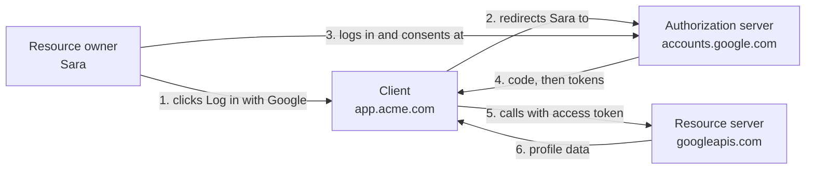
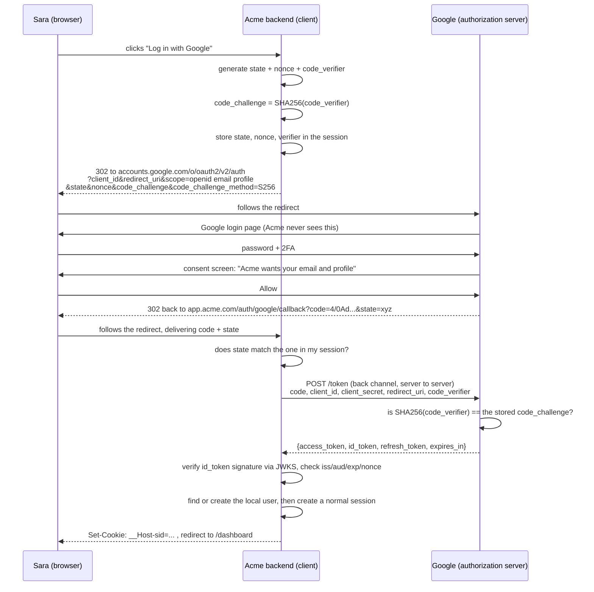

# OAuth2 and Social Login — Part 1

You pull up at a hotel and hand your car to the valet. You do not hand over
your house key, your office key and your safe key on the same ring. You hand
over a **valet key**: it starts the engine and opens the driver's door, it
will not open the boot, and it stops working when you check out.

That is OAuth2. An application wants to do one specific thing on your behalf
at another service — read your Google profile, list your GitHub repositories,
post to your calendar — and OAuth2 lets you grant exactly that, without ever
giving the application your password.

This part explains the protocol: the roles, the flow, and the two parameters
(`state` and PKCE) that keep it safe. Part 2 is the implementation — the
callback handler, the `id_token` check, and the account-linking trap that has
caused more real account takeovers than anything else in this file.

> **➡️ Continued in [Part 2](05-oauth2-and-social-login-part-2.md).**

> **📌 In one line:** OAuth2 is a way for a user to give an application limited
> access to their account somewhere else, and OpenID Connect is the small layer
> on top that turns "limited access" into "and here is who they are".

## Table of Contents

1. [The Problem OAuth2 Solves](#the-problem-oauth2-solves)
2. [The Four Roles](#the-four-roles)
3. [OAuth2 vs OpenID Connect](#oauth2-vs-openid-connect)
4. [The Authorization Code Flow, Step by Step](#the-authorization-code-flow-step-by-step)
5. [PKCE](#pkce)
6. [The state Parameter](#the-state-parameter)
7. [Scopes and Consent](#scopes-and-consent)
8. [The Other Grant Types](#the-other-grant-types)
9. [BROKEN vs FIXED: the Callback With No State](#broken-vs-fixed-the-callback-with-no-state)
10. [Common Mistakes](#common-mistakes)
11. [Questions to Test Yourself](#questions-to-test-yourself)
12. [Related](#related)

---

## The Problem OAuth2 Solves

Before OAuth2, an application that wanted to read your contacts asked for your
email password and logged in as you. This was normal. It was also terrible:

| Problem with "just give us your password" | Consequence |
|---|---|
| The app now has your **full** account | It can read everything, send mail, delete mail, change the password |
| The app must **store** your password | Its database breach is your email breach |
| You cannot **limit** what it does | There is no "read contacts only" |
| You cannot **revoke** it | Only changing your password stops it, which breaks every other app too |
| Two-factor authentication is **bypassed** | The app logs in with the password alone |

OAuth2 replaces all of that with a **delegation** step. You are sent to the
service you already trust, you log in there (the app never sees it), you
approve a specific list of permissions, and the app receives a **token** that
does only those things and can be revoked from your account settings.

Read that list again as the valet key: limited, revocable, and it never
becomes your house key.

---

## The Four Roles

OAuth2 defines four parties. Mapping them to a concrete "Log in with Google"
is the fastest way to make them stick.

| Role | Plain meaning | In "Log in with Google" on Acme |
|---|---|---|
| **Resource owner** | the human who owns the data and grants permission | Sara, the user |
| **Client** | the application asking for access | Acme's backend (`app.acme.com`) |
| **Authorization server** | the service that logs the user in and issues tokens | Google's accounts service |
| **Resource server** | the API that holds the data and accepts the token | Google's userinfo / Gmail / Calendar API |



Two of these are often the same company (Google is both authorization server
and resource server), which is why people collapse them. Keep them separate:
one **issues** tokens, the other **accepts** them.

The word **client** is also confusing: in OAuth2 it does not mean "browser".
It means the application requesting access, which for a web app is your
**backend**. There are two kinds:

- **Confidential client** — can keep a secret. A backend server. Gets a
  `client_secret`.
- **Public client** — cannot keep a secret. A single-page app, a mobile app, a
  CLI. Anything shipped to a user can be decompiled or read in devtools, so it
  gets no usable secret and must use PKCE (section 5).

---

## OAuth2 vs OpenID Connect

This is the distinction that confuses everyone, and it is genuinely simple
once stated plainly.

> **OAuth2 is about authorization: *may this app do X on my behalf?***
>
> **OpenID Connect (OIDC) is about authentication: *who is this person?***

OAuth2 on its own never tells you who the user is. It gives you an **access
token**, which is a key to an API. A key is not an identity. If you treat "I
got a valid access token" as "this person is Sara", you have built something
subtly broken — the token could have been obtained by a different application
for a different user and injected into your flow.

OIDC is a thin, standard layer on top of OAuth2 that adds three things:

| OIDC adds | What it is | Why it matters |
|---|---|---|
| The `openid` scope | a marker on the authorization request | it is what turns an OAuth2 flow into an OIDC flow |
| The **`id_token`** | a signed **JWT** describing the user | this is the actual answer to "who is this?" |
| A discovery document | `/.well-known/openid-configuration` | tells you the endpoints and the JWKS URL, so nothing is hard-coded |

An `id_token` decoded looks like this — and it is a JWT, exactly as described
in [file 04 part 1](04-jwt-part-1.md):

```json
{
  "iss": "https://accounts.google.com",
  "aud": "812734.apps.googleusercontent.com",
  "sub": "117223344556677889900",
  "email": "sara@acme.com",
  "email_verified": true,
  "name": "Sara Iqbal",
  "iat": 1758240000,
  "exp": 1758243600,
  "nonce": "n-0S6_WzA2Mj"
}
```

Two fields decide everything in Part 2: **`sub`** is the permanent, unique,
never-reused identifier for this user at this provider — it is the thing you
store. **`email_verified`** is the field whose absence causes account
takeovers.

| | Access token | ID token |
|---|---|---|
| Answers | "what may this app do?" | "who is the user?" |
| Audience | the resource server (the API) | **your client** |
| Format | opaque or JWT; treat it as opaque | always a JWT |
| Do you verify it? | no — you send it to the API | **yes**, you verify it yourself |
| Do you send it to an API? | yes | **no**, never |

> **⚠️ Warning:** "Log in with Google" is **OIDC**, not plain OAuth2. If you
> are using an access token to call `/userinfo` and trusting whatever comes
> back as the login identity, add the `openid` scope and verify the `id_token`
> instead. Part 2 shows exactly how.

---

## The Authorization Code Flow, Step by Step

This is the flow. Everything else is a variation or a deprecated mistake.



Each step in plain English:

1. **Sara clicks the button.** Nothing has happened yet; your backend is about
   to build a URL.
2. **Your backend generates three random values.** `state` (CSRF protection),
   `nonce` (replay protection for the `id_token`), and `code_verifier` (PKCE).
   It stores all three in Sara's session, tied to this attempt.
3. **You redirect Sara to Google** with your `client_id`, your exact
   `redirect_uri`, the scopes you want, and those random values. This is a
   full-page browser redirect, not an iframe or an AJAX call.
4. **Google authenticates Sara.** Password, 2FA, passkey, whatever she has
   configured. **Your application never sees any of it.** This is the whole
   point.
5. **Google shows the consent screen** listing what you asked for. Sara
   approves or refuses.
6. **Google redirects back** to your registered `redirect_uri` with a
   short-lived, single-use `code` and your `state` echoed back.
7. **You check `state`** against the session. If it does not match, stop — see
   section 6.
8. **You exchange the code for tokens** on the **back channel**: a direct
   server-to-server `POST` that includes your `client_secret` and the
   `code_verifier`. The code travels through the browser; the tokens never do.
9. **Google validates the exchange** — the code is unused and unexpired, the
   `redirect_uri` matches exactly, the client secret is right, and
   `SHA256(code_verifier)` equals the `code_challenge` from step 3.
10. **You verify the `id_token`** yourself: signature against Google's JWKS,
    `iss`, `aud` equal to your `client_id`, `exp`, and `nonce` matching.
11. **You create your own session** and set your own cookie. Google's tokens
    are for calling Google. Your session is for your app.

Step 11 is the one beginners skip. After a social login you should almost
always mint a normal session cookie
([file 03 part 2](03-cookies-and-sessions-part-2.md)) and forget the provider
until the user logs in again.

> **💡 Tip:** the reason the code goes through the browser and the tokens do
> not is that browser-visible things end up in history, `Referer` headers and
> logs. A code is single-use and useless without your client secret and
> verifier; a token is a live credential.

---

## PKCE

**PKCE** ("pixy") stands for *Proof Key for Code Exchange*. It closes one
specific hole: **authorization code interception**.

The hole: the code arrives through a browser redirect. On mobile, several apps
can register the same custom URL scheme, so a malicious app can receive your
callback; on any platform the code can leak through a `Referer` header or a
logged URL. A public client has no `client_secret` to stop the thief redeeming
it.

PKCE fixes this with one idea: **prove you are the same party who started the
flow.**

```text
  START                                         EXCHANGE
  ─────                                         ────────
  code_verifier  = 43-128 random characters     send code_verifier
        │                                              │
        ▼  SHA-256, base64url                          ▼
  code_challenge ──sent with the redirect──▶  server checks:
                   (public, in the URL)       SHA256(verifier) == challenge?
```

The `code_challenge` travels through the browser and is safe to leak: it is a
hash, and you cannot run SHA-256 backwards. The `code_verifier` never leaves
your client until the back-channel exchange. An attacker who steals the code
has no verifier, so the exchange fails.

```ts
import crypto from 'node:crypto'

const codeVerifier = crypto.randomBytes(32).toString('base64url')       // keep secret
const codeChallenge = crypto.createHash('sha256')
  .update(codeVerifier).digest('base64url')                             // send publicly
// authorize URL gets: code_challenge=<challenge>&code_challenge_method=S256
// token request gets: code_verifier=<verifier>
```

Always use `code_challenge_method=S256`. The spec also allows `plain`, which
sends the verifier itself and protects nothing.

> **📌 Remember:** PKCE began as a mobile fix, but the current guidance
> (OAuth 2.1) is to use it for **every** client, including confidential
> backends. It costs four lines and it defends against code injection even
> when a client secret exists.

---

## The state Parameter

`state` is an opaque random value you generate, send to the authorization
server, and check when it comes back.

It exists because the callback URL is a public endpoint that anyone can visit.
Without `state`, an attacker can run the flow **with their own Google account**,
capture the resulting `?code=...` before redeeming it, and then trick a
logged-in victim into visiting:

```text
https://app.acme.com/auth/google/callback?code=<attacker's code>
```

Your backend redeems the attacker's code, sees the attacker's Google identity,
and **links the attacker's Google account to the victim's Acme account**. The
attacker can now log into the victim's account with one click, forever. This
is *login CSRF*, and it is the reason `state` is not optional.

With `state`, the victim's browser carries no matching session value, the
comparison fails, and the request is rejected.

Rules that matter:

- Generate it with `crypto.randomBytes(16)` or more. Not a timestamp, not a
  counter.
- Store it **server-side**, in the session, bound to this one attempt.
- Compare it timing-safely, **delete it** after use, and expire it in minutes.

`nonce` is the sibling parameter and people mix them up:

| | `state` | `nonce` |
|---|---|---|
| Protects | the **callback** from CSRF / code injection | the **`id_token`** from replay |
| Travels in | the authorization request and the callback URL | the authorization request and the `id_token` claims |
| Checked against | the value in your session | the `nonce` claim inside the verified `id_token` |
| Required by | OAuth2, always | OIDC, whenever you use an `id_token` |

Use both. They are four lines each.

---

## Scopes and Consent

A **scope** is one named permission. `openid`, `email`, `profile`,
`repo:read`, `calendar.events.readonly`. You list the ones you want in the
authorization URL, the user sees them on the consent screen, and the resulting
token can do those things and nothing else.

Two rules, and the first one is as much product advice as security advice:

1. **Ask for the minimum.** A consent screen saying "Acme wants to read and
   delete all your email" loses you users. It also means a breach at Acme is a
   catastrophe rather than an inconvenience.
2. **Ask late.** Request `openid email profile` at signup. When the user later
   clicks "Import my calendar", run a second authorization with the calendar
   scope added. This is **incremental authorization**, and every major provider
   supports it.

For pure social login, `openid email profile` is the whole list. `openid` is
mandatory to get an `id_token` at all.

Consent is revocable by the user at any time from their Google or GitHub
settings, so your code must handle a refresh token that suddenly returns
`invalid_grant` by asking the user to reconnect, not by crashing.

---

## The Other Grant Types

A **grant type** is a way of obtaining a token. There are several, and most of
them are wrong for you.

| Grant type | What it is for | Verdict |
|---|---|---|
| **Authorization code + PKCE** | a user logging in through a browser; web apps, SPAs, mobile apps | **The default. Use this.** |
| **Client credentials** | a program authenticating as *itself*, with no user involved — your backend calling a partner API, a cron job, a microservice | **Use this** for service-to-service. The one you will actually reach for besides the first |
| **Refresh token** | swapping a long-lived refresh token for a fresh access token | Use it, with rotation — see [file 04 part 2](04-jwt-part-2.md#refresh-token-rotation-and-reuse-detection) |
| **Device code** | input-constrained devices: a TV, a CLI, a printer. Shows a code and a URL to enter on a phone | Use it when there is no browser on the device |
| **Implicit** | returned tokens directly in the URL fragment, for old SPAs | **Do not use.** Tokens in the URL leak into history and logs, and there is no PKCE. Removed in OAuth 2.1 |
| **Resource owner password credentials** | the app collects the username and password and sends them to the token endpoint | **Do not use.** It re-creates the exact problem OAuth2 was invented to solve, and it breaks 2FA and SSO. Removed in OAuth 2.1 |

Client credentials is worth seeing, because it is one request and no redirects:

```http
POST /oauth2/token HTTP/1.1
Host: auth.partner.com
Content-Type: application/x-www-form-urlencoded
Authorization: Basic BASE64(client_id:client_secret)

grant_type=client_credentials&scope=invoices.read
```

No user, no browser, no consent screen, no refresh token — when the access
token expires you ask for another. Compare it with plain API keys in
[file 06](06-api-keys-and-machine-auth.md): here the long-lived secret never
travels to the resource server, only a short-lived token does.

---

## BROKEN vs FIXED: the Callback With No State

```ts
// ❌ BROKEN — accepts any code from anyone, and trusts the provider's email blindly
router.get('/auth/google/callback', async (req, res) => {
  const { code } = req.query                       // no state checked at all
  const tokens = await exchangeCodeForTokens(code as string)
  const profile = await fetchUserInfo(tokens.access_token)

  const user = await User.firstOrCreate({ email: profile.email })
  req.session.userId = user.id                     // and no session regeneration
  return res.redirect('/dashboard')
})
```

Three separate holes. There is no `state`, so an attacker can inject their own
authorization code into a victim's browser and link their identity to the
victim's account. There is no `id_token` verification — `/userinfo` is called
with a token that might not have been issued for this application. And the
session id is not regenerated, so a planted session survives the login
([file 03 part 2](03-cookies-and-sessions-part-2.md#regenerate-the-id-at-login)).

```ts
// ✅ FIXED — state first, then a verified id_token, then a fresh session
router.get('/auth/google/callback', async (req, res) => {
  const { code, state, error } = req.query
  if (error) return res.redirect('/login?error=cancelled')

  // 1. CSRF: the state must match this browser's session, and is single use.
  const expected = req.session.oauthState
  delete req.session.oauthState
  if (!expected || !state || !timingSafeEqualStr(String(state), expected)) {
    return res.status(400).send('Invalid OAuth state')
  }

  // 2. Back-channel exchange, including the PKCE verifier.
  const tokens = await exchangeCodeForTokens(String(code), req.session.codeVerifier)

  // 3. Verify the id_token ourselves. Never trust an unverified profile.
  const claims = await verifyIdToken(tokens.id_token, req.session.oauthNonce)

  // 4. Link or create — the rules are in Part 2.
  const user = await findOrLinkUser(claims)

  // 5. Our own fresh session; the provider's tokens are not our credential.
  await req.session.regenerate()
  req.session.userId = user.id
  return res.redirect('/dashboard')
})
```

Step 4 is where the real danger lives, and it gets its own section in
[Part 2](05-oauth2-and-social-login-part-2.md#account-linking).

---

## Common Mistakes

| Mistake | Why it is wrong | Do this instead |
|---|---|---|
| Treating an access token as proof of identity | It is a key to an API, not a statement about a person | Use OIDC and verify the `id_token` |
| Skipping `state` | Login CSRF: an attacker links their identity to a victim's account | Random, session-stored, single-use, timing-safe compared |
| Skipping `nonce` | An `id_token` captured elsewhere can be replayed into your flow | Send it, and check the claim after verifying the signature |
| Skipping PKCE "because we have a client secret" | Code injection still works; OAuth 2.1 requires PKCE everywhere | Always, with `S256` |
| Using the implicit grant | Tokens in the URL fragment leak into history and logs | Authorization code + PKCE |
| Using the password grant | Recreates the problem OAuth2 exists to solve; breaks 2FA and SSO | Authorization code + PKCE |
| A wildcard or loose `redirect_uri` | An attacker redirects the code to a host they control | Register exact, full URIs; no wildcards, no open redirects |
| Putting the client secret in a SPA or mobile app | It is not a secret once shipped | Public client + PKCE, or keep the exchange on your backend |
| Requesting every scope up front | Frightens users and widens the blast radius | Minimum scopes, then incremental authorization |
| Keeping the provider's access token as your session | It expires on the provider's schedule and is not your credential | Mint your own session or token after login |

---

## Questions to Test Yourself

1. Explain the valet-key analogy and map each part of it to an OAuth2 concept.
2. Name the four roles and say which one your backend is when a user clicks
   "Log in with Google".
3. What is the exact difference between OAuth2 and OpenID Connect, and which
   one is social login?
4. Why is an access token not a proof of identity? Describe a concrete way
   trusting one goes wrong.
5. Why does the authorization **code** travel through the browser while the
   tokens do not?
6. Explain PKCE to someone who knows what a hash is, in three sentences.
7. Your app is a confidential client with a client secret. Do you still need
   PKCE? Justify the current answer.
8. Write out the login-CSRF attack that `state` prevents, step by step.
9. What is the difference between `state` and `nonce`?
10. A partner wants your backend to call their API on a nightly schedule, with
    no user involved. Which grant type, and why not the others?

---

## Related

- [Part 2](05-oauth2-and-social-login-part-2.md) — implementing "Log in with
  Google/GitHub", verifying the `id_token`, account linking, token handling,
  and being the provider yourself.
- [JWT — Part 1](04-jwt-part-1.md) — the `id_token` is a JWT, and everything
  about verifying one applies here.
- [JWT — Part 2](04-jwt-part-2.md) — refresh tokens and rotation, which OAuth2
  uses wholesale.
- [Cookies and Sessions — Part 2](03-cookies-and-sessions-part-2.md) — the
  session you should create after a successful social login.
- [Authentication Basics](01-authentication-basics.md) — where OAuth2 sits
  among the four approaches, and why email verification matters here.
- [API Keys and Machine Auth](06-api-keys-and-machine-auth.md) — the simpler
  alternative to client credentials, and when each fits.
- [HTTPS and TLS](../01-http-foundations/06-https-and-tls.md) — every redirect
  and every token exchange in this file assumes HTTPS.
- [Part 11 — API Security](../11-api-security/) — open redirects and login
  CSRF in the wider catalogue.
