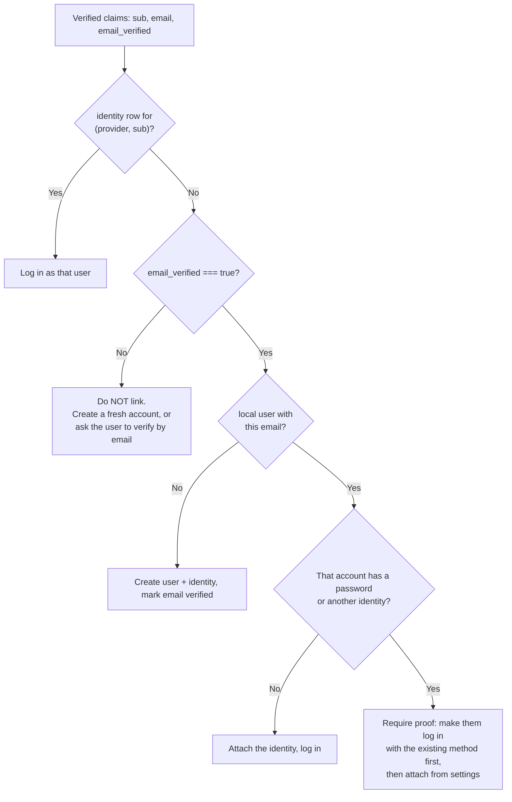

# OAuth2 and Social Login — Part 2

Part 1 was the protocol: roles, the authorization code flow, PKCE, `state`,
scopes and grant types.

This part is the code, and the one decision that turns a correct OAuth2
implementation into an account takeover: **account linking**. Getting the flow
right and the linking wrong is the most common way real products are breached
through social login, so that section is the heart of this file.

> **⬅️ This continues [Part 1](05-oauth2-and-social-login-part-1.md).**

> **📌 In one line:** implement the redirect and the callback carefully, verify
> the `id_token` yourself, and then link accounts **only** on an email the
> provider says it verified — anything looser hands your users' accounts to
> whoever can create a matching address.

## Table of Contents

1. [Registering the Application](#registering-the-application)
2. [Step 1: the Redirect](#step-1-the-redirect)
3. [Step 2: the Callback and the Code Exchange](#step-2-the-callback-and-the-code-exchange)
4. [Step 3: Verifying the id_token](#step-3-verifying-the-id_token)
5. [Account Linking](#account-linking)
6. [BROKEN vs FIXED: Linking by Unverified Email](#broken-vs-fixed-linking-by-unverified-email)
7. [Token Handling](#token-handling)
8. [Advanced: Being the Provider, M2M, and Introspection](#advanced-being-the-provider-m2m-and-introspection)
9. [Common Mistakes](#common-mistakes)
10. [Questions to Test Yourself](#questions-to-test-yourself)
11. [Related](#related)

---

## Registering the Application

Before any code, you register your app with the provider and receive two
values plus one setting.

| Thing | What it is | Handling |
|---|---|---|
| `client_id` | a public identifier for your app | may appear in URLs and in frontend code |
| `client_secret` | proves the token request came from you | **backend only**; a secret manager, never git, never a mobile app |
| Redirect URI allow-list | the exact URLs the provider will send the code to | register every environment's full URL; no wildcards |

The redirect URI is matched **exactly** — scheme, host, port, path and
trailing slash. That strictness is what stops an attacker asking the provider
to deliver your code to `https://evil.example`.

Two provider details worth knowing before you start:

- **Google** is a full OIDC provider: you get an `id_token` with
  `email_verified`, and discovery lives at
  `https://accounts.google.com/.well-known/openid-configuration`.
- **GitHub** is plain OAuth2 — there is **no `id_token`**. You call
  `GET /user` and `GET /user/emails`, and must find the entry where both
  `primary` and `verified` are true. The top-level `email` field is not a
  verification flag and may be `null`.

---

## Step 1: the Redirect

```ts
import crypto from 'node:crypto'

const GOOGLE_AUTH = 'https://accounts.google.com/o/oauth2/v2/auth'

router.get('/auth/google', async (req, res) => {
  const state = crypto.randomBytes(32).toString('base64url')
  const nonce = crypto.randomBytes(32).toString('base64url')
  const codeVerifier = crypto.randomBytes(32).toString('base64url')
  const codeChallenge = crypto.createHash('sha256').update(codeVerifier).digest('base64url')

  // Bind all three to THIS browser's session. They are single use.
  req.session.oauth = { state, nonce, codeVerifier, createdAt: Date.now() }

  const url = new URL(GOOGLE_AUTH)
  url.searchParams.set('client_id', process.env.GOOGLE_CLIENT_ID!)
  url.searchParams.set('redirect_uri', 'https://app.acme.com/auth/google/callback')
  url.searchParams.set('response_type', 'code')
  url.searchParams.set('scope', 'openid email profile')   // openid = give me an id_token
  url.searchParams.set('state', state)
  url.searchParams.set('nonce', nonce)
  url.searchParams.set('code_challenge', codeChallenge)
  url.searchParams.set('code_challenge_method', 'S256')
  url.searchParams.set('prompt', 'select_account')        // avoids silent wrong-account logins

  return res.redirect(url.toString())
})
```

Four details that are easy to get wrong:

- **Full-page redirect**, never an iframe — providers block framing, and
  third-party cookie rules break iframe flows anyway
  ([file 03 part 1](03-cookies-and-sessions-part-1.md#the-third-party-cookie-change)).
- The `redirect_uri` must be byte-identical to the registered one **and** to
  the one in the token request.
- `scope` must include `openid`, or you get no `id_token`.
- Store the three random values server-side; a cookie holding the
  `code_verifier` defeats the point of PKCE.

---

## Step 2: the Callback and the Code Exchange

```ts
router.get('/auth/google/callback', async (req, res) => {
  const { code, state, error } = req.query
  const pending = req.session.oauth
  delete req.session.oauth                       // single use, always

  if (error) return res.redirect('/login?error=' + encodeURIComponent(String(error)))
  if (!pending || Date.now() - pending.createdAt > 10 * 60_000) {
    return res.status(400).send('Login attempt expired, please try again')
  }
  if (!state || !timingSafeEqualStr(String(state), pending.state)) {
    return res.status(400).send('Invalid OAuth state')      // login CSRF blocked
  }
  if (!code) return res.status(400).send('Missing code')

  const tokens = await exchangeCode(String(code), pending.codeVerifier)
  const claims = await verifyIdToken(tokens.id_token, pending.nonce)
  const user = await findOrLinkUser(claims)                 // section 5

  await req.session.regenerate()                            // stops session fixation
  req.session.userId = user.id
  return res.redirect('/dashboard')
})
```

The exchange itself is a plain back-channel `POST`. Nothing here goes through
the browser:

```ts
async function exchangeCode(code: string, codeVerifier: string) {
  const r = await fetch('https://oauth2.googleapis.com/token', {
    method: 'POST',
    headers: { 'content-type': 'application/x-www-form-urlencoded' },
    body: new URLSearchParams({
      grant_type: 'authorization_code',
      code,
      code_verifier: codeVerifier,                       // PKCE proof
      client_id: process.env.GOOGLE_CLIENT_ID!,
      client_secret: process.env.GOOGLE_CLIENT_SECRET!,  // backend only
      redirect_uri: 'https://app.acme.com/auth/google/callback',
    }),
  })
  if (!r.ok) throw new Error(`token exchange failed: ${r.status}`)
  return r.json() as Promise<{
    access_token: string; id_token: string; refresh_token?: string; expires_in: number
  }>
}
```

> **⚠️ Warning:** never log this response, and never log the request body of
> the callback. `access_token`, `id_token` and `refresh_token` are all live
> credentials. Add them to your logger's redaction list today — see
> [logging basics](../08-logging-and-observability/01-logging-basics.md).

---

## Step 3: Verifying the id_token

The `id_token` is a JWT, so everything in
[file 04 part 1](04-jwt-part-1.md) applies. Verify it yourself. Do not decode
it and trust the claims.

```ts
import { createRemoteJWKSet, jwtVerify } from 'jose'

// Fetched from the discovery document, cached, and refreshed by kid.
const JWKS = createRemoteJWKSet(new URL('https://www.googleapis.com/oauth2/v3/certs'))

async function verifyIdToken(idToken: string, expectedNonce: string) {
  const { payload } = await jwtVerify(idToken, JWKS, {
    issuer: 'https://accounts.google.com',
    audience: process.env.GOOGLE_CLIENT_ID!,   // must be OUR client id
    algorithms: ['RS256'],                     // pin it; never let the token choose
    clockTolerance: 5,
  })

  if (payload.nonce !== expectedNonce) throw new Error('id_token nonce mismatch')
  if (!payload.sub) throw new Error('id_token has no sub')

  return payload as {
    sub: string; email?: string; email_verified?: boolean; name?: string; picture?: string
  }
}
```

What each check stops:

| Check | Without it |
|---|---|
| Signature against the provider's JWKS | anyone can hand you a made-up `id_token` |
| `issuer` | a token from a different provider you also trust is accepted |
| `audience` equals your `client_id` | **a token issued to a different application is accepted** — one of the classic OIDC holes |
| `algorithms: ['RS256']` | the `alg` attacks from [file 04 part 2](04-jwt-part-2.md#the-classic-attacks) |
| `nonce` | an `id_token` captured elsewhere is replayed into your flow |

For GitHub, which issues no `id_token`, the equivalent is:

```ts
const emails = await gh('/user/emails', accessToken)          // needs the user:email scope
const primary = emails.find((e) => e.primary && e.verified)   // BOTH flags
if (!primary) throw new Error('No verified primary email on this GitHub account')
```

---

## Account Linking

You have a verified provider identity. Now: which local user is this?

This is a **security decision**, not data plumbing. Schema first: store the
provider identity in its own table, never as columns on `users`, because one
user can connect Google *and* GitHub *and* a password.

```sql
CREATE TABLE identities (
  id               BIGSERIAL PRIMARY KEY,
  user_id          BIGINT NOT NULL REFERENCES users(id) ON DELETE CASCADE,
  provider         TEXT   NOT NULL,          -- 'google' | 'github'
  provider_user_id TEXT   NOT NULL,          -- the id_token `sub`. Never the email
  created_at       TIMESTAMPTZ NOT NULL DEFAULT now(),
  UNIQUE (provider, provider_user_id)
);
```

Store `sub`, not the email. Emails change hands; a Google `sub` is permanent
and never reused. Key on email and a user who changes their Google address
becomes a stranger to you — or worse, inherits someone else's account.

The decision, in order:



```ts
async function findOrLinkUser(claims: { sub: string; email?: string; email_verified?: boolean }) {
  // 1. Known identity: the normal, boring path.
  const existing = await Identity.findBy({ provider: 'google', providerUserId: claims.sub })
  if (existing) return User.findOrFail(existing.userId)

  // 2. No verified email means no linking. Full stop.
  if (!claims.email || claims.email_verified !== true) {
    throw new AuthError('Your Google account has no verified email address.')
  }

  const email = claims.email.trim().toLowerCase()
  const user = await User.findBy('email', email)

  // 3. Nobody here yet: create the account, already verified by the provider.
  if (!user) {
    const created = await User.create({ email, emailVerifiedAt: new Date(), passwordHash: null })
    await Identity.create({ userId: created.id, provider: 'google', providerUserId: claims.sub })
    return created
  }

  // 4. The account exists and can already be logged into another way.
  //    Auto-linking here is the takeover hole. Demand proof of the old method.
  if (user.passwordHash || (await Identity.countFor(user.id)) > 0) {
    throw new LinkRequiredError(
      'An account with this email already exists. Sign in with your password, then connect Google from Settings.',
    )
  }

  // 5. A shell account with no login method: safe to attach.
  await Identity.create({ userId: user.id, provider: 'google', providerUserId: claims.sub })
  return user
}
```

Step 4 is the judgement call. Auto-linking on a verified email match is
defensible — but only if **your** stored email was itself verified. If a user
could register `sara@acme.com` at your site without proving it, linking a real
verified Google `sara@acme.com` into that row hands the impostor's account to
the real Sara while the impostor keeps the password. Requiring the old method
is one extra click and removes the whole class of bug.

> **📌 Remember:** three rules. Key on `sub`. Link only on
> `email_verified === true`. Require proof of an existing login method before
> attaching a new one.

Two more cases: a user may later set a password or connect a second provider
(normal — that is what the table is for), and on **unlinking** you must never
let them remove their last login method. Check that a password or another
identity remains before deleting the row.

---

## BROKEN vs FIXED: Linking by Unverified Email

```ts
// ❌ BROKEN — one line, and it is an account takeover
const user = await User.firstOrCreate({ email: profile.email })
req.session.userId = user.id
```

The attack, concretely, against a provider that lets an unverified address sit
on an account (several smaller providers do, and GitHub's top-level `email`
field is not a verification flag):

1. The victim has an Acme account on `sara@acme.com`, with a password.
2. The attacker creates an account at some OAuth provider and sets its email
   to `sara@acme.com` **without verifying it**.
3. The attacker clicks "Log in with that provider" on Acme.
4. Acme reads `profile.email === 'sara@acme.com'`, finds Sara's row, and logs
   the attacker in as Sara.

No password was guessed. No token was stolen. The takeover cost the attacker
one signup form.

The mirror-image bug is just as bad: attaching a provider-verified email to a
local account whose email **you** never verified. Whoever squatted the address
first owns the merged account.

```ts
// ✅ FIXED — verified email only, keyed on sub, and never auto-merge into a live account
const identity = await Identity.findBy({ provider, providerUserId: claims.sub })
if (identity) return User.findOrFail(identity.userId)

if (claims.email_verified !== true) {
  throw new AuthError('This provider account has no verified email address.')
}

const email = claims.email!.trim().toLowerCase()
const existing = await User.findBy('email', email)

if (existing && (existing.passwordHash || (await Identity.countFor(existing.id)) > 0)) {
  // Prove you already own this account before we attach a new way into it.
  throw new LinkRequiredError('Sign in with your existing method, then connect this provider.')
}

const user = existing ?? (await User.create({ email, emailVerifiedAt: new Date() }))
await Identity.create({ userId: user.id, provider, providerUserId: claims.sub })
return user
```

---

## Token Handling

After login you may hold up to three provider tokens. Treat each differently.

| Token | Keep it? | How |
|---|---|---|
| `id_token` | no | verify it, read the claims, discard it. It is a login receipt, not a credential |
| `access_token` | only if you will call the provider's API | in memory or a short-lived cache; it expires in an hour anyway |
| `refresh_token` | only if you need offline access (background calendar sync, repo polling) | **encrypted at rest**, in its own table, with the scopes it was granted |

For pure social login — no calendar, no repos — keep **none of them**: verify,
create your session, discard. When you do need a refresh token:

```ts
// Encrypt with a key from your secret manager (KMS, Vault, Doppler), not from config.ts
const { ciphertext, iv, tag } = encryptAesGcm(refreshToken, await kms.dataKey())
await ProviderToken.updateOrCreate(
  { userId, provider },
  { ciphertext, iv, tag, scopes, expiresAt, updatedAt: new Date() },
)
```

Four operational rules:

1. **Never log a token.** Redact `access_token`, `id_token`, `refresh_token`
   and `code` in your logger, error reporter and HTTP client debug output. A
   token in Sentry is a token in a third party's database.
2. **Handle expiry as a normal path.** An access token dying mid-request is
   expected: refresh once, retry once, then give up.
3. **Handle revocation.** A user disconnecting your app turns every refresh
   into `invalid_grant`. Delete your stored token and prompt to reconnect —
   never retry in a loop.
4. **Delete tokens when the user disconnects** on your side, and call the
   provider's revocation endpoint so the grant disappears there too.

---

## Advanced: Being the Provider, M2M, and Introspection

### Being the OAuth provider

Everything so far had you as the **client**. The other side — third-party
developers building apps against *your* API — is a far bigger commitment:
- A developer portal issuing `client_id`/`client_secret` pairs.
- Exact `redirect_uri` allow-listing, and mandatory PKCE.
- A scope catalogue users can understand on a consent screen, consent storage,
  a "connected apps" page, and revocation.
- Token issuance, refresh and rotation, plus `/introspect` or published JWKS.
- Per-client [rate limits](../../system-design/foundational/rate-limiting.md).

**Do not write this yourself.** Use Keycloak, Ory Hydra, Auth0, Okta or your
cloud provider's identity service — a hand-rolled authorization server is a
security product, and that is not what you are shipping.

### Machine-to-machine tokens

For your own services talking to each other, the client credentials grant
([Part 1](05-oauth2-and-social-login-part-1.md#the-other-grant-types)) gives
each service a `client_id`/`client_secret` and short-lived access tokens. The
advantage over a static API key: the long-lived secret is presented only to
the authorization server, and what reaches the resource server expires in an
hour. Cache the token in memory until shortly before `expires_in` — do not
request one per call. The simpler alternative is
[file 06](06-api-keys-and-machine-auth.md).

### Introspection vs local JWT validation

When your API receives an access token, it can check it two ways.

| | **Local validation** | **Introspection** (RFC 7662) |
|---|---|---|
| How | verify the JWT signature against cached JWKS | `POST /introspect` to the authorization server |
| Cost | microseconds, no network | a network round trip per request |
| Revocation visible | no, until `exp` | **yes, immediately** |
| Works with opaque tokens | no | yes |
| Availability | works if the provider is down | fails if the provider is down |

This is the sessions-versus-JWT trade from
[file 04 part 2](04-jwt-part-2.md#sessions-vs-jwt-the-decision), one layer up.
The usual answer is **local validation with short token lifetimes**, plus
introspection only where instant revocation genuinely matters — deleting data,
moving money, changing permissions. Gateways often split the difference by
introspecting once and caching the result for a few seconds.

---

## Common Mistakes

| Mistake | Why it is wrong | Do this instead |
|---|---|---|
| Linking accounts by email alone | The classic takeover: an unverified address at either end merges two people | Key on `sub`; require `email_verified === true`; demand proof of the existing method |
| Storing the provider email as the identity key | Emails change hands; `sub` does not | `UNIQUE (provider, provider_user_id)` |
| Trusting GitHub's top-level `email` | It is not a verification flag and can be `null` | `GET /user/emails`, require `primary && verified` |
| Decoding the `id_token` without verifying | Anyone can craft claims | `jwtVerify` with issuer, audience, algorithm and nonce |
| Not checking `aud` on the `id_token` | A token issued to another app is accepted | `audience: YOUR_CLIENT_ID` |
| Keeping the provider's access token as your session | It expires on their schedule and is not your credential | Create your own session after login |
| Logging the token response | Live credentials in your log store and error tracker | Redact `*_token` and `code` everywhere |
| Storing refresh tokens in plain text | A table leak becomes offline access to users' Google data | Encrypt at rest with a managed key |
| Retrying forever on `invalid_grant` | The user revoked consent; it will never succeed | Delete the stored token, prompt to reconnect |
| Letting a user unlink their last login method | They are locked out permanently | Require a password or another identity to remain |
| Building your own authorization server | It is a security product with a long tail of edge cases | Keycloak, Ory Hydra, Auth0, Okta |

---

## Questions to Test Yourself

1. Why must the `redirect_uri` match exactly, and what attack does a wildcard
   enable?
2. Where do `state`, `nonce` and `code_verifier` live between the redirect and
   the callback, and why not in a cookie?
3. List the five checks `verifyIdToken` performs and say what each one stops.
4. Why does the `identities` table key on `sub` rather than on the email?
5. Walk through the unverified-email takeover in four steps, then give the two
   conditions that make it impossible.
6. A user has an Acme password account on `sara@acme.com` and now clicks "Log
   in with Google" for the first time, with a verified matching email. What
   should happen, and why not simply log her in?
7. GitHub gives you no `id_token`. What do you call instead, and which two
   flags must both be true?
8. You are doing pure social login with no provider API calls. Which of the
   three tokens do you store?
9. A background job starts failing with `invalid_grant`. What happened, and
   what should the job do?
10. Give one endpoint where introspection is worth the round trip, and one
    where local JWT validation is clearly the right call.

---

## Related

- [Part 1](05-oauth2-and-social-login-part-1.md) — the roles, the
  authorization code flow, PKCE, `state`, scopes and grant types.
- [JWT — Part 1](04-jwt-part-1.md) — the `id_token` is a JWT; JWKS, `aud` and
  algorithm pinning all come from there.
- [JWT — Part 2](04-jwt-part-2.md) — refresh-token rotation, and the same
  revocation trade-off that introspection resolves.
- [Cookies and Sessions — Part 2](03-cookies-and-sessions-part-2.md) — the
  session you create once the social login succeeds.
- [Authentication Basics](01-authentication-basics.md) — why email
  verification on your own side is a prerequisite for safe linking.
- [API Keys and Machine Auth](06-api-keys-and-machine-auth.md) — the simpler
  machine credential, and when client credentials is worth the extra hop.
- [Logging Basics](../08-logging-and-observability/01-logging-basics.md) —
  redaction, so tokens never reach your log store.
- [rate-limiting](../../system-design/foundational/rate-limiting.md) —
  per-client limits when you are the provider.
- [Part 11 — API Security](../11-api-security/) — open redirects, login CSRF
  and broken authentication in the wider catalogue.
